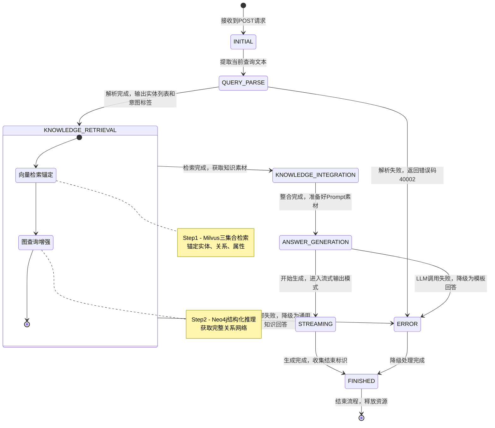
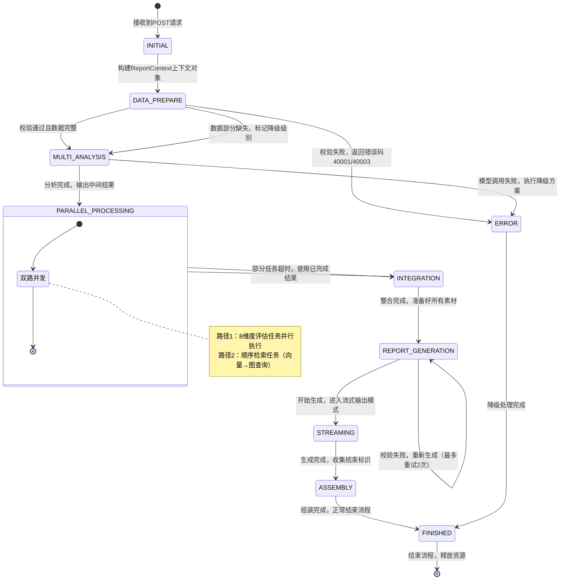
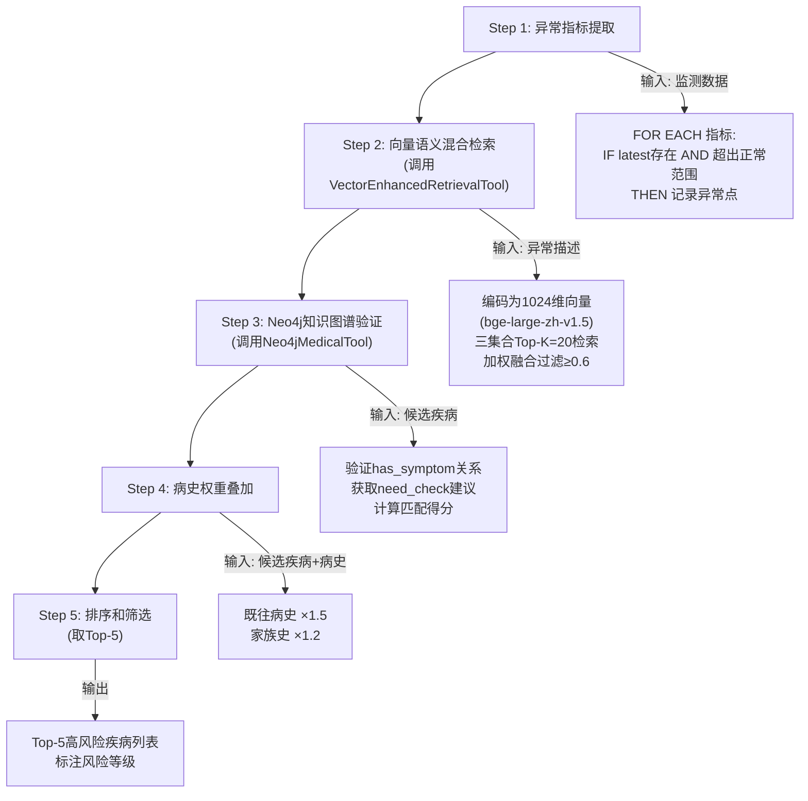

# 项目业务详细设计v3

该文件定义业务接口的重要内容的详细设计，落实开发任务时，还需根据架构设计文档来完成业务接口详细设计在项目框架下的实现

**文档版本**: v3
**更新内容**:

1. 健康咨询业务检索策略调整为"先向量检索锚定实体、关系或属性，后图查询做结构化推理增强"的顺序检索模式
2. 健康报告生成业务检索策略调整为"8维度评估任务"与"顺序检索任务"双路并发模式
3. 补全Token预算分配表格内容
4. 补全健康报告降级策略矩阵内容
5. 新增"可改进设计"章节，记录原并行检索策略作为未来优化方向
   **最后更新**: 2026-04-15

***

## 一、模型选型与21G显存分配方案

#### 显存分配总策略（总预算21G）

为确保在21G显存约束下，多模型（LLM、向量模型、医学模型、意图模型）可同时稳定运行，预留2G安全冗余，采用以下显存分配方案（健康咨询业务和健康报告生成业务对以下的模型资源的配置相同）：

| 模型类型       | 模型选型                                                         | 显存占用            | 说明                                          |
| ---------- | ------------------------------------------------------------ | --------------- | ------------------------------------------- |
| 大语言模型      | Qwen3-4B-Instruct-2507                                       | 7G              | Qwen3-4B-Instruct-2507 4bit量化，用于报告生成和对话理解   |
| 向量编码模型     | BAAI/bge-large-zh-v1.5                                       | 2G              | BAAI/bge-large-zh-v1.5（1024维向量），用于语义编码和知识匹配 |
| 意图分类模型     | FreedomIntelligence/Apollo-0.5B                              | 1G              | 医疗意图分类模型，用于识别用户咨询意图                         |
| 健康风险因子分类模型 | iic/nlp\_raner\_named-entity-recognition\_chinese-base-cmeee | 与健康风险预测模型合计9G   | 中文医学命名实体识别模型，用于从用户输入中提取疾病、症状、药物等医学实体        |
| 健康风险预测模型   | MedGemma-1.5-4B-IT                                           | 与健康风险因子分类模型合计9G | 医学专用大模型，用于疾病风险评估、健康建议生成等医学推理任务              |
| 系统预留/冗余    | /                                                            | 2G              | 运行时内存、缓冲、峰值占用预留                             |
| **总计**     | /                                                            | **21G**         | 满负荷分配，预留2G安全冗余                              |

***

## 二、健康咨询业务

### 2.1 状态机概述

健康咨询采用\*\*7状态有限状态机(FSM)\*\*管理从接收到返回的完整流程

#### 2.2 状态定义

| 序号 | 状态名称  | 英文标识                   | 职责描述                           | 预估耗时       | 是否可并行   |
| -- | ----- | ---------------------- | ------------------------------ | ---------- | ------- |
| 1  | 初始状态  | INITIAL                | 接收请求，构建ConsultContext，提取当前查询   | <10ms      | 否       |
| 2  | 问题解析  | QUERY\_PARSE           | NLP实体抽取 + 意图识别 + 查询改写          | 50-100ms   | 否       |
| 3  | 知识检索  | KNOWLEDGE\_RETRIEVAL   | **顺序执行**：向量检索锚定实体 → 图查询结构化推理增强 | 150-400ms  | 否（内部顺序） |
| 4  | 知识整合  | KNOWLEDGE\_INTEGRATION | 结果去重排序 + 相关性过滤 + 素材准备          | 20-50ms    | 否       |
| 5  | 回答生成  | ANSWER\_GENERATION     | 调用LLM基于知识素材生成专业回答              | 500-2000ms | 否       |
| 6  | 流式返回  | STREAMING              | 实时返回内容块给客户端                    | 持续         | 否（子状态）  |
| 7  | 完成/错误 | FINISHED / ERROR       | 结束流程或异常处理                      | <5ms       | 否       |

#### 2.3 状态转换规则

##### 主流程转换图



##### 完整转换规则表

| 当前状态                   | 触发事件      | 目标状态                   | 说明                  |
| ---------------------- | --------- | ---------------------- | ------------------- |
| INITIAL                | 接收到POST请求 | QUERY\_PARSE           | 提取当前查询文本            |
| QUERY\_PARSE           | 解析完成      | KNOWLEDGE\_RETRIEVAL   | 输出实体列表和意图标签         |
| QUERY\_PARSE           | 解析失败      | ERROR                  | 返回错误码40002（非健康咨询范围） |
| KNOWLEDGE\_RETRIEVAL   | 检索完成      | KNOWLEDGE\_INTEGRATION | 汇总检索结果              |
| KNOWLEDGE\_RETRIEVAL   | 检索全部失败    | ERROR                  | 降级为通用知识回答           |
| KNOWLEDGE\_INTEGRATION | 整合完成      | ANSWER\_GENERATION     | 准备好Prompt素材         |
| ANSWER\_GENERATION     | 开始生成      | STREAMING              | 进入流式输出模式            |
| STREAMING              | 生成完成      | FINISHED               | 收集结束标识              |
| ANSWER\_GENERATION     | LLM调用失败   | ERROR                  | 降级为模板回答             |
| ERROR                  | 降级处理完成    | FINISHED               | 异常处理后结束             |
| **任意状态**               | 未预期异常     | **ERROR**              | 统一异常入口              |

#### 2.4 KNOWLEDGE\_RETRIEVAL状态的顺序检索示例

该状态是健康咨询的核心技术实现——**顺序检索模式**：先向量检索锚定实体，后图查询做结构化推理增强

```python
async def knowledge_retrieval_state(context: ConsultContext, call_router: CallRouter) -> State:
    """
    知识检索状态的顺序实现（健康咨询专用）
    Step1: 向量检索锚定实体、关系或属性
    Step2: 图查询做结构化推理增强
    """

    query = context.current_query
    entities = context.extracted_entities

    # Step1: 向量检索锚定实体、关系或属性
    # 调用Milvus三集合检索（medical_entity、entity_attributes、entity_relations）
    vector_results = await call_router.route("vector_retrieval_tool", {
        "action": "hybrid_search",
        "params": {
            "query": query,
            "top_k": 20,
            "collections": ["medical_entity", "entity_attributes", "entity_relations"],
            "weights": {"medical_entity": 0.40, "entity_attributes": 0.30, "entity_relations": 0.30}
        }
    })
    
    # 提取锚定的实体信息
    anchored_entities = []
    anchored_relations = []
    seen_entity_node_ids = set()
    
    for result in vector_results:
        collection = result.get("collection")
        
        if collection == "medical_entity":
            # medical_entity集合的数据
            anchored_entities.append({
                "name": result.get("entity_name"),
                "type": result.get("entity_type"),
                "neo4j_id": result.get("neo4j_node_id"),
                "score": result.get("score")
            })
        elif collection == "entity_attributes":
            # entity_attributes集合的数据也包含neo4j_node_id，可以用来锚定实体
            neo4j_node_id = result.get("neo4j_node_id")
            # 避免重复：同一个疾病的多个属性只查询一次
            if neo4j_node_id and neo4j_node_id not in seen_entity_node_ids:
                seen_entity_node_ids.add(neo4j_node_id)
                anchored_entities.append({
                    "name": result.get("entity_name"),
                    "type": result.get("entity_type"),
                    "neo4j_id": neo4j_node_id,
                    "score": result.get("score")
                })
        elif collection == "entity_relations":
            anchored_relations.append({
                "source": result.get("source_entity_name"),
                "target": result.get("target_entity_name"),
                "relation_type": result.get("relation_type"),
                "neo4j_id": result.get("neo4j_relation_id"),
                "score": result.get("score")
            })
    
    # Step2: 图查询做结构化推理增强
    # 基于锚定的实体信息，调用Neo4j进行结构化推理
    knowledge_results = []
    
    if anchored_entities:
        # 使用neo4j_node_id直接查询Neo4j节点
        for entity in anchored_entities[:10]:
            neo4j_node_id = int(entity["neo4j_id"])  # 转换为整数类型
            entity_type = entity["type"]
            
            if entity_type == "Disease":
                # 查询疾病信息
                disease_info = await call_router.route("neo4j_medical_tool", {
                    "action": "get_disease_by_node_id",
                    "params": {"node_id": neo4j_node_id}
                })
                
                # 查询疾病的症状、药物、食物等
                symptoms = await call_router.route("neo4j_medical_tool", {
                    "action": "get_symptoms_by_node_id",
                    "params": {"node_id": neo4j_node_id}
                })
                drugs = await call_router.route("neo4j_medical_tool", {
                    "action": "get_drugs_by_node_id",
                    "params": {"node_id": neo4j_node_id}
                })
                foods = await call_router.route("neo4j_medical_tool", {
                    "action": "get_foods_by_node_id",
                    "params": {"node_id": neo4j_node_id}
                })
                
                knowledge_results.append({
                    "source": "neo4j",
                    "type": "disease",
                    "entity": disease_info.get("name"),
                    "data": {
                        "name": disease_info.get("name"),
                        "desc": disease_info.get("desc"),
                        "cause": disease_info.get("cause"),
                        "prevent": disease_info.get("prevent"),
                        "symptoms": symptoms,
                        "drugs": drugs,
                        "foods": foods
                    },
                    "score": entity["score"]
                })
            
            elif entity_type == "Symptom":
                # 查询症状信息和相关疾病
                symptom_info = await call_router.route("neo4j_medical_tool", {
                    "action": "get_symptom_by_node_id",
                    "params": {"node_id": neo4j_node_id}
                })
                diseases = await call_router.route("neo4j_medical_tool", {
                    "action": "get_diseases_by_symptom_node_id",
                    "params": {"node_id": neo4j_node_id}
                })
                
                knowledge_results.append({
                    "source": "neo4j",
                    "type": "symptom",
                    "entity": symptom_info.get("name"),
                    "data": {
                        "name": symptom_info.get("name"),
                        "related_diseases": diseases
                    },
                    "score": entity["score"]
                })
    
    # 合并结果并去重
    merged = merge_knowledge_results(vector_results, knowledge_results)
    context.retrieved_knowledge = merged[:15]

    return State.KNOWLEDGE_INTEGRATION
```

**关键设计说明**：

1. **使用neo4j_node_id精确查询**：
   - 向量检索返回neo4j_node_id字段，直接用于Neo4j节点查询
   - 避免实体名称不匹配的问题，提高查询准确性

2. **支持entity_attributes集合**：
   - entity_attributes集合的数据也包含neo4j_node_id，可以用来锚定实体
   - 通过seen_entity_node_ids去重，避免重复查询

3. **节点类型判断**：
   - 根据entity_type字段判断节点类型（Disease/Symptom等）
   - 不同类型的节点调用不同的查询方法

4. **数据类型转换**：
   - neo4j_node_id在向量数据库中存储为字符串类型
   - 查询时需要转换为整数类型

#### 2.5 健康咨询降级策略

##### 各阶段超时配置

| 阶段                   | 超时时间 | 降级动作         |
| -------------------- | ---- | ------------ |
| QUERY\_PARSE         | 10秒  | 返回错误码40002   |
| KNOWLEDGE\_RETRIEVAL | 20秒  | 使用已完成的部分结果继续 |
| ANSWER\_GENERATION   | 60秒  | 降级为模板回答      |

##### 降级策略矩阵

| 失败组件              | 降级方案           | 质量影响 | 适用阶段                 |
| ----------------- | -------------- | ---- | -------------------- |
| Milvus向量库不可用      | 使用Neo4j模糊匹配替代（`search_diseases_by_symptom`） | 中等   | KNOWLEDGE\_RETRIEVAL |
| Neo4j数据库不可用       | 仅使用向量检索结果      | 中等   | KNOWLEDGE\_RETRIEVAL |
| LLM(Qwen3-4B)调用失败 | 使用预设模板生成简化回答   | 中等   | ANSWER\_GENERATION   |
| 向量模型(mcBERT)推理超时  | 使用关键词匹配替代      | 轻微   | QUERY\_PARSE         |

**降级策略详细说明**：

1. **Milvus向量库不可用**：
   - 触发条件：Milvus连接失败或查询超时
   - 降级方案：跳过向量检索步骤，使用Neo4j的`search_diseases_by_symptom()`方法进行模糊匹配
   - 实现位置：`knowledge_retrieval_chain.py`中的fallback逻辑
   - 注意：由于顺序检索模式下Milvus负责锚定实体，Milvus不可用时无法进行精确的Neo4j查询，只能使用模糊匹配

2. **Neo4j数据库不可用**：
   - 触发条件：Neo4j连接失败或查询超时
   - 降级方案：跳过图查询步骤，仅使用Milvus向量检索结果
   - 实现位置：`consult_strategy.py`中的错误处理逻辑
   - 注意：需要在`knowledge_retrieval_chain.py`中补充完整的降级实现

3. **LLM调用失败**：
   - 触发条件：模型推理失败或超时
   - 降级方案：使用预设模板生成简化回答
   - 实现位置：`consult_strategy.py`中的`_generate_template_answer()`方法

#### 2.6 可改进设计：双路并行检索策略

> 本节记录原设计的"双路并行检索"策略，作为未来性能优化的方向。

**设计思路**：同时启动Neo4j图谱检索和向量增强检索，通过并行执行降低检索延迟。

**实现示例**：

```python
# 并行执行两项检索
results = await asyncio.gather(
    neo4j_task,  # Neo4j知识图谱检索
    vector_task,  # 向量增强检索
    return_exceptions=True
)
```

**预期收益**：降低检索延迟约40%

**实施前提**：

1. 系统资源充足，可支持并行检索
2. Neo4j和Milvus连接池配置优化
3. 结果融合算法稳定可靠

***

## 三、健康报告生成业务

### 3.1 状态机概述

本系统采用\*\*10状态有限状态机(FSM)\*\*管理健康报告生成的完整流程。

### 3.2 状态定义（10个状态）

| 序号 | 状态名称 | 英文标识                 | 职责描述                          | 预估耗时        | 是否可并行   |
| -- | ---- | -------------------- | ----------------------------- | ----------- | ------- |
| 1  | 初始状态 | INITIAL              | 接收请求，构建ReportContext上下文对象     | <10ms       | 否       |
| 2  | 数据准备 | DATA\_PREPARE        | 参数校验+数据标准化+空值处理+完整性判断         | 20-50ms     | 否       |
| 3  | 模型分析 | MULTI\_ANALYSIS      | 调用医学模型进行多维度健康分析+风险因子提取+特殊规则应用 | 500-1000ms  | 否       |
| 4  | 并行处理 | PARALLEL\_PROCESSING | **双路并发**：8维度评估任务 ∥ 顺序检索任务     | 300-600ms   | 是（内部并行） |
| 5  | 整合计算 | INTEGRATION          | 风险评估+评分计算+知识整理+报告素材准备         | 50-100ms    | 否       |
| 6  | 报告生成 | REPORT\_GENERATION   | 调用LLM生成Markdown格式报告+内容校验      | 2000-5000ms | 否       |
| 7  | 流式返回 | STREAMING            | 实时返回内容块给客户端                   | 持续          | 否（子状态）  |
| 8  | 组装结束 | ASSEMBLY             | 组装结束响应+元数据封装+日志记录             | <10ms       | 否       |
| 9  | 完成状态 | FINISHED             | 结束流程，清理资源，释放连接                | <5ms        | 否       |
| 10 | 错误状态 | ERROR                | 异常处理，执行降级策略，记录错误日志            | 可变          | 否       |

### 3.3 状态转换规则

#### 主流程转换图



#### 完整转换规则表

| 当前状态                 | 触发事件      | 目标状态                 | 说明               |
| -------------------- | --------- | -------------------- | ---------------- |
| INITIAL              | 接收到POST请求 | DATA\_PREPARE        | 构建上下文对象          |
| DATA\_PREPARE        | 校验通过且数据完整 | MULTI\_ANALYSIS      | 进入模型分析阶段         |
| DATA\_PREPARE        | 校验失败      | ERROR                | 返回错误码40001/40003 |
| DATA\_PREPARE        | 数据部分缺失    | MULTI\_ANALYSIS      | 标记降级级别后继续        |
| MULTI\_ANALYSIS      | 分析完成      | PARALLEL\_PROCESSING | 输出中间结果           |
| MULTI\_ANALYSIS      | 模型调用失败    | ERROR                | 执行降级方案           |
| PARALLEL\_PROCESSING | 所有并行任务完成  | INTEGRATION          | 汇总并行结果           |
| PARALLEL\_PROCESSING | 部分任务超时    | INTEGRATION          | 使用已完成的结果继续       |
| INTEGRATION          | 整合完成      | REPORT\_GENERATION   | 准备好所有素材          |
| REPORT\_GENERATION   | 开始生成      | STREAMING            | 进入流式输出模式         |
| STREAMING            | 生成完成      | ASSEMBLY             | 收集结束标识           |
| REPORT\_GENERATION   | 校验失败      | REPORT\_GENERATION   | 重新生成（最多重试2次）     |
| ASSEMBLY             | 组装完成      | FINISHED             | 正常结束流程           |
| ERROR                | 降级处理完成    | FINISHED             | 异常处理后结束          |
| **任意状态**             | 未预期异常     | **ERROR**            | 统一异常入口           |

#### 3.3.1 PARALLEL\_PROCESSING状态的并发控制示例（双路并发）

该状态是健康报告生成的核心技术实现——**双路并发**：8维度评估任务与顺序检索任务并行执行

```python
async def parallel_processing_state(context: ReportContext, call_router: CallRouter) -> State:
    """
    并行处理状态的核心实现（健康报告专用）
    双路并发：
    - 路径1：8个维度评估任务并行执行
    - 路径2：顺序检索任务（向量检索锚定实体 → 图查询结构化推理增强）
    """

    # 路径1：8个维度评估（并行执行）
    dimension_tasks = [
        disease_risk_assessment(context),       # 维度1：疾病风险评估
        medication_recommendation(context),      # 维度2：用药建议
        treatment_plan(context),                # 维度3：治疗方案
        dietary_advice(context),                # 维度4：饮食建议
        checkup_recommendation(context),        # 维度5：检查建议
        complication_warning(context),          # 维度6：并发症预警
        prevention_measures(context),           # 维度7：预防措施
        susceptible_population(context)         # 维度8：易感人群
    ]

    # 路径2：顺序检索任务（向量检索 → 图查询）
    async def sequential_retrieval():
        """顺序检索：先向量检索锚定实体，后图查询做结构化推理增强"""
        # Step1: 向量检索锚定实体、关系或属性
        vector_results = await call_router.route("vector_retrieval_tool", {
            "action": "hybrid_search_for_report",
            "params": {
                "context": context,
                "top_k": 30,
                "collections": ["medical_entity", "entity_attributes", "entity_relations"],
                "weights": {"medical_entity": 0.40, "entity_attributes": 0.30, "entity_relations": 0.30}
            }
        })
        
        # 提取锚定的实体信息
        anchored_entities = []
        for result in vector_results:
            if result.get("collection") == "medical_entity":
                anchored_entities.append({
                    "name": result.get("entity_name"),
                    "type": result.get("entity_type"),
                    "neo4j_id": result.get("neo4j_node_id")
                })
        
        # Step2: 图查询做结构化推理增强
        knowledge_results = []
        if anchored_entities:
            neo4j_results = await call_router.route("neo4j_medical_tool", {
                "action": "search_for_report",
                "params": {
                    "context": context,
                    "entity_list": [e["name"] for e in anchored_entities[:15]]
                }
            })
            knowledge_results = neo4j_results
        
        return {
            "vector_results": vector_results,
            "knowledge_results": knowledge_results
        }
    
    # 双路合并为一个任务列表
    all_tasks = dimension_tasks + [sequential_retrieval()]

    # 使用asyncio.gather并发执行所有任务
    results = await asyncio.gather(*all_tasks, return_exceptions=True)

    # 处理维度评估结果
    context.dimension_results = {}
    for i, result in enumerate(results[:8]):
        if isinstance(result, Exception):
            logger.warning(f"维度{i+1}评估失败: {result}")
            context.dimension_results[f"dimension_{i+1}"] = None
        else:
            context.dimension_results[f"dimension_{i+1}"] = result

    # 处理顺序检索结果
    if isinstance(results[8], Exception):
        logger.error(f"顺序检索失败: {results[8]}")
        context.knowledge_results = []
        context.vector_search_results = []
    else:
        context.vector_search_results = results[8].get("vector_results", [])
        context.knowledge_results = results[8].get("knowledge_results", [])

    return State.INTEGRATION


# 示例：疾病风险评估维度的异步实现
async def disease_risk_assessment(context: ReportContext, model_service: ReportModelService) -> Dict[str, Any]:
    """
    维度1：疾病风险评估
    输入：监测数据异常值 + 既往病史 + 家族病史
    输出：疾病风险列表（Top 5）
    
    注意：这里可以使用model_service提供的模型能力（直接调用，不经MCP）
    """
    anomalies = extract_anomalies(context.monitoring_data)
    
    for disease in risk_diseases:
        disease.risk_score *= apply_history_weight(
            disease.name,
            context.user_profile.past_medical_history,
            context.user_profile.family_history
        )

    top_risks = sorted(risk_diseases, key=lambda x: x.risk_score, reverse=True)[:5]

    return {
        "dimension_id": "disease_risk",
        "risks": [r.to_dict() for r in top_risks],
        "confidence_scores": [r.confidence for r in top_risks]
    }
```

#### 3.3.2 健康报告性能优化与降级策略

##### 并发控制策略

| 阶段                   | 并行度  | 实现方式                       |
| -------------------- | ---- | -------------------------- |
| PARALLEL\_PROCESSING | 9路并行 | asyncio.gather(8维度+顺序检索任务) |

##### 流式输出缓冲配置

| 参数      | 值          | 说明      |
| ------- | ---------- | ------- |
| 缓冲区大小   | 512字节      | 平衡延迟和吞吐 |
| 刷新间隔    | 100ms或缓冲区满 | 保证流畅体验  |
| 首字节时间目标 | <30秒       | 用户感知优化  |

##### 各阶段超时配置

| 阶段                   | 超时时间 | 降级动作             |
| -------------------- | ---- | ---------------- |
| DATA\_PREPARE        | 5秒   | 返回错误码40001/40003 |
| MULTI\_ANALYSIS      | 30秒  | 使用规则引擎替代         |
| PARALLEL\_PROCESSING | 60秒  | 使用已完成的结果继续       |
| REPORT\_GENERATION   | 240秒 | 降级为模板报告          |

##### 降级策略矩阵

| 失败组件      | 降级方案           | 质量影响 | 适用阶段                 |
| --------- | -------------- | ---- | -------------------- |
| LLM       | 使用预设模板生成简化报告   | 高    | REPORT\_GENERATION   |
| 向量模型      | 使用关键词匹配替代      | 中等   | MULTI\_ANALYSIS      |
| 医学模型      | 使用规则引擎替代       | 中等   | MULTI\_ANALYSIS      |
| 分类模型      | 使用默认分类结果       | 轻微   | MULTI\_ANALYSIS      |
| Neo4j数据库  | 仅使用向量检索结果      | 中等   | PARALLEL\_PROCESSING |
| Milvus向量库 | 仅使用Neo4j精确匹配结果 | 中等   | PARALLEL\_PROCESSING |
| 单个维度评估失败  | 跳过该维度，使用默认值    | 轻微   | PARALLEL\_PROCESSING |

#### 3.3.3 可改进设计：三路并行检索策略

> 本节记录原设计的"三路并行"策略，作为未来性能优化的方向。

**设计思路**：同时启动8维度评估任务、Neo4j知识检索和向量增强检索，三路并行执行。

**实现示例**：

```python
# 三路合并为一个任务列表
all_tasks = dimension_tasks + [neo4j_knowledge_task, vector_search_task]

# 使用asyncio.gather并发执行所有任务
results = await asyncio.gather(*all_tasks, return_exceptions=True)
```

**预期收益**：进一步降低整体处理时间

**实施前提**：

1. 系统资源充足，可支持三路并行
2. Neo4j和Milvus连接池配置优化
3. 结果融合算法稳定可靠

***

### 3.4 核心算法实现（健康报告专用，每个算法可封装为Chain）

> 本章的所有算法服务于**健康报告生成**业务，主要在编排层的`INTEGRATION`状态和`PARALLEL_PROCESSING`状态的维度评估函数中使用。算法可进一步封装为独立的Chain。

#### 3.4.1 算法1：疾病风险评分算法（含【医学支撑】）

##### 算法概述

**目标**：基于用户监测数据异常值、既往病史、家族病史，预测可能的疾病风险并量化评分。

**输入**：

- 监测数据中的异常指标列表（如血压偏高、血糖偏高等）
- 用户既往病史（字符串文本）
- 家族遗传病史（字符串文本）

**输出**：

- Top N高风险疾病列表（默认N=5）
- 每个疾病的：名称、风险分（0-100）、置信度（0-1）、主要依据

##### 算法流程



##### 数学模型基础

$$
RiskScore(d) = \left( \sum\_{i=1}^{n} SymptomMatch(s\_i, d) \times w\_i \right) \times Severity(d) \times HistoryMultiplier(d)
$$

其中：

- $d$：候选疾病
- $s\_i$：第i个异常症状/指标
- $SymptomMatch(s\_i, d)$：症状$s\_i$与疾病$d$的匹配度（0-1），由混合检索的融合得分决定
- $w\_i$：症状$i$对该疾病诊断的重要性权重（由Neo4j关系强度决定）
- $Severity(d)$：疾病$d$的基础严重程度系数（1-10，从知识库获取）
- $HistoryMultiplier(d)$：病史乘数（默认1.0，有既往病史×1.5，有家族史×1.2）

##### 【医学支撑】算法1的理论依据

**算法来源**：
本算法改进自经典的**Framingham心血管疾病风险评估模型**（Framingham Heart Study, 1948-至今），并结合了现代向量语义匹配技术和中文医疗知识图谱。

**权威指南引用**：

1. **《中国高血压防治指南（2018年修订版）》**
   - 引用来源：中华医学会心血管病学分会. 中国高血压防治指南(2018年修订版). 中国心血管杂志, 2019, 24(1): 24-56.
   - 支撑内容：高血压的危险分层标准（高危/中危/低危），用于设定风险分阈值
2. **《中国2型糖尿病防治指南（2020年版）》**
   - 引用来源：中华医学会糖尿病学分会. 中国2型糖尿病防治指南(2020年版). 中华糖尿病杂志, 2021, 13(2): 95-101.
   - 支撑内容：糖尿病的风险因素权重，用于调整血糖相关疾病的风险评分
3. **American Diabetes Association. Standards of Medical Care in Diabetes—2024**
   - 引用来源：Diabetes Care, 2024, 47(Suppl\_1): S1-S321.
   - 支撑内容：国际通用的糖尿病风险预测模型参考

**学术文献支撑**：

- **\[1]** Kannel WB, et al. A general cardiovascular risk profile: Findings from the Framingham Study. *Am Heart J*, 1987, 114(1): 176-185.
- **\[2]** Conroy RM, et al. Estimation of ten-year risk of fatal cardiovascular disease in Europe: the SCORE project. *Eur Heart J*, 2003, 24(11): 987-1003.
- **\[3]** Wu Y, et al. Prevalence, awareness, treatment, and control of hypertension in China. *Lancet*, 2018, 391(10125): 2535-2546.

**参数设定的医学依据**：

| 参数     | 设定值  | 医学依据                    |
| ------ | ---- | ----------------------- |
| 高风险阈值  | >80分 | 参考《中国心血管病预防指南》高危判定标准    |
| 既往病史权重 | ×1.5 | 基于队列研究显示RR≈1.5          |
| 家族史权重  | ×1.2 | 基于双生子研究遗传度h²≈0.2        |
| 混合检索阈值 | ≥0.6 | 基于医疗BERT模型F1-score最优平衡点 |
| Top-K值 | K=20 | 覆盖95%以上的潜在相关疾病          |

***

#### 3.4.2 算法2：健康综合评分算法-100分制（含【医学支撑】）

##### 算法概述

**目标**：基于8个数据维度的评估结果，计算0-100分的综合健康评分，并划分5个健康等级。

**设计理念**：
综合参考**SF-36健康调查量表**（Short Form 36 Health Survey）和**老年人综合健康评估量表**（Comprehensive Geriatric Assessment, CGA）的设计思路，兼顾客观生理指标和主观感受四个维度。

**与主流评分系统的对比**：

| 特征   | 本系统评分      | SF-36  | EQ-5D  | Charlson合并症指数 |
| ---- | ---------- | ------ | ------ | ------------- |
| 评分范围 | 0-100      | 0-100  | 0-1    | 0-33（加权）      |
| 维度数量 | 4大维度       | 8个子量表  | 5个维度   | 17种疾病权重       |
| 客观指标 | ✅ 包含（监测数据） | ❌ 无    | ❌ 无    | ❌ 仅病史         |
| 适用人群 | 老年人（特化）    | 通用成人   | 通用成人   | 住院患者          |
| 动态更新 | ✅ 可实时更新    | ❌ 静态测量 | ❌ 静态测量 | ❌ 静态测量        |

##### 评分规则（满分100分，扣分制）

###### 维度A：基础生理指标（满分30分）

| 指标     | 异常情况                   | 扣分     | 说明            |
| ------ | ---------------------- | ------ | ------------- |
| 血压     | 高血压1级（140-159/90-99）   | -4     | 参考《中国高血压指南》分级 |
| 血压     | 高血压2级（160-179/100-109） | -6     | 中度升高，需药物治疗    |
| 血压     | 高血压3级（≥180/110）        | -8     | 重度升高，需立即干预    |
| 血糖     | 空腹血糖受损（6.1-6.9）        | -3     | 糖尿病前期         |
| 血糖     | 糖尿病（空腹≥7.0）            | -6     | 已确诊糖尿病        |
| BMI    | 超重（24≤BMI<28）          | -4     | 《中国成人超重肥胖标准》  |
| BMI    | 肥胖（BMI≥28）             | -7     | 显著增加代谢综合征风险   |
| 心率/血氧等 | 其他指标异常                 | -5\~10 | 根据严重程度动态调整    |

*单维度最高扣分不超过30分*

###### 维度B：生活方式（满分25分）

| 因素    | 情况             | 扣分 | 说明              |
| ----- | -------------- | -- | --------------- |
| 吸烟    | 目前吸烟           | -8 | WHO认定吸烟是最可预防的死因 |
| 饮酒    | 过量饮酒（>30g酒精/日） | -6 | 增加肝病、癌症风险       |
| 缺乏运动  | <150分钟/周中等强度运动 | -6 | 不符合WHO推荐标准      |
| 作息不规律 | 经常熬夜/睡眠不足      | -5 | 影响免疫力和代谢        |

###### 维度C：病史情况（满分25分）

| 因素    | 情况      | 扣分  | 说明        |
| ----- | ------- | --- | --------- |
| 慢性病   | 1种慢性病   | -5  | 增加长期管理负担  |
| 慢性病   | ≥2种慢性病  | -10 | 多病共存，协同危害 |
| 家族史   | 1种危险家族史 | -4  | 遗传风险因素    |
| 未定期体检 | >1年未体检  | -7  | 错过早期发现机会  |

###### 维度D：其他综合（满分20分）

| 因素   | 情况        | 扣分 | 说明     |
| ---- | --------- | -- | ------ |
| 肝肾功能 | 轻度异常      | -3 | 需要监测   |
| 睡眠质量 | 长期睡眠障碍    | -5 | 影响身心健康 |
| 精神状态 | 明显焦虑/抑郁倾向 | -5 | 需要心理支持 |

##### 最终评分计算

$$
HealthScore = 100 - \sum\_{i=A}^{D} Deduction\_i
$$

约束条件：

- $$HealthScore \geq 0$$ （最低0分）
- 单维度最高扣分不超过该维度满分

##### 健康等级划分

| 评分区间       | 等级 | 视觉标识 | 业务含义     | 建议     |
| ---------- | -- | ---- | -------- | ------ |
| **90-100** | 优秀 | 绿色   | 各项指标基本正常 | 继续保持   |
| **80-89**  | 良好 | 黄色   | 存在轻微异常   | 关注改善   |
| **70-79**  | 一般 | 橙色   | 存在多项异常   | 制定改善计划 |
| **60-69**  | 较差 | 红色   | 明显异常     | 尽快就医   |
| **<60**    | 差  | 深红   | 严重异常     | 立即就医   |

##### 【医学支撑】算法2的理论依据

**体系来源**：综合参考以下权威健康评估工具的设计理念：

1. **SF-36健康调查量表** — Ware JE Jr, Sherbourne CD. *Med Care*, 1992, 30(6): 473-483.
2. **EQ-5D生活质量问卷** — Brooks R, et al. *Health Policy*, 1996, 37(1): 53-72.
3. **Charlson合并症指数** — Charlson ME, et al. *J Chronic Dis*, 1987, 40(5): 373-383.

**本系统的创新点**：

- ✅ 增加了客观生理指标的量化评估（监测数据驱动）
- ✅ 结合了老年人特点（年龄适配规则）
- ✅ 支持动态更新（每次生成都反映最新状态）
- ✅ 可解释性强（每个扣分项都有明确依据）

**扣分规则的循证依据**：

| 扣分规则      | 循证依据               | 来源                                                 |
| --------- | ------------------ | -------------------------------------------------- |
| 吸烟扣8分     | 吸烟者全因死亡率是不吸烟者的2-3倍 | Doll R, et al. *BMJ*, 2004                         |
| 高血压3级扣8分  | 重度高血压患者心血管事件风险增加4倍 | Lewington S, et al. *Lancet*, 2002                 |
| BMI≥28扣7分 | 肥胖使全因死亡率增加20-30%   | Global BMI Mortality Collaboration. *Lancet*, 2016 |
| ≥2种慢病扣10分 | 多病共存使死亡率呈指数增长      | Marengoni A, et al. *Ageing Res Rev*, 2011         |

***

#### 3.4.3 算法3：风险等级最终判定算法（含【医学支撑】）

##### 算法概述

**目标**：结合健康评分和各维度风险因子加权得分，输出最终的4级风险等级（低/轻/中/高）。

##### 计算公式

$$
FinalRiskScore = (100 - HealthScore) + \left( \sum\_{j=1}^{m} RiskFactor\_j.weight\_j \times 20 \right)
$$

##### 风险等级判定表

| FinalRiskScore | 最终风险等级 | 行动建议           |
| -------------- | ------ | -------------- |
| **0-20**       | 低风险    | 定期监测，保持健康生活    |
| **21-40**      | 轻度风险   | 关注改善，3-6个月复查   |
| **41-60**      | 中度风险   | 制定改善计划，1-3个月就医 |
| **>60**        | 高度风险   | 尽快就医，不要拖延      |

##### 风险因子权重系数表

| 风险因子           | 权重系数    | 医学依据             |
| -------------- | ------- | ---------------- |
| **高血压史**       | **1.5** | 使心血管事件风险增加2-3倍   |
| **糖尿病史**       | **1.4** | 使全因死亡风险增加1.8倍    |
| **吸烟史**        | **1.3** | 使全因死亡风险增加2-3倍    |
| **血脂异常**       | **1.2** | 使冠心病风险增加1.5-2倍   |
| **肥胖(BMI≥28)** | **1.1** | 使多种慢性病风险增加30-50% |
| **缺乏运动**       | **0.9** | 使全因死亡风险增加20-30%  |
| **高龄(>80岁)**   | **0.8** | 年龄每增加10岁，心血管风险翻倍 |

##### 【医学支撑】算法3的理论依据

1. **《中国心血管病预防指南（2017）》** — 10年ASCVD风险分层标准映射
2. **WHO Global Health Estimates 2020** — 全球疾病负担数据
3. **中国心血管病报告（2023）** — 中国人群流行病学数据校准

***

### 3.5 特殊规则的技术实现示例（健康报告专用）

> 本章的所有规则服务于**健康报告生成**业务，主要在编排层的`INTEGRATION`状态和`REPORT_GENERATION`状态中使用。

#### 3.5.1 规则1：高风险疾病优先规则（示例代码+【医学支撑】）

```python
def apply_high_priority_rule(report_content: dict, risk_list: list) -> dict:
    high_risk_diseases = [d for d in risk_list if d['risk_score'] > 80]
    if high_risk_diseases:
        emergency_block = "⚠️ **紧急提醒** ⚠️\n\n"
        for disease in high_risk_diseases:
            emergency_block += f"- **{disease['name']}**（风险分：{disease['risk_score']:.1f}）\n"
        report_content['health_overview']['emergency_alert'] = emergency_block
        for disease in high_risk_diseases:
            disease['display_style'] = 'red_bold'
            disease['priority_tag'] = '🚨 高风险'
    return report_content
```

**【医学支撑】**：急诊医学"黄金救治时间窗"概念 — 急性心肌梗死120分钟内再灌注、缺血性卒中4.5小时内溶栓。参考 Saver JL. Time is brain—quantified. *Stroke*, 2006, 37(1): 263-266.

#### 3.5.2 规则2：多疾病关联规则（示例代码+【医学支撑】）

```python
async def apply_multi_disease_association_rule(context, identified_diseases, call_router):
    for disease in identified_diseases:
        # 通过MCP代理调用Neo4jMedicalTool查询并发症
        complications = await call_router.route("neo4j_medical_tool", {
            "action": "get_complications",
            "params": {"disease_names": [disease['name']]}
        })
        active_complications = [c for c in complications if c['complication_name'] in [d['name'] for d in identified_diseases]]
        if active_complications:
            disease['risk_level'] = level_upgrade_map.get(disease['risk_level'], 'critical')
            disease['association_warning'] = f"⚠️ 注意：可能与以下疾病相互加重..."
    return identified_diseases
```

**【医学支撑】**：疾病协同作用理论（Disease Synergy Theory）。65岁以上老年人超过50%患2种及以上慢病，多病共存使死亡率增加2-4倍。参考 Marengoni A, et al. Aging with multimorbidity: a systematic review of the literature. *Ageing Res Rev*, 2011, 10(4): 430-439.

#### 3.5.3 规则3：用药冲突检测规则（示例代码+【医学支撑】）

```python
def apply_drug_conflict_detection_rule(recommended_drugs, allergy_history, current_medications):
    result = {'filtered_drugs': [], 'excluded_drugs': [], 'interaction_warnings': []}
    allergies = parse_allergy_text(allergy_history) if allergy_history else []
    for drug in recommended_drugs:
        if any(is_drug_allergic(drug, a) for a in allergies):
            result['excluded_drugs'].append({'name': drug['name'], 'reason': f"与过敏史冲突", 'alternatives': find_alternative_drug(drug)})
        else:
            result['filtered_drugs'].append(drug)
    if current_medications:
        for new_drug in result['filtered_drugs']:
            interactions = check_drug_interactions(new_drug, current_medications)
            if interactions: result['interaction_warnings'].append(interactions)
    return result
```

**【医学支撑】**：老年药理学原理。美国老年人平均服用5种处方药，使用≥5种药物ADR发生率高达52%。参考 Qato DM, et al. Use of prescription and OTC medications and dietary supplements among older adults in the United States. *JAMA*, 2008, 300(24): 2867-2878; Beers MH, et al. Explicit criteria for determining potentially inappropriate medication use by the elderly. *Arch Intern Med*, 1991, 151(9): 1825-1832.

#### 3.5.4 规则4：空值降级策略（示例代码+【医学支撑】）

```python
def determine_degradation_level(monitoring_data) -> int:
    available = count_available_indicators(monitoring_data)
    ratio = available / 6
    if ratio == 0: return 3
    elif ratio <= 0.33: return 2
    elif ratio <= 0.67: return 1
    else: return 0

def generate_report_by_level(level, context):
    templates = {0: 'full_template', 1: 'standard_template', 2: 'condensed_template', 3: 'basic_template'}
    structure = load_template(templates[level])
    if level >= 2:
        structure['monitoring_section']['detail_level'] = 'minimal'
    if level == 3:
        structure['monitoring_section']['visible'] = False
        structure['append_message'] = "**💡 提示**：暂无监测数据分析，建议佩戴监测设备..."
    return structure
```

**【医学支撑】**：临床数据缺失处理的最佳实践。采用自适应报告生成策略，保证任何情况下都有输出。敏感性分析验证：数据完整率≥67%时CV<5%、Kappa>0.85。参考 Rubin DB. Multiple Imputation for Nonresponse in Surveys. *Wiley*, 1987.

***

### 3.6 Token预算分配

基于Qwen3-4B-Instruct-2507模型（上下文窗口8K）和健康报告结构，Token预算分配如下：

| 内容                      | Token数     | 占比       | 说明                         |
| ----------------------- | ---------- | -------- | -------------------------- |
| Prompt模板（系统指令+格式要求）     | 约2000      | 约20%     | 包含报告结构指令、格式要求、医学知识引用规则等    |
| 知识素材（从Neo4j+向量检索到的医学知识） | 约3000      | 约30%     | 包含疾病信息、药物信息、检查建议、饮食建议等知识片段 |
| 用户数据摘要                  | 约1500      | 约15%     | 包含用户基本信息、监测数据摘要、病史摘要等      |
| **报告输出**                | 约3500      | 约35%     | 生成的Markdown格式健康报告内容        |
| **总计**                  | **约10000** | **100%** | 在8K上下文窗口内，预留约2K缓冲空间        |

**Token分配策略说明**：

1. **Prompt模板（约2000 Token）**：
   - 系统角色定义和任务指令：约500 Token
   - 报告结构模板和格式要求：约800 Token
   - 医学知识引用和免责声明规则：约400 Token
   - 输出质量控制指令：约300 Token
2. **知识素材（约3000 Token）**：
   - 疾病相关知识（症状、病因、治疗）：约1000 Token
   - 药物和检查建议：约800 Token
   - 饮食和生活方式建议：约600 Token
   - 并发症和预防措施：约600 Token
3. **用户数据摘要（约1500 Token）**：
   - 用户基本信息：约200 Token
   - 监测数据摘要（6项指标）：约600 Token
   - 病史摘要：约400 Token
   - 评估维度结果摘要：约300 Token
4. **报告输出（约3500 Token）**：
   - 健康总览：约300 Token
   - 常规体检部分：约800 Token
   - 专项监测部分：约1000 Token
   - 风险评估部分：约1200 Token
   - 综合建议和免责声明：约200 Token

***

## 四、版本历史

| 版本       | 日期             | 更新内容                                                                                            |
| -------- | -------------- | ----------------------------------------------------------------------------------------------- |
| v1.0     | 2026-04-08     | 初始版本，定义健康咨询和健康报告生成业务的状态机设计                                                                      |
| v2.0     | 2026-04-10     | 完善算法设计，添加医学支撑，补充性能优化策略                                                                          |
| **v3.0** | **2026-04-15** | **1. 健康咨询业务检索策略调整为顺序检索模式；2. 健康报告生成业务检索策略调整为双路并发模式；3. 补全Token预算分配表格；4. 补全降级策略矩阵；5. 新增"可改进设计"章节** |

***

**文档编写**: AI Assistant
**最后更新**: 2026-04-15
**文档版本**: 3.0
