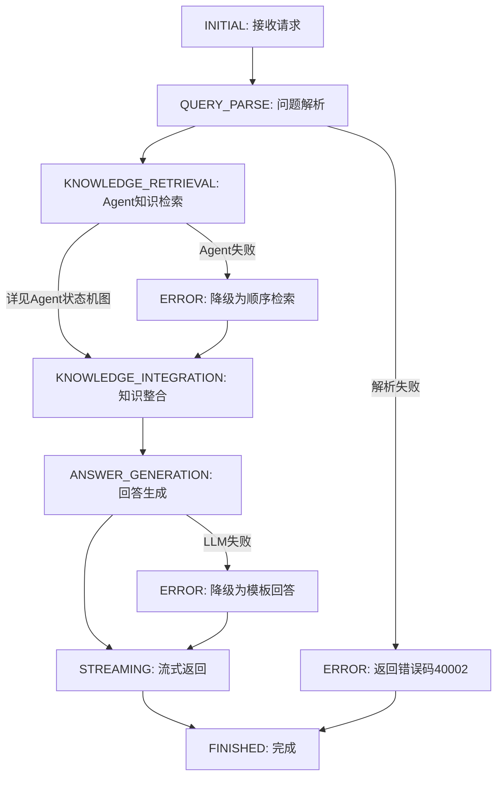
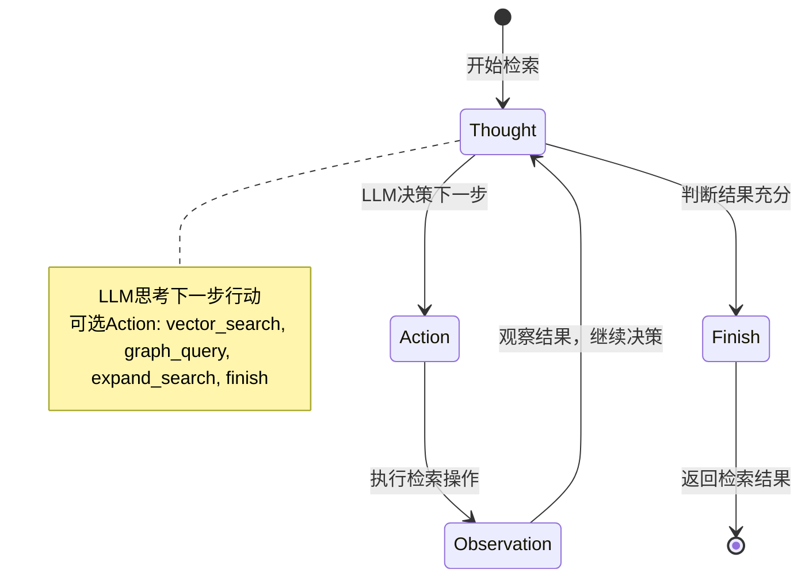
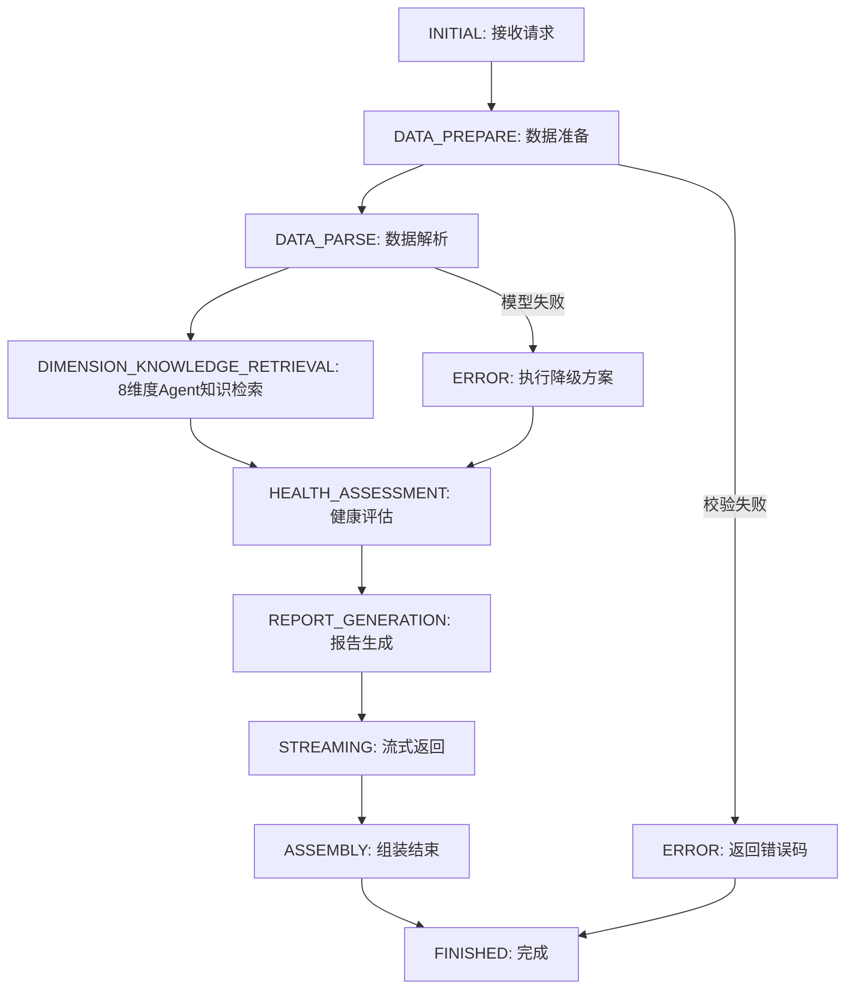
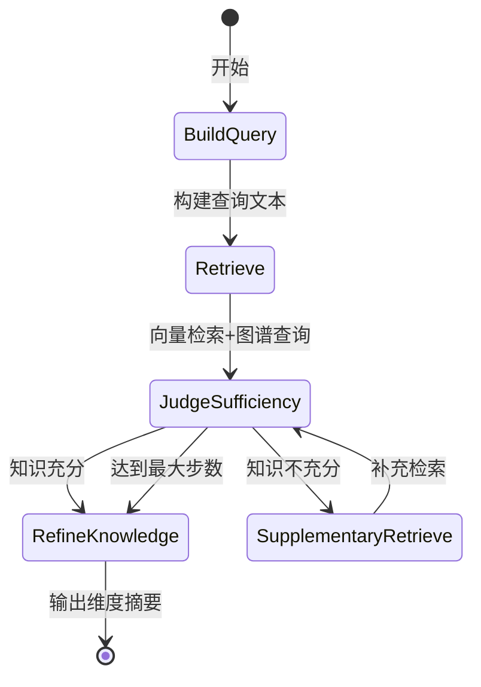
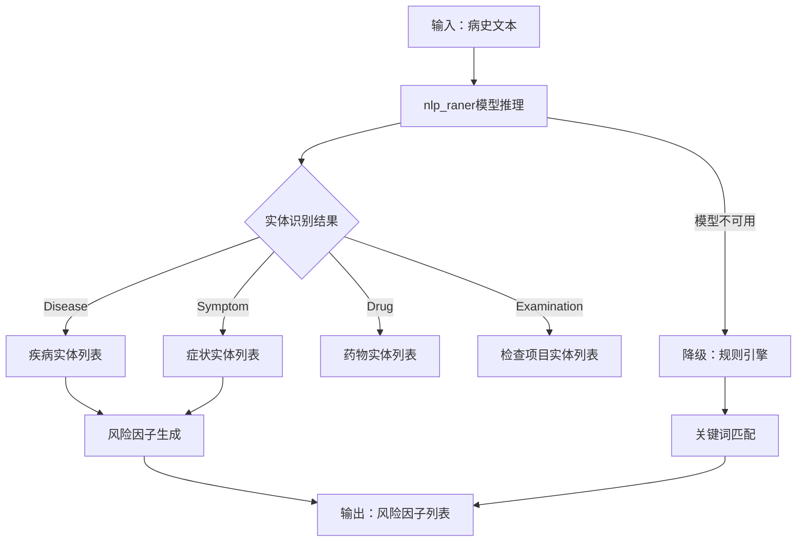
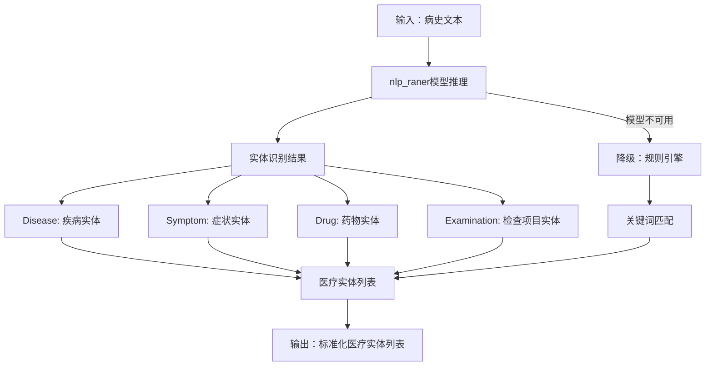
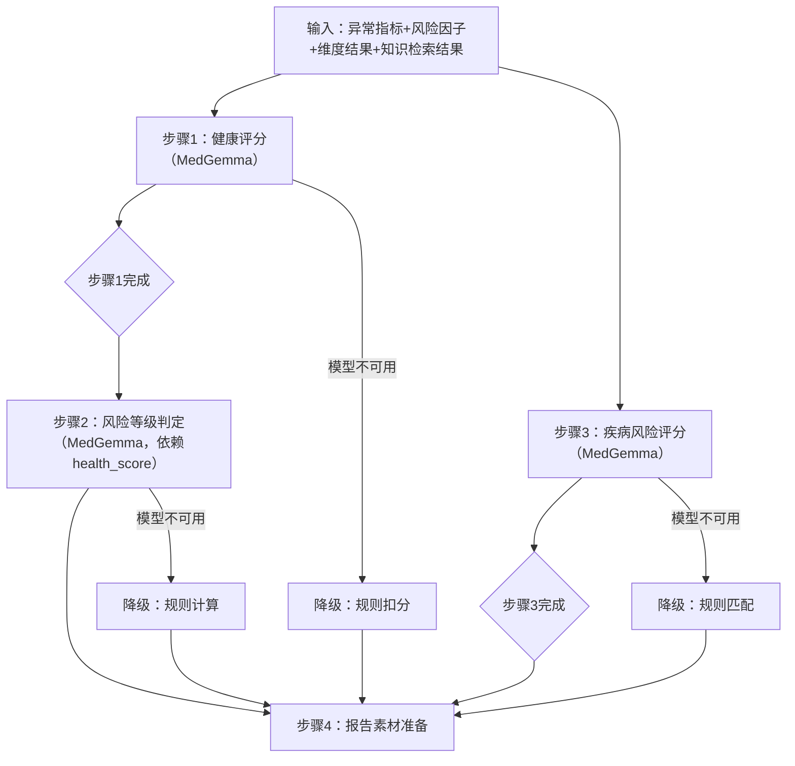
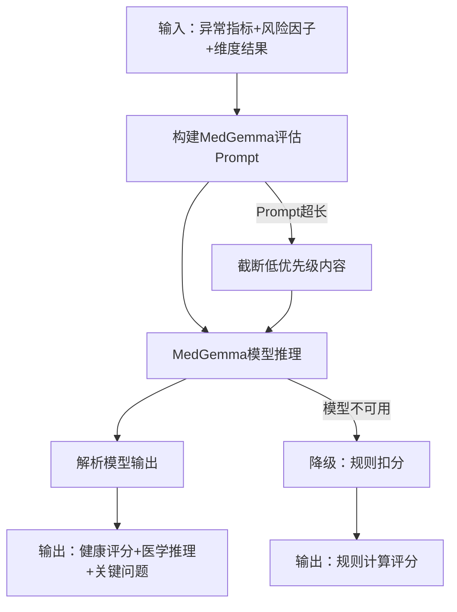
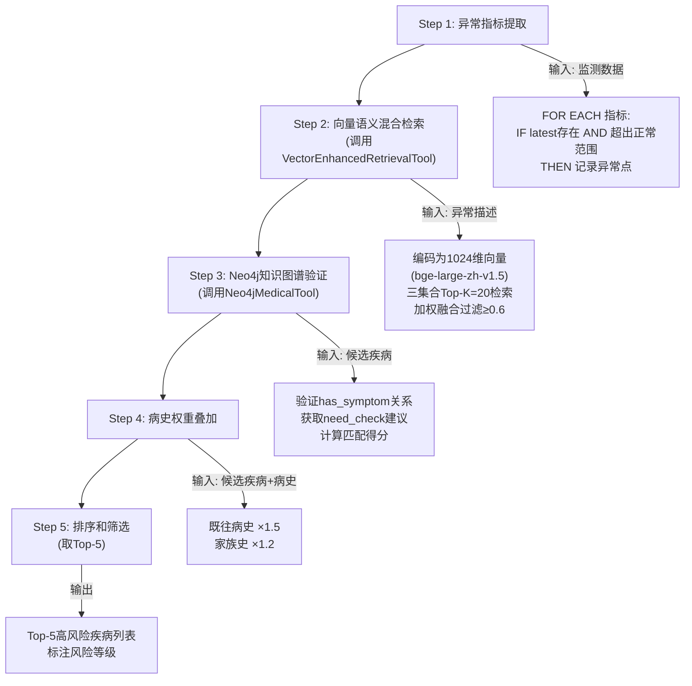

# 项目业务详细设计v4

该文件定义业务接口的重要内容的详细设计，落实开发任务时，还需根据架构设计文档来完成业务接口详细设计在项目框架下的实现

**文档版本**: v4.4
**更新内容**:

1. 采用混合模式设计：流程图描述固定业务流程（硬编码），Agent状态机图描述动态检索策略（LLM决策）
2. 流程图使用Mermaid的flowchart语法，Agent状态机图使用Mermaid的stateDiagram语法
3. Chain只在Agent内部使用（VectorSearchChain、GraphQueryChain）
4. 流程环节（QueryParse、KnowledgeIntegration、AnswerGeneration等）直接在service文件中实现
5. 新增代码实现说明章节，明确各流程环节的代码位置
6. **v4.2更新**：将nlp_raner模型和MedGemma模型纳入健康报告生成业务设计，nlp_raner用于DATA_PARSE环节的风险因子提取和医疗实体提取，MedGemma用于HEALTH_ASSESSMENT环节的健康评分、风险判定、疾病风险评分；HEALTH_ASSESSMENT环节三个MedGemma任务改为并行执行；MULTI_ANALYSIS重命名为DATA_PARSE
   **最后更新**: 2026-05-18

***

## 一、模型选型与21G显存分配方案

#### 显存分配总策略（总预算21G）

为确保在21G显存约束下，多模型（LLM、向量模型、医学模型、意图模型）可同时稳定运行，预留2G安全冗余，采用以下显存分配方案：

**说明**：健康咨询业务和健康报告生成业务对以下模型资源的配置内容相同，但需要各自创建独立的资源配置文件，以便未来扩展和维护。两个业务可能有对方不使用的资源。

| 模型类型       | 模型选型                                                         | 显存占用            | 使用业务         | 详细使用说明                                          |
| ---------- | ------------------------------------------------------------ | --------------- | ------------ | ------------------------------------------- |
| 大语言模型      | Qwen3-4B-Instruct-2507                                       | 7G              | 咨询+报告        | 4bit量化。咨询业务：对话理解和回答生成；报告业务：报告生成和流式输出   |
| 向量编码模型     | BAAI/bge-large-zh-v1.5                                       | 2G              | 咨询+报告        | 1024维向量。咨询业务：语义编码和知识匹配；报告业务：8维度知识检索和Agent检索 |
| 意图分类模型     | FreedomIntelligence/Apollo-0.5B                              | 1G              | 咨询           | 咨询业务：识别用户咨询意图和医疗实体提取                         |
| 健康风险因子分类模型 | iic/nlp\_raner\_named-entity-recognition\_chinese-base-cmeee | 2G              | 报告           | 报告业务DATA_PARSE环节：风险因子提取（从病史文本中识别疾病、症状实体）和医疗实体提取（从病史文本中识别疾病、症状、药物、检查项目实体） |
| 健康风险预测模型   | MedGemma-1.5-4B-IT                                           | 7G              | 报告           | 报告业务HEALTH_ASSESSMENT环节：健康综合评分计算（医学推理评分替代规则扣分）、风险等级判定（医学推理判定替代规则计算）、疾病风险评分（医学推理预测替代规则匹配） |
| 系统预留/冗余    | /                                                            | 2G              | /            | 运行时内存、缓冲、峰值占用预留                             |
| **总计**     | /                                                            | **21G**         | /            | 满负荷分配，预留2G安全冗余                              |

***

## 二、健康咨询业务

### 2.0 业务设计模式

健康咨询业务采用**混合模式**设计：

- **流程图**：描述固定的业务流程（硬编码），每个流程环节是固定的处理步骤
- **Agent状态机图**：描述动态的知识检索策略（LLM决策），是流程图中"知识检索"环节的详细设计

**代码实现说明**：
- 流程图中的流程环节在实际代码中写到 `src/service/consult_service.py`
- Agent检索使用 `KnowledgeRetrievalAgent` 类，内部使用Chain封装固定逻辑

### 2.1 流程概述

健康咨询采用**7环节固定流程**管理从接收到返回的完整流程。

#### 2.2 流程环节定义

| 序号 | 状态名称  | 英文标识                   | 职责描述                           | 预估耗时       | 是否可并行   |
| -- | ----- | ---------------------- | ------------------------------ | ---------- | ------- |
| 1  | 初始状态  | INITIAL                | 接收请求，构建ConsultContext，提取当前查询   | <10ms      | 否       |
| 2  | 问题解析  | QUERY\_PARSE           | NLP实体抽取 + 意图识别 + 查询改写          | 50-100ms   | 否       |
| 3  | 知识检索  | KNOWLEDGE\_RETRIEVAL   | **Agent知识检索模式**：LLM决策动态检索策略    | 150-500ms  | 否（内部动态） |
| 4  | 知识整合  | KNOWLEDGE\_INTEGRATION | 结果去重排序 + 相关性过滤 + 素材准备          | 20-50ms    | 否       |
| 5  | 回答生成  | ANSWER\_GENERATION     | 调用LLM基于知识素材生成专业回答              | 500-2000ms | 否       |
| 6  | 流式返回  | STREAMING              | 实时返回内容块给客户端                    | 持续         | 否（子状态）  |
| 7  | 完成/错误 | FINISHED / ERROR       | 结束流程或异常处理                      | <5ms       | 否       |

#### 2.3 流程图

##### 主流程图



##### 完整转换规则表

| 当前状态                   | 触发事件      | 目标状态                   | 说明                  |
| ---------------------- | --------- | ---------------------- | ------------------- |
| INITIAL                | 接收到POST请求 | QUERY\_PARSE           | 提取当前查询文本            |
| QUERY\_PARSE           | 解析完成      | KNOWLEDGE\_RETRIEVAL   | 输出实体列表和意图标签         |
| QUERY\_PARSE           | 解析失败      | ERROR                  | 返回错误码40002（非健康咨询范围） |
| KNOWLEDGE\_RETRIEVAL   | 检索完成      | KNOWLEDGE\_INTEGRATION | 汇总检索结果              |
| KNOWLEDGE\_RETRIEVAL   | Agent失败   | ERROR                  | 降级为顺序检索模式           |
| KNOWLEDGE\_INTEGRATION | 整合完成      | ANSWER\_GENERATION     | 准备好Prompt素材         |
| ANSWER\_GENERATION     | 开始生成      | STREAMING              | 进入流式输出模式            |
| STREAMING              | 生成完成      | FINISHED               | 收集结束标识              |
| ANSWER\_GENERATION     | LLM调用失败   | ERROR                  | 降级为模板回答             |
| ERROR                  | 降级处理完成    | FINISHED               | 异常处理后结束             |
| **任意状态**               | 未预期异常     | **ERROR**              | 统一异常入口              |

#### 2.4 Agent知识检索模式详细设计

##### 2.4.1 Agent检索概述

健康咨询业务的KNOWLEDGE_RETRIEVAL环节采用**Agent知识检索模式**，基于ReAct（Reasoning + Acting）模式实现动态检索策略决策。

**Agent状态机图是流程图中KNOWLEDGE_RETRIEVAL环节的详细设计**，描述LLM动态决策检索策略的过程。

**核心特点**：
- **LLM作为决策者**：大语言模型根据当前上下文动态决定下一步检索操作
- **动态策略调整**：根据检索结果实时调整检索策略，而非固定流程
- **自适应检索**：根据问题类型、检索效果自动选择最优检索路径
- **降级保障**：Agent失败时自动回退到固定流程的顺序检索模式

##### 2.4.2 Agent状态机图



##### 2.4.3 Agent状态定义

Agent检索过程包含以下状态循环：

| Agent状态 | 说明 | 输出示例 |
|---------|------|--------|
| **Thought** | LLM思考下一步行动 | "用户询问高血压的症状，需要先检索高血压疾病实体" |
| **Action** | 执行检索操作 | `{"action": "vector_search", "params": {"query": "高血压症状", "top_k": 10}}` |
| **Observation** | 观察检索结果 | "检索到高血压疾病实体，包含症状列表" |

**可用Action列表**：

| Action | 说明 | 参数 |
|--------|------|------|
| `vector_search` | 向量检索锚定实体、关系或属性 | `query`, `top_k`, `collections` |
| `graph_query` | 图查询做结构化推理增强 | `entity_ids`, `query_type` |
| `expand_search` | 扩展检索（基于已有结果扩展） | `seed_entities`, `expand_depth` |
| `finish` | 完成检索，返回结果 | `final_results` |

##### 2.4.4 Agent限制机制

为确保Agent检索的稳定性和可控性，设置以下限制：

| 限制项 | 限制值 | 说明 |
|-------|--------|------|
| **MAX_STEPS** | 5 | 最大检索步数限制，防止无限循环 |
| **MAX_PROMPT_CHARS** | 4000 | Agent决策Prompt最大字符数 |
| **TIMEOUT** | 20秒 | Agent检索总超时时间 |
| **MIN_RESULTS** | 3 | 最少检索结果数量，不足则继续检索 |

##### 2.4.5 Agent决策Prompt模板

```python
AGENT_DECISION_PROMPT = """
你是一个医学知识检索Agent，负责根据用户查询动态决定检索策略。

## 当前状态
- 当前步骤：{current_step}/{max_steps}
- 用户查询：{user_query}
- 已提取实体：{extracted_entities}
- 意图标签：{intent_label}

## 已检索结果摘要
{retrieved_results_summary}

## 可用操作
1. **vector_search**: 向量检索锚定实体、关系或属性
   - 参数: query（检索文本）, top_k（返回数量，默认10）, collections（集合列表）
   - 适用场景: 初始检索、实体锚定

2. **graph_query**: 图查询做结构化推理增强
   - 参数: entity_ids（实体ID列表）, query_type（查询类型：disease/symptom/drug）
   - 适用场景: 已锚定实体后，获取完整关系网络

3. **expand_search**: 扩展检索（基于已有结果扩展）
   - 参数: seed_entities（种子实体）, expand_depth（扩展深度，默认1）
   - 适用场景: 结果不足时，扩展相关实体

4. **finish**: 完成检索，返回结果
   - 参数: final_results（最终结果列表）
   - 适用场景: 已获得足够结果，可以结束检索

## 决策要求
请根据当前状态和已检索结果，决策下一步行动。
输出JSON格式：
{
    "action": "操作名称",
    "params": {参数对象},
    "reason": "决策理由"
}

注意：
- 如果已获得足够的知识素材（≥3个相关实体），建议使用finish结束
- 如果当前步骤已达上限，必须使用finish结束
- 优先使用vector_search锚定实体，再使用graph_query增强
"""
```

##### 2.4.6 Agent检索流程示例

```python
async def knowledge_retrieval_agent(
    context: ConsultContext, 
    call_router: CallRouter,
    llm_service: LLMService
) -> List[Dict]:
    """
    Agent知识检索模式（健康咨询专用）
    基于ReAct模式，LLM动态决策检索策略
    """
    
    # Agent限制配置
    MAX_STEPS = 5
    MAX_PROMPT_CHARS = 4000
    TIMEOUT = 20
    
    # 初始化Agent状态
    current_step = 0
    retrieved_results = []
    action_history = []
    
    # Agent循环
    while current_step < MAX_STEPS:
        current_step += 1
        
        # 构建Agent决策Prompt
        prompt = build_agent_decision_prompt(
            current_step=current_step,
            max_steps=MAX_STEPS,
            user_query=context.current_query,
            extracted_entities=context.extracted_entities,
            intent_label=context.intent_label,
            retrieved_results_summary=summarize_results(retrieved_results)
        )
        
        # 限制Prompt长度
        if len(prompt) > MAX_PROMPT_CHARS:
            prompt = prompt[:MAX_PROMPT_CHARS]
            logger.warning(f"Agent决策Prompt已截断至{MAX_PROMPT_CHARS}字符")
        
        try:
            # LLM决策下一步行动
            decision_json = await llm_service.generate(prompt, temperature=0.3)
            decision = parse_json(decision_json)
            
            action = decision.get("action")
            params = decision.get("params", {})
            reason = decision.get("reason", "")
            
            logger.info(f"Agent步骤{current_step}: action={action}, reason={reason}")
            action_history.append({"step": current_step, "action": action, "reason": reason})
            
            # 执行Action
            if action == "vector_search":
                # 向量检索锚定实体
                results = await call_router.route("vector_retrieval_tool", {
                    "action": "hybrid_search",
                    "params": {
                        "query": params.get("query", context.current_query),
                        "top_k": params.get("top_k", 10),
                        "collections": params.get("collections", ["medical_entity", "entity_attributes", "entity_relations"]),
                        "weights": {"medical_entity": 0.40, "entity_attributes": 0.30, "entity_relations": 0.30}
                    }
                })
                retrieved_results.extend(results)
                
            elif action == "graph_query":
                # 图查询做结构化推理增强
                entity_ids = params.get("entity_ids", extract_entity_ids(retrieved_results))
                query_type = params.get("query_type", "disease")
                
                for entity_id in entity_ids[:10]:
                    graph_results = await call_router.route("neo4j_medical_tool", {
                        "action": f"get_{query_type}_by_node_id",
                        "params": {"node_id": entity_id}
                    })
                    retrieved_results.extend(graph_results)
                
            elif action == "expand_search":
                # 扩展检索
                seed_entities = params.get("seed_entities", extract_entities(retrieved_results))
                expand_depth = params.get("expand_depth", 1)
                
                expand_results = await call_router.route("neo4j_medical_tool", {
                    "action": "expand_entities",
                    "params": {
                        "entity_names": seed_entities,
                        "depth": expand_depth
                    }
                })
                retrieved_results.extend(expand_results)
                
            elif action == "finish":
                # 完成检索
                logger.info(f"Agent检索完成，共{current_step}步，获得{len(retrieved_results)}个结果")
                break
                
            else:
                logger.warning(f"未知的Action: {action}")
                
        except Exception as e:
            logger.error(f"Agent步骤{current_step}执行失败: {e}")
            # Agent失败，触发降级
            return await fallback_sequential_retrieval(context, call_router)
    
    # 检查结果数量
    if len(retrieved_results) < 3:
        logger.warning(f"Agent检索结果不足({len(retrieved_results)}个)，触发降级")
        return await fallback_sequential_retrieval(context, call_router)
    
    # 去重和排序
    merged_results = merge_and_rank_results(retrieved_results)
    
    return merged_results[:15]


async def fallback_sequential_retrieval(context: ConsultContext, call_router: CallRouter) -> List[Dict]:
    """
    降级策略：顺序检索模式
    先向量检索锚定实体，后图查询做结构化推理增强
    """
    logger.warning("Agent检索失败，降级为顺序检索模式")
    
    # Step1: 向量检索锚定实体
    vector_results = await call_router.route("vector_retrieval_tool", {
        "action": "hybrid_search",
        "params": {
            "query": context.current_query,
            "top_k": 20,
            "collections": ["medical_entity", "entity_attributes", "entity_relations"],
            "weights": {"medical_entity": 0.40, "entity_attributes": 0.30, "entity_relations": 0.30}
        }
    })
    
    # Step2: 图查询做结构化推理增强
    anchored_entities = extract_entities_with_ids(vector_results)
    knowledge_results = []
    
    for entity in anchored_entities[:10]:
        graph_result = await call_router.route("neo4j_medical_tool", {
            "action": f"get_{entity['type'].lower()}_by_node_id",
            "params": {"node_id": entity["neo4j_id"]}
        })
        knowledge_results.extend(graph_result)
    
    # 合并结果
    merged = merge_knowledge_results(vector_results, knowledge_results)
    return merged[:15]
```

##### 2.4.7 Agent检索优势

| 优势项 | 说明 |
|-------|------|
| **动态适应性** | 根据问题类型和检索效果动态调整策略 |
| **智能决策** | LLM理解查询意图，选择最优检索路径 |
| **结果质量** | 通过多步迭代优化，提高检索结果相关性 |
| **可控性** | 最大步数限制和超时机制保证稳定性 |
| **降级保障** | Agent失败时自动回退到固定流程 |

#### 2.5 Chain封装说明

Agent检索内部使用以下Chain封装固定逻辑：

| Chain名称 | 在Agent状态机图中的位置 | 职责描述 | 输入 | 输出 |
|----------|----------------------|---------|------|------|
| **VectorSearchChain** | Action: vector_search | 向量检索锚定实体、关系或属性 | 查询文本、top_k | 检索结果列表 |
| **GraphQueryChain** | Action: graph_query | 图查询做结构化推理增强 | 实体ID列表 | 知识图谱结果 |

**Chain调用位置**：
- VectorSearchChain：在Agent的Action阶段，当action="vector_search"时调用
- GraphQueryChain：在Agent的Action阶段，当action="graph_query"时调用

#### 2.6 代码实现说明

**流程环节实现位置**：
- 流程图中的流程环节（INITIAL、QUERY_PARSE、KNOWLEDGE_INTEGRATION、ANSWER_GENERATION、STREAMING、FINISHED、ERROR）在 `src/service/consult_service.py` 中实现
- Agent检索（KNOWLEDGE_RETRIEVAL）使用 `KnowledgeRetrievalAgent` 类

**代码结构示例**：
```python
# src/service/consult_service.py

class ConsultService:
    async def execute_consult(self, request: ConsultRequest) -> AsyncGenerator:
        # INITIAL: 接收请求
        context = self._init_context(request)
        
        # QUERY_PARSE: 问题解析（直接在service中实现）
        parsed_result = await self._parse_query(context)
        
        # KNOWLEDGE_RETRIEVAL: Agent知识检索
        agent = KnowledgeRetrievalAgent(self.resource)
        knowledge = await agent.retrieve(parsed_result)
        
        # KNOWLEDGE_INTEGRATION: 知识整合（直接在service中实现）
        materials = self._integrate_knowledge(knowledge)
        
        # ANSWER_GENERATION: 回答生成（直接在service中实现）
        async for chunk in self._generate_answer(materials):
            yield chunk  # STREAMING
```

#### 2.7 健康咨询降级策略

##### 各阶段超时配置

| 阶段                   | 超时时间 | 降级动作         |
| -------------------- | ---- | ------------ |
| QUERY\_PARSE         | 10秒  | 返回错误码40002   |
| KNOWLEDGE\_RETRIEVAL | 20秒  | Agent失败降级为顺序检索模式 |
| ANSWER\_GENERATION   | 60秒  | 降级为模板回答      |

##### 降级策略矩阵

| 失败组件              | 降级方案                                        | 质量影响 | 适用阶段                 |
| ----------------- | ------------------------------------------- | ---- | -------------------- |
| Agent决策失败          | 降级为固定流程的顺序检索模式（向量检索→图查询）                     | 轻微   | KNOWLEDGE\_RETRIEVAL |
| Agent超过最大步数        | 使用已检索结果继续，或降级为顺序检索模式                          | 轻微   | KNOWLEDGE\_RETRIEVAL |
| Milvus向量库不可用      | 使用Neo4j模糊匹配替代（`search_diseases_by_symptom`） | 中等   | KNOWLEDGE\_RETRIEVAL |
| Neo4j数据库不可用       | 仅使用向量检索结果                                   | 中等   | KNOWLEDGE\_RETRIEVAL |
| LLM(Qwen3-4B)调用失败 | 使用预设模板生成简化回答                                | 中等   | ANSWER\_GENERATION   |
| 向量模型(mcBERT)推理超时  | 使用关键词匹配替代                                   | 轻微   | QUERY\_PARSE         |

**降级策略详细说明**：

1. **Agent决策失败**：
   - 触发条件：LLM决策输出格式错误、Action执行失败、超时
   - 降级方案：回退到固定流程的顺序检索模式（先向量检索锚定实体，后图查询做结构化推理增强）
   - 实现位置：`knowledge_retrieval_agent_chain.py`中的fallback逻辑
   - 注意：降级后仍能保证基本的检索质量
2. **Agent超过最大步数**：
   - 触发条件：Agent检索步数达到MAX_STEPS（5步）限制
   - 降级方案：使用已检索到的结果继续，如果结果不足则降级为顺序检索模式
   - 实现位置：`knowledge_retrieval_agent_chain.py`中的步数检查逻辑
3. **Milvus向量库不可用**：
   - 触发条件：Milvus连接失败或查询超时
   - 降级方案：跳过向量检索步骤，使用Neo4j的`search_diseases_by_symptom()`方法进行模糊匹配
   - 实现位置：`knowledge_retrieval_agent_chain.py`中的fallback逻辑
4. **Neo4j数据库不可用**：
   - 触发条件：Neo4j连接失败或查询超时
   - 降级方案：跳过图查询步骤，仅使用Milvus向量检索结果
   - 实现位置：`consult_strategy.py`中的错误处理逻辑
5. **LLM调用失败**：
   - 触发条件：模型推理失败或超时
   - 降级方案：使用预设模板生成简化回答
   - 实现位置：`consult_strategy.py`中的`_generate_template_answer()`方法

#### 2.8 可改进设计：双路并行检索策略

> 本节记录原设计的"双路并行检索"策略，作为未来性能优化的方向。

**设计思路**：同时启动Neo4j图谱检索和向量增强检索，通过并行执行降低检索延迟。

**实现示例**：

```python
# 并行执行两项检索
results = await asyncio.gather(
    neo4j_task,  # Neo4j知识图谱检索
    vector_task,  # 向量增强检索
    return_exceptions=True
)
```

**预期收益**：降低检索延迟约40%

**实施前提**：

1. 系统资源充足，可支持并行检索
2. Neo4j和Milvus连接池配置优化
3. 结果融合算法稳定可靠

***

## 三、健康报告生成业务

（注：健康报告生成业务与健康咨询业务所相同资源类型的使用配置相同）

### 3.0 业务设计模式

健康报告生成业务采用**混合模式**设计：

- **流程图**：描述固定的业务流程（硬编码），每个流程环节是固定的处理步骤
- **Agent状态机图**：描述动态的知识检索策略（LLM决策），是流程图中"Agent知识检索"任务的详细设计

**代码实现说明**：
- 流程图中的流程环节在实际代码中写到 `src/service/report_service.py`
- 8维度Agent知识检索使用 `DimensionKnowledgeAgent` 类，每个维度Agent内部使用Chain封装固定逻辑
- 8维度Agent知识检索在 `report_service.py` 中并发执行

### 3.1 流程概述

本系统采用**10环节固定流程**管理健康报告生成的完整流程。

### 3.2 流程环节定义（10个环节）

| 序号 | 状态名称 | 英文标识                 | 职责描述                          | 预估耗时        | 是否可并行   |
| -- | ---- | -------------------- | ----------------------------- | ----------- | ------- |
| 1  | 初始状态 | INITIAL              | 接收请求，构建ReportContext上下文对象     | <10ms       | 否       |
| 2  | 数据准备 | DATA\_PREPARE        | 参数校验+数据标准化+空值处理+完整性判断         | 20-50ms     | 否       |
| 3  | 数据解析 | DATA\_PARSE          | 调用nlp_raner模型进行医学实体识别+异常指标提取（规则引擎）+特殊规则应用 | 500-1500ms | 否       |
| 4  | 维度知识检索 | DIMENSION\_KNOWLEDGE\_RETRIEVAL | **8维度Agent知识检索**：统一Agent管理8维度检索+去重+充分性判断+精炼 | 300-700ms   | 是（内部并行） |
| 5  | 健康评估 | HEALTH\_ASSESSMENT          | 调用MedGemma模型并行推理（健康评分∥疾病风险评分）→风险判定→素材准备 | 200-500ms   | 是（内部并行） |
| 6  | 报告生成 | REPORT\_GENERATION   | 调用LLM生成Markdown格式报告+内容校验      | 2000-5000ms | 否       |
| 7  | 流式返回 | STREAMING            | 实时返回内容块给客户端                   | 持续          | 否（子状态）  |
| 8  | 组装结束 | ASSEMBLY             | 组装结束响应+元数据封装+日志记录             | <10ms       | 否       |
| 9  | 完成状态 | FINISHED             | 结束流程，清理资源，释放连接                | <5ms        | 否       |
| 10 | 错误状态 | ERROR                | 异常处理，执行降级策略，记录错误日志            | 可变          | 否       |

### 3.3 流程图

#### 主流程图



#### 完整转换规则表

| 当前状态                 | 触发事件      | 目标状态                 | 说明               |
| -------------------- | --------- | -------------------- | ---------------- |
| INITIAL              | 接收到POST请求 | DATA\_PREPARE        | 构建上下文对象          |
| DATA\_PREPARE        | 校验通过且数据完整 | DATA\_PARSE          | 进入数据解析阶段         |
| DATA\_PREPARE        | 校验失败      | ERROR                | 返回错误码40001/40003 |
| DATA\_PREPARE        | 数据部分缺失    | DATA\_PARSE          | 标记降级级别后继续        |
| DATA\_PARSE          | 解析完成      | DIMENSION\_KNOWLEDGE\_RETRIEVAL | 输出中间结果           |
| DATA\_PARSE          | 模型调用失败    | ERROR                | 执行降级方案           |
| DIMENSION\_KNOWLEDGE\_RETRIEVAL | 所有并行任务完成  | HEALTH\_ASSESSMENT          | 汇总8维度知识精炼结果           |
| DIMENSION\_KNOWLEDGE\_RETRIEVAL | 部分维度超时    | HEALTH\_ASSESSMENT          | 使用已完成的维度结果继续       |
| HEALTH\_ASSESSMENT          | 整合完成      | REPORT\_GENERATION   | 准备好所有素材          |
| REPORT\_GENERATION   | 开始生成      | STREAMING            | 进入流式输出模式         |
| STREAMING            | 生成完成      | ASSEMBLY             | 收集结束标识           |
| REPORT\_GENERATION   | 校验失败      | REPORT\_GENERATION   | 重新生成（最多重试2次）     |
| ASSEMBLY             | 组装完成      | FINISHED             | 正常结束流程           |
| ERROR                | 降级处理完成    | FINISHED             | 异常处理后结束          |
| **任意状态**             | 未预期异常     | **ERROR**            | 统一异常入口           |

#### 3.3.1 DIMENSION\_KNOWLEDGE\_RETRIEVAL状态的统一Agent设计

该状态是健康报告生成的核心技术实现——**8维度Agent知识检索**：8个维度并发执行Agent检索+知识精炼

每个维度是一个独立的DimensionKnowledgeAgent，并发执行以下流程：
1. 构建查询文本（基于异常指标+医疗实体）
2. 向量检索 + 图谱查询
3. Qwen3-4B判断知识充分性
4. 若不充分 → 补充检索 → 回到步骤3
5. Qwen3-4B知识精炼（精炼知识 + 关联用户数据）
6. 输出结构化维度摘要

**约束**：MAX_STEPS=5, MAX_PROMPT_CHARS=4000

```python
async def parallel_processing_state(context: ReportContext, resource) -> Dict:
    """
    8维度Agent知识检索（并发执行）
    每个维度独立执行Agent检索+知识精炼
    """
    dimension_agents = [
        DimensionKnowledgeAgent(dim_id=1, dim_name="疾病风险", resource=resource),
        DimensionKnowledgeAgent(dim_id=2, dim_name="用药建议", resource=resource),
        DimensionKnowledgeAgent(dim_id=3, dim_name="治疗方案", resource=resource),
        DimensionKnowledgeAgent(dim_id=4, dim_name="饮食建议", resource=resource),
        DimensionKnowledgeAgent(dim_id=5, dim_name="检查建议", resource=resource),
        DimensionKnowledgeAgent(dim_id=6, dim_name="并发症预警", resource=resource),
        DimensionKnowledgeAgent(dim_id=7, dim_name="预防措施", resource=resource),
        DimensionKnowledgeAgent(dim_id=8, dim_name="易感人群", resource=resource),
    ]
    
    tasks = [agent.retrieve_and_refine(context) for agent in dimension_agents]
    results = await asyncio.gather(*tasks, return_exceptions=True)
    
    dimension_summaries = {}
    for i, result in enumerate(results):
        if isinstance(result, Exception):
            logger.warning(f"维度{i+1}Agent检索失败: {result}")
            dimension_summaries[f"dimension_{i+1}"] = None
        else:
            dimension_summaries[f"dimension_{i+1}"] = result
    
    return dimension_summaries
```

##### DimensionKnowledgeAgent状态机图

每个维度的Agent内部执行以下状态循环：



#### 3.3.2 DimensionKnowledgeAgent详细设计（8维度Agent知识检索）

健康报告生成业务的DIMENSION_KNOWLEDGE_RETRIEVAL状态采用**统一8维度Agent知识检索模式**，单个DimensionKnowledgeAgent统一管理8个维度的检索、去重、充分性判断和精炼。

##### DimensionKnowledgeAgent概述

每个DimensionKnowledgeAgent是一个独立的Agent，负责单个维度的知识检索和精炼，内部执行以下流程：

1. **BuildQuery**：基于该维度的异常指标和医疗实体，构建查询文本
2. **Retrieve**：执行向量检索 + 图谱查询，获取原始知识
3. **JudgeSufficiency**：Qwen3-4B判断检索到的知识是否充分
4. **SupplementaryRetrieve**：若知识不充分，补充检索后回到步骤3
5. **RefineKnowledge**：Qwen3-4B知识精炼（精炼知识 + 关联用户数据）
6. **输出结构化维度摘要**

**约束**：MAX_STEPS=5, MAX_PROMPT_CHARS=4000

##### DimensionKnowledgeAgent查询构建

每个维度的Agent根据维度类型和用户数据构建查询：

| 维度 | 查询来源 | 查询示例 |
|-----|-------|--------|
| 维度1：疾病风险 | 异常指标 + 风险因子 | "高血压症状和治疗" |
| 维度2：用药建议 | 既往病史 + 当前用药 | "糖尿病治疗药物" |
| 维度3：治疗方案 | 疾病诊断 | "高血压综合治疗方案" |
| 维度4：饮食建议 | 疾病 + BMI | "高血压饮食建议" |
| 维度5：检查建议 | 异常指标 + 疾病 | "高血压定期检查项目" |
| 维度6：并发症预警 | 疾病 + 病史 | "糖尿病并发症" |
| 维度7：预防措施 | 风险因子 + 疾病 | "心血管疾病预防措施" |
| 维度8：易感人群 | 年龄 + 性别 + 病史 | "老年人心血管疾病风险" |

##### DimensionKnowledgeAgent检索流程

```python
class DimensionKnowledgeAgent:
    """维度知识检索Agent，负责单个维度的检索+知识精炼"""
    
    def __init__(self, dim_id: int, dim_name: str, resource):
        self.dim_id = dim_id
        self.dim_name = dim_name
        self.resource = resource
        self.MAX_STEPS = 5
        self.MAX_PROMPT_CHARS = 4000
    
    async def retrieve_and_refine(self, context: ReportContext) -> Dict[str, Any]:
        """
        执行维度检索+知识精炼
        流程：构建查询 → 检索 → 判断充分性 → 补充检索 → 知识精炼
        """
        # Step1: 构建查询文本
        query_text = self._build_query(context)
        
        # Step2: 向量检索 + 图谱查询
        raw_knowledge = await self._retrieve(query_text)
        
        # Step3-4: 判断知识充分性，不充分则补充检索
        current_step = 1
        while current_step < self.MAX_STEPS:
            sufficiency = await self._judge_sufficiency(query_text, raw_knowledge)
            if sufficiency.get("is_sufficient", False):
                break
            # 补充检索
            supplementary = await self._supplementary_retrieve(sufficiency.get("gaps", []))
            raw_knowledge.extend(supplementary)
            current_step += 1
        
        # Step5: Qwen3-4B知识精炼
        refined_summary = await self._refine_knowledge(query_text, raw_knowledge, context)
        
        return refined_summary
    
    def _build_query(self, context: ReportContext) -> str:
        """基于维度类型和用户数据构建查询文本"""
        anomalies = extract_anomalies(context.monitoring_data)
        entities = context.medical_entities
        return f"{self.dim_name}：{', '.join([a['indicator'] for a in anomalies])}，{', '.join([e['entity_name'] for e in entities[:5]])}"
    
    async def _retrieve(self, query_text: str) -> List[Dict]:
        """向量检索 + 图谱查询"""
        # 向量检索
        vector_results = await self.resource.call_router.route("vector_retrieval_tool", {
            "action": "hybrid_search",
            "params": {
                "query": query_text,
                "top_k": 10,
                "collections": ["medical_entity", "entity_attributes", "entity_relations"],
                "weights": {"medical_entity": 0.40, "entity_attributes": 0.30, "entity_relations": 0.30}
            }
        })
        # 图谱查询
        entity_ids = extract_entity_ids(vector_results)
        graph_results = []
        for entity_id in entity_ids[:5]:
            result = await self.resource.call_router.route("neo4j_medical_tool", {
                "action": "get_disease_by_node_id",
                "params": {"node_id": entity_id}
            })
            graph_results.extend(result)
        return vector_results + graph_results
    
    async def _judge_sufficiency(self, query_text: str, knowledge: List[Dict]) -> Dict:
        """Qwen3-4B判断知识充分性"""
        prompt = self._build_sufficiency_prompt(query_text, knowledge)
        response = await self.resource.llm_service.generate(prompt, temperature=0.3)
        return parse_json(response)
    
    async def _supplementary_retrieve(self, gaps: List[str]) -> List[Dict]:
        """补充检索"""
        results = []
        for gap in gaps[:3]:
            vector_results = await self.resource.call_router.route("vector_retrieval_tool", {
                "action": "search",
                "params": {"query": gap, "collection": "medical_entity", "top_k": 5}
            })
            results.extend(vector_results)
        return results
    
    async def _refine_knowledge(self, query_text: str, knowledge: List[Dict], context: ReportContext) -> Dict[str, Any]:
        """Qwen3-4B知识精炼：精炼知识 + 关联用户数据"""
        prompt = self._build_refine_prompt(query_text, knowledge, context)
        response = await self.resource.llm_service.generate(prompt, temperature=0.3)
        return parse_json(response)
```

#### 3.3.3 健康报告性能优化与降级策略

##### 并发控制策略

| 阶段                   | 并行度  | 实现方式                       |
| -------------------- | ---- | -------------------------- |
| DIMENSION\_KNOWLEDGE\_RETRIEVAL | 8维度并行 | asyncio.gather(8个维度检索任务) |

##### 流式输出缓冲配置

| 参数      | 值          | 说明      |
| ------- | ---------- | ------- |
| 缓冲区大小   | 512字节      | 平衡延迟和吞吐 |
| 刷新间隔    | 100ms或缓冲区满 | 保证流畅体验  |
| 首字节时间目标 | <30秒       | 用户感知优化  |

##### 各阶段超时配置

| 阶段                   | 超时时间 | 降级动作             |
| -------------------- | ---- | ---------------- |
| DATA\_PREPARE        | 5秒   | 返回错误码40001/40003 |
| DATA\_PARSE          | 30秒  | nlp_raner降级为规则引擎 |
| DIMENSION\_KNOWLEDGE\_RETRIEVAL | 60秒  | 使用已完成的结果继续       |
| HEALTH\_ASSESSMENT          | 60秒  | MedGemma降级为规则计算  |
| REPORT\_GENERATION   | 240秒 | 降级为模板报告          |

##### 降级策略矩阵

| 失败组件      | 降级方案           | 质量影响 | 适用阶段                 |
| --------- | -------------- | ---- | -------------------- |
| LLM       | 使用预设模板生成简化报告   | 高    | REPORT\_GENERATION   |
| 向量模型      | 使用关键词匹配替代      | 中等   | DATA\_PARSE      |
| nlp_raner模型 | 使用规则引擎（关键词匹配）替代 | 中等   | DATA\_PARSE（风险因子提取、医疗实体提取） |
| MedGemma模型 | 使用规则计算替代       | 中等   | HEALTH_ASSESSMENT（健康评分、风险判定、疾病风险评分） |
| 分类模型      | 使用默认分类结果       | 轻微   | DATA\_PARSE      |
| Agent检索失败 | 降级为顺序检索模式      | 轻微   | DIMENSION\_KNOWLEDGE\_RETRIEVAL |
| Neo4j数据库  | 仅使用向量检索结果      | 中等   | DIMENSION\_KNOWLEDGE\_RETRIEVAL |
| Milvus向量库 | 仅使用Neo4j精确匹配结果 | 中等   | DIMENSION\_KNOWLEDGE\_RETRIEVAL |
| 单个维度检索失败  | 跳过该维度，使用默认值    | 轻微   | DIMENSION\_KNOWLEDGE\_RETRIEVAL |

#### 3.3.4 可改进设计：维度间知识共享策略

> 本节记录原设计的"三路并行"策略，现已统一为8维度Agent知识检索模式。本节保留作为未来维度间知识共享优化的方向。

**设计思路**：当前8个维度Agent独立执行检索，维度间无知识共享。未来可引入维度间知识共享机制，当一个维度检索到其他维度也可复用的知识时，主动共享。

**预期收益**：减少重复检索，提升整体效率

**实施前提**：

1. 维度间知识相关性分析算法稳定可靠
2. 共享机制不增加维度间的耦合度
3. 知识共享的增量收益大于通信开销

***

#### 3.3.5 DATA_PARSE环节详细设计（nlp_raner模型使用）

> 本节详细描述DATA_PARSE环节中nlp_raner模型的使用设计。nlp_raner模型（iic/nlp_raner_named-entity-recognition_chinese-base-cmeee）是中文医学命名实体识别模型，用于从用户病史文本中精确识别疾病、症状、药物、检查项目等医学实体。

##### nlp_raner模型在DATA_PARSE环节的使用位置

| 步骤 | 使用模型 | 当前实现 | 优化后实现 | 降级方案 |
|------|----------|----------|------------|----------|
| 步骤1：异常指标提取 | 无（规则引擎） | 规则引擎（数值判断） | **保持不变**（输入是数值，不需要NER） | / |
| 步骤2：风险因子提取 | **nlp_raner** | 规则引擎（文本分割） | nlp_raner模型识别病史文本中的疾病、症状实体 | 规则引擎（关键词匹配） |
| 步骤3：医疗实体提取 | **nlp_raner** | IntentClassificationHandler + 规则引擎降级 | nlp_raner模型识别疾病、症状、药物、检查项目实体 | 规则引擎（关键词匹配） |
| 步骤4：特殊规则应用 | 无（规则引擎） | 规则引擎 | **保持不变** | / |
| 步骤5：生成分析摘要 | 无 | 字符串拼接 | **保持不变** | / |

##### 步骤2：风险因子提取（nlp_raner模型）详细设计

**输入**：用户病史文本（既往病史、家族病史、过敏史、手术史）

**nlp_raner处理流程**：



**nlp_raner模型调用示例**：

```python
def _extract_risk_factors_with_ner(self, validated_data: Dict) -> List[Dict]:
    """
    使用nlp_raner模型提取风险因子
    
    主路径：nlp_raner模型识别病史文本中的疾病、症状实体
    降级路径：规则引擎（关键词匹配）
    """
    risk_factors = []
    user_profile = validated_data.get("user_profile", {})
    
    # 构建待识别的病史文本
    history_texts = []
    past_medical_history = user_profile.get("past_medical_history", "")
    if past_medical_history and past_medical_history.strip():
        history_texts.append(f"既往病史：{past_medical_history}")
    family_history = user_profile.get("family_history", "")
    if family_history and family_history.strip():
        history_texts.append(f"家族病史：{family_history}")
    
    if not history_texts:
        return risk_factors
    
    text = "。".join(history_texts)
    
    try:
        # 主路径：调用nlp_raner模型
        ner_results = self._resource.ner_model.extract(text)
        
        # 从NER结果中提取疾病实体
        disease_entities = [e for e in ner_results if e["entity_type"] == "Disease"]
        symptom_entities = [e for e in ner_results if e["entity_type"] == "Symptom"]
        
        # 基于识别出的实体生成风险因子
        if len(disease_entities) >= 3:
            risk_factors.append({
                "factor_name": "多病共存",
                "risk_level": "高",
                "basis": f"既往病史包含多种疾病：{', '.join([e['entity_name'] for e in disease_entities])}",
                "source": "nlp_raner",
                "entities": disease_entities
            })
        elif len(disease_entities) > 0:
            risk_factors.append({
                "factor_name": "既往病史",
                "risk_level": "中",
                "basis": f"既往病史：{', '.join([e['entity_name'] for e in disease_entities])}",
                "source": "nlp_raner",
                "entities": disease_entities
            })
        
        if symptom_entities:
            risk_factors.append({
                "factor_name": "症状风险",
                "risk_level": "中",
                "basis": f"存在症状：{', '.join([e['entity_name'] for e in symptom_entities])}",
                "source": "nlp_raner",
                "entities": symptom_entities
            })
        
        # 家族病史风险（从家族病史文本中识别疾病实体）
        family_diseases = [e for e in ner_results 
                          if e["entity_type"] == "Disease" and "家族" in e.get("context", "")]
        if family_diseases:
            risk_factors.append({
                "factor_name": "家族遗传",
                "risk_level": "中",
                "basis": f"有家族病史：{', '.join([e['entity_name'] for e in family_diseases])}",
                "source": "nlp_raner",
                "entities": family_diseases
            })
        
    except Exception as e:
        logger.warning(f"nlp_raner模型调用失败，降级到规则引擎: {str(e)}")
        risk_factors = self._extract_risk_factors_by_rules(validated_data)
    
    return risk_factors
```

**nlp_raner模型输出格式**：

```python
{
    "entity_name": "高血压",       # 实体名称
    "entity_type": "Disease",      # 实体类型：Disease/Symptom/Drug/Examination
    "confidence": 0.95,            # 置信度（0-1）
    "position": [5, 8],            # 在原文中的位置 [start, end]
    "context": "既往病史：高血压5年"  # 实体所在的上下文
}
```

##### 步骤3：医疗实体提取（nlp_raner模型）详细设计

**输入**：用户病史文本（既往病史、家族病史、过敏史、手术史）

**nlp_raner处理流程**：



**nlp_raner模型调用示例**：

```python
def _extract_medical_entities_with_ner(self, validated_data: Dict) -> List[Dict]:
    """
    使用nlp_raner模型提取医疗实体
    
    主路径：nlp_raner模型识别疾病、症状、药物、检查项目实体
    降级路径：规则引擎（关键词匹配）
    """
    medical_entities = []
    
    # 构建待提取的文本
    text_parts = []
    user_profile = validated_data.get("user_profile", {})
    
    past_medical_history = user_profile.get("past_medical_history", "")
    if past_medical_history and past_medical_history.strip():
        text_parts.append(f"既往病史：{past_medical_history}")
    family_history = user_profile.get("family_history", "")
    if family_history and family_history.strip():
        text_parts.append(f"家族病史：{family_history}")
    allergy_history = user_profile.get("allergy_history", "")
    if allergy_history and allergy_history.strip():
        text_parts.append(f"过敏史：{allergy_history}")
    surgical_history = user_profile.get("surgical_history", "")
    if surgical_history and surgical_history.strip():
        text_parts.append(f"手术史：{surgical_history}")
    
    if not text_parts:
        return medical_entities
    
    text = "。".join(text_parts)
    
    try:
        # 主路径：调用nlp_raner模型
        ner_results = self._resource.ner_model.extract(text)
        
        # 标准化NER结果
        for entity in ner_results:
            medical_entities.append({
                "entity_name": entity["entity_name"],
                "entity_type": entity["entity_type"],  # Disease/Symptom/Drug/Examination
                "confidence": entity["confidence"],
                "source": "nlp_raner",
                "context": entity.get("context", ""),
                "neo4j_node_id": None  # 后续由图谱查询补充
            })
        
        logger.info(f"nlp_raner提取医疗实体成功: entity_count={len(medical_entities)}")
        
    except Exception as e:
        logger.warning(f"nlp_raner模型调用失败，降级到规则引擎: {str(e)}")
        medical_entities = self._extract_entities_by_rules(text)
    
    return medical_entities
```

**与原IntentClassificationHandler的对比**：

| 对比项 | IntentClassificationHandler（Apollo-0.5B） | nlp_raner模型 |
|--------|------------------------------------------|--------------|
| 模型类型 | 意图分类模型 | 命名实体识别模型 |
| 核心能力 | 意图识别 + 实体提取（附带） | 专业医学实体识别 |
| 实体类型 | 疾病、症状（2种） | 疾病、症状、药物、检查项目（4种） |
| 精确度 | 中等（附带能力） | 高（专业NER模型） |
| 置信度输出 | 无 | 有（0-1分数） |
| 位置信息 | 无 | 有（原文位置） |
| 适用业务 | 健康咨询业务 | 健康报告生成业务 |

***

#### 3.3.6 HEALTH_ASSESSMENT环节详细设计（MedGemma模型使用）

> 本节详细描述HEALTH_ASSESSMENT环节中MedGemma模型的使用设计。MedGemma模型（MedGemma-1.5-4B-IT）是医学专用大模型，具备医学推理能力，用于替代HEALTH_ASSESSMENT环节中的规则计算，提供更智能的健康评分、风险判定和疾病风险评分。

##### MedGemma模型在HEALTH_ASSESSMENT环节的使用位置

| 步骤 | 使用模型 | 当前实现 | 优化后实现 | 降级方案 | 执行方式 |
|------|----------|----------|------------|----------|----------|
| 步骤1：健康综合评分计算 | **MedGemma** | 规则扣分（高血压扣8分） | MedGemma医学推理评分 | 规则扣分 | **并行**（与步骤3） |
| 步骤2：风险等级判定 | **MedGemma** | 规则计算（分数>60为高风险） | MedGemma医学推理判定 | 规则计算 | **顺序**（依赖步骤1的健康评分） |
| 步骤3：疾病风险评分 | **MedGemma** | 规则匹配（异常数×15+病史×20） | MedGemma医学推理预测 | 规则匹配 | **并行**（与步骤1） |
| 步骤4：报告素材准备 | 无 | 数据整合 | **保持不变** | / | 顺序 |

##### HEALTH_ASSESSMENT环节并行执行设计

**依赖关系分析**：
- 步骤1（健康评分）：输入为anomalies + risk_factors + dimension_results → **独立**
- 步骤3（疾病风险评分）：输入为anomalies + medical_entities + knowledge_results → **独立**
- 步骤2（风险判定）：输入为anomalies + risk_factors + **health_score** + knowledge_results → **依赖步骤1**

**并行执行流程**：



**并行执行代码示例**：

```python
async def _integrate(self, dimensions, knowledge):
    """HEALTH_ASSESSMENT环节：并行执行MedGemma推理任务"""
    
    # 并行执行：健康评分 + 疾病风险评分（两者无依赖关系）
    health_score_task = self._calculate_health_score_with_medgemma(body)
    disease_risks_task = self._calculate_disease_risks_with_medgemma(body)
    
    health_result, disease_risks = await asyncio.gather(
        health_score_task, disease_risks_task, return_exceptions=True
    )
    
    # 顺序执行：风险等级判定（依赖健康评分结果）
    if isinstance(health_result, dict):
        risk_level = await self._calculate_risk_level_with_medgemma(body, health_result)
    else:
        risk_level = self._calculate_risk_level_by_rules(body)
    
    # 顺序执行：报告素材准备
    materials = self._prepare_report_materials(body, health_result, risk_level, disease_risks)
    
    return materials
```

##### 步骤1：健康综合评分计算（MedGemma模型）详细设计

**当前实现**：规则扣分制（高血压扣8分，糖尿病扣6分等），无法理解指标间的医学关联

**优化后实现**：MedGemma模型基于异常指标、风险因子、知识检索结果进行医学推理，理解指标间的关联关系

**MedGemma调用流程**：



**MedGemma评估Prompt模板**：

```
你是一位资深全科医生，请根据以下患者信息进行健康综合评估。

## 患者信息
- 异常指标：{anomalies}
- 风险因子：{risk_factors}
- 8维度Agent知识检索结果摘要：{dimension_summary}

## 评估要求
1. 综合考虑各指标之间的医学关联（如高血压与心血管疾病的关系）
2. 评估各风险因子的协同影响（如糖尿病+肥胖的代谢综合征风险）
3. 给出0-100的健康评分（参考标准：90-100优秀，80-89良好，70-79一般，60-69较差，<60差）

## 输出格式（JSON）
{
    "health_score": 72,
    "reasoning": "患者长期高血压未控制，合并糖尿病，血管内皮损伤风险增加...",
    "key_issues": ["高血压控制不佳", "糖尿病合并症风险", "缺乏规律运动"],
    "dimension_analysis": {
        "physiological": "基础生理指标存在明显异常，血压和血糖均需控制",
        "lifestyle": "缺乏运动和饮食管理，需改善生活方式",
        "medical_history": "既往病史较多，需关注多病共存风险",
        "comprehensive": "综合评估存在中度健康风险"
    }
}
```

**MedGemma输出格式**：

```python
{
    "health_score": 72,                    # 健康评分（0-100）
    "reasoning": "患者长期高血压...",         # 医学推理过程
    "key_issues": ["高血压控制不佳", ...],    # 关键健康问题
    "dimension_analysis": {                 # 各维度分析
        "physiological": "...",
        "lifestyle": "...",
        "medical_history": "...",
        "comprehensive": "..."
    }
}
```

**代码实现示例**：

```python
def _calculate_health_score_with_medgemma(self, body: IntegrationContextBody) -> Dict:
    """
    使用MedGemma模型计算健康综合评分
    
    主路径：MedGemma医学推理评分
    降级路径：规则扣分
    """
    try:
        # 构建评估Prompt
        prompt = self._build_health_score_prompt(body)
        
        # 调用MedGemma模型
        response = self._resource.medgemma_service.call_model(prompt)
        
        # 解析模型输出
        result = self._parse_medgemma_response(response)
        
        # 验证评分合理性（0-100范围）
        health_score = max(0, min(100, result.get("health_score", 75)))
        
        return {
            "health_score": health_score,
            "health_level": self._determine_health_level(health_score),
            "reasoning": result.get("reasoning", ""),
            "key_issues": result.get("key_issues", []),
            "dimension_analysis": result.get("dimension_analysis", {}),
            "source": "medgemma"
        }
        
    except Exception as e:
        logger.warning(f"MedGemma健康评分失败，降级到规则计算: {str(e)}")
        # 降级到规则计算
        health_score = self._calculate_health_score_by_rules(body)
        return {
            "health_score": health_score,
            "health_level": self._determine_health_level(health_score),
            "reasoning": "",
            "key_issues": [],
            "dimension_analysis": {},
            "source": "rules"
        }
```

##### 步骤2：风险等级判定（MedGemma模型）详细设计

**当前实现**：规则计算（FinalRiskScore = (异常数×10 + 风险因子数×5 + 病史权重×3) / 10），无法理解风险因子的医学权重

**优化后实现**：MedGemma模型基于异常指标、风险因子、知识检索结果进行医学推理，综合评估风险等级

**MedGemma风险判定Prompt模板**：

```
你是一位资深全科医生，请根据以下患者信息进行疾病风险评估。

## 患者信息
- 异常指标：{anomalies}
- 风险因子：{risk_factors}
- 健康评分：{health_score}
- 知识检索结果摘要：{knowledge_summary}

## 评估要求
1. 综合分析各风险因子的医学权重（如高血压史的心血管风险权重高于缺乏运动）
2. 评估风险因子的协同效应（如高血压+糖尿病的心血管风险远大于单独存在）
3. 给出4级风险等级：低/轻/中/高

## 输出格式（JSON）
{
    "risk_level": "中",
    "confidence": 0.85,
    "reasoning": "患者长期高血压未控制，合并糖尿病，心血管事件风险显著增加...",
    "primary_risk_factors": ["高血压", "糖尿病"],
    "synergistic_effects": ["高血压+糖尿病协同增加心血管风险"],
    "recommendation": "建议1-3个月内就医，制定综合管理方案"
}
```

**MedGemma输出格式**：

```python
{
    "risk_level": "中",                      # 风险等级（低/轻/中/高）
    "confidence": 0.85,                      # 置信度（0-1）
    "reasoning": "患者长期高血压...",           # 医学推理过程
    "primary_risk_factors": ["高血压", ...],  # 主要风险因子
    "synergistic_effects": ["高血压+糖尿病..."], # 协同效应
    "recommendation": "建议1-3个月内就医..."    # 行动建议
}
```

##### 步骤3：疾病风险评分（MedGemma模型）详细设计

**当前实现**：规则匹配（风险分 = (异常数×15 + 病史匹配×20) × 置信度 × 病史权重），无法理解疾病与症状的深层医学关联

**优化后实现**：MedGemma模型基于异常指标、医疗实体、知识检索结果进行医学推理，分析疾病与症状关系，生成风险依据

**MedGemma疾病风险评分Prompt模板**：

```
你是一位资深全科医生，请根据以下患者信息预测可能的疾病风险。

## 患者信息
- 异常指标：{anomalies}
- 医疗实体（nlp_raner识别）：{medical_entities}
- 知识检索结果：{knowledge_results}
- 风险因子：{risk_factors}

## 评估要求
1. 基于异常指标和病史，分析可能的疾病风险
2. 考虑疾病与症状的医学关联（如高血压→冠心病→心衰的进展路径）
3. 给出Top-5高风险疾病，每个疾病包含风险分（0-100）、置信度（0-1）、医学推理依据

## 输出格式（JSON）
{
    "disease_risks": [
        {
            "disease_name": "冠心病",
            "risk_score": 85,
            "confidence": 0.88,
            "medical_reasoning": "患者长期高血压未控制，合并糖尿病，血管内皮损伤风险增加，动脉粥样硬化进展加速...",
            "risk_factors": ["高血压", "糖尿病", "高龄"],
            "prevention_suggestions": ["控制血压<140/90", "定期心电图检查", "低盐低脂饮食"]
        }
    ]
}
```

**MedGemma输出格式**：

```python
[
    {
        "disease_name": "冠心病",              # 疾病名称
        "risk_score": 85,                     # 风险分（0-100）
        "confidence": 0.88,                   # 置信度（0-1）
        "medical_reasoning": "患者长期高血压...", # 医学推理依据
        "risk_factors": ["高血压", "糖尿病"],    # 相关风险因子
        "prevention_suggestions": ["控制血压...", ...] # 预防建议
    }
]
```

##### MedGemma模型调用的通用约束

1. **Prompt长度限制**：单次调用Prompt不超过4000字符（约1000 tokens），避免超过模型上下文长度
2. **输出格式约束**：强制JSON输出格式，便于解析和验证
3. **超时控制**：单次调用超时30秒，超时后降级到规则计算
4. **重试策略**：最多重试1次，仍失败则降级
5. **结果验证**：验证输出中的数值范围（评分0-100，置信度0-1，风险等级在预定义集合内）

***

### 3.4 8维度Agent知识检索详细设计

> 本章详细描述健康报告生成业务中8个维度Agent知识检索的设计，每个维度由独立的DimensionKnowledgeAgent执行检索+知识精炼。

#### 3.4.0 8维度Agent知识检索概述

8维度Agent知识检索是流程图中DIMENSION_KNOWLEDGE_RETRIEVAL环节的核心实现，单个DimensionKnowledgeAgent统一管理8个维度的检索、去重、充分性判断和精炼。

**实现位置**：`src/service/report_service.py` 中的 `_evaluate_dimensions()` 方法

**并行执行**：使用 `asyncio.gather()` 同时执行8个维度的DimensionKnowledgeAgent

#### 3.4.1 DimensionKnowledgeAgent概述

**DimensionKnowledgeAgent**负责执行单个维度的知识检索和精炼，8个维度Agent并发执行。每个维度Agent独立实现检索、判断充分性、补充检索、知识精炼逻辑。

**Agent职责**：
- 构建维度查询文本
- 执行向量检索 + 图谱查询
- Qwen3-4B判断知识充分性
- 知识不充分时补充检索
- Qwen3-4B知识精炼（精炼知识 + 关联用户数据）
- 输出结构化维度摘要

**实现示例**：

```python
class DimensionKnowledgeAgent:
    """8维度Agent知识检索，每个维度独立执行Agent检索+知识精炼"""
    
    def __init__(self, dim_id: int, dim_name: str, resource):
        self.dim_id = dim_id
        self.dim_name = dim_name
        self.resource = resource
    
    async def retrieve_and_refine(self, context: ReportContext) -> Dict[str, Any]:
        """执行维度检索+知识精炼"""
        
        # 定义8个维度评估任务
        dimension_tasks = [
            self._dimension_1_disease_risk(context),      # 维度1：疾病风险评估
            self._dimension_2_medication(context),        # 维度2：用药建议
            self._dimension_3_treatment(context),         # 维度3：治疗方案
            self._dimension_4_dietary(context),           # 维度4：饮食建议
            self._dimension_5_checkup(context),           # 维度5：检查建议
            self._dimension_6_complication(context),      # 维度6：并发症预警
            self._dimension_7_prevention(context),        # 维度7：预防措施
            self._dimension_8_susceptible(context)        # 维度8：易感人群
        ]
        
        # 并行执行
        results = await asyncio.gather(*dimension_tasks, return_exceptions=True)
        
        # 汇总结果
        dimension_results = {}
        dimension_names = [
            "disease_risk", "medication", "treatment", "dietary",
            "checkup", "complication", "prevention", "susceptible"
        ]
        
        for i, result in enumerate(results):
            if isinstance(result, Exception):
                logger.warning(f"维度{i+1}Agent检索失败: {result}")
                dimension_results[dimension_names[i]] = None
            else:
                dimension_results[dimension_names[i]] = result
        
        return dimension_results
```

#### 3.4.2 维度1：疾病风险

**Agent检索目标**：基于异常指标和病史，检索疾病风险相关知识并精炼。

| 项目 | 内容 |
|-----|------|
| **输入** | `anomalies`（异常指标）, `risk_factors`（风险因子）, `medical_entities`（医疗实体） |
| **输出** | `risk_level`（风险等级）, `risk_diseases`（风险疾病列表）, `suggestions`（建议）, `basis`（依据） |
| **检索策略** | 向量检索 + 图谱查询 + Qwen3-4B知识精炼 |
| **Agent逻辑** | 构建查询 → 向量检索锚定相关疾病 → 图谱查询获取疾病详细信息 → Qwen3-4B判断充分性 → 知识精炼 |

**实现示例**：

```python
async def _dimension_1_disease_risk(self, context: ReportContext) -> Dict[str, Any]:
    """维度1：疾病风险评估"""
    
    # 提取输入
    anomalies = extract_anomalies(context.monitoring_data)
    risk_factors = context.risk_factors
    medical_entities = extract_medical_entities(context.user_profile.past_medical_history)
    
    # 检索策略：向量检索 + 图谱查询
    # Step1: 向量检索锚定相关疾病
    disease_candidates = []
    for anomaly in anomalies:
        vector_results = await self.call_router.route("vector_retrieval_tool", {
            "action": "search",
            "params": {
                "query": f"{anomaly['indicator']}异常相关疾病",
                "collection": "medical_entity",
                "top_k": 5
            }
        })
        disease_candidates.extend(vector_results)
    
    # Step2: 图谱查询获取疾病详细信息
    risk_diseases = []
    for candidate in disease_candidates[:10]:
        disease_info = await self.call_router.route("neo4j_medical_tool", {
            "action": "get_disease_by_name",
            "params": {"name": candidate["entity_name"]}
        })
        if disease_info:
            # 计算风险分
            risk_score = calculate_risk_score(disease_info, anomalies, risk_factors)
            risk_diseases.append({
                "name": disease_info["name"],
                "risk_score": risk_score,
                "risk_level": get_risk_level(risk_score),
                "symptoms": disease_info.get("symptoms", []),
                "cause": disease_info.get("cause", "")
            })
    
    # 排序并取Top 5
    risk_diseases = sorted(risk_diseases, key=lambda x: x["risk_score"], reverse=True)[:5]
    
    # 生成建议
    suggestions = generate_risk_suggestions(risk_diseases)
    
    return {
        "risk_level": get_overall_risk_level(risk_diseases),
        "risk_diseases": risk_diseases,
        "suggestions": suggestions,
        "basis": "基于监测数据异常指标和既往病史分析"
    }
```

#### 3.4.3 维度2：用药建议

**Agent检索目标**：基于既往病史和当前用药，检索用药建议相关知识并精炼。

| 项目 | 内容 |
|-----|------|
| **输入** | `medical_entities`（既往病史和当前用药） |
| **输出** | `current_medication_review`（当前用药审查）, `recommended_medications`（推荐药物）, `precautions`（注意事项）, `suggestions`（建议） |
| **检索策略** | 向量检索 + 图谱查询 + Qwen3-4B知识精炼 |
| **Agent逻辑** | 构建查询 → 向量检索锚定相关药物 → 图谱查询获取药物详细信息 → Qwen3-4B判断充分性 → 知识精炼 |

**实现示例**：

```python
async def _dimension_2_medication(self, context: ReportContext) -> Dict[str, Any]:
    """维度2：用药建议"""
    
    # 提取输入
    past_history = context.user_profile.past_medical_history
    current_medications = context.user_profile.current_medications
    medical_entities = extract_medical_entities(past_history)
    
    # 检索策略：向量检索 + 图谱查询
    # Step1: 向量检索锚定相关药物
    drug_candidates = []
    for entity in medical_entities:
        if entity["type"] == "Disease":
            vector_results = await self.call_router.route("vector_retrieval_tool", {
                "action": "search",
                "params": {
                    "query": f"{entity['name']}治疗药物",
                    "collection": "medical_entity",
                    "top_k": 5
                }
            })
            drug_candidates.extend(vector_results)
    
    # Step2: 图谱查询获取药物详细信息
    recommended_medications = []
    for candidate in drug_candidates[:10]:
        drug_info = await self.call_router.route("neo4j_medical_tool", {
            "action": "get_drug_by_name",
            "params": {"name": candidate["entity_name"]}
        })
        if drug_info:
            recommended_medications.append({
                "name": drug_info["name"],
                "usage": drug_info.get("usage", ""),
                "dosage": drug_info.get("dosage", ""),
                "side_effects": drug_info.get("side_effects", []),
                "contraindications": drug_info.get("contraindications", [])
            })
    
    # 当前用药审查
    current_medication_review = review_current_medications(current_medications, recommended_medications)
    
    # 注意事项
    precautions = generate_medication_precautions(recommended_medications, current_medications)
    
    return {
        "current_medication_review": current_medication_review,
        "recommended_medications": recommended_medications[:5],
        "precautions": precautions,
        "suggestions": "请遵医嘱用药，注意药物相互作用"
    }
```

#### 3.4.4 维度3：治疗方案

**Agent检索目标**：基于疾病诊断，检索治疗方案相关知识并精炼。

| 项目 | 内容 |
|-----|------|
| **输入** | `medical_entities`（疾病诊断） |
| **输出** | `treatment_options`（治疗方案选项）, `lifestyle_interventions`（生活方式干预）, `follow_up_plan`（随访计划）, `suggestions`（建议） |
| **检索策略** | 向量检索 + 图谱查询 + Qwen3-4B知识精炼 |
| **Agent逻辑** | 构建查询 → 图谱查询获取治疗方案 → Qwen3-4B判断充分性 → 知识精炼 |

**实现示例**：

```python
async def _dimension_3_treatment(self, context: ReportContext) -> Dict[str, Any]:
    """维度3：治疗方案"""
    
    # 提取输入
    diseases = extract_diseases(context.user_profile.past_medical_history)
    risk_diseases = context.dimension_results.get("disease_risk", {}).get("risk_diseases", [])
    all_diseases = diseases + [d["name"] for d in risk_diseases]
    
    # 检索策略：向量检索 + 图谱查询
    treatment_options = []
    lifestyle_interventions = []
    
    for disease_name in all_diseases[:5]:
        # 图谱查询获取治疗方案
        disease_info = await self.call_router.route("neo4j_medical_tool", {
            "action": "get_disease_by_name",
            "params": {"name": disease_name}
        })
        
        if disease_info:
            treatment_options.append({
                "disease": disease_name,
                "treatment": disease_info.get("treatment", ""),
                "drugs": disease_info.get("drugs", [])
            })
            
            lifestyle_interventions.append({
                "disease": disease_name,
                "lifestyle": disease_info.get("prevent", "")
            })
    
    # 随访计划
    follow_up_plan = generate_follow_up_plan(all_diseases)
    
    return {
        "treatment_options": treatment_options,
        "lifestyle_interventions": lifestyle_interventions,
        "follow_up_plan": follow_up_plan,
        "suggestions": "建议定期复查，遵医嘱治疗"
    }
```

#### 3.4.5 维度4：饮食建议

**Agent检索目标**：基于疾病和BMI，检索饮食建议相关知识并精炼。

| 项目 | 内容 |
|-----|------|
| **输入** | `medical_entities`（疾病和BMI） |
| **输出** | `recommended_foods`（推荐食物）, `forbidden_foods`（禁忌食物）, `dietary_principles`（饮食原则）, `suggestions`（建议） |
| **检索策略** | 向量检索 + 图谱查询 + Qwen3-4B知识精炼 |
| **Agent逻辑** | 构建查询 → 图谱查询获取饮食建议 → Qwen3-4B判断充分性 → 知识精炼 |

**实现示例**：

```python
async def _dimension_4_dietary(self, context: ReportContext) -> Dict[str, Any]:
    """维度4：饮食建议"""
    
    # 提取输入
    diseases = extract_diseases(context.user_profile.past_medical_history)
    bmi = calculate_bmi(context.user_profile.height, context.user_profile.weight)
    
    # 检索策略：向量检索 + 图谱查询
    recommended_foods = []
    forbidden_foods = []
    
    for disease_name in diseases[:5]:
        # 图谱查询获取饮食建议
        foods = await self.call_router.route("neo4j_medical_tool", {
            "action": "get_foods_by_disease_name",
            "params": {"disease_name": disease_name}
        })
        
        if foods:
            recommended_foods.extend(foods.get("recommended", []))
            forbidden_foods.extend(foods.get("forbidden", []))
    
    # 去重
    recommended_foods = list(set(recommended_foods))
    forbidden_foods = list(set(forbidden_foods))
    
    # 饮食原则
    dietary_principles = generate_dietary_principles(diseases, bmi)
    
    return {
        "recommended_foods": recommended_foods[:10],
        "forbidden_foods": forbidden_foods[:10],
        "dietary_principles": dietary_principles,
        "suggestions": "注意饮食均衡，避免禁忌食物"
    }
```

#### 3.4.6 维度5：检查建议

**Agent检索目标**：基于疾病和异常指标，检索检查建议相关知识并精炼。

| 项目 | 内容 |
|-----|------|
| **输入** | `anomalies`（异常指标）, `medical_entities`（疾病） |
| **输出** | `recommended_examinations`（推荐检查项目）, `examination_frequency`（检查频率）, `key_indicators`（关键指标）, `suggestions`（建议） |
| **检索策略** | 向量检索 + 图谱查询 + Qwen3-4B知识精炼 |
| **Agent逻辑** | 构建查询 → 图谱查询获取检查建议 → Qwen3-4B判断充分性 → 知识精炼 |

**实现示例**：

```python
async def _dimension_5_checkup(self, context: ReportContext) -> Dict[str, Any]:
    """维度5：检查建议"""
    
    # 提取输入
    anomalies = extract_anomalies(context.monitoring_data)
    diseases = extract_diseases(context.user_profile.past_medical_history)
    
    # 检索策略：向量检索 + 图谱查询
    recommended_examinations = []
    
    for disease_name in diseases[:5]:
        # 图谱查询获取检查建议
        checks = await self.call_router.route("neo4j_medical_tool", {
            "action": "get_checks_by_disease_name",
            "params": {"disease_name": disease_name}
        })
        
        if checks:
            recommended_examinations.extend(checks)
    
    # 去重
    recommended_examinations = list(set(recommended_examinations))
    
    # 检查频率
    examination_frequency = generate_examination_frequency(diseases, anomalies)
    
    # 关键指标
    key_indicators = extract_key_indicators(anomalies)
    
    return {
        "recommended_examinations": recommended_examinations[:10],
        "examination_frequency": examination_frequency,
        "key_indicators": key_indicators,
        "suggestions": "建议定期进行相关检查，关注关键指标变化"
    }
```

#### 3.4.7 维度6：并发症预警

**Agent检索目标**：基于疾病和病史，检索并发症预警相关知识并精炼。

| 项目 | 内容 |
|-----|------|
| **输入** | `medical_entities`（疾病和病史） |
| **输出** | `potential_complications`（潜在并发症）, `warning_signs`（预警信号）, `prevention_measures`（预防措施）, `suggestions`（建议） |
| **检索策略** | 向量检索 + 图谱查询 + Qwen3-4B知识精炼 |
| **Agent逻辑** | 构建查询 → 图谱查询获取并发症 → Qwen3-4B判断充分性 → 知识精炼 |

**实现示例**：

```python
async def _dimension_6_complication(self, context: ReportContext) -> Dict[str, Any]:
    """维度6：并发症预警"""
    
    # 提取输入
    diseases = extract_diseases(context.user_profile.past_medical_history)
    
    # 检索策略：向量检索 + 图谱查询
    potential_complications = []
    
    for disease_name in diseases[:5]:
        # 图谱查询获取并发症
        complications = await self.call_router.route("neo4j_medical_tool", {
            "action": "get_complications_by_disease_name",
            "params": {"disease_name": disease_name}
        })
        
        if complications:
            potential_complications.extend(complications)
    
    # 去重
    potential_complications = list(set(potential_complications))
    
    # 预警信号
    warning_signs = generate_warning_signs(potential_complications)
    
    # 预防措施
    prevention_measures = generate_complication_prevention(potential_complications)
    
    return {
        "potential_complications": potential_complications[:10],
        "warning_signs": warning_signs,
        "prevention_measures": prevention_measures,
        "suggestions": "注意观察预警信号，及时就医"
    }
```

#### 3.4.8 维度7：预防措施

**Agent检索目标**：基于疾病和风险因子，检索预防措施相关知识并精炼。

| 项目 | 内容 |
|-----|------|
| **输入** | `risk_factors`（风险因子）, `medical_entities`（疾病） |
| **输出** | `lifestyle_prevention`（生活方式预防）, `vaccination_recommendations`（疫苗接种建议）, `regular_checkups`（定期检查）, `suggestions`（建议） |
| **检索策略** | 向量检索 + 图谱查询 + Qwen3-4B知识精炼 |
| **Agent逻辑** | 构建查询 → 图谱查询获取预防措施 → Qwen3-4B判断充分性 → 知识精炼 |

**实现示例**：

```python
async def _dimension_7_prevention(self, context: ReportContext) -> Dict[str, Any]:
    """维度7：预防措施"""
    
    # 提取输入
    risk_factors = context.risk_factors
    diseases = extract_diseases(context.user_profile.past_medical_history)
    
    # 检索策略：向量检索 + 图谱查询
    lifestyle_prevention = []
    vaccination_recommendations = []
    
    for disease_name in diseases[:5]:
        # 图谱查询获取预防措施
        prevention = await self.call_router.route("neo4j_medical_tool", {
            "action": "get_prevention_by_disease_name",
            "params": {"disease_name": disease_name}
        })
        
        if prevention:
            lifestyle_prevention.append({
                "disease": disease_name,
                "prevention": prevention
            })
    
    # 疫苗接种建议（基于年龄和疾病）
    age = calculate_age(context.user_profile.birth_date)
    vaccination_recommendations = generate_vaccination_recommendations(age, diseases)
    
    # 定期检查
    regular_checkups = generate_regular_checkups(diseases, risk_factors)
    
    return {
        "lifestyle_prevention": lifestyle_prevention,
        "vaccination_recommendations": vaccination_recommendations,
        "regular_checkups": regular_checkups,
        "suggestions": "保持健康生活方式，定期体检"
    }
```

#### 3.4.9 维度8：易感人群

**Agent检索目标**：基于年龄、性别、病史，检索易感疾病相关知识并精炼。

| 项目 | 内容 |
|-----|------|
| **输入** | `risk_factors`（年龄、性别、病史） |
| **输出** | `susceptible_diseases`（易感疾病）, `risk_factors_analysis`（风险因子分析）, `prevention_priorities`（预防优先级）, `suggestions`（建议） |
| **检索策略** | 向量检索 + 图谱查询 + Qwen3-4B知识精炼 |
| **Agent逻辑** | 构建查询 → 图谱查询获取易感疾病 → Qwen3-4B判断充分性 → 知识精炼 |

**实现示例**：

```python
async def _dimension_8_susceptible(self, context: ReportContext) -> Dict[str, Any]:
    """维度8：易感人群"""
    
    # 提取输入
    age = calculate_age(context.user_profile.birth_date)
    gender = context.user_profile.gender
    past_history = context.user_profile.past_medical_history
    family_history = context.user_profile.family_history
    
    # 检索策略：向量检索 + 图谱查询
    # 基于年龄、性别查询易感疾病
    susceptible_diseases = await self.call_router.route("neo4j_medical_tool", {
        "action": "get_susceptible_diseases",
        "params": {
            "age": age,
            "gender": gender,
            "past_history": past_history,
            "family_history": family_history
        }
    })
    
    # 风险因子分析
    risk_factors_analysis = analyze_risk_factors(age, gender, past_history, family_history)
    
    # 预防优先级
    prevention_priorities = generate_prevention_priorities(susceptible_diseases, risk_factors_analysis)
    
    return {
        "susceptible_diseases": susceptible_diseases[:10],
        "risk_factors_analysis": risk_factors_analysis,
        "prevention_priorities": prevention_priorities,
        "suggestions": "关注易感疾病，提前预防"
    }
```

***

### 3.5 Agent与Chain封装说明

8维度Agent知识检索使用以下Agent和Chain封装：

| 名称 | 类型 | 在流程中的位置 | 职责描述 | 输入 | 输出 |
|----------|------|----------------------|---------|------|------|
| **DimensionKnowledgeAgent** | Agent | DIMENSION_KNOWLEDGE_RETRIEVAL | 统一管理8维度知识检索+去重+充分性判断+精炼 | ReportContext | 8维度摘要 |
| **VectorSearchChain** | Chain | DimensionKnowledgeAgent内部: Retrieve | 向量检索锚定实体、关系或属性 | 查询文本、top_k | 检索结果列表 |
| **GraphQueryChain** | Chain | DimensionKnowledgeAgent内部: Retrieve | 图查询做结构化推理增强 | 实体ID列表 | 知识图谱结果 |

**调用关系**：
- DimensionKnowledgeAgent：在DIMENSION_KNOWLEDGE_RETRIEVAL环节，统一管理8维度检索
- VectorSearchChain：在DimensionKnowledgeAgent的Retrieve阶段调用
- GraphQueryChain：在DimensionKnowledgeAgent的Retrieve阶段调用

### 3.6 代码实现说明

**流程环节实现位置**：
- 流程图中的流程环节（INITIAL、DATA_PREPARE、DATA_PARSE、HEALTH_ASSESSMENT、REPORT_GENERATION、STREAMING、ASSEMBLY、FINISHED、ERROR）在 `src/service/report_service.py` 中实现
- DATA_PARSE环节：nlp_raner模型用于风险因子提取和医疗实体提取，异常指标提取和特殊规则应用使用规则引擎
- HEALTH_ASSESSMENT环节：MedGemma模型用于健康综合评分计算、风险等级判定、疾病风险评分，报告素材准备使用数据整合
- DIMENSION_KNOWLEDGE_RETRIEVAL环节：DimensionKnowledgeAgent统一管理8维度检索+去重+充分性判断+精炼

**代码结构示例**：
```python
# src/service/report_service.py

class ReportService:
    async def execute_report(self, request: ReportRequest) -> AsyncGenerator:
        # INITIAL: 接收请求
        context = self._init_context(request)
        
        # DATA_PREPARE: 数据准备（直接在service中实现）
        prepared_data = self._prepare_data(context)
        
        # DATA_PARSE: 数据解析
        # - 异常指标提取：规则引擎（数值判断）
        # - 风险因子提取：nlp_raner模型（降级为规则引擎）
        # - 医疗实体提取：nlp_raner模型（降级为规则引擎）
        # - 特殊规则应用：规则引擎
        analysis_result = await self._data_parse(prepared_data)
        
        # DIMENSION_KNOWLEDGE_RETRIEVAL: 8维度Agent知识检索
        dimension_agents = [
            DimensionKnowledgeAgent(dim_id=1, dim_name="疾病风险", resource=self.resource),
            DimensionKnowledgeAgent(dim_id=2, dim_name="用药建议", resource=self.resource),
            DimensionKnowledgeAgent(dim_id=3, dim_name="治疗方案", resource=self.resource),
            DimensionKnowledgeAgent(dim_id=4, dim_name="饮食建议", resource=self.resource),
            DimensionKnowledgeAgent(dim_id=5, dim_name="检查建议", resource=self.resource),
            DimensionKnowledgeAgent(dim_id=6, dim_name="并发症预警", resource=self.resource),
            DimensionKnowledgeAgent(dim_id=7, dim_name="预防措施", resource=self.resource),
            DimensionKnowledgeAgent(dim_id=8, dim_name="易感人群", resource=self.resource),
        ]
        tasks = [agent.retrieve_and_refine(context) for agent in dimension_agents]
        dimension_summaries = await asyncio.gather(*tasks, return_exceptions=True)
        
        # HEALTH_ASSESSMENT: 健康评估（并行执行MedGemma推理）
        # - 健康综合评分 ∥ 疾病风险评分：MedGemma模型并行（降级为规则计算）
        # - 风险等级判定：MedGemma模型（依赖健康评分，降级为规则计算）
        # - 报告素材准备：数据整合
        materials = self._integrate(dimension_summaries)
        
        # REPORT_GENERATION: 报告生成（直接在service中实现）
        async for chunk in self._generate_report(materials):
            yield chunk  # STREAMING
```

***

### 3.7 核心算法实现（健康报告专用，MedGemma降级方案）

> 本章的所有算法服务于**健康报告生成**业务，主要在编排层的`HEALTH_ASSESSMENT`环节中使用。**当MedGemma模型不可用时，这些规则算法作为降级方案使用。**MedGemma模型的主路径设计详见3.3.6节。

#### 3.7.1 算法1：疾病风险评分算法（含【医学支撑】）

##### 算法概述

**目标**：基于用户监测数据异常值、既往病史、家族病史，预测可能的疾病风险并量化评分。

**输入**：

- 监测数据中的异常指标列表（如血压偏高、血糖偏高等）
- 用户既往病史（字符串文本）
- 家族遗传病史（字符串文本）

**输出**：

- Top N高风险疾病列表（默认N=5）
- 每个疾病的：名称、风险分（0-100）、置信度（0-1）、主要依据

##### 算法流程



##### 数学模型基础

$$
RiskScore(d) = \left( \sum\_{i=1}^{n} SymptomMatch(s\_i, d) \times w\_i \right) \times Severity(d) \times HistoryMultiplier(d)
$$

其中：

- $d$：候选疾病
- $s\_i$：第i个异常症状/指标
- $SymptomMatch(s\_i, d)$：症状$s\_i$与疾病$d$的匹配度（0-1），由混合检索的融合得分决定
- $w\_i$：症状$i$对该疾病诊断的重要性权重（由Neo4j关系强度决定）
- $Severity(d)$：疾病$d$的基础严重程度系数（1-10，从知识库获取）
- $HistoryMultiplier(d)$：病史乘数（默认1.0，有既往病史×1.5，有家族史×1.2）

##### 【医学支撑】算法1的理论依据

**算法来源**：
本算法改进自经典的**Framingham心血管疾病风险评估模型**（Framingham Heart Study, 1948-至今），并结合了现代向量语义匹配技术和中文医疗知识图谱。

**权威指南引用**：

1. **《中国高血压防治指南（2018年修订版）》**
   - 引用来源：中华医学会心血管病学分会. 中国高血压防治指南(2018年修订版). 中国心血管杂志, 2019, 24(1): 24-56.
   - 支撑内容：高血压的危险分层标准（高危/中危/低危），用于设定风险分阈值
2. **《中国2型糖尿病防治指南（2020年版）》**
   - 引用来源：中华医学会糖尿病学分会. 中国2型糖尿病防治指南(2020年版). 中华糖尿病杂志, 2021, 13(2): 95-101.
   - 支撑内容：糖尿病的风险因素权重，用于调整血糖相关疾病的风险评分
3. **American Diabetes Association. Standards of Medical Care in Diabetes—2024**
   - 引用来源：Diabetes Care, 2024, 47(Suppl\_1): S1-S321.
   - 支撑内容：国际通用的糖尿病风险预测模型参考

**学术文献支撑**：

- **\[1]** Kannel WB, et al. A general cardiovascular risk profile: Findings from the Framingham Study. *Am Heart J*, 1987, 114(1): 176-185.
- **\[2]** Conroy RM, et al. Estimation of ten-year risk of fatal cardiovascular disease in Europe: the SCORE project. *Eur Heart J*, 2003, 24(11): 987-1003.
- **\[3]** Wu Y, et al. Prevalence, awareness, treatment, and control of hypertension in China. *Lancet*, 2018, 391(10125): 2535-2546.

**参数设定的医学依据**：

| 参数     | 设定值  | 医学依据                    |
| ------ | ---- | ----------------------- |
| 高风险阈值  | >80分 | 参考《中国心血管病预防指南》高危判定标准    |
| 既往病史权重 | ×1.5 | 基于队列研究显示RR≈1.5          |
| 家族史权重  | ×1.2 | 基于双生子研究遗传度h²≈0.2        |
| 混合检索阈值 | ≥0.6 | 基于医疗BERT模型F1-score最优平衡点 |
| Top-K值 | K=20 | 覆盖95%以上的潜在相关疾病          |

***

#### 3.7.2 算法2：健康综合评分算法-100分制（含【医学支撑】）

##### 算法概述

**目标**：基于8个数据维度的评估结果，计算0-100分的综合健康评分，并划分5个健康等级。

**设计理念**：
综合参考**SF-36健康调查量表**（Short Form 36 Health Survey）和**老年人综合健康评估量表**（Comprehensive Geriatric Assessment, CGA）的设计思路，兼顾客观生理指标和主观感受四个维度。

**与主流评分系统的对比**：

| 特征   | 本系统评分      | SF-36  | EQ-5D  | Charlson合并症指数 |
| ---- | ---------- | ------ | ------ | ------------- |
| 评分范围 | 0-100      | 0-100  | 0-1    | 0-33（加权）      |
| 维度数量 | 4大维度       | 8个子量表  | 5个维度   | 17种疾病权重       |
| 客观指标 | ✅ 包含（监测数据） | ❌ 无    | ❌ 无    | ❌ 仅病史         |
| 适用人群 | 老年人（特化）    | 通用成人   | 通用成人   | 住院患者          |
| 动态更新 | ✅ 可实时更新    | ❌ 静态测量 | ❌ 静态测量 | ❌ 静态测量        |

##### 评分规则（满分100分，扣分制）

###### 维度A：基础生理指标（满分30分）

| 指标     | 异常情况                   | 扣分     | 说明            |
| ------ | ---------------------- | ------ | ------------- |
| 血压     | 高血压1级（140-159/90-99）   | -4     | 参考《中国高血压指南》分级 |
| 血压     | 高血压2级（160-179/100-109） | -6     | 中度升高，需药物治疗    |
| 血压     | 高血压3级（≥180/110）        | -8     | 重度升高，需立即干预    |
| 血糖     | 空腹血糖受损（6.1-6.9）        | -3     | 糖尿病前期         |
| 血糖     | 糖尿病（空腹≥7.0）            | -6     | 已确诊糖尿病        |
| BMI    | 超重（24≤BMI<28）          | -4     | 《中国成人超重肥胖标准》  |
| BMI    | 肥胖（BMI≥28）             | -7     | 显著增加代谢综合征风险   |
| 心率/血氧等 | 其他指标异常                 | -5\~10 | 根据严重程度动态调整    |

*单维度最高扣分不超过30分*

###### 维度B：生活方式（满分25分）

| 因素    | 情况             | 扣分 | 说明              |
| ----- | -------------- | -- | --------------- |
| 吸烟    | 目前吸烟           | -8 | WHO认定吸烟是最可预防的死因 |
| 饮酒    | 过量饮酒（>30g酒精/日） | -6 | 增加肝病、癌症风险       |
| 缺乏运动  | <150分钟/周中等强度运动 | -6 | 不符合WHO推荐标准      |
| 作息不规律 | 经常熬夜/睡眠不足      | -5 | 影响免疫力和代谢        |

###### 维度C：病史情况（满分25分）

| 因素    | 情况      | 扣分  | 说明        |
| ----- | ------- | --- | --------- |
| 慢性病   | 1种慢性病   | -5  | 增加长期管理负担  |
| 慢性病   | ≥2种慢性病  | -10 | 多病共存，协同危害 |
| 家族史   | 1种危险家族史 | -4  | 遗传风险因素    |
| 未定期体检 | >1年未体检  | -7  | 错过早期发现机会  |

###### 维度D：其他综合（满分20分）

| 因素   | 情况        | 扣分 | 说明     |
| ---- | --------- | -- | ------ |
| 肝肾功能 | 轻度异常      | -3 | 需要监测   |
| 睡眠质量 | 长期睡眠障碍    | -5 | 影响身心健康 |
| 精神状态 | 明显焦虑/抑郁倾向 | -5 | 需要心理支持 |

##### 最终评分计算

$$
HealthScore = 100 - \sum\_{i=A}^{D} Deduction\_i
$$

约束条件：

- $$HealthScore \geq 0$$ （最低0分）
- 单维度最高扣分不超过该维度满分

##### 健康等级划分

| 评分区间       | 等级 | 视觉标识 | 业务含义     | 建议     |
| ---------- | -- | ---- | -------- | ------ |
| **90-100** | 优秀 | 绿色   | 各项指标基本正常 | 继续保持   |
| **80-89**  | 良好 | 黄色   | 存在轻微异常   | 关注改善   |
| **70-79**  | 一般 | 橙色   | 存在多项异常   | 制定改善计划 |
| **60-69**  | 较差 | 红色   | 明显异常     | 尽快就医   |
| **<60**    | 差  | 深红   | 严重异常     | 立即就医   |

##### 【医学支撑】算法2的理论依据

**体系来源**：综合参考以下权威健康评估工具的设计理念：

1. **SF-36健康调查量表** — Ware JE Jr, Sherbourne CD. *Med Care*, 1992, 30(6): 473-483.
2. **EQ-5D生活质量问卷** — Brooks R, et al. *Health Policy*, 1996, 37(1): 53-72.
3. **Charlson合并症指数** — Charlson ME, et al. *J Chronic Dis*, 1987, 40(5): 373-383.

**本系统的创新点**：

- ✅ 增加了客观生理指标的量化评估（监测数据驱动）
- ✅ 结合了老年人特点（年龄适配规则）
- ✅ 支持动态更新（每次生成都反映最新状态）
- ✅ 可解释性强（每个扣分项都有明确依据）

**扣分规则的循证依据**：

| 扣分规则      | 循证依据               | 来源                                                 |
| --------- | ------------------ | -------------------------------------------------- |
| 吸烟扣8分     | 吸烟者全因死亡率是不吸烟者的2-3倍 | Doll R, et al. *BMJ*, 2004                         |
| 高血压3级扣8分  | 重度高血压患者心血管事件风险增加4倍 | Lewington S, et al. *Lancet*, 2002                 |
| BMI≥28扣7分 | 肥胖使全因死亡率增加20-30%   | Global BMI Mortality Collaboration. *Lancet*, 2016 |
| ≥2种慢病扣10分 | 多病共存使死亡率呈指数增长      | Marengoni A, et al. *Ageing Res Rev*, 2011         |

***

#### 3.7.3 算法3：风险等级最终判定算法（含【医学支撑】）

##### 算法概述

**目标**：结合健康评分和各维度风险因子加权得分，输出最终的4级风险等级（低/轻/中/高）。

##### 计算公式

$$
FinalRiskScore = (100 - HealthScore) + \left( \sum\_{j=1}^{m} RiskFactor\_j.weight\_j \times 20 \right)
$$

##### 风险等级判定表

| FinalRiskScore | 最终风险等级 | 行动建议           |
| -------------- | ------ | -------------- |
| **0-20**       | 低风险    | 定期监测，保持健康生活    |
| **21-40**      | 轻度风险   | 关注改善，3-6个月复查   |
| **41-60**      | 中度风险   | 制定改善计划，1-3个月就医 |
| **>60**        | 高度风险   | 尽快就医，不要拖延      |

##### 风险因子权重系数表

| 风险因子           | 权重系数    | 医学依据             |
| -------------- | ------- | ---------------- |
| **高血压史**       | **1.5** | 使心血管事件风险增加2-3倍   |
| **糖尿病史**       | **1.4** | 使全因死亡风险增加1.8倍    |
| **吸烟史**        | **1.3** | 使全因死亡风险增加2-3倍    |
| **血脂异常**       | **1.2** | 使冠心病风险增加1.5-2倍   |
| **肥胖(BMI≥28)** | **1.1** | 使多种慢性病风险增加30-50% |
| **缺乏运动**       | **0.9** | 使全因死亡风险增加20-30%  |
| **高龄(>80岁)**   | **0.8** | 年龄每增加10岁，心血管风险翻倍 |

##### 【医学支撑】算法3的理论依据

1. **《中国心血管病预防指南（2017）》** — 10年ASCVD风险分层标准映射
2. **WHO Global Health Estimates 2020** — 全球疾病负担数据
3. **中国心血管病报告（2023）** — 中国人群流行病学数据校准

***

### 3.8 特殊规则的技术实现示例（健康报告专用）

> 本章的所有规则服务于**健康报告生成**业务，主要在编排层的`HEALTH_ASSESSMENT`环节和`REPORT_GENERATION`环节中使用。

#### 3.8.1 规则1：高风险疾病优先规则（示例代码+【医学支撑】）

```python
def apply_high_priority_rule(report_content: dict, risk_list: list) -> dict:
    high_risk_diseases = [d for d in risk_list if d['risk_score'] > 80]
    if high_risk_diseases:
        emergency_block = "⚠️ **紧急提醒** ⚠️\n\n"
        for disease in high_risk_diseases:
            emergency_block += f"- **{disease['name']}**（风险分：{disease['risk_score']:.1f}）\n"
        report_content['health_overview']['emergency_alert'] = emergency_block
        for disease in high_risk_diseases:
            disease['display_style'] = 'red_bold'
            disease['priority_tag'] = '🚨 高风险'
    return report_content
```

**【医学支撑】**：急诊医学"黄金救治时间窗"概念 — 急性心肌梗死120分钟内再灌注、缺血性卒中4.5小时内溶栓。参考 Saver JL. Time is brain—quantified. *Stroke*, 2006, 37(1): 263-266.

#### 3.8.2 规则2：多疾病关联规则（示例代码+【医学支撑】）

```python
async def apply_multi_disease_association_rule(context, identified_diseases, call_router):
    for disease in identified_diseases:
        # 通过MCP代理调用Neo4jMedicalTool查询并发症
        complications = await call_router.route("neo4j_medical_tool", {
            "action": "get_complications",
            "params": {"disease_names": [disease['name']]}
        })
        active_complications = [c for c in complications if c['complication_name'] in [d['name'] for d in identified_diseases]]
        if active_complications:
            disease['risk_level'] = level_upgrade_map.get(disease['risk_level'], 'critical')
            disease['association_warning'] = f"⚠️ 注意：可能与以下疾病相互加重..."
    return identified_diseases
```

**【医学支撑】**：疾病协同作用理论（Disease Synergy Theory）。65岁以上老年人超过50%患2种及以上慢病，多病共存使死亡率增加2-4倍。参考 Marengoni A, et al. Aging with multimorbidity: a systematic review of the literature. *Ageing Res Rev*, 2011, 10(4): 430-439.

#### 3.8.3 规则3：用药冲突检测规则（示例代码+【医学支撑】）

```python
def apply_drug_conflict_detection_rule(recommended_drugs, allergy_history, current_medications):
    result = {'filtered_drugs': [], 'excluded_drugs': [], 'interaction_warnings': []}
    allergies = parse_allergy_text(allergy_history) if allergy_history else []
    for drug in recommended_drugs:
        if any(is_drug_allergic(drug, a) for a in allergies):
            result['excluded_drugs'].append({'name': drug['name'], 'reason': f"与过敏史冲突", 'alternatives': find_alternative_drug(drug)})
        else:
            result['filtered_drugs'].append(drug)
    if current_medications:
        for new_drug in result['filtered_drugs']:
            interactions = check_drug_interactions(new_drug, current_medications)
            if interactions: result['interaction_warnings'].append(interactions)
    return result
```

**【医学支撑】**：老年药理学原理。美国老年人平均服用5种处方药，使用≥5种药物ADR发生率高达52%。参考 Qato DM, et al. Use of prescription and OTC medications and dietary supplements among older adults in the United States. *JAMA*, 2008, 300(24): 2867-2878; Beers MH, et al. Explicit criteria for determining potentially inappropriate medication use by the elderly. *Arch Intern Med*, 1991, 151(9): 1825-1832.

#### 3.8.4 规则4：空值降级策略（示例代码+【医学支撑】）

```python
def determine_degradation_level(monitoring_data) -> int:
    available = count_available_indicators(monitoring_data)
    ratio = available / 6
    if ratio == 0: return 3
    elif ratio <= 0.33: return 2
    elif ratio <= 0.67: return 1
    else: return 0

def generate_report_by_level(level, context):
    templates = {0: 'full_template', 1: 'standard_template', 2: 'condensed_template', 3: 'basic_template'}
    structure = load_template(templates[level])
    if level >= 2:
        structure['monitoring_section']['detail_level'] = 'minimal'
    if level == 3:
        structure['monitoring_section']['visible'] = False
        structure['append_message'] = "**💡 提示**：暂无监测数据分析，建议佩戴监测设备..."
    return structure
```

**【医学支撑】**：临床数据缺失处理的最佳实践。采用自适应报告生成策略，保证任何情况下都有输出。敏感性分析验证：数据完整率≥67%时CV<5%、Kappa>0.85。参考 Rubin DB. Multiple Imputation for Nonresponse in Surveys. *Wiley*, 1987.

***

### 3.9 Token预算分配

基于Qwen3-4B-Instruct-2507模型（上下文窗口8K）和健康报告结构，Token预算分配如下：

| 内容                      | Token数     | 占比       | 说明                         |
| ----------------------- | ---------- | -------- | -------------------------- |
| Prompt模板（系统指令+格式要求）     | 约2000      | 约20%     | 包含报告结构指令、格式要求、医学知识引用规则等    |
| 知识素材（从Neo4j+向量检索到的医学知识） | 约3000      | 约30%     | 包含疾病信息、药物信息、检查建议、饮食建议等知识片段 |
| 用户数据摘要                  | 约1500      | 约15%     | 包含用户基本信息、监测数据摘要、病史摘要等      |
| **报告输出**                | 约3500      | 约35%     | 生成的Markdown格式健康报告内容        |
| **总计**                  | **约10000** | **100%** | 在8K上下文窗口内，预留约2K缓冲空间        |

**Token分配策略说明**：

1. **Prompt模板（约2000 Token）**：
   - 系统角色定义和任务指令：约500 Token
   - 报告结构模板和格式要求：约800 Token
   - 医学知识引用和免责声明规则：约400 Token
   - 输出质量控制指令：约300 Token
2. **知识素材（约3000 Token）**：
   - 疾病相关知识（症状、病因、治疗）：约1000 Token
   - 药物和检查建议：约800 Token
   - 饮食和生活方式建议：约600 Token
   - 并发症和预防措施：约600 Token
3. **用户数据摘要（约1500 Token）**：
   - 用户基本信息：约200 Token
   - 监测数据摘要（6项指标）：约600 Token
   - 病史摘要：约400 Token
   - 8维度Agent知识检索结果摘要：约300 Token
4. **报告输出（约3500 Token）**：
   - 健康总览：约300 Token
   - 常规体检部分：约800 Token
   - 专项监测部分：约1000 Token
   - 风险评估部分：约1200 Token
   - 综合建议和免责声明：约200 Token

**Prompt长度限制机制（防止超过模型上下文长度）**：

为避免Prompt超过模型最大上下文长度（8192 tokens），ReportGenerationChain实现了Prompt长度限制机制：

1. **长度控制常量**：
   - `MAX_PROMPT_CHARS = 16000`：Prompt总长度上限（约4000 tokens）
   - `MAX_KNOWLEDGE_CHARS = 12000`：知识素材长度上限（约3000 tokens）

2. **知识素材构建策略**：
   - **总量控制**：知识素材总长度不超过12000字符
   - **分段截断**：每个部分（merged_results、dimension_results等）添加时检查总长度
   - **单项压缩**：
     - 单个value长度超过500字符时截断
     - 单个analysis长度超过300字符时截断
     - 单个basis长度超过200字符时截断
   - **优先级保留**：按照merged_results → dimension_results → anomalies → risk_factors的顺序添加，确保重要信息优先保留

3. **实现示例**：

```python
# src/orchestration/chain/report_generation_chain/report_generation_chain.py

# Prompt长度控制常量
MAX_PROMPT_CHARS = 16000  # 约4000 tokens
MAX_KNOWLEDGE_CHARS = 12000  # 知识素材最大字符数

def _build_knowledge_context(self, report_materials: Dict) -> str:
    """构建知识素材上下文，添加长度限制"""
    context_parts = []
    total_chars = 0
    
    # 处理merged_results（知识检索结果）
    merged_results = report_materials.get("merged_results", [])
    if merged_results:
        context_parts.append("=== 知识检索结果 ===")
        total_chars += len(context_parts[-1])
        
        for item in merged_results:
            if total_chars >= MAX_KNOWLEDGE_CHARS:
                logger.warning("知识素材长度达到上限，截断merged_results")
                break
            # 添加实体数据，限制单个value长度为500字符
            # ...
    
    # 处理dimension_results（8维度Agent知识检索结果）
    if total_chars < MAX_KNOWLEDGE_CHARS:
        # 添加维度评估结果，限制单个value长度为300字符
        # ...
    
    # 处理anomalies（异常指标）
    if total_chars < MAX_KNOWLEDGE_CHARS:
        # 添加异常指标
        # ...
    
    # 处理risk_factors（风险因素）
    if total_chars < MAX_KNOWLEDGE_CHARS:
        # 添加风险因素，限制basis长度为200字符
        # ...
    
    result = "\n".join(context_parts)
    logger.info(f"知识素材构建完成: chars={len(result)}, truncated={len(result) >= MAX_KNOWLEDGE_CHARS}")
    
    return result
```

4. **长度限制的优势**：
   - **防止超限**：确保Prompt不超过模型最大上下文长度
   - **自动压缩**：长文本被自动压缩，保留关键信息
   - **优先级保留**：重要信息优先保留，确保报告质量
   - **监控友好**：记录截断情况，便于问题排查

***

## 四、版本历史

| 版本       | 日期             | 更新内容                                                                                            |
| -------- | -------------- | ----------------------------------------------------------------------------------------------- |
| v1.0     | 2026-04-08     | 初始版本，定义健康咨询和健康报告生成业务的状态机设计                                                                      |
| v2.0     | 2026-04-10     | 完善算法设计，添加医学支撑，补充性能优化策略                                                                          |
| v3.0     | 2026-04-15     | 1. 健康咨询业务检索策略调整为顺序检索模式；2. 健康报告生成业务检索策略调整为双路并发模式；3. 补全Token预算分配表格；4. 衡全降级策略矩阵；5. 新增"可改进设计"章节 |
| v4.0     | 2026-05-15     | **1. 健康咨询业务检索策略升级为Agent知识检索模式（ReAct模式）；2. 健康报告生成业务检索策略升级为Agent知识检索模式；3. 新增Agent知识检索模式详细设计；4. 新增8维度评估详细设计；5. 新增Chain封装说明** |
| **v4.1** | **2026-05-16** | **采用混合模式设计：流程图描述固定业务流程（硬编码），Agent状态机图描述动态检索策略（LLM决策）；Chain只在Agent内部使用；流程环节直接在service文件中实现** |
| **v4.2** | **2026-05-18** | **1. nlp_raner模型纳入DATA_PARSE环节设计：风险因子提取和医疗实体提取使用nlp_raner模型（降级为规则引擎）；2. MedGemma模型纳入HEALTH_ASSESSMENT环节设计：健康综合评分、风险等级判定、疾病风险评分使用MedGemma模型（降级为规则计算）；3. HEALTH_ASSESSMENT环节三个MedGemma任务改为并行执行（健康评分∥疾病风险评分→风险判定）；4. MULTI_ANALYSIS重命名为DATA_PARSE（数据解析）；5. 新增3.3.5和3.3.6节详细设计；6. 更新模型选型表、降级策略矩阵、超时配置** |
| **v4.3** | **2026-05-18** | **1. INTEGRATION重命名为HEALTH_ASSESSMENT（健康评估）；2. PARALLEL_PROCESSING双路并行改为统一8维度Agent知识检索模式；3. 每个维度Agent内部：检索→Qwen3-4B判断充分性→补充检索→Qwen3-4B知识精炼；4. 预分析改为知识精炼；5. 8维度评估改为8维度Agent知识检索；6. DimensionEvaluationChain改为DimensionKnowledgeAgent** |
| **v4.4** | **2026-05-18** | **1. PARALLEL_PROCESSING重命名为DIMENSION_KNOWLEDGE_RETRIEVAL（维度知识检索）；2. DimensionKnowledgeAgent改为统一管理8维度的Agent；3. 新增6个优化机制：知识去重、维度间知识共享、检索质量评估、补充检索策略、知识精炼Prompt设计、置信度评估** |

***

**文档编写**: AI Assistant
**最后更新**: 2026-05-18
**文档版本**: 4.3
