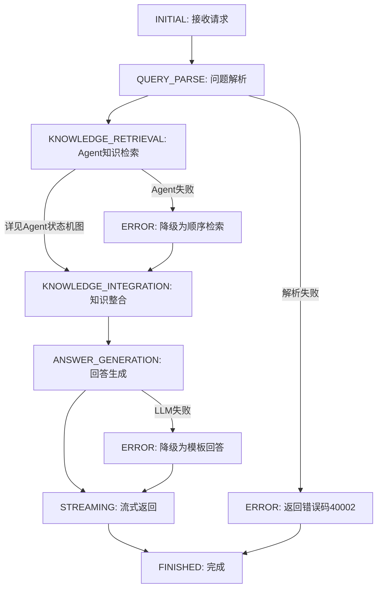
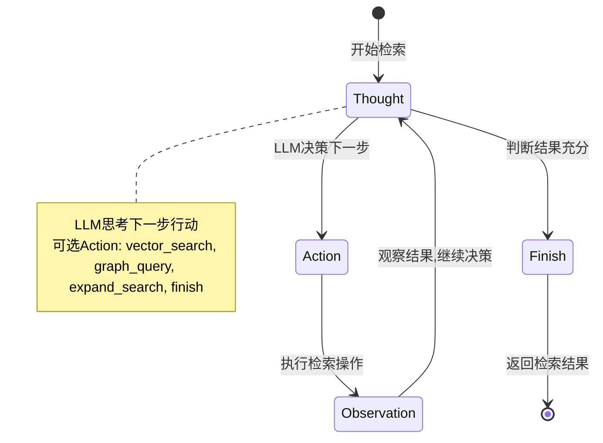
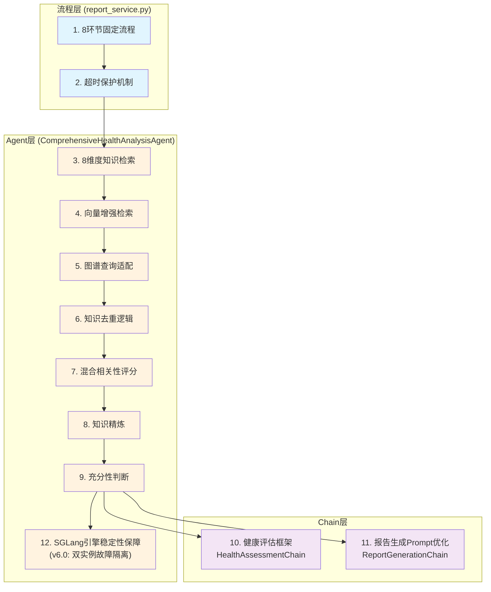
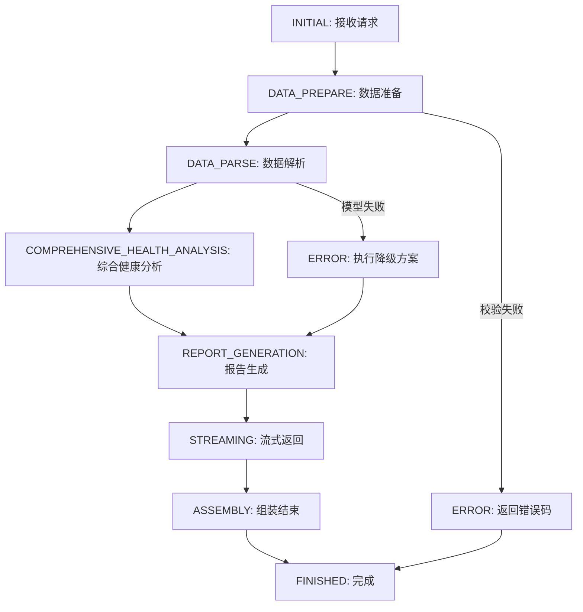
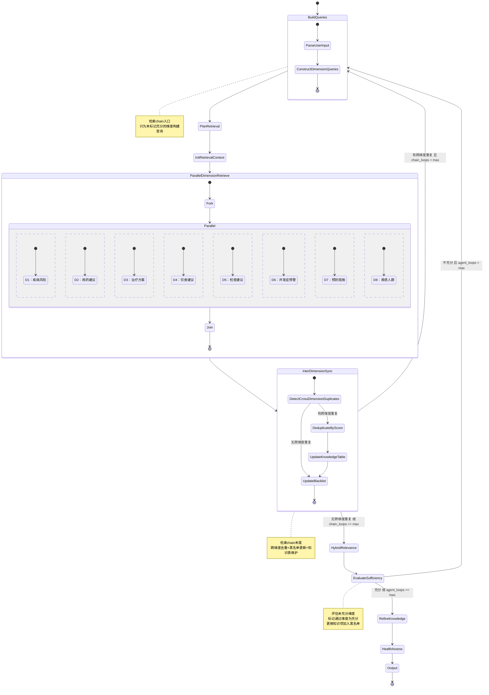
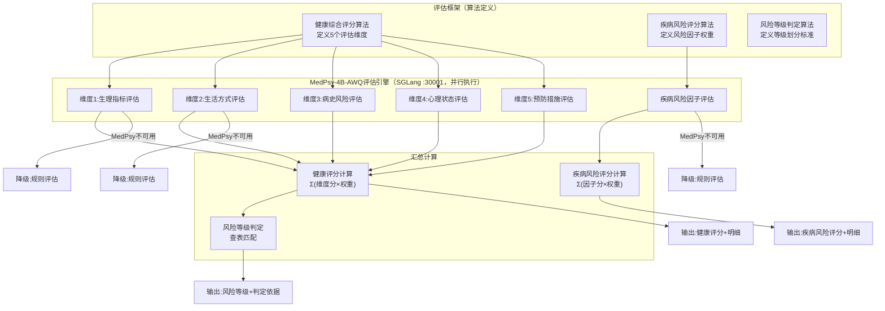

# 项目业务详细设计v8

该文件定义业务接口的重要内容的详细设计,落实开发任务时,还需根据架构设计文档来完成业务接口详细设计在项目框架下的实现

**文档版本**: v8
**更新内容**:

**v8更新**:
1. **扁平化状态机**: Agent内部状态扁平化，去掉嵌套子状态机，从11状态精简为10状态
2. **删除状态**: 去掉KnowledgeSelection（由HybridRelevance替代）、Deduplicate（由InterDimensionSync去重替代）、PatchPathPlan（由EvaluateSufficiency直接回到检索chain替代）
3. **新增主状态**: InitRetrievalContext和ParallelDimensionRetrieve从子状态提升为主状态
4. **检索chain**: BuildQueries → PlanRetrieval → InitRetrievalContext → ParallelDimensionRetrieve → InterDimensionSync
5. **黑名单机制**: 检索结果过滤已有知识项，InterDimensionSync结束时更新（不论是否有重复）
6. **维度标记机制**: EvaluateSufficiency通过的维度标记为充分，后续流程只为未充分维度执行
7. **知识表**: 跨维度引用记录，报告生成时加入prompt
8. **HybridRelevance评分公式扩展**: 新增knowledge_quality子评估项，公式为 α*user_relevance + β*dimension_relevance + γ*knowledge_quality
9. **循环保护**: chain内循环和agent层面回到检索chain两个独立计数器，均从配置读取

**v7更新**:
1. **模型配置同步**: 同步application.yaml实际配置值——Qwen3-4B-AWQ: --context-length 8192, --max-total-tokens 10240, --max-running-requests 4；MedPsy-4B-AWQ: --context-length 8192, --max-total-tokens 10240, --max-running-requests 3
2. **MedPsy-4B-AWQ量化确认**: MedPsy-4B-AWQ为AWQ 4bit量化模型（自量化版本），权重~2.57 GiB，非FP16
3. **双Thinking模型**: Qwen3-4B-AWQ和MedPsy-4B-AWQ均配置--reasoning-parser qwen3，均为Thinking模型
4. **显存重分配**: Qwen3-4B-AWQ(~7.7G,4并发) + bge(~2G) + ernie-health-zh(~0.4G) + nlp_raner(~1G) + MedPsy-4B-AWQ(~6G,3并发) = ~17.1GB / 22.5GB，剩余~5.4GB
5. **Qwen3-4B-AWQ新增启动参数**: --reasoning-parser qwen3, --sampling-backend pytorch, --schedule-policy lpm

**v6.2更新**:
1. **健康评估模型升级**: MedPsy-1.7B → MedPsy-4B-AWQ(Qwen3-4B-Thinking-2507架构，AWQ 4bit量化，Thinking模型)
2. **Thinking模型适配**: MedPsy-4B-AWQ基于Qwen3-4B-Thinking-2507，思维链已融入权重不可禁用；通过--reasoning-parser qwen3分离thinking到reasoning_content字段，content输出纯净JSON
3. **Prompt优化**: 系统提示词改为"你是一位全科医生，擅长精炼评估。请在3秒内、不超过50字完成思考，然后直接输出JSON。"，实验验证struct_rate=100%，thinking输出最小化
4. **max_tokens调整**: medpsy_max_tokens 1024→2048，medpsy_batch_max_tokens 512→2048，适配Thinking模型额外token消耗
5. **5模型共存显存重分配**: Qwen3-4B-AWQ(~7.7G,4并发) + bge(~2G) + ernie-health-zh(~0.4G) + nlp_raner(~1G) + MedPsy-4B-AWQ(~6G,3并发) = ~17.1GB / 22.5GB，剩余~5.4GB

**v6.0更新**:
1. **推理框架迁移**: 从vLLM迁移到SGLang，双SGLang实例部署（Qwen3-4B-AWQ :30000主推理 + MedPsy-4B-AWQ :30001健康评估）
2. **大语言模型更换**: Qwen3-4B-Instruct-2507(FP16) → Qwen3-4B-AWQ(AWQ 4bit量化)，权重2.57GB + KV Cache 2.26GB(4并发共享10240 token预算) + CUDA Graph 1.24GB = ~7.7GB
3. **健康评估模型更换**: MedGemma-1.5-4B-IT → MedPsy-4B-AWQ(Qwen3-4B-Thinking-2507架构，AWQ 4bit量化，Thinking模型)，总显存~6GB，部署在SGLang :30001独立实例
4. **NER模型显存更正**: nlp_raner 2G → 1G（实测仅0.4GB）
5. **5模型共存显存分配**: Qwen3-4B-AWQ(~7.7G,4并发) + bge(~2G) + ernie-health-zh(~0.4G) + nlp_raner(~1G) + MedPsy-4B-AWQ(~6G,3并发) = ~17.1GB / 22.5GB，剩余~5.4GB
6. **SGLang引擎配置与稳定性**: 移除Sleep Mode（SGLang无此特性），使用--max-total-tokens控制KV Cache，--mem-fraction-static=0.45(Qwen3)/0.40(MedPsy)，双实例故障隔离
7. **MedPsy评估引擎适配**: 调用方式从reasoning_model资源池改为health_assessment_model独立资源池（SGLang :30001），Thinking模型通过--reasoning-parser qwen3分离思维链，_extract_content()只返回content字段
8. **除业务功能最终的返回输出外，所有模型调用使用非流式**
   **最后更新**: 2026-06-03

***

## 一、模型选型与21G显存分配方案

#### 显存分配总策略(总预算21G)

为确保在21G显存约束下,多模型(LLM、向量模型、医学模型、意图模型)可同时稳定运行,预留4G安全冗余,采用以下显存分配方案:

**说明**: 健康咨询业务和健康报告生成业务对以下模型资源的配置内容相同,但需要各自创建独立的资源配置文件,以便未来扩展和维护。两个业务可能有对方不使用的资源。

| 模型类型       | 模型选型                                                         | 显存占用            | 使用业务         | 详细使用说明                                          |
| ---------- | ------------------------------------------------------------ | --------------- | ------------ | ------------------------------------------- |
| 大语言模型      | Qwen3-4B-AWQ                                                  | 5G              | 咨询+报告        | 4bit量化(AWQ),4并发(--max-running-requests=4),Thinking模型(--reasoning-parser qwen3)。咨询业务:对话理解和回答生成(流式);报告业务:报告生成(流式)   |
| 向量编码模型     | BAAI/bge-large-zh-v1.5                                       | 2G              | 咨询+报告        | 1024维向量。咨询业务:语义编码和知识匹配;报告业务:8维度知识检索和Agent检索 |
| 意图分类模型     | nghuyong/ernie-health-zh                                    | 1G              | 咨询           | 咨询业务:基于Embedding余弦相似度识别用户咨询意图(ERNIE医疗预训练模型,实际显存~0.4GB)                         |
| 健康风险因子分类模型 | iic/nlp\_raner\_named-entity-recognition\_chinese-base-cmeee | 1G              | 报告           | 报告业务DATA_PARSE环节:风险因子提取(从病史文本中识别疾病、症状实体)和医疗实体提取(从病史文本中识别疾病、症状、药物、检查项目实体) |
| 健康风险预测模型   | MedPsy-4B-AWQ                                                  | 6G              | 报告           | 报告业务COMPREHENSIVE_HEALTH_ANALYSIS环节:作为评估引擎对健康评估框架的各子指标进行医学推理评估(SGLang :30001独立实例,AWQ 4bit量化,Thinking模型,--reasoning-parser qwen3,3并发),输出子指标评分+理由,最终按算法公式汇总计算健康评分、风险等级、疾病风险评分 |
| 系统预留/冗余    | /                                                            | 5G              | /            | 运行时内存、缓冲、峰值占用预留、KV Cache弹性扩展（5模型共存实际剩余~4.8GB）              |
| **总计**     | /                                                            | **21G**         | /            | 满负荷分配,预留4G安全冗余                              |

#### SGLang模型详细配置

##### Qwen3-4B-AWQ 主推理模型配置

**模型参数配置**:

| 配置项 | 配置值 | 说明 |
|-------|-------|------|
| 量化方式 | 4bit量化(AWQ,官方Qwen/Qwen3-4B-AWQ) | 权重2.57GB，相比FP16节省~6GB显存 |
| --context-length | **8192** | v7更新：上下文窗口8K |
| --mem-fraction-static | 0.45 | SGLang静态显存分配比例 |
| --reasoning-parser | **qwen3** | v7更新：Thinking模型适配，分离思维链到reasoning_content，content输出纯净内容 |
| --sampling-backend | **pytorch** | v7新增：AWQ在sm_75上使用PyTorch采样后端 |
| --schedule-policy | **lpm** | v7新增：最长Prompt优先调度策略 |
| --dtype | float16 | 推理数据类型 |
| --attention-backend | triton | AWQ在sm_75上Triton回退，推理速度比FP16慢2-3x |

**SGLang KV Cache配置**:

| 配置项 | 配置值 | 说明 |
|-------|-------|------|
| --max-total-tokens | **10240** | v7更新：4并发共享10240 token预算的KV Cache |
| --max-running-requests | **4** | v7更新：Qwen3-4B-AWQ推理并发4 |
| KV Cache显存 | ~2.26 GiB | --max-total-tokens=10240下KV Cache |
| CUDA Graph显存 | ~1.24 GiB | SGLang运行时CUDA Graph缓存 |

**显存占用分解**:

| 组件 | 显存占用 | 说明 |
|------|---------|------|
| 模型权重 | 2.57 GiB | AWQ 4bit量化权重 |
| KV Cache | 2.26 GiB | --max-total-tokens=10240，4并发共享token预算 |
| CUDA Graph | 1.24 GiB | 运行时CUDA Graph缓存 |
| 其他开销 | ~1.63 GiB | 框架开销、激活值临时缓存 |
| **总计** | **~7.7 GiB** | 主推理实例SGLang总显存占用 |

**配置说明**:

1. **AWQ量化方案选择原因**：
   - Qwen3-4B FP16原始权重约8GB（int4量化后2.57GB），AWQ相比FP16节省~6GB显存
   - AWQ在RTX 2080 Ti(sm_75)上使用Triton回退实现，推理速度比FP16慢2-3x，但显存优势显著
   - 在22GB显存约束下，节省的6GB显存正好用于MedPsy-4B-AWQ独立部署

2. **SGLang关键配置说明**：
   - `--context-length 8192`：上下文窗口大小8K，报告生成业务需精简Prompt以适应8K上下文
   - `--mem-fraction-static 0.45`：静态显存分配比例，Qwen3-4B-AWQ推理模型的静态显存分配比例
   - `--max-total-tokens 10240`：4并发共享10240 token KV Cache预算，每请求平均~2560 tokens
   - `--max-running-requests 4`：4并发，多步推理可在不同请求slot中交替执行
   - `--reasoning-parser qwen3`：Thinking模型适配，分离思维链，content输出纯净内容
   - `--attention-backend triton`：AWQ在sm_75上Triton回退，非最优但功能可用
   - `--sampling-backend pytorch`：AWQ使用PyTorch采样后端
   - `--schedule-policy lpm`：最长Prompt优先调度，优化长Prompt处理

3. **并发与KV Cache预算说明**（v7更新）：
   - --max-total-tokens=10240控制KV Cache总量，4个并发请求共享此token预算
   - 报告生成中相关性评估、知识精炼等多步推理可在不同请求slot中交替执行，减少等待时间
   - SGLang continuous batching在4并发下可正常调度，批量推理+串行降级保障稳定性

##### MedPsy-4B-AWQ 健康评估模型配置（v7更新）

**模型参数配置**:

| 配置项 | 配置值 | 说明 |
|-------|-------|------|
| 模型架构 | Qwen3-4B-Thinking-2507 | Thinking模型，思维链融入权重不可禁用 |
| 量化方式 | 4bit量化(AWQ,自量化版本) | v7更新：自量化AWQ版本，权重~2.57 GiB，与Qwen3-4B-AWQ同等量化方案 |
| --context-length | **8192** | v7更新：健康评估上下文窗口8K |
| --max-total-tokens | **10240** | v7更新：3并发共享10240 token KV Cache预算 |
| --mem-fraction-static | 0.40 | Thinking模型AWQ量化后的静态显存分配比例 |
| --max-running-requests | **3** | MedPsy-4B-AWQ评估并发数为3 |
| --dtype | float16 | 推理数据类型 |
| --attention-backend | triton | sm_75上Triton后端 |
| --enable-torch-compile<br />--chunked-prefill-size: 2048 | — | 禁用CUDA Graph以节省显存（~1.5GB），Thinking模型CUDA Graph占用量大 |
| --reasoning-parser | **qwen3** | 分离Thinking输出，reasoning_content字段存思维链，content字段输出纯净JSON |
| --port | **30001** | 第二个SGLang实例端口，与主推理实例(:30000)隔离 |

**显存占用分解**:

| 组件 | 显存占用 | 说明 |
|------|---------|------|
| 模型权重 | ~2.57 GiB | AWQ 4bit量化权重（自量化版本） |
| KV Cache | ~2.26 GiB | --max-total-tokens=10240，3并发共享token预算 |
| 其他开销 | ~1.17 GiB | 框架开销（已禁用CUDA Graph） |
| **总计** | **~6.0 GiB** | 健康评估实例SGLang总显存占用 |

**配置说明**:

1. **MedPsy-4B-AWQ选型与升级原因**（v7更新）：
   - MedPsy-4B-AWQ基于Qwen3-4B-Thinking-2507，相比MedPsy-1.7B(1.7B参数)模型能力更强，医学推理评估质量更高
   - 采用AWQ 4bit自量化版本，权重仅~2.57 GiB（与Qwen3-4B-AWQ同等量化方案），相比FP16节省~5.5GB显存
   - Thinking模型的思维链融入权重不可禁用，但通过--reasoning-parser qwen3可将思维链分离到reasoning_content字段，content字段输出纯净JSON

2. **Thinking模型适配**：
   - MedPsy-4B-AWQ基于Qwen3-4B-Thinking-2507，思维链已融入模型权重，无法通过enable_thinking=False完全禁用
   - **--reasoning-parser qwen3**：SGLang启动参数，将Thinking输出分离到response.reasoning_content字段，content字段仅包含模型实际输出（纯净JSON）
   - **Prompt优化**：系统提示词改为"你是一位全科医生，擅长精炼评估。请在3秒内、不超过50字完成思考，然后直接输出JSON。"，通过时间+字数双重约束最小化思考输出（实验验证struct_rate=100%）
   - **_extract_content()适配**：适配层只返回content字段，丢弃reasoning_content，确保上游获取纯净JSON
   - **enable_thinking=False仍需传递**：控制chat_template的prefill行为，减少thinking token输出
   - **max_tokens需2048**：Thinking模型额外消耗token用于思维链，max_tokens=1024会导致风险因子评估场景content被截断为空

3. **并发与KV Cache预算说明**（v7更新）：
   - --max-total-tokens=10240控制KV Cache总量，3个并发请求共享此token预算
   - 每请求平均~3413 tokens，满足单次健康评估输入+输出需求
   - --enable-torch-compile + --chunked-prefill-size=2048：禁用CUDA Graph节省~1.5GB显存

#### SGLang引擎配置与稳定性(v6.0更新)

**SGLang双实例架构**:

| 实例 | 端口 | 模型 | 用途 | 显存占用 |
|------|------|------|------|---------|
| 主推理实例 | :30000 | Qwen3-4B-AWQ | 咨询回答生成(流式)、报告生成(流式)、相关性评估、知识精炼 | ~7.7GB |
| 健康评估实例 | :30001 | MedPsy-4B-AWQ | COMPREHENSIVE_HEALTH_ANALYSIS环节:子指标评估+风险因子评估 | ~6.0GB |

**双实例故障隔离机制**: 两个SGLang实例独立部署在不同端口，任一实例崩溃不影响另一实例。主推理实例(Qwen3-4B-AWQ)崩溃时仅影响咨询回答生成(流式)、报告生成(流式)和相关性评估；健康评估实例(MedPsy-4B-AWQ)崩溃时仅触发降级规则引擎评估。

**SGLang稳定性保障(v6.1更新)**:

| 保障措施 | 说明 |
|---------|------|
| --max-total-tokens精确控制 | Qwen3-4B-AWQ: --max-total-tokens=10240, 4并发共享KV Cache；MedPsy-4B-AWQ: --max-total-tokens=10240, 3并发共享KV Cache |
| --mem-fraction-static | Qwen3-4B-AWQ: 0.45；MedPsy-4B-AWQ: 0.40 |
| SGLang无Sleep Mode | SGLang不使用Sleep Mode，通过--max-total-tokens和--max-running-requests保障稳定性 |
| 批量推理 | 8维度评估合并为一次generate调用，减少引擎运行次数 |
| 双实例故障隔离 | Qwen3-4B-AWQ和MedPsy-4B-AWQ独立实例，互不影响 |
| --max-running-requests | Qwen3-4B-AWQ: 4并发推理；MedPsy-4B-AWQ: 3并发评估 |
| --reasoning-parser qwen3 | MedPsy-4B-AWQ Thinking模型适配，分离思维链到reasoning_content，content输出纯净JSON |
| --enable-torch-compile<br />--chunked-prefill-size: 2048 | MedPsy-4B-AWQ禁用CUDA Graph节省~1.5GB显存 |
| 推理超时保护 | 单次推理超时30s，超时后降级为串行推理或其他降级路径 |
| 降级策略 | 批量推理失败→串行推理→规则引擎默认评分（详见3.3.7降级策略） |

**SGLang vs 原vLLM引擎配置对比**:

| 对比项 | vLLM (v5.x) | SGLang (v6.0) |
|--------|-------------|---------------|
| 推理引擎 | vLLM 0.17.1 | SGLang |
| 大语言模型 | Qwen3-4B-Instruct-2507 (FP16) | Qwen3-4B-AWQ (AWQ 4bit) |
| 健康评估模型 | 复用Qwen3-4B | MedPsy-4B-AWQ独立实例(:30001) |
| 模型权重显存 | ~7.61 GiB (FP16) | 2.57 GiB (AWQ) |
| KV Cache控制 | gpu_memory_utilization=0.45(Qwen3) / 0.40(MedPsy) | --max-total-tokens=10240 (精确,4并发Qwen3/3并发MedPsy) |
| Sleep Mode | 启用但不可用(EngineCore崩溃) | 无Sleep Mode特性 |
| 引擎实例数 | 1个(3模型服务共享) | 2个(主推理:30000 + 健康评估:30001) |
| 健康评估方式 | 复用Qwen3-4B + 医学Prompt | MedPsy-4B-AWQ独立评估(Thinking模型,--reasoning-parser qwen3) |
| 故障隔离 | 无(单实例崩溃影响全部) | 有(双实例独立) |
| 并发控制 | max_num_seqs=1 | Qwen3: --max-running-requests=4; MedPsy: --max-running-requests=3 |
| 批量推理 | 支持(continuous batching) | 支持(continuous batching) |

**批量推理稳定性设计(继承自v5.15)**：

批量推理将8维度评估从逐维度串行调用改为一次`generate(prompts=list)`批量调用，SGLang内部使用continuous batching并行调度：

```
[8维度批量评估] → [8维度批量精炼] → [5维度批量健康评估]
```

无需任务间冷却，批量推理本身已大幅减少引擎运行次数（27次→3次），消除KV Cache碎片累积问题。

| 对比项 | 优化前 | 优化后 |
|--------|--------|--------|
| 引擎推理次数 | 8+8+11=27次 | 3次批量 |
| 评估总耗时 | ~274s（串行累加） | ~55s（批量推理） |
| KV Cache碎片 | 严重（27次连续分配/释放） | 轻微（3次批量后清除） |
| 崩溃风险 | 高（第7次串行评估即崩溃） | 低（引擎仅运行3次批量，无KV Cache碎片累积） |
| 冷却开销 | N/A | 0s(无需冷却) |

***

## 二、健康咨询业务

### 2.1 业务设计模式

健康咨询业务采用**混合模式**设计:

- **流程图**: 描述固定的业务流程(硬编码),每个流程环节是固定的处理步骤
- **Agent状态机图**: 描述动态的知识检索策略(LLM决策),是流程图中"知识检索"环节的详细设计

**代码实现说明**:
- 流程图中的流程环节在实际代码中写到 `src/service/consult_service.py`
- Agent检索使用 `KnowledgeRetrievalAgent` 类,内部使用Chain封装固定逻辑

### 2.2 业务流程

健康咨询采用**7环节固定流程**管理从接收到返回的完整流程。

#### 2.2.1 流程环节定义

| 序号 | 状态名称  | 英文标识                   | 职责描述                           | 预估耗时       | 是否可并行   |
| -- | ----- | ---------------------- | ------------------------------ | ---------- | ------- |
| 1  | 初始状态  | INITIAL                | 接收请求,构建ConsultContext,提取当前查询   | <10ms      | 否       |
| 2  | 问题解析  | QUERY\_PARSE           | NLP实体抽取 + 意图识别 + 查询改写          | 50-100ms   | 否       |
| 3  | 知识检索  | KNOWLEDGE\_RETRIEVAL   | **Agent知识检索模式**:LLM决策动态检索策略    | 150-500ms  | 否(内部动态) |
| 4  | 知识整合  | KNOWLEDGE\_INTEGRATION | 结果去重排序 + 相关性过滤 + 素材准备          | 20-50ms    | 否       |
| 5  | 回答生成  | ANSWER\_GENERATION     | 调用LLM基于知识素材生成专业回答              | 500-2000ms | 否       |
| 6  | 流式返回  | STREAMING              | 实时返回内容块给客户端                    | 持续         | 否(子状态)  |
| 7  | 完成/错误 | FINISHED / ERROR       | 结束流程或异常处理                      | <5ms       | 否       |

#### 2.2.2 流程图

##### 主流程图



##### 完整转换规则表

| 当前状态                   | 触发事件      | 目标状态                   | 说明                  |
| ---------------------- | --------- | ---------------------- | ------------------- |
| INITIAL                | 接收到POST请求 | QUERY\_PARSE           | 提取当前查询文本            |
| QUERY\_PARSE           | 解析完成      | KNOWLEDGE\_RETRIEVAL   | 输出实体列表和意图标签         |
| QUERY\_PARSE           | 解析失败      | ERROR                  | 返回错误码40002(非健康咨询范围) |
| KNOWLEDGE\_RETRIEVAL   | 检索完成      | KNOWLEDGE\_INTEGRATION | 汇总检索结果              |
| KNOWLEDGE\_RETRIEVAL   | Agent失败   | ERROR                  | 降级为顺序检索模式           |
| KNOWLEDGE\_INTEGRATION | 整合完成      | ANSWER\_GENERATION     | 准备好Prompt素材         |
| ANSWER\_GENERATION     | 开始生成      | STREAMING              | 进入流式输出模式            |
| STREAMING              | 生成完成      | FINISHED               | 收集结束标识              |
| ANSWER\_GENERATION     | LLM调用失败   | ERROR                  | 降级为模板回答             |
| ERROR                  | 降级处理完成    | FINISHED               | 异常处理后结束             |
| **任意状态**               | 未预期异常     | **ERROR**              | 统一异常入口              |

#### 2.2.3 超时配置

| 阶段                   | 超时时间 | 降级动作         |
| -------------------- | ---- | ------------ |
| QUERY\_PARSE         | 10秒  | 返回错误码40002   |
| KNOWLEDGE\_RETRIEVAL | 20秒  | Agent失败降级为顺序检索模式 |
| ANSWER\_GENERATION   | 60秒  | 降级为模板回答      |

#### 2.2.4 降级策略矩阵

| 失败组件              | 降级方案                                        | 质量影响 | 适用阶段                 |
| ----------------- | ------------------------------------------- | ---- | -------------------- |
| Agent决策失败          | 降级为固定流程的顺序检索模式(向量检索→图查询)                     | 轻微   | KNOWLEDGE\_RETRIEVAL |
| Agent超过最大步数        | 使用已检索结果继续,或降级为顺序检索模式                          | 轻微   | KNOWLEDGE\_RETRIEVAL |
| Milvus向量库不可用      | 使用Neo4j模糊匹配替代(`search_diseases_by_symptom`) | 中等   | KNOWLEDGE\_RETRIEVAL |
| Neo4j数据库不可用       | 仅使用向量检索结果                                   | 中等   | KNOWLEDGE\_RETRIEVAL |
| LLM(Qwen3-4B)调用失败 | 使用预设模板生成简化回答                                | 中等   | ANSWER\_GENERATION   |
| 向量模型(mcBERT)推理超时  | 使用关键词匹配替代                                   | 轻微   | QUERY\_PARSE         |

**降级策略详细说明**:

1. **Agent决策失败**:
   - 触发条件: LLM决策输出格式错误、Action执行失败、超时
   - 降级方案: 回退到固定流程的顺序检索模式(先向量检索锚定实体,后图查询做结构化推理增强)
   - 实现位置: `knowledge_retrieval_agent_chain.py`中的fallback逻辑
   - 注意: 降级后仍能保证基本的检索质量
2. **Agent超过最大步数**:
   - 触发条件: Agent检索步数达到MAX_STEPS(5步)限制
   - 降级方案: 使用已检索到的结果继续,如果结果不足则降级为顺序检索模式
   - 实现位置: `knowledge_retrieval_agent_chain.py`中的步数检查逻辑
3. **Milvus向量库不可用**:
   - 触发条件: Milvus连接失败或查询超时
   - 降级方案: 跳过向量检索步骤,使用Neo4j的`search_diseases_by_symptom()`方法进行模糊匹配
   - 实现位置: `knowledge_retrieval_agent_chain.py`中的fallback逻辑
4. **Neo4j数据库不可用**:
   - 触发条件: Neo4j连接失败或查询超时
   - 降级方案: 跳过图查询步骤,仅使用Milvus向量检索结果
   - 实现位置: `consult_strategy.py`中的错误处理逻辑
5. **LLM调用失败**:
   - 触发条件: 模型推理失败或超时
   - 降级方案: 使用预设模板生成简化回答
   - 实现位置: `consult_strategy.py`中的`_generate_template_answer()`方法

#### 2.2.5 各阶段详细设计

##### INITIAL阶段详细设计

**输入**: HTTP POST请求(包含用户查询文本、会话历史)

**处理逻辑**:
1. 接收HTTP请求
2. 构建ConsultContext上下文对象
3. 提取当前查询文本
4. 初始化会话历史(如有)

**输出**: ConsultContext对象

**预估耗时**: <10ms

##### QUERY_PARSE阶段详细设计

**输入**: ConsultContext对象

**处理逻辑**:
1. NLP实体抽取(识别疾病、症状、药物等医疗实体)
2. 意图识别(使用ernie-health-zh模型,基于Embedding余弦相似度分类)
3. 查询改写(基于会话历史优化查询)

**输出**: 
- extracted_entities: 提取的医疗实体列表
- intent_label: 意图标签
- rewritten_query: 改写后的查询文本

**预估耗时**: 50-100ms

##### KNOWLEDGE_RETRIEVAL阶段详细设计

**输入**: 
- rewritten_query: 改写后的查询文本
- extracted_entities: 提取的医疗实体列表
- intent_label: 意图标签

**处理逻辑**: 使用KnowledgeRetrievalAgent执行Agent知识检索(详见2.3节Agent设计)

**输出**: 
- retrieved_knowledge: 检索到的知识列表

**预估耗时**: 150-500ms

##### KNOWLEDGE_INTEGRATION阶段详细设计

**输入**: 
- retrieved_knowledge: 检索到的知识列表

**处理逻辑**:
1. 结果去重(基于实体ID)
2. 相关性排序(基于检索得分)
3. 相关性过滤(过滤得分<0.6的结果)
4. 素材准备(构建Prompt素材)

**输出**: 
- knowledge_materials: 准备好的知识素材

**预估耗时**: 20-50ms

##### ANSWER_GENERATION阶段详细设计

**输入**: 
- knowledge_materials: 知识素材
- rewritten_query: 改写后的查询文本
- session_history: 会话历史

**处理逻辑**:
1. 构建回答生成Prompt
2. 调用Qwen3-4B模型生成回答
3. 流式输出(进入STREAMING状态)

**输出**: 
- answer_chunks: 回答内容块流

**预估耗时**: 500-2000ms

##### STREAMING阶段详细设计

**输入**: 
- answer_chunks: 回答内容块流

**处理逻辑**:
1. 实时返回内容块给客户端
2. 收集结束标识
3. 进入ASSEMBLY状态

**输出**: 
- HTTP SSE流式响应

**预估耗时**: 持续

##### FINISHED阶段详细设计

**输入**: 无

**处理逻辑**:
1. 清理资源
2. 释放连接
3. 记录日志

**输出**: 无

**预估耗时**: <5ms

### 2.3 Agent设计

#### 2.3.1 KnowledgeRetrievalAgent概述

健康咨询业务的KNOWLEDGE_RETRIEVAL环节采用**Agent知识检索模式**,基于ReAct(Reasoning + Acting)模式实现动态检索策略决策。

**Agent状态机图是流程图中KNOWLEDGE_RETRIEVAL环节的详细设计**,描述LLM动态决策检索策略的过程。

**核心特点**:
- **LLM作为决策者**: 大语言模型根据当前上下文动态决定下一步检索操作
- **动态策略调整**: 根据检索结果实时调整检索策略,而非固定流程
- **自适应检索**: 根据问题类型、检索效果自动选择最优检索路径
- **降级保障**: Agent失败时自动回退到固定流程的顺序检索模式

#### 2.3.2 状态定义

Agent检索过程包含以下状态循环:

| Agent状态 | 说明 | 输出示例 |
|---------|------|--------|
| **Thought** | LLM思考下一步行动 | "用户询问高血压的症状,需要先检索高血压疾病实体" |
| **Action** | 执行检索操作 | `{"action": "vector_search", "params": {"query": "高血压症状", "top_k": 10}}` |
| **Observation** | 观察检索结果 | "检索到高血压疾病实体,包含症状列表" |

**可用Action列表**:

| Action | 说明 | 参数 |
|--------|------|------|
| `vector_search` | 向量检索锚定实体、关系或属性 | `query`, `top_k`, `collections` |
| `graph_query` | 图查询做结构化推理增强 | `entity_ids`, `query_type` |
| `expand_search` | 扩展检索(基于已有结果扩展) | `seed_entities`, `expand_depth` |
| `finish` | 完成检索,返回结果 | `final_results` |

#### 2.3.3 状态机图



#### 2.3.4 状态转换规则

| 当前状态 | 触发条件 | 目标状态 | 说明 |
|---------|---------|---------|------|
| Thought | LLM决策完成 | Action | 选择下一个检索操作 |
| Action | 检索执行完成 | Observation | 观察检索结果 |
| Observation | 结果不足且未达最大步数 | Thought | 继续决策下一步 |
| Observation | 结果充分或达到最大步数 | Finish | 结束检索 |
| Finish | 返回结果 | [*] | 输出最终检索结果 |

#### 2.3.5 各状态详细设计

##### Thought状态详细设计

**输入**: 
- current_step: 当前步骤数
- user_query: 用户查询
- extracted_entities: 已提取实体
- intent_label: 意图标签
- retrieved_results_summary: 已检索结果摘要

**处理逻辑**:
1. 构建Agent决策Prompt
2. 调用Qwen3-4B模型决策下一步行动
3. 解析决策JSON输出

**输出**: 
- action: 下一步操作名称
- params: 操作参数
- reason: 决策理由

**限制机制**:
- MAX_STEPS = 5: 最大检索步数限制
- MAX_PROMPT_CHARS = 4000: Agent决策Prompt最大字符数
- TIMEOUT = 20秒: Agent检索总超时时间
- MIN_RESULTS = 3: 最少检索结果数量

##### Action状态详细设计

**输入**: 
- action: 操作名称
- params: 操作参数

**处理逻辑**:
根据action类型执行相应操作:

1. **vector_search**: 调用VectorSearchChain执行向量检索
2. **graph_query**: 调用GraphQueryChain执行图查询
3. **expand_search**: 基于已有结果扩展检索
4. **finish**: 结束检索,返回结果

**输出**: 
- action_results: 操作执行结果

##### Observation状态详细设计

**输入**: 
- action_results: 操作执行结果

**处理逻辑**:
1. 观察检索结果
2. 更新已检索结果列表
3. 判断结果是否充分
4. 检查是否达到最大步数

**输出**: 
- is_sufficient: 结果是否充分
- current_step: 当前步骤数

#### 2.3.6 Chain使用说明

Agent检索内部使用Chain封装固定逻辑。健康咨询业务使用的Chain及其在Agent中的特殊使用方式如下：

| Chain名称 | 在Agent状态机图中的位置 | 职责描述 | 特殊使用说明 |
|----------|----------------------|---------|-------------|
| **VectorSearchChain** | Action: vector_search | 向量检索锚定实体、关系或属性 | ReAct模式下，由LLM决策触发，每次Action调用一次 |
| **GraphQueryChain** | Action: graph_query | 图查询做结构化推理增强 | ReAct模式下，由LLM决策触发，基于VectorSearchChain结果执行 |

**Chain调用位置**:
- VectorSearchChain: 在Agent的Action阶段,当action="vector_search"时调用
- GraphQueryChain: 在Agent的Action阶段,当action="graph_query"时调用

**通用Chain详细设计**: 详见第四章"通用Chain设计"

#### 2.3.7 降级策略

当Agent检索失败时,自动降级为顺序检索模式:

```python
async def fallback_sequential_retrieval(context: ConsultContext, call_router: CallRouter) -> List[Dict]:
    """
    降级策略:顺序检索模式
    先向量检索锚定实体,后图查询做结构化推理增强
    """
    logger.warning("Agent检索失败,降级为顺序检索模式")
    
    # Step1: 向量检索锚定实体
    vector_results = await call_router.route("vector_retrieval_tool", {
        "action": "hybrid_search",
        "params": {
            "query": context.current_query,
            "top_k": 20,
            "collections": ["medical_entity", "entity_attributes", "entity_relations"],
            "weights": {"medical_entity": 0.40, "entity_attributes": 0.30, "entity_relations": 0.30}
        }
    })
    
    # Step2: 图查询做结构化推理增强
    anchored_entities = extract_entities_with_ids(vector_results)
    knowledge_results = []
    
    for entity in anchored_entities[:10]:
        graph_result = await call_router.route("neo4j_medical_tool", {
            "action": f"get_{entity['type'].lower()}_by_node_id",
            "params": {"node_id": entity["neo4j_id"]}
        })
        knowledge_results.extend(graph_result)
    
    # 合并结果
    merged = merge_knowledge_results(vector_results, knowledge_results)
    return merged[:15]
```

***

## 三、健康报告生成业务

(注:健康报告生成业务与健康咨询业务所相同资源类型的使用配置相同)

### 3.1 业务设计模式

健康报告生成业务采用**混合模式**设计:

- **流程图**: 描述固定的业务流程(硬编码),每个流程环节是固定的处理步骤
- **Agent状态机图**: 描述动态的知识检索策略(LLM决策),是流程图中"Agent知识检索"任务的详细设计

**代码实现说明**:
- 流程图中的流程环节在实际代码中写到 `src/service/report_service.py`
- Agent知识检索使用 `ComprehensiveHealthAnalysisAgent` 类,内部使用Chain封装固定逻辑
- Agent知识检索在 `report_service.py` 中执行

#### 3.1.1 重要设计列表

健康报告生成业务包含以下重要设计，按代码执行顺序排列：

| 序号 | 设计名称 | 设计位置 | 设计目的 | 关键参数/配置 |
|------|---------|---------|---------|-------------|
| 1 | **8环节固定流程** | report_service.py | 定义业务整体流程框架 | INITIAL→DATA_PREPARE→DATA_PARSE→COMPREHENSIVE_HEALTH_ANALYSIS→REPORT_GENERATION→STREAMING→ASSEMBLY→FINISHED |
| 2 | **超时保护机制** | report_strategy.py | 防止业务流程阻塞 | COMPREHENSIVE_HEALTH_ANALYSIS:1200s, REPORT_GENERATION:240s |
| 3 | **8维度知识检索** | ComprehensiveHealthAnalysisAgent | 全面检索用户健康相关医学知识 | disease_risk, medication, treatment, dietary, checkup, complication, prevention, susceptible |
| 4 | **向量增强图谱检索** | MilvusAdapterImpl+Neo4jMedicalTool | 向量检索作为图谱检索增强模式 | 向量候选筛选→图谱查询详细信息→低质知识过滤→结果融合 |
| 5 | **图谱查询适配** | ComprehensiveHealthAnalysisAgent | 统一图谱查询结果数据结构 | 输出规范化：source_entity(必需)+relation_type(必需)+target_entity(必需)+content(可选) |
| 6 | **跨维度去重与黑名单(v8)** | ComprehensiveHealthAnalysisAgent | InterDimensionSync跨维度去重+黑名单过滤重复检索 | 基于neo4j ID去重，按检索分数保留；黑名单在InterDimensionSync结束时更新 |
| 7 | **混合相关性评分(v8)** | ComprehensiveHealthAnalysisAgent | 评估知识对用户的价值 | α=0.50(用户相关性)+β=0.30(维度相关性)+γ=0.20(知识质量)；系数从配置读取 |
| 8 | **知识精炼** | ComprehensiveHealthAnalysisAgent | LLM精炼整合知识 | 去冗余、去重复、去不相关，输出JSON格式 |
| 9 | **充分性评估+维度标记(v8)** | ComprehensiveHealthAnalysisAgent | EvaluateSufficiency评估维度知识充分性，标记通过维度 | 维度标记is_sufficient，不充分维度回到检索chain；循环保护：max_chain_loops, max_agent_retrieval_loops |
| 10 | **健康评估框架** | HealthAssessmentChain | 定义评估维度和计算公式 | 健康综合评分、疾病风险评分、风险等级判定；v8知识表信息加入prompt |
| 11 | **报告生成Prompt优化** | ReportGenerationChain | 减少token使用，提高生成质量 | 只使用精炼后的summary，不包含原始knowledge_items |
| 12 | **SGLang引擎稳定性保障** | ComprehensiveHealthAnalysisAgent+SGLangAdapterImpl | 双SGLang实例故障隔离 + --max-total-tokens控制KV Cache + --max-running-requests(Qwen3:4,MedPsy:3) | 批量推理+降级策略+推理超时保护(v5.15更新)；双实例故障隔离(v6.0新增) |
| 13 | **检索chain(v8)** | ComprehensiveHealthAnalysisAgent | BuildQueries→PlanRetrieval→InitRetrievalContext→ParallelDimensionRetrieve→InterDimensionSync | chain_loop_count和agent_retrieval_loop_count双计数器独立保护 |
| 14 | **PlanRetrieval智能路径规划(v8)** | ComprehensiveHealthAnalysisAgent | LLM为每个维度自定义检索路径和策略 | 从可用路径池（向量候选筛选+图谱查询、向量属性检索+图谱查询、向量关系检索+图谱查询）中选择 |
| 15 | **知识表(v8)** | ComprehensiveHealthAnalysisAgent | 跨维度引用记录，报告生成时加入prompt | 维度表（主表）+ 知识表（附表） |

#### 3.1.2 设计执行流程图



**设计说明**：

1. **流程层**：定义业务整体框架，确保流程可控、可监控、可降级
2. **Agent层**：实现动态知识检索策略，包含检索、过滤、精炼、评估完整链路
3. **Chain层**：封装特定业务逻辑，健康评估和报告生成

**关键设计决策**：

- **为什么需要图谱查询适配？** 图谱查询方法返回数据结构不一致（如get_drugs_by_disease返回Dict[str, List[str]]），需要统一转换为包含entity_name和description的标准结构
- **为什么需要混合相关性评分？** 向量score只反映文本语义相似度，不反映知识对用户的价值，需要LLM评估用户相关性和维度相关性
- **为什么只使用精炼后的summary？** 减少token使用量，精炼知识已包含原始知识的关键信息，避免冗余

### 3.2 业务流程

本系统采用**8环节固定流程**管理健康报告生成的完整流程。

#### 3.2.1 流程环节定义(8个环节)

| 序号 | 状态名称 | 英文标识                 | 职责描述                          | 预估耗时        | 是否可并行   |
| -- | ---- | -------------------- | ----------------------------- | ----------- | ------- |
| 1  | 初始状态 | INITIAL              | 接收请求,构建ReportContext上下文对象     | <10ms       | 否       |
| 2  | 数据准备 | DATA\_PREPARE        | 参数校验+数据标准化+空值处理+完整性判断         | 20-50ms     | 否       |
| 3  | 数据解析 | DATA\_PARSE          | 调用nlp_raner模型进行医学实体识别+异常指标提取(规则引擎)+特殊规则应用 | 500-1500ms | 否       |
| 4  | 综合健康分析 | COMPREHENSIVE\_HEALTH\_ANALYSIS | **统一Agent管理**:8维度知识检索+去重+充分性判断(v5.14:从EvaluateRelevance提取)+精炼+健康评估(HealthAssessmentChain) | 500-1200ms   | 是(内部并行) |
| 5  | 报告生成 | REPORT\_GENERATION   | 调用LLM生成Markdown格式报告+内容校验      | 2000-5000ms | 否       |
| 6  | 流式返回 | STREAMING            | 实时返回内容块给客户端                   | 持续          | 否(子状态)  |
| 7  | 组装结束 | ASSEMBLY             | 组装结束响应+元数据封装+日志记录             | <10ms       | 否       |
| 8  | 完成状态 | FINISHED             | 结束流程,清理资源,释放连接                | <5ms        | 否       |

#### 3.2.2 流程图

##### 主流程图



##### 完整转换规则表

| 当前状态                 | 触发事件      | 目标状态                 | 说明               |
| -------------------- | --------- | -------------------- | ---------------- |
| INITIAL              | 接收到POST请求 | DATA\_PREPARE        | 构建上下文对象          |
| DATA\_PREPARE        | 校验通过且数据完整 | DATA\_PARSE          | 进入数据解析阶段         |
| DATA\_PREPARE        | 校验失败      | ERROR                | 返回错误码40001/40003 |
| DATA\_PREPARE        | 数据部分缺失    | DATA\_PARSE          | 标记降级级别后继续        |
| DATA\_PARSE          | 解析完成      | COMPREHENSIVE\_HEALTH\_ANALYSIS | 输出中间结果           |
| DATA\_PARSE          | 模型调用失败    | ERROR                | 执行降级方案           |
| COMPREHENSIVE\_HEALTH\_ANALYSIS | Agent执行完成  | REPORT\_GENERATION   | 汇总知识检索和健康评估结果           |
| COMPREHENSIVE\_HEALTH\_ANALYSIS | Agent部分失败    | REPORT\_GENERATION          | 使用已完成的结果继续       |
| REPORT\_GENERATION   | 开始生成      | STREAMING            | 进入流式输出模式         |
| STREAMING            | 生成完成      | ASSEMBLY             | 收集结束标识           |
| REPORT\_GENERATION   | 校验失败      | REPORT\_GENERATION   | 重新生成(最多重试2次)     |
| ASSEMBLY             | 组装完成      | FINISHED             | 正常结束流程           |
| ERROR                | 降级处理完成    | FINISHED             | 异常处理后结束          |
| **任意状态**             | 未预期异常     | **ERROR**            | 统一异常入口           |

#### 3.2.3 超时配置

| 阶段                   | 超时时间 | 降级动作             |
| -------------------- | ---- | ---------------- |
| DATA\_PREPARE        | 5秒   | 返回错误码40001/40003 |
| DATA\_PARSE          | 30秒  | nlp_raner降级为规则引擎 |
| COMPREHENSIVE\_HEALTH\_ANALYSIS          | 1200秒  | Agent失败使用已完成结果继续,MedPsy降级为规则计算  |
| REPORT\_GENERATION   | 240秒 | 降级为模板报告          |

#### 3.2.4 降级策略矩阵

| 失败组件      | 降级方案           | 质量影响 | 适用阶段                 |
| --------- | -------------- | ---- | -------------------- |
| LLM       | 使用预设模板生成简化报告   | 高    | REPORT\_GENERATION   |
| 向量模型      | 使用关键词匹配替代      | 中等   | DATA\_PARSE      |
| nlp_raner模型 | 使用规则引擎(关键词匹配)替代 | 中等   | DATA\_PARSE(风险因子提取、医疗实体提取) |
| MedPsy模型 | 使用规则计算替代       | 中等   | COMPREHENSIVE_HEALTH_ANALYSIS(健康评分、风险判定、疾病风险评分) |
| 分类模型      | 使用默认分类结果       | 轻微   | DATA\_PARSE      |
| Agent检索失败 | 降级为顺序检索模式      | 轻微   | COMPREHENSIVE\_HEALTH\_ANALYSIS |
| Neo4j数据库  | 仅使用向量检索结果      | 中等   | COMPREHENSIVE\_HEALTH\_ANALYSIS |
| Milvus向量库 | 仅使用Neo4j精确匹配结果 | 中等   | COMPREHENSIVE\_HEALTH\_ANALYSIS |

#### 3.2.5 各阶段详细设计

##### DATA_PARSE阶段详细设计

**输入**: 
- validated_data: 校验后的用户数据

**处理逻辑**:
1. **异常指标提取**: 规则引擎(数值判断)
2. **风险因子提取**: nlp_raner模型识别病史文本中的疾病、症状实体(降级为规则引擎)
3. **医疗实体提取**: nlp_raner模型识别疾病、症状、药物、检查项目实体(降级为规则引擎)
4. **特殊规则应用**: 规则引擎
5. **生成分析摘要**: 字符串拼接

**输出**: 
- anomalies: 异常指标列表
- risk_factors: 风险因子列表
- medical_entities: 医疗实体列表
- analysis_summary: 分析摘要

**medical_entities数据结构定义**:

```python
medical_entities = {
    "diseases": [        # 疾病实体列表
        {
            "entity_id": str,      # 实体ID
            "entity_name": str,    # 实体名称
            "entity_type": str,    # 实体类型(disease)
            "attributes": {},      # 属性字典
            "source": str          # 来源(nlp_raner/规则引擎)
        }
    ],
    "symptoms": [],      # 症状实体列表
    "medications": [],   # 药物实体列表
    "examinations": []   # 检查项目实体列表
}
```

**预估耗时**: 500-1500ms

**nlp_raner模型使用详细设计**:

| 步骤 | 使用模型 | 当前实现 | 优化后实现 | 降级方案 |
|------|----------|----------|------------|----------|
| 步骤1:异常指标提取 | 无(规则引擎) | 规则引擎(数值判断) | **保持不变**(输入是数值,不需要NER) | / |
| 步骤2:风险因子提取 | **nlp_raner** | 规则引擎(文本分割) | nlp_raner模型识别病史文本中的疾病、症状实体 | 规则引擎(关键词匹配) |
| 步骤3:医疗实体提取 | **nlp_raner** | IntentClassificationHandler + 规则引擎降级 | nlp_raner模型识别疾病、症状、药物、检查项目实体 | 规则引擎(关键词匹配) |
| 步骤4:特殊规则应用 | 无(规则引擎) | 规则引擎 | **保持不变** | / |
| 步骤5:生成分析摘要 | 无 | 字符串拼接 | **保持不变** | / |

**nlp_raner模型调用示例**:

```python
def _extract_risk_factors_with_ner(self, validated_data: Dict) -> List[Dict]:
    """
    使用nlp_raner模型提取风险因子
    
    主路径:nlp_raner模型识别病史文本中的疾病、症状实体
    降级路径:规则引擎(关键词匹配)
    """
    risk_factors = []
    user_profile = validated_data.get("user_profile", {})
    
    # 构建待识别的病史文本
    history_texts = []
    past_medical_history = user_profile.get("past_medical_history", "")
    if past_medical_history and past_medical_history.strip():
        history_texts.append(f"既往病史:{past_medical_history}")
    family_history = user_profile.get("family_history", "")
    if family_history and family_history.strip():
        history_texts.append(f"家族病史:{family_history}")
    
    if not history_texts:
        return risk_factors
    
    text = "。".join(history_texts)
    
    try:
        # 主路径:调用nlp_raner模型
        ner_results = self._resource.ner_model.extract(text)
        
        # 从NER结果中提取疾病实体
        disease_entities = [e for e in ner_results if e["entity_type"] == "Disease"]
        symptom_entities = [e for e in ner_results if e["entity_type"] == "Symptom"]
        
        # 基于识别出的实体生成风险因子
        if len(disease_entities) >= 3:
            risk_factors.append({
                "factor_name": "多病共存",
                "risk_level": "高",
                "basis": f"既往病史包含多种疾病:{', '.join([e['entity_name'] for e in disease_entities])}",
                "source": "nlp_raner",
                "entities": disease_entities
            })
        elif len(disease_entities) > 0:
            risk_factors.append({
                "factor_name": "既往病史",
                "risk_level": "中",
                "basis": f"既往病史:{', '.join([e['entity_name'] for e in disease_entities])}",
                "source": "nlp_raner",
                "entities": disease_entities
            })
        
        if symptom_entities:
            risk_factors.append({
                "factor_name": "症状风险",
                "risk_level": "中",
                "basis": f"存在症状:{', '.join([e['entity_name'] for e in symptom_entities])}",
                "source": "nlp_raner",
                "entities": symptom_entities
            })
        
        # 家族病史风险(从家族病史文本中识别疾病实体)
        family_diseases = [e for e in ner_results 
                          if e["entity_type"] == "Disease" and "家族" in e.get("context", "")]
        if family_diseases:
            risk_factors.append({
                "factor_name": "家族遗传",
                "risk_level": "中",
                "basis": f"有家族病史:{', '.join([e['entity_name'] for e in family_diseases])}",
                "source": "nlp_raner",
                "entities": family_diseases
            })
        
    except Exception as e:
        logger.warning(f"nlp_raner模型调用失败,降级到规则引擎: {str(e)}")
        risk_factors = self._extract_risk_factors_by_rules(validated_data)
    
    return risk_factors
```

##### COMPREHENSIVE_HEALTH_ANALYSIS阶段详细设计

**输入**: 
- anomalies: 异常指标列表
- risk_factors: 风险因子列表
- medical_entities: 医疗实体列表
- user_profile: 用户档案

**处理逻辑**: 使用ComprehensiveHealthAnalysisAgent执行统一Agent知识检索+健康评估(详见3.3节Agent设计)

**输出**: 
- dimension_summaries: 8维度知识摘要
- health_assessment: 健康评估结果(健康评分、风险等级、疾病风险评分)

**预估耗时**: 500-1200ms

##### REPORT_GENERATION阶段详细设计

**输入**: 
- final_result: 来自COMPREHENSIVE_HEALTH_ANALYSIS阶段的完整结果对象，包含：
  - user_profile: 用户基本信息（姓名、年龄、性别、既往病史、家族史、生活方式）
  - anomalies: 异常指标列表（指标名称、实际值、单位、参考范围、严重程度）
  - risk_factors: 风险因子列表
  - medical_entities: 医疗实体列表（疾病、症状、药物、检查项目）
  - dimension_summaries: 8维度知识检索结果摘要
  - health_assessment: 健康评估结果（健康评分、风险等级、疾病风险评分、评分明细、推理过程）

**处理逻辑**:
1. 构建报告生成Prompt，包含以下信息：
   - 用户基本信息
   - 异常指标分析
   - 风险因子评估
   - 8维度知识检索结果
   - 健康评估结果
2. 调用Qwen3-4B模型生成Markdown格式报告
3. 内容校验(检查报告完整性)
4. 流式输出(进入STREAMING状态)

**报告生成Prompt结构**:

```
你是一位专业的健康报告撰写专家，请根据以下信息撰写一份完整的健康评估报告。

## 用户基本信息
{user_profile}

## 异常指标分析
{anomalies}

## 风险因子评估
{risk_factors}

## 8维度健康分析
### 1. 疾病风险分析
{dimension_summaries.disease_risk}

### 2. 用药建议
{dimension_summaries.medication}

### 3. 治疗方案
{dimension_summaries.treatment}

### 4. 饮食建议
{dimension_summaries.dietary}

### 5. 检查建议
{dimension_summaries.checkup}

### 6. 并发症预警
{dimension_summaries.complication}

### 7. 预防措施
{dimension_summaries.prevention}

### 8. 易感人群
{dimension_summaries.susceptible}

## 健康评估结果
- 健康综合评分: {health_assessment.health_score}分
- 健康等级: {health_assessment.health_level}
- 风险等级: {health_assessment.risk_level}
- 疾病风险评分: {health_assessment.disease_risks}
- 评分明细: {health_assessment.score_breakdown}

## 撰写要求
1. 报告采用Markdown格式
2. 包含以下章节：健康概述、异常指标分析、风险评估、健康建议、随访建议
3. 语言专业但通俗易懂
4. 建议具体可操作
```

**输出**: 
- report_chunks: 报告内容块流

**预估耗时**: 2000-5000ms

##### STREAMING阶段详细设计

**输入**: 
- report_chunks: 报告内容块流

**处理逻辑**:
1. 实时返回内容块给客户端
2. 收集结束标识
3. 进入ASSEMBLY状态

**输出**: 
- HTTP SSE流式响应

**预估耗时**: 持续

##### ASSEMBLY阶段详细设计

**输入**: 
- report_content: 完整报告内容

**处理逻辑**:
1. 组装结束响应
2. 元数据封装(报告ID、生成时间等)
3. 日志记录

**输出**: 
- final_response: 最终响应对象

**预估耗时**: <10ms

##### FINISHED阶段详细设计

**输入**: 无

**处理逻辑**:
1. 清理资源
2. 释放连接
3. 记录日志

**输出**: 无

**预估耗时**: <5ms

### 3.3 Agent设计

#### 3.3.1 ComprehensiveHealthAnalysisAgent概述

健康报告生成业务的COMPREHENSIVE_HEALTH_ANALYSIS环节采用**统一Agent知识检索模式**,单个ComprehensiveHealthAnalysisAgent统一管理8个维度的检索、去重、充分性判断(v5.14:从EvaluateRelevance结果提取dimension_sufficiency)、精炼和健康评估。

**Agent状态机图是流程图中COMPREHENSIVE_HEALTH_ANALYSIS环节的详细设计**,描述LLM动态决策检索策略和健康评估的过程。

**核心特点**:
- **统一管理**: 单个Agent管理8维度检索+健康评估,避免维度间重复检索
- **LLM作为决策者**: 大语言模型根据当前上下文动态决定检索策略和健康评估
- **动态策略调整**: 根据检索结果实时调整检索策略
- **健康评估集成**: 在知识精炼后直接执行健康评估(HealthAssessmentChain)
- **降级保障**: Agent失败时自动回退到固定流程

#### 3.3.2 状态定义

Agent执行过程包含以下10个主状态（v8扁平化设计，无嵌套子状态机）:

| Agent状态 | 说明 | 输出示例 |
|---------|------|--------|
| **BuildQueries** | 构建8维度查询文本（检索chain入口） | {"dim1": "高血压症状和治疗", "dim2": "糖尿病治疗药物", ...} |
| **PlanRetrieval** | LLM为每个维度规划检索路径和策略 | retrieval_plan（每维度自定义路径组合） |
| **InitRetrievalContext** | 初始化检索上下文（从v7子状态提升） | shared_memory, retrieval_stats |
| **ParallelDimensionRetrieve** | 8维度并行检索（从v7子状态提升） | dimension_knowledge (raw) |
| **InterDimensionSync** | 跨维度去重+黑名单更新+知识表维护 | deduplicated_knowledge, knowledge_table, blacklist |
| **HybridRelevance** | 混合相关性评分（含知识质量评估） | user_relevance + dimension_relevance + knowledge_quality |
| **EvaluateSufficiency** | 充分性评估 | is_sufficient, replace_indices |
| **RefineKnowledge** | Qwen3-4B知识精炼 | 精炼知识+关联用户数据 |
| **HealthAssess** | 健康评估（prompt含知识表信息） | {"health_score": 72, "risk_level": "中", ...} |
| **Output** | 输出最终结果 | 8维度摘要+健康评估结果 |

**v8设计变更说明**：

相比v7的11状态设计，v8做了以下变更：
- **去掉KnowledgeSelection**：由HybridRelevance的评分替代
- **去掉Deduplicate**：由InterDimensionSync的跨维度去重替代
- **去掉PatchPathPlan**：由EvaluateSufficiency不充分时直接回到检索chain替代
- **提升InitRetrievalContext和ParallelDimensionRetrieve为主状态**：从ExecuteRetrieval子状态提升，Agent内部扁平化
- **引入检索chain概念**：BuildQueries → PlanRetrieval → InitRetrievalContext → ParallelDimensionRetrieve → InterDimensionSync
- **引入黑名单机制**：InterDimensionSync结束时更新（不论是否有跨维度重复），EvaluateSufficiency模型要求更换时更新
- **引入维度标记机制**：EvaluateSufficiency通过的维度标记为充分，后续流程只为未充分维度执行
- **引入知识表**：跨维度引用记录，报告生成时加入prompt
- **HybridRelevance评分公式扩展**：新增knowledge_quality子评估项
- **PlanRetrieval为每个维度自定义检索路径和策略**：LLM从可用路径池中选择最合适的路径组合

#### 3.3.3 状态机图



#### 3.3.4 状态转换规则

| 当前状态 | 触发条件 | 目标状态 | 说明 |
|---------|---------|---------|------|
| BuildQueries | 查询构建完成 | PlanRetrieval | 开始规划检索策略 |
| PlanRetrieval | 规划完成 | InitRetrievalContext | 开始初始化检索上下文 |
| InitRetrievalContext | 初始化完成 | ParallelDimensionRetrieve | 开始并行检索 |
| ParallelDimensionRetrieve | 检索完成 | InterDimensionSync | 进入维度间同步 |
| InterDimensionSync | 有跨维度重复 且 chain_loops < max | BuildQueries | 去重后回到检索chain入口（chain_loop_count++） |
| InterDimensionSync | 无跨维度重复 或 chain_loops >= max | HybridRelevance | 进入相关性评分 |
| HybridRelevance | 评分完成 | EvaluateSufficiency | 进入充分性评估 |
| EvaluateSufficiency | 充分 或 agent_loops >= max | RefineKnowledge | 知识精炼 |
| EvaluateSufficiency | 不充分 且 agent_loops < max | BuildQueries | 回到检索chain入口（agent_retrieval_loop_count++，chain_loop_count重置为0） |
| RefineKnowledge | 精炼完成 | HealthAssess | 健康评估 |
| HealthAssess | 评估完成 | Output | 输出结果 |

#### 3.3.5 核心机制

**1. 检索chain**

检索chain = BuildQueries → PlanRetrieval → InitRetrievalContext → ParallelDimensionRetrieve → InterDimensionSync

属性：
- 每次进入检索chain都从 BuildQueries 开始
- 检索chain中各状态只为**未标记充分**的维度执行任务
- 检索chain内循环（InterDimensionSync → BuildQueries）最大次数：`max_chain_loops`（默认2，可配置，不硬编码）
- Agent层面回到检索chain（EvaluateSufficiency → BuildQueries）最大次数：`max_agent_retrieval_loops`（默认2，可配置，不硬编码）
- 两个计数器独立
- Agent层面回到检索chain时，chain_loop_count重置为0

**2. 黑名单**

定义：知识项 neo4j ID 集合。检索结果中 neo4j ID 在黑名单中的知识项被过滤掉。

写入时机：

| 时机 | 写入内容 |
|------|----------|
| InterDimensionSync 结束时 | 所有当前保留的知识项 neo4j ID（不论是否有跨维度重复） |
| EvaluateSufficiency 模型要求更换 | 被更换的知识项 neo4j ID |

作用：
- 向量检索结果中过滤黑名单中的 neo4j_node_id（结果后处理过滤或Milvus filter表达式）
- 图谱查询 Cypher 语句中通过 WHERE 条件排除黑名单节点

**3. 维度标记**

定义：每个维度有 `is_sufficient` 标记，初始为 False。

写入时机：EvaluateSufficiency 评估通过的维度标记为 True。

对各状态的影响：

| 状态 | 行为 |
|------|------|
| BuildQueries | 只为未标记充分的维度构建查询 |
| PlanRetrieval | 只为未标记充分的维度规划检索策略 |
| ParallelDimensionRetrieve | 只为未标记充分的维度执行检索 |
| InterDimensionSync | 不对已标记充分的维度的知识进行去重 |
| HybridRelevance | 只对未标记充分的维度评分 |
| EvaluateSufficiency | 只对未标记充分的维度评估 |

**4. 知识表（跨维度引用记录）**

两张表：
- **维度表**（主表）：每个维度 → 该维度保留的知识项列表
- **知识表**（附表）：每个知识项 neo4j ID → 它同时属于哪些维度的记录

规则：
- 去重时：知识项从某维度移除，但维度表中仍存在（在其他维度），知识表保留跨维度记录
- 模型剔除时：EvaluateSufficiency模型要求更换的知识项从维度表移除，若该知识项不在任何维度的维度表中，知识表也删除对应记录；若仍在其他维度中保留，知识表记录保留
- 报告生成时：知识表信息加入 HealthAssess 的 prompt，让模型知道知识项的跨维度关联

**5. 循环保护**

| 计数器 | 含义 | 默认上限 | 配置字段 |
|--------|------|----------|----------|
| chain_loop_count | 检索chain内循环次数 | 2 | max_chain_loops |
| agent_retrieval_loop_count | Agent层面回到检索chain次数 | 2 | max_agent_retrieval_loops |

达到上限后的行为：
- chain_loop_count 达上限：InterDimensionSync 不再回到 BuildQueries，继续到 HybridRelevance
- agent_retrieval_loop_count 达上限：EvaluateSufficiency 不再回到 BuildQueries，继续到 RefineKnowledge（使用当前知识生成报告）

#### 3.3.6 各状态详细设计

##### BuildQueries状态详细设计

**输入**:
- anomalies: 异常指标列表
- risk_factors: 风险因子列表
- medical_entities: 医疗实体列表
- user_profile: 用户档案

**v8设计说明**:
- 只为未标记充分的维度构建查询文本，已充分维度的查询跳过
- 循环进入时，根据已有知识和黑名单调整查询策略（避免重复检索相同知识项）

**处理逻辑**:
基于维度类型和用户数据构建8个维度的查询文本:

| 维度 | 查询来源 | 查询示例 |
|-----|-------|--------|
| 维度1:疾病风险 | 异常指标 + 风险因子 | "高血压症状和治疗" |
| 维度2:用药建议 | 既往病史 + 当前用药 | "糖尿病治疗药物" |
| 维度3:治疗方案 | 疾病诊断 | "高血压综合治疗方案" |
| 维度4:饮食建议 | 疾病 + BMI | "高血压饮食建议" |
| 维度5:检查建议 | 异常指标 + 疾病 | "高血压定期检查项目" |
| 维度6:并发症预警 | 疾病 + 病史 | "糖尿病并发症" |
| 维度7:预防措施 | 风险因子 + 疾病 | "心血管疾病预防措施" |
| 维度8:易感人群 | 年龄 + 性别 + 病史 | "老年人心血管疾病风险" |

**输出**: 
- dimension_queries: 8维度查询文本字典

**预估耗时**: <50ms

**8维度查询构建逻辑**:

```
8维度查询构建模板：

| 维度 | 查询模板 | 参数来源 |
|-----|---------|---------|
| D1:疾病风险 | "{疾病名称} 风险因素 并发症" | medical_entities.diseases |
| D2:用药建议 | "{疾病名称} {药物名称} 用药指导 禁忌" | medical_entities.diseases + medications |
| D3:治疗方案 | "{疾病名称} 治疗方案 指南" | medical_entities.diseases |
| D4:饮食建议 | "{疾病名称} 饮食禁忌 营养建议" | medical_entities.diseases |
| D5:检查建议 | "{疾病名称} 定期检查 筛查项目" | medical_entities.diseases |
| D6:并发症预警 | "{疾病名称} 并发症 预防" | medical_entities.diseases |
| D7:预防措施 | "{疾病名称} 预防措施 生活方式" | medical_entities.diseases |
| D8:易感人群 | "{疾病名称} 易感人群 风险因素" | medical_entities.diseases |

构建逻辑：
1. 从medical_entities中提取疾病实体
2. 为每个疾病实体应用8个查询模板
3. 合并相同维度的查询
4. 输出8维度查询字典
```

**v8循环进入说明**：v8中BuildQueries在循环进入时只为未标记充分的维度构建查询，已充分维度的查询跳过。循环进入时根据已有知识和黑名单调整查询策略，避免重复检索相同知识项。

##### PlanRetrieval状态详细设计

**输入**:
- dimension_queries: 8维度查询文本字典

**v8设计说明**:
- 只为未标记充分的维度规划检索策略
- LLM为每个维度自定义检索路径和策略（从可用路径池中选择最合适的路径组合）
- 循环进入时，避开已用过的检索路径

**可用路径池**:

| 路径 | 说明 | 适用维度 |
|------|------|----------|
| 向量候选筛选+图谱查询 | 向量检索锚定实体，图谱查询获取结构化知识 | 所有维度（主流程，默认路径） |
| 向量属性检索+图谱查询 | 向量检索实体属性，图谱补充关系 | 需要详细属性信息的维度（如用药建议、饮食建议） |
| 向量关系检索+图谱查询 | 向量检索实体关系，图谱补充详情 | 需要关系推理的维度（如并发症预警、疾病风险） |

**设计说明**：所有路径都遵循"先向量定位再图谱检索"的原则，向量检索始终作为图谱检索的增强模式。不设"纯图谱查询"路径，因为向量候选筛选能有效锚定相关实体，提高图谱查询的精准度。

**LLM规划输出格式**:

```json
{
  "retrieval_plan": {
    "D1:疾病风险": {
      "paths": ["向量候选筛选+图谱查询", "纯图谱查询"],
      "strategy": "先向量锚定再图谱扩展",
      "focus_entities": ["高血压", "糖尿病"]
    },
    "D2:用药建议": {
      "paths": ["纯图谱查询"],
      "strategy": "直接图谱查询药物信息",
      "focus_entities": ["阿司匹林", "二甲双胍"]
    }
  }
}
```

**输出**:
- retrieval_plan: 各维度检索路径和策略规划

**预估耗时**: 100-300ms（LLM推理）

##### InitRetrievalContext状态详细设计

**职责**：初始化检索上下文

**输入**: 当前上下文状态

**处理逻辑**:
1. 首次进入：初始化 SharedMemory、RetrievalStats、chain_loop_count=0
2. 循环进入：快速跳过（检查已初始化则直接返回下一状态）

**输出**: 初始化后的共享内存和检索统计

**预估耗时**: <5ms（非首次进入时<1ms）

##### ParallelDimensionRetrieve状态详细设计

**职责**：8维度并行检索

**输入**:
- retrieval_plan: 各维度检索路径和策略规划
- blacklist: 黑名单

**处理逻辑**:
1. 使用 PlanRetrieval 规划的检索路径执行检索
2. 只为未标记充分的维度执行检索
3. 检索结果过滤黑名单中的知识项（向量检索结果后处理过滤，图谱查询 Cypher WHERE 条件过滤）
4. 8维度并行执行（Fork-Join模式）

**向量增强图谱检索流程**：

每个维度的检索流程（遵循v5.13"向量检索作为图谱检索增强模式"的设计）：

1. **向量候选筛选**: 使用VectorRetrievalTool的hybrid_search方法，对查询文本进行三集合混合检索，获取候选实体名称列表
   - medical_entity集合(权重0.40) + entity_attributes集合(权重0.30) + entity_relations集合(权重0.30)
   - 融合阈值过滤: score >= 0.6的结果保留
   - 输出：按向量score降序排列的候选实体名称列表

2. **图谱查询**: 使用Neo4jMedicalTool执行图谱查询，获取结构化医学知识
   - 基于候选实体的图谱查询：取向量候选top-K的实体名称，逐一查询图谱
   - 基于疾病实体的图谱查询：根据维度类型调用对应图谱查询方法
   - 图谱查询输出规范化：source_entity(必需) + relation_type(必需) + target_entity(必需) + content(可选)

3. **低质知识过滤**: 过滤content为空/过短/只有名称无实质内容的知识

4. **结果融合**: 将基于候选实体和基于疾病实体的图谱查询结果合并去重（基于target_entity，保留content更丰富的结果）

**降级策略**:
- 图谱查询正常：向量候选筛选 → 图谱查询 → 低质知识过滤 → 结果融合
- 图谱查询故障：向量候选筛选结果直接作为降级知识（添加`_degraded: True`标记）
- 向量检索故障：仅使用基于疾病实体的图谱查询结果
- 两者都故障：该维度raw_knowledge为空列表

**检索分数**：每个知识项的检索分数取其向量检索的score值；图谱查询结果（无向量score）赋予默认检索分数1.0。检索分数用于InterDimensionSync去重时比较。

**输出**: dimension_knowledge (raw)

**预估耗时**: 300-700ms

##### InterDimensionSync状态详细设计

**职责**：跨维度去重 + 黑名单更新 + 知识表维护

**输入**:
- dimension_knowledge: 8维度原始知识列表

**处理逻辑**:
1. **跨维度重复检测**：扫描所有未标记充分维度的知识项，按 neo4j ID 分组
2. **跨维度去重**：同一 neo4j ID 出现在多个维度时，保留在检索分数最高的维度，从其他维度移除
3. **更新知识表**：记录跨维度引用（被移除维度仍记录关联）
4. **更新黑名单**：将所有当前保留的知识项 neo4j ID 加入黑名单（不论是否有跨维度重复）
5. **判断下一状态**：有跨维度重复且 chain_loop_count < max → BuildQueries（chain_loop_count++）；否则 → HybridRelevance

**去重策略**：按检索分数保留。每个知识项在检索时有评分（向量检索score或图谱查询默认分数1.0），保留在评分最高的维度。

**注意**：不对已标记充分的维度的知识进行去重。已充分维度的知识项不参与重复检测。

**输出**:
- deduplicated_knowledge: 去重后的8维度知识列表
- knowledge_table: 更新后的知识表（跨维度引用记录）
- blacklist: 更新后的黑名单

**预估耗时**: 20-50ms

##### HybridRelevance状态详细设计

**职责**：混合相关性评分（含知识质量评估）

**输入**:
- deduplicated_knowledge: 去重后的8维度知识列表
- user_profile: 用户档案

**v8评分公式**:

```
综合相关性评分 = α * user_relevance + β * dimension_relevance + γ * knowledge_quality

默认系数：α=0.50, β=0.30, γ=0.20（α+β+γ=1.0）
系数从配置读取，不硬编码。
```

| 子评估项 | 说明 | LLM评估内容 |
|----------|------|------------|
| user_relevance | 用户相关性 | 知识是否与用户画像/病情相关 |
| dimension_relevance | 维度相关性 | 知识是否属于该维度 |
| knowledge_quality | 知识质量 | 内容完整度、信息密度、来源可靠性 |

**v8设计说明**:
- 所有子分数由LLM给出，公式由程序计算
- 只为未标记充分的维度评分
- 相比v7公式（0.60 * user_relevance + 0.40 * dimension_relevance），v8新增knowledge_quality子评估项，系数重新分配

**降级路径下的评分调整**：
- 当图谱查询故障、使用向量增强检索降级知识时，综合相关性评分需额外考虑降级标记
- 降级知识评分公式：`综合相关性评分 = 0.50 * user_relevance + 0.30 * dimension_relevance + 0.20 * vector_score`
- 降级知识因缺少图谱结构化信息，向量语义相关性重新引入作为补充，但权重降低

**输出**:
- scored_knowledge: 评分后的8维度知识列表（每条知识包含comprehensive_score）

**预估耗时**: 100-300ms（LLM批量推理）

##### EvaluateSufficiency状态详细设计

**职责**：充分性评估 + 维度标记 + 黑名单更新

**输入**:
- scored_knowledge: 评分后的8维度知识列表

**处理逻辑**:
1. LLM评估未标记充分的维度知识是否充分
2. 标记评估通过的维度为充分（is_sufficient=True）
3. 模型指出要更换的知识项加入黑名单
4. 判断下一状态：
   - 所有未充分维度都充分 → RefineKnowledge
   - 有维度不充分且 agent_retrieval_loop_count < max → BuildQueries（agent_retrieval_loop_count++，chain_loop_count重置为0）
   - 有维度不充分但 agent_retrieval_loop_count >= max → RefineKnowledge（使用当前知识生成报告）

**v8设计说明**:
- 只对未标记充分的维度评估
- 充分性判断依据维度级评分（dimension_sufficiency），阈值从配置读取
- 模型要求更换的知识项neo4j ID加入黑名单，下次检索时过滤

**输出**:
- sufficiency_result: 各维度充分性判断结果
- updated_blacklist: 更新后的黑名单（含模型要求更换的知识项）

**预估耗时**: <10ms（从HybridRelevance的LLM评估结果提取，无需额外LLM调用）

##### RefineKnowledge状态详细设计

**输入**: 
- deduplicated_knowledge: 去重后的8维度知识列表
- user_profile: 用户档案

**处理逻辑(v5.15更新)**:
1. 为8个维度构建知识精炼Prompt（精简版）
2. 批量调用Qwen3-4B模型精炼知识（一次generate调用）
3. 关联用户数据(异常指标、病史等)
4. 生成结构化维度摘要

**输出**: 
- dimension_summaries: 8维度结构化摘要

**预估耗时**: 500-1500ms(批量推理)(v5.15更新)

**知识精炼Prompt模板(v5.15更新-精简版)**:

```
精炼以下维度知识，关联用户数据。

用户：{user_age}岁{user_gender}，病史：{past_medical_history}，异常指标：{abnormal_indicators}

## 维度：{dimension_name}
{retrieved_knowledge}

输出JSON：
{
  "dimension_summary": "摘要(≤100字)",
  "key_findings": ["发现1", "发现2"],
  "recommendations": ["建议1"]
}
```

**Prompt精简要点(v5.15)**：
- 移除"精炼要求"列表（4条→隐含在输出格式中）
- 移除"confidence"字段
- 移除"basis"字段
- 限制摘要长度≤100字
- 知识内容用双引号包裹

**知识精炼Prompt模板(详细版)**:

```
你是一位医学知识精炼专家，请对以下检索到的知识进行精炼和整合。

## 用户查询上下文
- 用户档案: {user_profile}
- 异常指标: {anomalies}
- 医疗实体: {medical_entities}

## 待精炼知识
{raw_knowledge}

## 精炼要求
1. 去除冗余和重复信息
2. 提取与用户健康状况最相关的知识
3. 整合关联知识(如疾病-症状-药物关联)
4. 标注知识来源和可信度

## 输出格式(JSON)
{
    "refined_knowledge": [
        {
            "content": "精炼后的知识内容",
            "relevance": 0.85,
            "source": "来源标识",
            "entities": ["关联实体列表"]
        }
    ],
    "knowledge_summary": "知识摘要"
}
```

##### HealthAssess状态详细设计

**输入**: 
- dimension_summaries: 8维度结构化摘要
- anomalies: 异常指标列表
- risk_factors: 风险因子列表
- medical_entities: 医疗实体列表

**处理逻辑**: 调用HealthAssessmentChain执行健康评估(详见3.3.6节Chain设计)

**输出**: 
- health_assessment: 健康评估结果
  - health_score: 健康综合评分(0-100)
  - health_level: 健康等级(优秀/良好/一般/较差/差)
  - risk_level: 风险等级(低/轻/中/高)
  - disease_risks: 疾病风险评分列表
  - reasoning: 医学推理过程（reasoning字段由MedPsy-4B-AWQ子指标评估的sub_indicator_scores中各reason字段拼接汇总生成，非独立LLM输出字段）

**预估耗时**: 300-600ms

**HealthAssess状态设计要点**:

1. **不能跳过**: HealthAssess状态必须执行,不能跳过
2. **检索结果为0**: 如果检索结果为0,仅基于用户信息(anomalies+risk_factors+medical_entities)进行评估
3. **检索不充分**: 如果检索结果不充分,使用可用知识+用户信息继续评估
4. **失败降级**: 如果HealthAssessmentChain失败,LLM在报告生成期间进行降级评估
5. **v8知识表集成**: 知识表信息加入prompt，让模型知道知识项的跨维度关联
6. **v8维度充分性可见**: 模型能看到的维度信息包括每个维度是否充分标记

**实现示例**:

```python
async def _health_assess(self, dimension_summaries: Dict, context: ReportContext) -> Dict:
    """
    HealthAssess状态:执行健康评估
    
    设计要点:
    1. 不能跳过,必须执行
    2. 检索结果为0时,仅基于用户信息评估
    3. 检索不充分时,使用可用知识+用户信息继续
    4. 失败时,标记降级标志,LLM在报告生成期间评估
    """
    
    # 检查检索结果
    has_knowledge = any(len(summary) > 0 for summary in dimension_summaries.values())
    
    if not has_knowledge:
        logger.warning("检索结果为0,仅基于用户信息进行健康评估")
    
    try:
        # 调用HealthAssessmentChain
        health_assessment = await self._health_assessment_chain.execute(
            dimension_summaries=dimension_summaries,
            anomalies=context.anomalies,
            risk_factors=context.risk_factors,
            medical_entities=context.medical_entities,
            user_profile=context.user_profile
        )
        
        return health_assessment
        
    except Exception as e:
        logger.error(f"HealthAssessmentChain执行失败: {e}")
        
        # 标记降级标志,LLM在报告生成期间评估
        return {
            "health_score": None,
            "health_level": None,
            "risk_level": None,
            "disease_risks": [],
            "reasoning": "",
            "degraded": True,  # 降级标志
            "degraded_reason": str(e)
        }
```

##### 批量推理稳定性保障(v5.15更新，替代原EngineCooldown设计)

**设计变更说明(v6.0更新)**: 原EngineCooldown冷却点设计基于vLLM Sleep Mode。迁移到SGLang后，SGLang本身无Sleep Mode特性（通过--max-total-tokens和--max-running-requests保障稳定性），自然不存在Sleep Mode崩溃问题。批量推理+双实例故障隔离保障引擎稳定性。

**批量推理稳定性保障机制(v6.0更新)**:

| 保障措施 | 说明 |
|---------|------|
| 批量推理 | 8维度评估合并为1次generate调用，引擎运行次数从27次降至3次 |
| 推理超时保护 | 单次推理超时30s，超时后降级为串行推理 |
| 降级策略 | 批量推理失败→串行推理→规则引擎默认评分（详见3.3.7降级策略） |
| --context-length=8192 | SGLang保持16K上下文窗口，支持8维度批量评估的长prompt输入 |
| 双实例故障隔离 | Qwen3-4B-AWQ(:30000)和MedPsy-4B-AWQ(:30001)独立实例，健康评估失败不影响报告生成 |

**生产环境测试数据**:

| 测试项 | 结果 |
|--------|------|
| 8维度批量评估 | 3.99s（vs 串行24.12s，加速3.83x） |
| 3轮批量推理稳定性 | 全部成功，引擎存活 |
| 串行推理16次稳定性 | 全部成功，耗时无增长趋势 |

##### LLM推理防重复设计(v5.16新增)

**问题背景**: 在生产环境中，Qwen3-4B模型在生成JSON格式输出时存在N-gram重复循环问题——模型生成完一个完整的JSON块后，不输出EOS结束符，而是继续生成```` ```json ````+相同JSON块，如此循环往复直到max_tokens截断。该问题在批量推理场景下更容易触发，导致单次推理耗时从正常的5-15秒暴涨至100-427秒。

**根因分析**（三层原因）：

1. **直接原因**：Qwen3-4B模型在生成JSON格式输出时陷入N-gram重复循环，生成完一个JSON块后继续生成```` ```json ````+相同JSON块
2. **技术原因**：SGLang采样参数配置缺失——repetition_penalty=1.0(不惩罚重复)、temperature=0.7(偏高增加随机性)
3. **深层原因**：Prompt中嵌入了```` ```json ````标记和`...`省略号，模型在生成时模仿prompt中出现的JSON格式模式

**防重复设计方案**：

| 措施 | 参数/设计 | 说明 |
|------|----------|------|
| repetition_detection | SGLang内部RadixAttention自动检测 | SGLang引擎层面通过RadixAttention缓存自动检测重复模式，检测到重复后自动终止生成 |
| repetition_penalty | 1.15 | 对重复token施加惩罚，降低重复概率（默认1.0=不惩罚） |
| temperature | 0.3 | 降低随机性，使模型更倾向于确定性输出（JSON结构化任务建议0.3-0.5） |
| max_tokens | 512 | 限制最大输出token数，即使重复检测失效也不会无限输出（单维度评估/风险因子评估输出通常<200 tokens） |
| Prompt优化-清除嵌入标记 | 移除Prompt中嵌入的```` ```json ````标记 | 避免模型模仿prompt中的JSON格式模式导致重复 |
| Prompt优化-替换省略号 | 用完整小型JSON示例替代`...`省略号 | `...`在JSON中不合法，模型可能理解为"可以继续添加更多内容" |
| Prompt优化-停止指令 | 添加"只输出一个JSON对象，不要重复输出" | 明确告知模型停止条件 |

**验证测试数据**（批量推理6个风险因子场景）：

| 方案 | 总耗时 | 重复问题 | 加速比 |
|------|--------|---------|--------|
| 原始参数(max_tokens=1024, temp=0.7, rep_penalty=1.0, 无repetition_detection) | 24.79s | 生活方式风险13次重复、并发症风险2次重复 | 1x |
| 防重复参数(max_tokens=512, temp=0.3, rep_penalty=1.15, repetition_detection启用) | 1.90s | 全部0重复 | **13x** |

**SamplingParams配置代码**：

```python
from sglang.sampling_params import RepetitionDetectionParams

sampling_params = SamplingParams(
    max_tokens=512,
    temperature=0.3,
    top_p=0.9,
    repetition_penalty=1.15,
    repetition_detection=RepetitionDetectionParams(
        max_pattern_size=50,   # 检测最大50个token的重复模式
        min_pattern_size=10,   # 最小10个token的重复模式
        min_count=2,           # 重复2次即触发终止
    ),
)
```

**适用范围(v6.0更新)**：所有使用SGLang引擎进行JSON格式输出的LLM调用，包括：
- 8维度相关性评估（批量/串行，Qwen3-4B-AWQ :30000）
- 8维度知识精炼（批量/串行，Qwen3-4B-AWQ :30000）
- 5维度健康评估（MedPsy-4B-AWQ :30001独立实例）
- 6风险因子评估（MedPsy-4B-AWQ :30001独立实例）
- 健康咨询业务的意图分类和实体提取（Qwen3-4B-AWQ :30000）
- 健康咨询业务的知识检索Agent决策（Qwen3-4B-AWQ :30000）

**重要约束(v6.0更新)**：LLM推理防重复设计中的`max_new_tokens=512`仅限制单次推理的输出token数，**不得修改`--context-length=8192`**。`--context-length`是SGLang引擎的全局上下文窗口大小，健康报告生成业务的Prompt输入（包含用户档案、8维度知识检索结果、健康评估结果等）需控制在8K上下文窗口内。`--context-length=8192`是SGLang引擎的全局上下文窗口大小，报告生成Prompt需精简以适应8K限制。同时，MedPsy-4B-AWQ的`--max-total-tokens=10240`为3并发共享KV Cache预算，单次健康评估调用需在token预算内完成。

**降级策略**：当repetition_detection触发终止(FINISHED_REPETITION)时，输出可能不完整。处理方式：
1. 检测输出中是否包含完整的JSON对象
2. 如果包含，提取第一个完整JSON对象继续业务流程
3. 如果不包含，降级为规则引擎默认评分

##### Output状态详细设计

**输入**: 
- dimension_summaries: 8维度结构化摘要
- health_assessment: 健康评估结果
- refined_knowledge: 精炼后的知识列表
- user_profile: 用户档案
- anomalies: 异常指标列表
- risk_factors: 风险因子列表
- medical_entities: 医疗实体列表

**处理逻辑**:
1. 汇总8维度摘要
2. 汇总健康评估结果
3. 整理提交给LLM撰写报告的完整信息
4. 输出最终结果

**输出**: 
- final_result: 最终结果对象（提交给REPORT_GENERATION阶段的完整信息）

**输出数据结构定义**:

```python
final_result = {
    # 用户基本信息
    "user_profile": {
        "name": str,           # 用户姓名
        "age": int,            # 年龄
        "gender": str,         # 性别
        "medical_history": [], # 既往病史
        "family_history": [],  # 家族史
        "lifestyle": {}        # 生活方式信息
    },
    
    # 异常指标列表
    "anomalies": [
        {
            "indicator_name": str,  # 指标名称(如"收缩压")
            "value": float,         # 实际值
            "unit": str,            # 单位
            "reference_range": [],  # 参考范围
            "severity": str         # 严重程度(normal/mild/moderate/severe)
        }
    ],
    
    # 风险因子列表
    "risk_factors": [
        {
            "factor_name": str,     # 风险因子名称
            "factor_type": str,     # 因子类型
            "weight": float         # 权重
        }
    ],
    
    # 医疗实体列表
    "medical_entities": {
        "diseases": [],    # 疾病实体
        "symptoms": [],    # 症状实体
        "medications": [], # 药物实体
        "examinations": [] # 检查项目实体
    },
    
    # 8维度知识检索结果摘要
    "dimension_summaries": {
        "disease_risk": {          # 维度1: 疾病风险
            "summary": str,        # 摘要文本
            "key_entities": [],    # 关键实体
            "knowledge_items": []  # 知识条目
        },
        "medication": {...},       # 维度2: 用药建议
        "treatment": {...},        # 维度3: 治疗方案
        "dietary": {...},          # 维度4: 饮食建议
        "checkup": {...},          # 维度5: 检查建议
        "complication": {...},     # 维度6: 并发症预警
        "prevention": {...},       # 维度7: 预防措施
        "susceptible": {...}       # 维度8: 易感人群
    },
    
    # 健康评估结果
    "health_assessment": {
        "health_score": float,           # 健康综合评分(0-100)
        "health_level": str,             # 健康等级(优秀/良好/一般/较差/差)
        "risk_level": str,               # 风险等级(低/轻/中/高)
        "disease_risks": [               # 疾病风险评分列表
            {
                "disease_name": str,
                "risk_score": float,
                "risk_level": str
            }
        ],
        "score_breakdown": {             # 评分明细(可追溯)
            "physiological": {...},      # 生理指标维度评分明细
            "lifestyle": {...},          # 生活方式维度评分明细
            "medical_history": {...},    # 病史风险维度评分明细
            "psychological": {...},      # 心理状态维度评分明细
            "prevention": {...}          # 预防措施维度评分明细
        },
        "reasoning": str                 # 医学推理过程汇总
    }
}
```

**预估耗时**: <10ms

#### 3.3.7 Chain使用说明

Agent内部使用Chain封装固定逻辑。健康报告生成业务使用的Chain及其在Agent中的特殊使用方式如下：

| Chain名称 | 在Agent状态机图中的位置 | 职责描述 | 特殊使用说明 |
|----------|----------------------|---------|-------------|
| **VectorSearchChain** | ParallelDimensionRetrieve状态 | 向量检索锚定实体、关系或属性 | 8维度并行检索，每个维度独立调用，使用hybrid_search方法实现三集合混合检索 |
| **GraphQueryChain** | ParallelDimensionRetrieve状态 | 图查询做结构化推理增强 | 8维度并行检索，每个维度独立调用，使用call_tool方法执行图谱查询 |
| **HealthAssessmentChain** | HealthAssess状态 | 执行健康评估(健康评分+风险判定+疾病风险评分) | 必须执行，不能跳过；检索结果为0时仅基于用户信息评估；失败时LLM降级评估 |
| **ReportGenerationChain** | REPORT_GENERATION状态(8环节流程) | 构建报告Prompt+LLM调用+内容校验 | 固定流程Chain；失败时最多重试2次；使用Qwen3-4B-AWQ(:30000)流式生成；repetition_penalty=1.15,temperature=0.3 |

**Chain调用位置**:
- VectorSearchChain: 在ParallelDimensionRetrieve状态,为每个维度执行向量检索时调用
- GraphQueryChain: 在ParallelDimensionRetrieve状态,为每个维度执行图谱查询时调用
- HealthAssessmentChain: 在HealthAssess状态,执行健康评估时调用
- ReportGenerationChain: 在REPORT_GENERATION状态,执行报告生成时调用

**通用Chain详细设计**: 详见第四章"通用Chain设计"

**HealthAssessmentChain在健康报告业务中的特殊使用说明**:

HealthAssessmentChain采用"评估框架+LLM评估引擎"的分层设计。在健康报告生成业务中：
- **评估框架**: 定义健康综合评分(5维度18子指标:D1=5+D2=5+D3=3+D4=2+D5=3)、疾病风险评分(6风险因子)、风险等级判定(4等级标准)
- **MedPsy-4B-AWQ引擎(SGLang :30001)**: 对每个子指标进行医学推理评估，输出子指标评分(0-1归一化)+理由
- **最终计算**: 按算法公式汇总各子指标评分，输出健康评分(0-100)、风险等级(低/轻/中/高)、疾病风险评分列表
- **降级方案**: MedPsy-4B-AWQ不可用时，使用3.4节规则引擎降级评估

**输入**: 
- dimension_summaries: 8维度结构化摘要
- anomalies: 异常指标列表
- risk_factors: 风险因子列表
- medical_entities: 医疗实体列表

**输出**: 
- health_assessment: 健康评估结果
  - health_score: 健康综合评分(0-100)
  - health_level: 健康等级(优秀/良好/一般/较差/差)
  - risk_level: 风险等级(低/轻/中/高)
  - disease_risks: 疾病风险评分列表

#### 3.3.8 降级策略

当Agent执行失败时,采用以下降级策略:

1. **检索失败降级**:
   - 单个维度检索失败:跳过该维度,使用默认值
   - 所有维度检索失败:使用用户信息继续健康评估

2. **健康评估失败降级**:
   - MedPsy-4B-AWQ模型不可用:降级为规则计算(详见3.4节降级算法实现)
   - HealthAssessmentChain失败:标记降级标志,LLM在报告生成期间进行降级评估

3. **Agent整体失败降级**:
   - 降级为顺序检索模式+规则健康评估

4. **批量推理失败降级(v5.15新增)**:
   - 批量推理失败: call_model_batch抛出异常，降级为逐维度串行推理
   - 串行推理也失败: 使用规则引擎默认评分

**降级策略实现示例**:

```python
async def _execute_with_degradation(self, context: ReportContext) -> Dict:
    """Agent执行,带降级策略"""
    
    try:
        # 主路径:执行Agent状态机
        result = await self._execute_state_machine(context)
        return result
        
    except Exception as e:
        logger.error(f"Agent执行失败,触发降级: {e}")
        
        # 降级路径1:顺序检索+规则健康评估
        try:
            sequential_result = await self._fallback_sequential_retrieval(context)
            rule_assessment = self._fallback_rule_assessment(context)
            
            return {
                "dimension_summaries": sequential_result,
                "health_assessment": rule_assessment,
                "degraded": True,
                "degraded_reason": "Agent失败,降级为顺序检索+规则评估"
            }
            
        except Exception as e2:
            logger.error(f"降级路径1失败: {e2}")
            
            # 降级路径2:仅用户信息+规则健康评估
            minimal_assessment = self._fallback_minimal_assessment(context)
            
            return {
                "dimension_summaries": {},
                "health_assessment": minimal_assessment,
                "degraded": True,
                "degraded_reason": "Agent和顺序检索均失败,仅使用用户信息评估"
            }
```

### 3.4 降级算法实现（规则引擎）

> 本章的所有算法服务于**健康报告生成**业务,作为MedPsy-4B-AWQ评估引擎的降级方案。**当MedPsy-4B-AWQ模型不可用时,使用这些规则算法对子指标进行评估。**主路径设计详见3.3.6节HealthAssessmentChain详细设计。

#### 3.4.1 降级算法1:疾病风险评分规则(含【医学支撑】)

##### 算法概述

**目标**: 基于用户监测数据异常值、既往病史、家族病史,预测可能的疾病风险并量化评分。

**输入**:

- 监测数据中的异常指标列表(如血压偏高、血糖偏高等)
- 用户既往病史(字符串文本)
- 家族遗传病史(字符串文本)

**输出**:

- Top N高风险疾病列表(默认N=5)
- 每个疾病的:名称、风险分(0-100)、置信度(0-1)、主要依据

##### 算法流程

```mermaid
flowchart TD
    A["Step 1: 异常指标提取"] --> B["Step 2: 向量语义混合检索<br/>(调用VectorRetrievalTool)"]
    B --> C["Step 3: Neo4j知识图谱验证<br/>(调用Neo4jMedicalTool)"]
    C --> D["Step 4: 病史权重叠加"]
    D --> E["Step 5: 排序和筛选<br/>(取Top-5)"]
    
    A -->|"输入: 监测数据"| A1["FOR EACH 指标:<br/>IF latest存在 AND 超出正常范围<br/>THEN 记录异常点"]
    B -->|"输入: 异常描述"| B1["编码为1024维向量<br/>(bge-large-zh-v1.5)<br/>三集合Top-K=20检索<br/>加权融合过滤≥0.6"]
    C -->|"输入: 候选疾病"| C1["验证has_symptom关系<br/>获取need_check建议<br/>计算匹配得分"]
    D -->|"输入: 候选疾病+病史"| D1["既往病史 ×1.5<br/>家族史 ×1.2"]
    E -->|"输出"| E1["Top-5高风险疾病列表<br/>标注风险等级"]
```



##### 数学模型基础

$$
RiskScore(d) = \left( \sum\_{i=1}^{n} SymptomMatch(s\_i, d) \times w\_i \right) \times Severity(d) \times HistoryMultiplier(d)
$$

其中:

- $d$:候选疾病
- $s\_i$:第i个异常症状/指标
- $SymptomMatch(s\_i, d)$:症状$s\_i$与疾病$d$的匹配度(0-1),由混合检索的融合得分决定
- $w\_i$:症状$i$对该疾病诊断的重要性权重(由Neo4j关系强度决定)
- $Severity(d)$:疾病$d$的基础严重程度系数(1-10,从知识库获取)
- $HistoryMultiplier(d)$:病史乘数(默认1.0,有既往病史×1.5,有家族史×1.2)

##### 【医学支撑】算法1的理论依据

**算法来源**:
本算法改进自经典的**Framingham心血管疾病风险评估模型**(Framingham Heart Study, 1948-至今),并结合了现代向量语义匹配技术和中文医疗知识图谱。

**权威指南引用**:

1. **《中国高血压防治指南(2018年修订版)》**
   - 引用来源:中华医学会心血管病学分会. 中国高血压防治指南(2018年修订版). 中国心血管杂志, 2019, 24(1): 24-56.
   - 支撑内容:高血压的危险分层标准(高危/中危/低危),用于设定风险分阈值
2. **《中国2型糖尿病防治指南(2020年版)》**
   - 引用来源:中华医学会糖尿病学分会. 中国2型糖尿病防治指南(2020年版). 中华糖尿病杂志, 2021, 13(2): 95-101.
   - 支撑内容:糖尿病的风险因素权重,用于调整血糖相关疾病的风险评分
3. **American Diabetes Association. Standards of Medical Care in Diabetes—2024**
   - 引用来源:Diabetes Care, 2024, 47(Suppl\_1): S1-S321.
   - 支撑内容:国际通用的糖尿病风险预测模型参考

**学术文献支撑**:

- **\[1]** Kannel WB, et al. A general cardiovascular risk profile: Findings from the Framingham Study. *Am Heart J*, 1987, 114(1): 176-185.
- **\[2]** Conroy RM, et al. Estimation of ten-year risk of fatal cardiovascular disease in Europe: the SCORE project. *Eur Heart J*, 2003, 24(11): 987-1003.
- **\[3]** Wu Y, et al. Prevalence, awareness, treatment, and control of hypertension in China. *Lancet*, 2018, 391(10125): 2535-2546.

**参数设定的医学依据**:

| 参数     | 设定值  | 医学依据                    |
| ------ | ---- | ----------------------- |
| 高风险阈值  | >80分 | 参考《中国心血管病预防指南》高危判定标准    |
| 既往病史权重 | ×1.5 | 基于队列研究显示RR≈1.5          |
| 家族史权重  | ×1.2 | 基于双生子研究遗传度h²≈0.2        |
| 混合检索阈值 | ≥0.6 | 基于医疗BERT模型F1-score最优平衡点 |
| Top-K值 | K=20 | 覆盖95%以上的潜在相关疾病          |

***

#### 3.4.2 降级算法2:健康综合评分规则-100分制(含【医学支撑】)

##### 算法概述

**目标**: 基于8个数据维度的评估结果,计算0-100分的综合健康评分,并划分5个健康等级。

**设计理念**:
综合参考**SF-36健康调查量表**(Short Form 36 Health Survey)和**老年人综合健康评估量表**(Comprehensive Geriatric Assessment, CGA)的设计思路,兼顾客观生理指标和主观感受四个维度。

**与主流评分系统的对比**:

| 特征   | 本系统评分      | SF-36  | EQ-5D  | Charlson合并症指数 |
| ---- | ---------- | ------ | ------ | ------------- |
| 评分范围 | 0-100      | 0-100  | 0-1    | 0-33(加权)      |
| 维度数量 | 4大维度       | 8个子量表  | 5个维度   | 17种疾病权重       |
| 客观指标 | ✅ 包含(监测数据) | ❌ 无    | ❌ 无    | ❌ 仅病史         |
| 适用人群 | 老年人(特化)    | 通用成人   | 通用成人   | 住院患者          |
| 动态更新 | ✅ 可实时更新    | ❌ 静态测量 | ❌ 静态测量 | ❌ 静态测量        |

##### 评分规则(满分100分,扣分制)

###### 维度A:基础生理指标(满分30分)

| 指标     | 异常情况                   | 扣分     | 说明            |
| ------ | ---------------------- | ------ | ------------- |
| 血压     | 高血压1级(140-159/90-99)   | -4     | 参考《中国高血压指南》分级 |
| 血压     | 高血压2级(160-179/100-109) | -6     | 中度升高,需药物治疗    |
| 血压     | 高血压3级(≥180/110)        | -8     | 重度升高,需立即干预    |
| 血糖     | 空腹血糖受损(6.1-6.9)        | -3     | 糖尿病前期         |
| 血糖     | 糖尿病(空腹≥7.0)            | -6     | 已确诊糖尿病        |
| BMI    | 超重(24≤BMI<28)          | -4     | 《中国成人超重肥胖标准》  |
| BMI    | 肥胖(BMI≥28)             | -7     | 显著增加代谢综合征风险   |
| 心率/血氧等 | 其他指标异常                 | -5\~10 | 根据严重程度动态调整    |

*单维度最高扣分不超过30分*

###### 维度B:生活方式(满分25分)

| 因素    | 情况             | 扣分 | 说明              |
| ----- | -------------- | -- | --------------- |
| 吸烟    | 目前吸烟           | -8 | WHO认定吸烟是最可预防的死因 |
| 饮酒    | 过量饮酒(>30g酒精/日) | -6 | 增加肝病、癌症风险       |
| 缺乏运动  | <150分钟/周中等强度运动 | -6 | 不符合WHO推荐标准      |
| 作息不规律 | 经常熬夜/睡眠不足      | -5 | 影响免疫力和代谢        |

###### 维度C:病史情况(满分25分)

| 因素    | 情况      | 扣分  | 说明        |
| ----- | ------- | --- | --------- |
| 慢性病   | 1种慢性病   | -5  | 增加长期管理负担  |
| 慢性病   | ≥2种慢性病  | -10 | 多病共存,协同危害 |
| 家族史   | 1种危险家族史 | -4  | 遗传风险因素    |
| 未定期体检 | >1年未体检  | -7  | 错过早期发现机会  |

###### 维度D:其他综合(满分20分)

| 因素   | 情况        | 扣分 | 说明     |
| ---- | --------- | -- | ------ |
| 肝肾功能 | 轻度异常      | -3 | 需要监测   |
| 睡眠质量 | 长期睡眠障碍    | -5 | 影响身心健康 |
| 精神状态 | 明显焦虑/抑郁倾向 | -5 | 需要心理支持 |

##### 最终评分计算

$$
HealthScore = 100 - \sum\_{i=A}^{D} Deduction\_i
$$

约束条件:

- $$HealthScore \geq 0$$ (最低0分)
- 单维度最高扣分不超过该维度满分

##### 健康等级划分

| 评分区间       | 等级 | 视觉标识 | 业务含义     | 建议     |
| ---------- | -- | ---- | -------- | ------ |
| **90-100** | 优秀 | 绿色   | 各项指标基本正常 | 继续保持   |
| **80-89**  | 良好 | 黄色   | 存在轻微异常   | 关注改善   |
| **70-79**  | 一般 | 橙色   | 存在多项异常   | 制定改善计划 |
| **60-69**  | 较差 | 红色   | 明显异常     | 尽快就医   |
| **<60**    | 差  | 深红   | 严重异常     | 立即就医   |

##### 【医学支撑】算法2的理论依据

**体系来源**:综合参考以下权威健康评估工具的设计理念:

1. **SF-36健康调查量表** — Ware JE Jr, Sherbourne CD. *Med Care*, 1992, 30(6): 473-483.
2. **EQ-5D生活质量问卷** — Brooks R, et al. *Health Policy*, 1996, 37(1): 53-72.
3. **Charlson合并症指数** — Charlson ME, et al. *J Chronic Dis*, 1987, 40(5): 373-383.

**本系统的创新点**:

- ✅ 增加了客观生理指标的量化评估(监测数据驱动)
- ✅ 结合了老年人特点(年龄适配规则)
- ✅ 支持动态更新(每次生成都反映最新状态)
- ✅ 可解释性强(每个扣分项都有明确依据)

**扣分规则的循证依据**:

| 扣分规则      | 循证依据               | 来源                                                 |
| --------- | ------------------ | -------------------------------------------------- |
| 吸烟扣8分     | 吸烟者全因死亡率是不吸烟者的2-3倍 | Doll R, et al. *BMJ*, 2004                         |
| 高血压3级扣8分  | 重度高血压患者心血管事件风险增加4倍 | Lewington S, et al. *Lancet*, 2002                 |
| BMI≥28扣7分 | 肥胖使全因死亡率增加20-30%   | Global BMI Mortality Collaboration. *Lancet*, 2016 |
| ≥2种慢病扣10分 | 多病共存使死亡率呈指数增长      | Marengoni A, et al. *Ageing Res Rev*, 2011         |

***

#### 3.4.3 降级算法3:风险等级判定规则(含【医学支撑】)

##### 算法概述

**目标**: 结合健康评分和各维度风险因子加权得分,输出最终的4级风险等级(低/轻/中/高)。

##### 计算公式

$$
FinalRiskScore = (100 - HealthScore) + \left( \sum\_{j=1}^{m} RiskFactor\_j.weight\_j \times 20 \right)
$$

##### 风险等级判定表

| FinalRiskScore | 最终风险等级 | 行动建议           |
| -------------- | ------ | -------------- |
| **0-20**       | 低风险    | 定期监测,保持健康生活    |
| **21-40**      | 轻度风险   | 关注改善,3-6个月复查   |
| **41-60**      | 中度风险   | 制定改善计划,1-3个月就医 |
| **>60**        | 高度风险   | 尽快就医,不要拖延      |

##### 风险因子权重系数表

| 风险因子           | 权重系数    | 医学依据             |
| -------------- | ------- | ---------------- |
| **高血压史**       | **1.5** | 使心血管事件风险增加2-3倍   |
| **糖尿病史**       | **1.4** | 使全因死亡风险增加1.8倍    |
| **吸烟史**        | **1.3** | 使全因死亡风险增加2-3倍    |
| **血脂异常**       | **1.2** | 使冠心病风险增加1.5-2倍   |
| **肥胖(BMI≥28)** | **1.1** | 使多种慢性病风险增加30-50% |
| **缺乏运动**       | **0.9** | 使全因死亡风险增加20-30%  |
| **高龄(>80岁)**   | **0.8** | 年龄每增加10岁,心血管风险翻倍 |

##### 【医学支撑】算法3的理论依据

1. **《中国心血管病预防指南(2017)》** — 10年ASCVD风险分层标准映射
2. **WHO Global Health Estimates 2020** — 全球疾病负担数据
3. **中国心血管病报告(2023)** — 中国人群流行病学数据校准

***

### 3.5 特殊规则的技术实现示例

> 本章的所有规则服务于**健康报告生成**业务,主要在编排层的`COMPREHENSIVE_HEALTH_ANALYSIS`环节和`REPORT_GENERATION`环节中使用。

#### 3.5.1 规则1:高风险疾病优先规则(示例代码+【医学支撑】)

```python
def apply_high_priority_rule(report_content: dict, risk_list: list) -> dict:
    high_risk_diseases = [d for d in risk_list if d['risk_score'] > 80]
    if high_risk_diseases:
        emergency_block = "⚠️ **紧急提醒** ⚠️\n\n"
        for disease in high_risk_diseases:
            emergency_block += f"- **{disease['name']}**(风险分:{disease['risk_score']:.1f})\n"
        report_content['health_overview']['emergency_alert'] = emergency_block
        for disease in high_risk_diseases:
            disease['display_style'] = 'red_bold'
            disease['priority_tag'] = '🚨 高风险'
    return report_content
```

**【医学支撑】**: 急诊医学"黄金救治时间窗"概念 — 急性心肌梗死120分钟内再灌注、缺血性卒中4.5小时内溶栓。参考 Saver JL. Time is brain—quantified. *Stroke*, 2006, 37(1): 263-266.

#### 3.5.2 规则2:多疾病关联规则(示例代码+【医学支撑】)

```python
async def apply_multi_disease_association_rule(context, identified_diseases, call_router):
    for disease in identified_diseases:
        # 通过MCP代理调用Neo4jMedicalTool查询并发症
        complications = await call_router.route("neo4j_medical_tool", {
            "action": "get_complications",
            "params": {"disease_names": [disease['name']]}
        })
        active_complications = [c for c in complications if c['complication_name'] in [d['name'] for d in identified_diseases]]
        if active_complications:
            disease['risk_level'] = level_upgrade_map.get(disease['risk_level'], 'critical')
            disease['association_warning'] = f"⚠️ 注意:可能与以下疾病相互加重..."
    return identified_diseases
```

**【医学支撑】**: 疾病协同作用理论(Disease Synergy Theory)。65岁以上老年人超过50%患2种及以上慢病,多病共存使死亡率增加2-4倍。参考 Marengoni A, et al. Aging with multimorbidity: a systematic review of the literature. *Ageing Res Rev*, 2011, 10(4): 430-439.

#### 3.5.3 规则3:用药冲突检测规则(示例代码+【医学支撑】)

```python
def apply_drug_conflict_detection_rule(recommended_drugs, allergy_history, current_medications):
    result = {'filtered_drugs': [], 'excluded_drugs': [], 'interaction_warnings': []}
    allergies = parse_allergy_text(allergy_history) if allergy_history else []
    for drug in recommended_drugs:
        if any(is_drug_allergic(drug, a) for a in allergies):
            result['excluded_drugs'].append({'name': drug['name'], 'reason': f"与过敏史冲突", 'alternatives': find_alternative_drug(drug)})
        else:
            result['filtered_drugs'].append(drug)
    if current_medications:
        for new_drug in result['filtered_drugs']:
            interactions = check_drug_interactions(new_drug, current_medications)
            if interactions: result['interaction_warnings'].append(interactions)
    return result
```

**【医学支撑】**: 老年药理学原理。美国老年人平均服用5种处方药,使用≥5种药物ADR发生率高达52%。参考 Qato DM, et al. Use of prescription and OTC medications and dietary supplements among older adults in the United States. *JAMA*, 2008, 300(24): 2867-2878; Beers MH, et al. Explicit criteria for determining potentially inappropriate medication use by the elderly. *Arch Intern Med*, 1991, 151(9): 1825-1832.

#### 3.5.4 规则4:空值降级策略(示例代码+【医学支撑】)

```python
def determine_degradation_level(monitoring_data) -> int:
    available = count_available_indicators(monitoring_data)
    ratio = available / 6
    if ratio == 0: return 3
    elif ratio <= 0.33: return 2
    elif ratio <= 0.67: return 1
    else: return 0

def generate_report_by_level(level, context):
    templates = {0: 'full_template', 1: 'standard_template', 2: 'condensed_template', 3: 'basic_template'}
    structure = load_template(templates[level])
    if level >= 2:
        structure['monitoring_section']['detail_level'] = 'minimal'
    if level == 3:
        structure['monitoring_section']['visible'] = False
        structure['append_message'] = "**💡 提示**:暂无监测数据分析,建议佩戴监测设备..."
    return structure
```

**【医学支撑】**: 临床数据缺失处理的最佳实践。采用自适应报告生成策略,保证任何情况下都有输出。敏感性分析验证:数据完整率≥67%时CV<5%、Kappa>0.85。参考 Rubin DB. Multiple Imputation for Nonresponse in Surveys. *Wiley*, 1987.

***

### 3.6 Token预算分配

基于Qwen3-4B-Instruct-2507模型(上下文窗口8K)和健康报告结构,Token预算分配如下:

| 内容                      | Token数     | 占比       | 说明                         |
| ----------------------- | ---------- | -------- | -------------------------- |
| Prompt模板(系统指令+格式要求)     | 约2000      | 约20%     | 包含报告结构指令、格式要求、医学知识引用规则等    |
| 知识素材(从Neo4j+向量检索到的医学知识) | 约3000      | 约30%     | 包含疾病信息、药物信息、检查建议、饮食建议等知识片段 |
| 用户数据摘要                  | 约1500      | 约15%     | 包含用户基本信息、监测数据摘要、病史摘要等      |
| **报告输出**                | 约3500      | 约35%     | 生成的Markdown格式健康报告内容        |
| **总计**                  | **约10000** | **100%** | 在8K上下文窗口内,预留约2K缓冲空间        |

**Token分配策略说明**:

1. **Prompt模板(约2000 Token)**:
   - 系统角色定义和任务指令:约500 Token
   - 报告结构模板和格式要求:约800 Token
   - 医学知识引用和免责声明规则:约400 Token
   - 输出质量控制指令:约300 Token
2. **知识素材(约3000 Token)**:
   - 疾病相关知识(症状、病因、治疗):约1000 Token
   - 药物和检查建议:约800 Token
   - 饮食和生活方式建议:约600 Token
   - 并发症和预防措施:约600 Token
3. **用户数据摘要(约1500 Token)**:
   - 用户基本信息:约200 Token
   - 监测数据摘要(6项指标):约600 Token
   - 病史摘要:约400 Token
   - 8维度Agent知识检索结果摘要:约300 Token
4. **报告输出(约3500 Token)**:
   - 健康总览:约300 Token
   - 常规体检部分:约800 Token
   - 专项监测部分:约1000 Token
   - 风险评估部分:约1200 Token
   - 综合建议和免责声明:约200 Token

**Prompt长度限制机制(防止超过模型上下文长度)**:

为避免Prompt超过模型最大上下文长度(8192 tokens),ReportGenerationChain实现了Prompt长度限制机制:

1. **长度控制常量**:
   - `MAX_PROMPT_CHARS = 16000`:Prompt总长度上限(约4000 tokens)
   - `MAX_KNOWLEDGE_CHARS = 12000`:知识素材长度上限(约3000 tokens)

2. **知识素材构建策略**:
   - **总量控制**:知识素材总长度不超过12000字符
   - **分段截断**:每个部分(merged_results、dimension_results等)添加时检查总长度
   - **单项压缩**:
     - 单个value长度超过500字符时截断
     - 单个analysis长度超过300字符时截断
     - 单个basis长度超过200字符时截断
   - **优先级保留**:按照merged_results → dimension_results → anomalies → risk_factors的顺序添加,确保重要信息优先保留

3. **实现示例**:

```python
# src/orchestration/chain/report_generation_chain/report_generation_chain.py

# Prompt长度控制常量
MAX_PROMPT_CHARS = 16000  # 约4000 tokens
MAX_KNOWLEDGE_CHARS = 12000  # 知识素材最大字符数

def _build_knowledge_context(self, report_materials: Dict) -> str:
    """构建知识素材上下文,添加长度限制"""
    context_parts = []
    total_chars = 0
    
    # 处理merged_results(知识检索结果)
    merged_results = report_materials.get("merged_results", [])
    if merged_results:
        context_parts.append("=== 知识检索结果 ===")
        total_chars += len(context_parts[-1])
        
        for item in merged_results:
            if total_chars >= MAX_KNOWLEDGE_CHARS:
                logger.warning("知识素材长度达到上限,截断merged_results")
                break
            # 添加实体数据,限制单个value长度为500字符
            # ...
    
    # 处理dimension_results(8维度Agent知识检索结果)
    if total_chars < MAX_KNOWLEDGE_CHARS:
        # 添加维度评估结果,限制单个value长度为300字符
        # ...
    
    # 处理anomalies(异常指标)
    if total_chars < MAX_KNOWLEDGE_CHARS:
        # 添加异常指标
        # ...
    
    # 处理risk_factors(风险因素)
    if total_chars < MAX_KNOWLEDGE_CHARS:
        # 添加风险因素,限制basis长度为200字符
        # ...
    
    result = "\n".join(context_parts)
    logger.info(f"知识素材构建完成: chars={len(result)}, truncated={len(result) >= MAX_KNOWLEDGE_CHARS}")
    
    return result
```

4. **长度限制的优势**:
   - **防止超限**:确保Prompt不超过模型最大上下文长度
   - **自动压缩**:长文本被自动压缩,保留关键信息
   - **优先级保留**:重要信息优先保留,确保报告质量
   - **监控友好**:记录截断情况,便于问题排查

***

### 3.7 代码实现说明

**流程环节实现位置**:
- 流程图中的流程环节(INITIAL、DATA_PREPARE、DATA_PARSE、COMPREHENSIVE_HEALTH_ANALYSIS、REPORT_GENERATION、STREAMING、ASSEMBLY、FINISHED、ERROR)在 `src/service/report_service.py` 中实现
- DATA_PARSE环节:nlp_raner模型用于风险因子提取和医疗实体提取,异常指标提取和特殊规则应用使用规则引擎
- COMPREHENSIVE_HEALTH_ANALYSIS环节:ComprehensiveHealthAnalysisAgent统一管理8维度检索+去重+充分性判断(v5.14:从EvaluateRelevance提取dimension_sufficiency)+精炼+健康评估(HealthAssessmentChain)
- REPORT_GENERATION环节:Qwen3-4B模型用于报告生成

**代码结构示例**:
```python
# src/service/report_service.py

class ReportService:
    async def execute_report(self, request: ReportRequest) -> AsyncGenerator:
        # INITIAL: 接收请求
        context = self._init_context(request)
        
        # DATA_PREPARE: 数据准备(直接在service中实现)
        prepared_data = self._prepare_data(context)
        
        # DATA_PARSE: 数据解析
        # - 异常指标提取:规则引擎(数值判断)
        # - 风险因子提取:nlp_raner模型(降级为规则引擎)
        # - 医疗实体提取:nlp_raner模型(降级为规则引擎)
        # - 特殊规则应用:规则引擎
        analysis_result = await self._data_parse(prepared_data)
        
        # COMPREHENSIVE_HEALTH_ANALYSIS: 统一Agent知识检索+健康评估
        agent = ComprehensiveHealthAnalysisAgent(resource=self.resource)
        comprehensive_result = await agent.execute(context)
        
        # REPORT_GENERATION: 报告生成(直接在service中实现)
        async for chunk in self._generate_report(comprehensive_result):
            yield chunk  # STREAMING
```

***

## 四、通用Chain设计

> 本章定义跨业务使用的通用Chain的详细设计。Chain是封装固定逻辑的组件，可被多个业务的Agent复用。各业务Agent下的Chain使用说明详见对应业务的Agent设计章节。

### 4.1 Chain设计概述

**Chain的定位**:
- Chain是**跨业务复用**的组件，封装固定的检索、评估、生成逻辑
- Chain在Agent内部被调用，但设计独立于具体业务
- 每个业务Agent对Chain的使用方式可能不同（如调用时机、参数配置、降级策略）

**Chain列表**:

**健康咨询业务Chain**：

| Chain | 职责 | 输入类型 | 输出类型 |
|-------|------|----------|----------|
| IntentParseChain | 意图解析与实体抽取 | 用户查询文本 | 意图分类+实体列表 |
| KnowledgeRetrievalChain | 知识检索（合并向量+图谱检索） | 查询文本+实体 | 检索知识列表 |
| ConsultWithKnowledgeChain | 知识整合与回答生成 | 查询文本+知识列表 | 回答文本 |
| AnswerGenerationChain | 回答生成（含execute_stream流式生成） | 查询文本+知识 | 流式/同步回答 |

**健康报告业务Chain**：

| Chain | 职责 | 输入类型 | 输出类型 |
|-------|------|----------|----------|
| DataPrepareChain | 数据准备与NER实体识别 | 用户数据 | 结构化实体 |
| HealthAssessmentChain | 健康评估（5维度18子指标，含降级机制） | 知识+用户数据 | 健康评估结果 |
| MultiAnalysisChain | 多维度分析 | 检索知识 | 维度分析结果 |
| ReportKnowledgeRetrievalChain | 报告知识检索 | 实体列表 | 知识列表 |
| ReportGenerationChain | 报告生成（含execute_stream流式生成） | 评估结果+知识 | 流式/同步报告 |

### 4.2 KnowledgeRetrievalChain详细设计

KnowledgeRetrievalChain合并了原VectorSearchChain和GraphQueryChain的职责，内部仍分两步执行：

1. **_vector_search_step()**：向量检索步骤，使用Milvus混合检索获取候选知识
2. **_graph_query_step()**：图谱查询步骤，基于向量检索结果中的neo4j_node_id执行Cypher查询获取详细关系

**合并理由**：咨询业务中向量检索和图谱检索总是配对执行，合并简化了调用链路，减少Agent与Chain之间的交互次数。

**输入**: 
- query: 检索文本
- top_k: 返回数量(默认10)
- collections: 集合列表(默认["medical_entity", "entity_attributes", "entity_relations"])

**处理逻辑**:
1. 调用向量编码模型(bge-large-zh-v1.5)编码查询文本
2. 在指定集合中执行向量检索
3. 加权融合检索结果
4. 过滤低相关性结果(得分<0.6)

**输出**: 
- results: 检索结果列表

**预估耗时**: 50-100ms

### 4.3 HealthAssessmentChain详细设计

**设计理念(v6.0更新)**: 采用"评估框架+LLM评估引擎"的分层设计，评估框架定义评估维度、子指标、权重和计算公式，MedPsy-4B-AWQ作为评估引擎对每个子指标进行医学推理评估，最终按算法公式汇总计算。MedPsy-4B-AWQ部署在SGLang :30001独立实例，通过HTTP API调用，单次输入+输出限制4096 token。

**输入**: 
- dimension_summaries: 8维度结构化摘要
- anomalies: 异常指标列表
- risk_factors: 风险因子列表
- medical_entities: 医疗实体列表
- user_profile: 用户档案

**处理逻辑**:

**分层评估架构**:

```
┌─────────────────────────────────────────────────────────────┐
│                    评估框架（算法层）                          │
│  定义评估维度、子指标、权重、计算公式                              │
└─────────────────────────────────────────────────────────────┘
                              ↓
┌─────────────────────────────────────────────────────────────┐
│               MedPsy-4B-AWQ评估引擎（SGLang :30001）              │
│  对每个子指标进行医学推理评估，输出子指标评分+理由                   │
└─────────────────────────────────────────────────────────────┘
                              ↓
┌─────────────────────────────────────────────────────────────┐
│                    汇总计算（计算层）                           │
│  按算法公式汇总各子指标评分，输出最终评分+明细                      │
└─────────────────────────────────────────────────────────────┘
```

**并行执行设计**:



**输出**: 
- health_assessment: 健康评估结果
  - health_score: 健康综合评分(0-100)
  - health_level: 健康等级(优秀/良好/一般/较差/差)
  - risk_level: 风险等级(低/轻/中/高)
  - disease_risks: 疾病风险评分列表
  - **score_breakdown**: 评分明细（各子指标评分+理由，可追溯）
  - reasoning: 医学推理过程汇总

**预估耗时**: 300-600ms(并行评估+汇总计算)

---

**评估框架详细设计**:

#### 4.4.1 健康综合评分算法（评估框架）

> **医学支撑**: 详见3.4.2节降级算法2的【医学支撑】部分，包含SF-36健康调查量表、EQ-5D生活质量问卷、Charlson合并症指数等权威评估体系的理论依据。

**评估维度定义**:

| 维度ID | 维度名称 | 权重 | 子指标 | 评估依据 |
|-------|---------|------|-------|---------|
| D1 | 生理指标 | 0.35 | 血压、血糖、血脂、BMI、心率 | 异常指标列表 |
| D2 | 生活方式 | 0.20 | 运动、饮食、睡眠、吸烟、饮酒 | 用户档案+维度检索结果 |
| D3 | 病史风险 | 0.25 | 既往病史、家族史、用药史 | 医疗实体+风险因子 |
| D4 | 心理状态 | 0.10 | 压力水平、情绪状态 | 用户档案 |
| D5 | 预防措施 | 0.10 | 体检频率、疫苗接种、筛查情况 | 维度检索结果 |

**计算公式**:

```
health_score = Σ(Di_score × Di_weight) × 100

其中:
- Di_score: 第i个维度的归一化评分(0-1)
- Di_weight: 第i个维度的权重
- Σ(Di_weight) = 1
```

**MedPsy-4B-AWQ子指标评估Prompt模板(v5.15更新-精简版，v6.0适配4096 token限制)**:

```
评估维度：{dimension_name}（权重{dimension_weight}）

子指标：{sub_indicators}

用户：{user_age}岁{user_gender}，异常指标：{anomalies}，相关知识：{dimension_knowledge}

输出JSON：
{
  "dimension_score": 0.72,
  "sub_indicator_scores": {
    "血压": {"score": 0.65, "reason": "收缩压145偏高"},
    ...
  }
}
```

**精简要点(v5.15)**：
- 移除"你是一位资深全科医生"角色定义
- 移除"评估要求"列表（3条→隐含在输出格式中）
- 移除"维度名称:"等标签（直接在第一行说明）
- 限制reason长度（不超过20字）
- 移除"dimension_reasoning"字段

---

#### 4.4.2 疾病风险评分算法（评估框架）

> **医学支撑**: 详见3.4.1节降级算法1的【医学支撑】部分，包含Framingham心血管疾病风险评估模型、《中国高血压防治指南》、《中国2型糖尿病防治指南》等权威指南的理论依据。

**风险因子定义**:

| 因子ID | 因子名称 | 权重 | 评估依据 |
|-------|---------|------|---------|
| F1 | 异常指标风险 | 0.30 | 异常指标数量和严重程度 |
| F2 | 病史风险 | 0.25 | 既往病史数量和类型 |
| F3 | 家族史风险 | 0.15 | 家族病史情况 |
| F4 | 生活方式风险 | 0.15 | 不良生活习惯数量 |
| F5 | 年龄风险 | 0.10 | 年龄相关风险 |
| F6 | 并发症风险 | 0.05 | 潜在并发症风险 |

**计算公式**:

```
disease_risk_score = Σ(Fi_score × Fi_weight) × 100

风险等级判定:
- 低风险: score < 30
- 轻度风险: 30 ≤ score < 50
- 中度风险: 50 ≤ score < 70
- 高风险: score ≥ 70
```

**MedPsy-4B-AWQ风险因子评估Prompt模板(v5.15更新-精简版，v6.0适配4096 token限制)**:

```
风险因子：{factor_name}（权重{factor_weight}）

用户：{user_age}岁{user_gender}，异常指标：{anomalies}，相关知识：{dimension_knowledge}

输出JSON：
{
  "factor_score": 45,
  "factor_reasoning": "高血压5年控制不佳",
  "related_diseases": ["冠心病", "脑卒中"]
}
```

**精简要点(v5.15)**：
- 移除"你是一位资深全科医生"角色定义
- 移除"评估要求"列表（3条→隐含在输出格式中）
- 移除"因子名称:"等标签（直接在第一行说明）
- 限制factor_reasoning长度（不超过20字）

---

#### 4.4.3 风险等级判定算法（评估框架）

> **医学支撑**: 详见3.4.3节降级算法3的【医学支撑】部分，包含《中国心血管病预防指南》、WHO Global Health Estimates、中国心血管病报告等权威依据。

**等级划分标准**:

| 风险等级 | 分数范围 | 判定条件 | 健康建议 |
|---------|---------|---------|---------|
| 低 | 0-29 | 无异常指标,无病史,生活方式良好 | 保持现状,定期体检 |
| 轻 | 30-49 | 1-2个轻微异常,或1个可控病史 | 改善生活方式,关注异常指标 |
| 中 | 50-69 | 3-5个异常,或2个病史,或生活方式差 | 积极干预,就医咨询 |
| 高 | 70-100 | 多个严重异常,或多病共存,或高危病史 | 立即就医,密切监测 |

**判定规则**:

```
risk_level = determine_risk_level(health_score, disease_risk_score, special_conditions)

其中special_conditions包括:
- 急性发作史: 直接判定为高风险
- 恶性肿瘤史: 直接判定为高风险
- 多病共存(≥3种): 提升一级风险
- 年龄>65岁: 提升一级风险
```

---

**MedPsy-4B-AWQ模型调用的通用约束(v6.0更新)**:

1. **上下文长度限制**: SGLang --max-total-tokens=10240（3并发共享KV Cache预算），单次调用输入+输出token数需在共享预算内
2. **Prompt精简要求**: 单次调用Prompt不超过3000字符(约750 tokens)，预留约250 tokens给输出
3. **输出格式约束**: 强制JSON输出格式,便于解析和验证
4. **超时控制**: 单次调用超时30秒,超时后降级到规则评估
5. **重试策略**: 最多重试1次,仍失败则降级
6. **结果验证**: 验证输出中的数值范围(评分0-100,置信度0-1)
7. **调用方式**: 通过SGLang HTTP API（OpenAI兼容REST接口），非流式调用，端点: http://localhost:30001/v1/completions

---

**降级策略设计**:

| 降级场景 | 降级方案 | 质量影响 | 说明 |
|---------|---------|---------|------|
| MedPsy不可用 | 规则引擎评估子指标 | 中等 | 使用预设规则对子指标评分 |
| MedPsy超时 | 默认子指标评分 | 中等 | 使用历史平均值或中性评分 |
| 子指标评估失败 | 跳过该子指标 | 轻微 | 权重重新归一化 |
| 框架加载失败 | 直接LLM评分 | 高 | 回退到当前设计(直接输出最终评分) |

**规则引擎降级实现**:

```python
def rule_based_sub_indicator_evaluation(
    dimension: str,
    sub_indicator: str,
    user_profile: Dict,
    anomalies: List[Dict]
) -> Dict:
    """规则引擎降级:对子指标进行规则评估"""
    
    rules = {
        ("D1", "血压"): lambda a: 100 - (a.get("systolic", 120) - 120) * 0.5,
        ("D1", "血糖"): lambda a: 100 - (a.get("fasting_glucose", 5.6) - 5.6) * 10,
        ("D2", "运动"): lambda u: 80 if u.get("exercise_freq", "偶尔") == "规律" else 50,
        ...
    }
    
    rule_key = (dimension, sub_indicator)
    if rule_key in rules:
        score = rules[rule_key](user_profile if "运动" in sub_indicator else anomalies[0])
        return {"score": max(0, min(100, score)), "reason": "规则评估"}
    
    return {"score": 70, "reason": "默认中性评分"}
```

***

### 4.4 ReportGenerationChain详细设计

**职责**: 构建报告Prompt→LLM调用→内容校验，生成最终健康报告。

**Chain类型**: 固定流程Chain（非Agent模式），仅在REPORT_GENERATION状态调用。

**输入**:
- dimension_summaries: 8维度结构化摘要
- health_assessment: 健康评估结果(health_score, risk_level, disease_risks等)
- user_profile: 用户基本信息

**输出**:
- report_text: 完整健康报告文本

**Prompt结构**:

| 组成部分 | Token预算 | 内容来源 |
|---------|----------|---------|
| 模板部分 | ~2000 Token | 报告框架模板(固定) |
| 知识部分 | ~3000 Token | 精炼后的8维度知识摘要 |
| 用户数据部分 | ~1500 Token | 用户健康数据+评估结果 |

**参数配置**:

| 参数 | 值 | 说明 |
|-----|-----|------|
| temperature | 0.3 | 低温度确保生成稳定性 |
| repetition_penalty | 1.15 | 防止N-gram重复 |
| repetition_detection | 启用 | SGLang引擎repetition_detection |
| max_tokens | 512 | 单次生成最大Token数 |

**重试策略**: 校验失败时最多重试2次，耗尽后降级为模板报告。

**Token限制**:

| 参数 | 值 | 说明 |
|-----|-----|------|
| MAX_PROMPT_CHARS | 16000 | Prompt总长度上限(~4000 tokens) |
| MAX_KNOWLEDGE_CHARS | 12000 | 知识素材长度上限(~3000 tokens) |
| 单项value截断 | ≤500字符 | 单个value超过即截断 |
| 单项analysis截断 | ≤300字符 | 单个analysis超过即截断 |
| 单项basis截断 | ≤200字符 | 单个basis超过即截断 |

**调用方式**: 通过SGLang :30000端口(Qwen3-4B-AWQ)流式生成，SSE输出。

***

## 五、版本历史

| 版本       | 日期             | 更新内容                                                                                            |
| -------- | -------------- | ----------------------------------------------------------------------------------------------- |
| **v8** | **2026-06-09** | **1. 扁平化状态机:Agent内部状态扁平化,去掉嵌套子状态机,从11状态精简为10状态;2. 删除状态:去掉KnowledgeSelection(由HybridRelevance替代)、Deduplicate(由InterDimensionSync去重替代)、PatchPathPlan(由EvaluateSufficiency直接回到检索chain替代);3. 新增主状态:InitRetrievalContext和ParallelDimensionRetrieve从子状态提升为主状态;4. 检索chain:BuildQueries→PlanRetrieval→InitRetrievalContext→ParallelDimensionRetrieve→InterDimensionSync;5. 黑名单机制:检索结果过滤已有知识项,InterDimensionSync结束时更新(不论是否有重复),EvaluateSufficiency模型更换时更新;6. 维度标记机制:EvaluateSufficiency通过的维度标记为充分,后续流程只为未充分维度执行;7. 知识表:跨维度引用记录(维度表+知识表),报告生成时加入prompt;8. HybridRelevance评分公式扩展:新增knowledge_quality子评估项,公式为α*user_relevance+β*dimension_relevance+γ*knowledge_quality(默认0.50/0.30/0.20);9. 循环保护:chain内循环(max_chain_loops)和agent层面回到检索chain(max_agent_retrieval_loops)两个独立计数器,均从配置读取;10. PlanRetrieval为每个维度自定义检索路径和策略(LLM从可用路径池中选择);11. 去掉维度间主动知识共享,由PlanRetrieval的智能路径规划替代;12. 修正主状态转换规则表(v7缺失5个状态的转换规则);13. 删除已废弃的ParallelRetrieve内部转换规则表(引用InitDimensions/CrossDimensionShare/LLMJudgeSufficiency/SupplementaryRetrieve等已废弃状态)** |
| **v7** | **2026-06-07** | **1. 模型配置同步application.yaml:Qwen3-4B-AWQ --context-length 8192, --max-total-tokens 10240, --max-running-requests 4;MedPsy-4B-AWQ --context-length 8192, --max-total-tokens 10240, --max-running-requests 3;2. MedPsy-4B-AWQ确认为AWQ 4bit自量化版本(非FP16),权重~2.57 GiB,总显存~6GB;3. 双Thinking模型:Qwen3和MedPsy均配置--reasoning-parser qwen3;4. Qwen3新增--sampling-backend pytorch和--schedule-policy lpm;5. 显存重分配:5模型共存~17.7GB/22.5GB,剩余~4.8GB;6. 7个Chain类设计补充;7. 三级降级策略;8. 11状态FSM** |
| **v6.2** | **2026-06-03** | **1. 健康评估模型升级:MedPsy-1.7B→MedPsy-4B-AWQ(Qwen3-4B-Thinking-2507,AWQ 4bit量化,权重~2.57 GiB);2. Thinking模型适配:--reasoning-parser qwen3分离思维链,--enable-torch-compile禁用CUDA Graph节省显存,--mem-fraction-static=0.40;3. Prompt优化:系统提示词改为时间+字数双重约束最小化思考输出;4. max_tokens调整:medpsy_max_tokens 1024→2048,medpsy_batch_max_tokens 512→2048;5. Qwen3-4B-AWQ并发调整:Qwen3-4B-AWQ并发调整为4(--max-running-requests=4),MedPsy-4B-AWQ并发调整为3(--max-running-requests=3);6. 5模型共存显存重分配:~20.2GB/22.5GB,剩余~2.3GB;7. _extract_content()适配:只返回content字段,丢弃reasoning_content** |
| **v6.1** | **2026-06-01** | **1. Qwen3-4B-AWQ并发数从1提升到2(--max-running-requests=2),--max-total-tokens从8192提升到16384;2. Qwen3显存从~7.7GB增加到~9.96GB;3. 5模型共存显存从~15.4GB增加到~17.7GB,剩余~4.8GB;4. 章节标题从"大语言模型(Qwen3-4B-AWQ)详细配置"改为"SGLang模型详细配置",新增MedPsy-4B配置小节;5. 提高GPU利用率和业务执行速率** |
| **v6.0** | **2026-06-01** | **1. 推理框架迁移:vLLM→SGLang,双SGLang实例(Qwen3-4B-AWQ :30000 + MedPsy-4B :30001);2. 大语言模型更换:Qwen3-4B-Instruct-2507(FP16)→Qwen3-4B-AWQ(AWQ 4bit),显存7G→3G;3. 健康评估模型更换:MedGemma-1.5-4B-IT(7G)→MedPsy-4B-AWQ(Qwen3-4B-Thinking-2507,AWQ 4bit,显存~6G,max_total_tokens=10240);4. NER模型显存更正:2G→1G;5. 5模型共存显存:~17.7GB/22.5GB,剩余~4.8GB;6. SGLang引擎配置重写:--max-total-tokens控制KV Cache,--mem-fraction-static=0.45(Qwen3)/0.40(MedPsy),移除Sleep Mode,双实例故障隔离;7. MedPsy评估引擎适配:独立health_assessment_model资源池(SGLang :30001),Prompt精简适配8K上下文限制;8. 附录E重写:SGLang双实例资源管理;9. 除业务功能最终的返回输出外,所有模型调用使用非流式** |
| v1.0     | 2026-04-08     | 初始版本,定义健康咨询和健康报告生成业务的状态机设计                                                                      |
| v2.0     | 2026-04-10     | 完善算法设计,添加医学支撑,补充性能优化策略                                                                          |
| v3.0     | 2026-04-15     | 1. 健康咨询业务检索策略调整为顺序检索模式;2. 健康报告生成业务检索策略调整为双路并发模式;3. 补全Token预算分配表格;4. 衡全降级策略矩阵;5. 新增"可改进设计"章节 |
| v4.0     | 2026-05-15     | **1. 健康咨询业务检索策略升级为Agent知识检索模式(ReAct模式);2. 健康报告生成业务检索策略升级为Agent知识检索模式;3. 新增Agent知识检索模式详细设计;4. 新增8维度评估详细设计;5. 新增Chain封装说明** |
| v4.1     | 2026-05-16     | **采用混合模式设计:流程图描述固定业务流程(硬编码),Agent状态机图描述动态检索策略(LLM决策);Chain只在Agent内部使用;流程环节直接在service文件中实现** |
| v4.2     | 2026-05-18     | **1. nlp_raner模型纳入DATA_PARSE环节设计:风险因子提取和医疗实体提取使用nlp_raner模型(降级为规则引擎);2. MedPsy模型纳入HEALTH_ASSESSMENT环节设计:健康综合评分、风险等级判定、疾病风险评分使用MedPsy模型(降级为规则计算);3. HEALTH_ASSESSMENT环节三个MedPsy任务改为并行执行(健康评分∥疾病风险评分→风险判定);4. MULTI_ANALYSIS重命名为DATA_PARSE(数据解析);5. 新增3.3.5和3.3.6节详细设计;6. 更新模型选型表、降级策略矩阵、超时配置** |
| v4.3     | 2026-05-18     | **1. INTEGRATION重命名为HEALTH_ASSESSMENT(健康评估);2. PARALLEL_PROCESSING双路并行改为统一8维度Agent知识检索模式;3. 每个维度Agent内部:检索→Qwen3-4B判断充分性→补充检索→Qwen3-4B知识精炼;4. 预分析改为知识精炼;5. 8维度评估改为8维度Agent知识检索;6. DimensionEvaluationChain改为DimensionKnowledgeAgent** |
| v4.4     | 2026-05-18     | **1. PARALLEL_PROCESSING重命名为DIMENSION_KNOWLEDGE_RETRIEVAL(维度知识检索);2. DimensionKnowledgeAgent改为统一管理8维度的Agent;3. 新增6个优化机制:知识去重、维度间知识共享、检索质量评估、补充检索策略、知识精炼Prompt设计、置信度评估** |
| **v5.0** | **2026-05-18** | **1. 流程阶段合并:DIMENSION_KNOWLEDGE_RETRIEVAL和HEALTH_ASSESSMENT合并为COMPREHENSIVE_HEALTH_ANALYSIS(综合健康分析);2. Agent架构重新设计:从8个独立DimensionKnowledgeAgent实例改为1个统一DimensionKnowledgeAgent,包含HealthAssess状态;3. 新增HealthAssess状态:在Agent状态机中新增HealthAssess状态,调用HealthAssessmentChain执行健康评估;4. HealthAssess状态设计:不能跳过,必须执行;检索结果为0时仅基于用户信息评估;失败时LLM在报告生成期间降级评估;5. 文档结构优化:按照新结构重新组织文档,流程图、状态机图、各阶段详细设计、Agent设计、Chain设计层次清晰** |
| **v5.1** | **2026-05-17** | **1. Agent类名重命名:DimensionKnowledgeAgent重命名为ComprehensiveHealthAnalysisAgent;2. 状态机图重新设计:使用stateDiagram-v2语法,包含嵌套状态和并行状态;3. ParallelRetrieve状态拆分:拆分为InitDimensions→ExecuteRetrieval→CrossDimensionShare→LLMJudgeSufficiency子状态;4. ExecuteRetrieval内部设计:8维度并行检索,使用parallel state语法** |
| **v5.2** | **2026-05-17** | **1. ExecuteRetrieval单独设计状态机图:包含InitRetrievalContext→ParallelDimensionRetrieve→InterDimensionSync→LocalJudgeSufficiency→GlobalQualityCheck→TriggerSupplement→CollectResults共7个子状态;2. 维度间交互机制设计:知识共享规则表、交叉引用机制、共享内存;3. LLM监督判断机制:各维度并行充分性判断+全局质量检查+补充检索触发;4. 全局质量分数计算:加权平均,核心维度权重更高;5. 补充检索策略:各维度针对性的查询扩展方式** |
| **v5.3** | **2026-05-17** | **1. HealthAssessmentChain重新设计:采用"评估框架+LLM评估引擎"分层设计;2. 评估框架定义:健康综合评分算法(5维度21子指标)、疾病风险评分算法(6风险因子)、风险等级判定算法(4等级标准);3. MedPsy角色调整:从直接输出最终评分改为对每个子指标进行评估,输出子指标评分+理由;4. 最终计算:按算法公式汇总各子指标评分,输出最终评分+明细(可追溯可解释);5. 降级策略重新设计:规则引擎评估子指标、默认子指标评分、跳过失败子指标** |
| **v5.4** | **2026-05-17** | **1. 文档结构优化:将"3.4核心算法实现"改为"3.4降级算法实现(规则引擎)",明确其作为MedPsy降级方案的角色;2. 评估框架添加医学支撑引用:每个评估框架添加指向对应降级算法医学支撑的引用;3. 避免重复定义:评估框架在HealthAssessmentChain中定义,降级规则在3.4节定义,职责清晰** |
| **v5.5** | **2026-05-17** | **1. 修复审查验收问题:统一MedPsy评分单位为0-1归一化评分;2. 补充健康综合分析输出数据结构:明确提交给LLM撰写报告的完整信息列表;3. 补充各状态详细设计:RefineKnowledge Prompt模板、Deduplicate去重算法、BuildQueries查询构建逻辑;4. 补充充分性阈值设定依据:经验依据、实验验证、业务考量;5. 补充medical_entities数据结构定义** |
| **v5.6** | **2026-05-17** | **1. 显存分配方案优化:冗余预算从2G增加到4G;2. 大语言模型配置:上下文窗口从8K扩大到16K(max_model_len=16384),支持健康报告撰写的大量内容输入;3. KV Cache配置:并发数控制在3左右,KV Cache显存约3.5GiB;4. 新增大语言模型详细配置章节:模型参数配置表、KV Cache配置表、配置说明** |
| **v5.7** | **2026-05-19** | **1. 8维度知识检索采用向量增强检索(Vector-Enhanced Retrieval)优化;2. 补充ParallelDimensionRetrieve子状态的向量增强检索三阶段流程设计(向量检索+图谱查询+结果融合);3. 补充向量检索工具调用方式:使用hybrid_search方法(非call_tool),实现三集合(medical_entity/entity_attributes/entity_relations)加权融合检索;4. 补充图谱查询工具调用方式:使用call_tool方法;5. 补充降级策略设计:向量检索失败仅用图谱结果、图谱查询失败仅用向量结果、两者都失败则raw_knowledge为空;6. 更新实现示例代码:使用hybrid_search方法替代call_tool方法** |
| **v5.8** | **2026-05-19** | **1. 补充BuildQueries与TriggerSupplement职责区分说明:明确两者分别为冷启动和热启动，输入和上下文不同，不可合并;2. 补充InterDimensionSync与Deduplicate职责区分说明:明确前者为知识补充(复制)、后者为知识压缩(合并)，职责不同不可合并;3. 补充设计精简说明:CrossDimensionShare与InterDimensionSync功能重叠，CrossDimensionShare可去掉;4. 补充混合相关性评分设计:向量语义相关性(α=0.30)+LLM用户相关性(β=0.50)+LLM维度相关性(γ=0.20)，三层性能优化策略;5. 补充补充检索指向说明:TriggerSupplement指向InterDimensionSync的原因** |
| **v5.9** | **2026-05-19** | **1. 文档结构重组:将Chain的详细设计从业务Agent章节中分离，新增第四章"通用Chain设计";2. 健康咨询业务(2.3.6)和健康报告生成业务(3.3.6)改为"Chain使用说明"，仅描述Chain在Agent中的特殊使用方式;3. 通用Chain的详细设计(VectorSearchChain、GraphQueryChain、HealthAssessmentChain)统一移至第四章;4. 明确Chain的跨业务复用定位:Chain封装固定逻辑，在Agent内部被调用，但设计独立于具体业务** |
| **v5.13** | **2026-05-21** | **1. 维度知识检索架构优化:向量检索定位从"知识的直接来源"改为"知识图谱检索的增强模式";2. 图谱查询输出规范化:source_entity(被检索对象,必需)+relation_type(关系,必需)+target_entity(知识项名称,必需)+content(知识项内容,可选);3. 混合相关性评分公式简化:移除向量语义相关性分量(α=0.30),改为β=0.60(LLM用户相关性)+γ=0.40(LLM维度相关性);4. 向量score作用域限定:从知识评分属性改为候选实体筛选排序依据;5. 新增图谱检索故障降级方案:向量增强检索结果直接作为降级知识,添加_degraded标记,降级评分公式引入向量语义相关性(0.20);6. 新增低质知识过滤机制:过滤content为空/过短/仅名称的知识,定义优质知识标准** |
| **v5.16** | **2026-05-22** | **1. 新增LLM推理防重复设计:Qwen3-4B模型在生成JSON格式输出时存在N-gram重复循环问题(批量推理场景下6个风险因子中2个出现13+次重复,单次推理耗时从5-15s暴涨至100-427s);2. 防重复方案:启用SGLang引擎repetition_detection(RepetitionDetectionParams,min_count=2)+repetition_penalty=1.15+temperature=0.3+max_tokens=512;3. Prompt优化:清除嵌入的```json标记+替换...省略号为完整示例+添加停止指令;4. 验证数据:批量推理6个风险因子,原始参数24.79s(2个重复),防重复参数1.90s(0重复),加速比13x;5. 适用范围:所有SGLang引擎JSON格式输出调用;6. 降级策略:FINISHED_REPETITION时提取第一个完整JSON对象,不完整则降级为规则引擎;7. 重要约束:max_model_len=16384不可修改,健康报告Prompt需要16K上下文窗口;8. LLM并发数从3降至1,释放KV Cache显存为批量推理和长Prompt预留空间;9. 子指标数量修正:5维度子指标从23个修正为18个(D1=5+D2=5+D3=3+D4=2+D5=3),与详细定义表一致;10. HealthAssessmentChain批量推理:5维度+6风险因子从串行改为批量推理,三级降级策略(批量→串行→规则引擎);11. REPORT_GENERATION重试机制:校验失败时最多重试2次,耗尽后降级模板报告;12. 降级策略矩阵显式实现:Milvus→Neo4j/Neo4j→仅向量/MedPsy→规则引擎/Agent→顺序检索;13. 编排层消除直接import适配层:通过SGLangAdapter接口mark_engine_dead()和EngineUnavailableError替代;14. 硬编码参数迁移到配置类:MAX_KNOWLEDGE_CHARS/MAX_USER_INFO_CHARS/medpsy_max_tokens** |
| **v5.15** | **2026-05-22** | **1. SGLang引擎稳定性优化:8维度相关性评估从串行改为批量推理;2. Sleep Mode在RTX 2080 Ti上不可用(sleep(level=1)导致EngineCore崩溃),移除Sleep Mode冷却机制;3. SGLang引擎稳定性配置更新:enable_sleep_mode=False,冷却策略改为无需冷却;4. LLM评估Prompt改为每个维度独立Prompt+独立JSON输出(非8维度合并JSON);5. 新增批量推理降级策略(串行推理→规则引擎默认评分);6. EngineCooldown冷却点设计替换为批量推理稳定性保障;7. 移除状态机图和状态转换规则中的CP1/CP2冷却点;8. 3.3.7降级策略新增批量推理失败降级条目;9. MedPsy评估Prompt精简:移除角色定义/评估要求列表,限制reason长度≤20字,移除dimension_reasoning字段**（注：经生产环境测试，Sleep Mode在RTX 2080 Ti上不可用，sleep(level=1)导致EngineCore崩溃，已移除相关设计，改为仅批量推理方案） |

***

## 附页：知识条目数与长度限制设计汇总

> **目的**: 集中记录所有与知识条目数、Prompt长度限制、上下文预算相关的设计参数，方便后续显存紧张或模型切换时快速定位调整。本附页随业务代码同步维护。

### 附-A. ComprehensiveHealthAnalysisAgent 知识检索限制

| 参数 | 值 | 配置位置 | 说明 |
|------|-----|---------|------|
| VECTOR_CANDIDATE_TOP_K | 6 | ComprehensiveHealthAnalysisConfig | 每维度向量候选实体取top-K |
| 疾病实体图谱查询上限 | 6条 | _query_graph_by_dimension() | Step3每维度疾病图谱查询最高条目数 |
| 每维度总知识条目上限 | 6条 | _merge_and_dedupe()后截断 | 合并去重后每维度保留的最高条目数 |
| max_prompt_chars | 8000 | ComprehensiveHealthAnalysisConfig | Agent单次LLM决策Prompt最大字符数 |
| sequential_top_k | 20 | ComprehensiveHealthAnalysisConfig | 向量检索top-K参数 |
| max_chain_loops | 2 | ComprehensiveHealthAnalysisConfig | 检索chain内循环最大次数（InterDimensionSync→BuildQueries） |
| max_agent_retrieval_loops | 2 | ComprehensiveHealthAnalysisConfig | Agent层面回到检索chain最大次数（EvaluateSufficiency→BuildQueries） |
| relevance_alpha | 0.50 | ComprehensiveHealthAnalysisConfig | HybridRelevance用户相关性权重系数 |
| relevance_beta | 0.30 | ComprehensiveHealthAnalysisConfig | HybridRelevance维度相关性权重系数 |
| relevance_gamma | 0.20 | ComprehensiveHealthAnalysisConfig | HybridRelevance知识质量权重系数 |

### 附-B. HealthAssessmentChain Prompt长度限制

| 参数 | 值 | 配置位置 | 说明 |
|------|-----|---------|------|
| max_prompt_chars | 16000 | HealthAssessmentConfig | 单维度评估Prompt最大字符数 |
| max_knowledge_chars | 12000 | HealthAssessmentConfig | 知识素材部分最大字符数(~3000 tokens) |
| max_user_info_chars | 800 | HealthAssessmentConfig | 用户信息部分最大字符数 |
| medpsy_max_tokens | 2048 | HealthAssessmentConfig | MedPsy-4B-AWQ(Thinking模型)调用默认最大生成token数 |
| medpsy_batch_max_tokens | 2048 | HealthAssessmentConfig | MedPsy-4B-AWQ(Thinking模型)批量调用最大生成token数 |

### 附-C. ReportGenerationChain Prompt长度限制

| 参数 | 值 | 配置位置 | 说明 |
|------|-----|---------|------|
| MAX_PROMPT_CHARS | 16000 | report_generation_chain.py | Prompt总长度上限(~4000 tokens) |
| MAX_KNOWLEDGE_CHARS | 12000 | report_generation_chain.py | 知识素材长度上限(~3000 tokens) |
| 单项value截断 | ≤500字符 | _build_knowledge_context() | 单个value超过即截断 |
| 单项analysis截断 | ≤300字符 | _build_knowledge_context() | 单个analysis超过即截断 |
| 单项basis截断 | ≤200字符 | _build_knowledge_context() | 单个basis超过即截断 |

### 附-D. 模型上下文窗口参考

| 模型 | 上下文窗口 | 显存占用 | 用途 |
|------|-----------|---------|------|
| Qwen3-4B-AWQ | 8192 tokens (--context-length) | ~7.7 GiB (AWQ 4bit,4并发) | 咨询回答生成(流式)、报告生成(流式)、相关性评估、知识精炼(SGLang :30000) |
| MedPsy-4B-AWQ | 10240 tokens (--max-total-tokens,3并发共享) | ~6.0 GiB (AWQ 4bit,Thinking模型,3并发) | 健康评估引擎:子指标评估+风险因子评估(SGLang :30001独立实例,--reasoning-parser qwen3) |
| ernie-health-zh | 512 tokens | ~0.4G | 意图分类(Embedding余弦相似度) |
| BAAI/bge-large-zh-v1.5 | 512 tokens (max_length) | ~2G | 向量编码 |

> **实测数据** (2026-06-07, RTX 2080 Ti 22.5GB, v7 SGLang双实例):
> - Qwen3-4B-AWQ SGLang实例(:30000): 权重2.57GB + KV Cache 2.26GB(4并发共享10240 tokens) + CUDA Graph 1.24GB + 其他 ~1.63GB = ~7.7GB
> - MedPsy-4B-AWQ SGLang实例(:30001): 权重~2.57GB (AWQ 4bit) + KV Cache ~2.26GB(3并发共享10240 tokens) + 其他 ~1.17GB = ~6.0GB (禁用CUDA Graph)
> - bge + ernie-health-zh + nlp_raner: ~2G + ~0.4G + ~1G = ~3.4GB
> - 5模型共存总显存: ~17.7GB / 22.5GB (21.3%剩余, ~4.8GB)
> - SGLang通过CUDA API管理显存，`torch.cuda.memory_allocated()`仅显示PyTorch分配器部分(约1.2GB)，见附-F

### 附-E. SGLang双实例资源管理与故障隔离设计

> **更新时间**: 2026-06-01（v6.0 SGLang双实例架构）

#### E.1 SGLang双实例资源池架构

v6.0采用双SGLang实例，各自独立资源池：

| 资源池名称 | 资源类型 | SGLang实例 | 模型 | 显存 | 用途 |
|-----------|---------|-----------|------|------|------|
| reasoning_model | reasoning_model | :30000 | Qwen3-4B-AWQ | ~7.7GB | 咨询回答生成(流式)、报告生成(流式)、相关性评估、知识精炼 |
| health_assessment_model | health_assessment_model | :30001 | MedPsy-4B-AWQ | ~6.0GB | COMPREHENSIVE_HEALTH_ANALYSIS环节:子指标评估+风险因子评估(Thinking模型,--reasoning-parser qwen3,3并发) |

| 模型服务 | 文件 | 资源获取方式 | 使用的SGLang实例 |
|---------|------|-------------|-----------------|
| ConsultModelService | `consult_model_service.py` | `acquire("reasoning_model")` | :30000 (Qwen3-4B-AWQ) |
| ReportModelService | `report_model_service.py` | `acquire("reasoning_model")` | :30000 (Qwen3-4B-AWQ) |
| HealthAssessmentModelService | `health_assessment_model_service.py` | `acquire("health_assessment_model")` | :30001 (MedPsy-4B-AWQ) |

> **设计说明(v6.2)**: MedPsy-4B现在拥有独立的health_assessment_model资源池，部署在SGLang :30001独立实例上。与v5.x的"复用Qwen3-4B + 医学Prompt"方案相比，v6.0实现了真正的评估引擎独立部署，具备以下优势：(1)故障隔离——MedPsy实例崩溃不影响Qwen3-4B的报告生成和咨询回答；(2)独立调优——可根据健康评估任务特点独立调整采样参数；(3)显存可控——MedPsy-4B-AWQ占~6.0GB(AWQ 4bit量化)，独立管理更精确。v7确认MedPsy-4B-AWQ为自量化AWQ版本，通过--reasoning-parser qwen3分离思维链，系统提示词优化为时间+字数双重约束最小化思考输出。

#### E.2 双实例故障隔离机制

**设计原则**: 两个SGLang实例独立部署在不同端口，各自拥有独立的资源池和`_engine_dead`标志。任一实例崩溃不影响另一实例。

| 故障场景 | 影响范围 | 降级行为 |
|---------|---------|---------|
| Qwen3-4B-AWQ (:30000) 崩溃 | 咨询回答生成(流式)、报告生成(流式)、相关性评估、知识精炼 | 相关性评估→规则引擎默认评分；报告生成→模板报告；咨询→预设模板 |
| MedPsy-4B-AWQ (:30001) 崩溃 | 健康综合评分、疾病风险评分、风险等级判定 | 降级为规则引擎评估(详见3.4节降级算法实现) |
| 双实例同时崩溃 | 所有LLM功能 | 全部降级到规则引擎和模板 |

**对比v5.x单实例**: v5.x中单个SGLang引擎崩溃导致3个模型服务全部不可用，v6.0的双实例架构将故障影响限制在单个功能域。

#### E.3 资源获取代码示例

```python
# Qwen3-4B-AWQ资源获取（报告生成、相关性评估等）
with GlobalResourceManager.INSTANCE.acquire("reasoning_model") as handle:
    client = handle.client  # 指向SGLang :30000实例
    result = client.generate(prompt, max_new_tokens=5000)

# MedPsy-4B-AWQ资源获取（健康评估）
with GlobalResourceManager.INSTANCE.acquire("health_assessment_model") as handle:
    client = handle.client  # 指向SGLang :30001实例
    result = client.generate(prompt, max_new_tokens=2048, enable_thinking=False)

# 注意：health_assessment_model资源池与reasoning_model资源池完全独立，
# 互不影响，各自维护连接状态和故障标志
```

#### E.4 报告生成max_tokens设计

| 参数 | 当前值 | 位置 | 说明 |
|------|--------|------|------|
| report_generation_max_tokens | 5000 | ReportBusinessConfig | 报告生成最大token数，流式输出到客户端 |
| medpsy_max_tokens | 2048 | HealthAssessmentConfig | MedPsy-4B-AWQ(Thinking模型)单次调用默认最大生成token数，思维链额外消耗token |
| medpsy_batch_max_tokens | 2048 | HealthAssessmentConfig | MedPsy-4B-AWQ(Thinking模型)批量调用最大生成token数，思维链额外消耗token |

> **v7说明**: MedPsy-4B-AWQ为AWQ 4bit量化Thinking模型，思维链消耗额外token，max_tokens=1024会导致风险因子评估场景content被截断为空。Qwen3-4B-AWQ: --max-total-tokens=10240, 4并发共享KV Cache。MedPsy-4B-AWQ: --max-total-tokens=10240, 3并发共享KV Cache。

### 附-F. 已知问题与监控缺陷

> **更新时间**: 2026-05-29（生产测试发现）

#### F.1 GPU显存监控方式缺陷

**问题**: `sglang_adapter_impl.py` 中使用 `torch.cuda.memory_allocated()` 监控VRAM，该API仅返回PyTorch缓存分配器管理的内存。SGLang引擎通过独立CUDA API管理模型权重和KV Cache，不经过PyTorch分配器，因此监控值(约1.2GB)严重低于实际占用(约17GB)。

**修复方向**: 使用 `torch.cuda.mem_get_info()` (返回free/total bytes) 或 `nvidia-smi` 获取真实VRAM占用。

#### F.2 HealthAssessmentChain MedPsy评估解析失败（已部分修复：_try_structured_repair()结构化自修复机制）

**问题**: 5维度评估中D1(生理指标)、D2(生活方式)、D4(心理状态)的MedPsy批量推理结果JSON解析失败，降级为规则引擎。

**分析(v7注: MedPsy-4B-AWQ的--max-total-tokens=10240, 3并发共享KV Cache预算, 评估Prompt需控制长度)**:
- D1: prompt_len=16000（达到max_prompt_chars上限），输出可能被截断导致JSON不完整
- D2: prompt_len=7505，未达上限但仍解析失败，可能是模型输出格式不稳定
- D4: prompt_len=8151，同上
- D3(病史风险, 14861字符)和D5(预防措施, 8765字符)成功解析
- **v7改进方向**: MedPsy-4B-AWQ独立实例部署后，--max-total-tokens=10240提供更大token预算，但仍需控制评估Prompt长度

**降级行为**: 解析失败 → 规则引擎评估（已有的三级降级策略正常工作）

#### F.3 模板报告时序竞争

**问题**: Agent状态机中 STREAMING→ASSEMBLY 在0.00s内完成，ASSEMBLY在LLM流式生成完成前就生成了模板报告。这不是SGLang崩溃导致的——phase3-001（SGLang正常时）同样触发了模板报告。

**根因**: 异步流式生成与同步状态机之间的时序不匹配。STREAMING状态处理器不等待实际流式生成完成就返回ASSEMBLY。

***

**文档编写**: AI Assistant
**最后更新**: 2026-06-01
**文档版本**: v6.0
