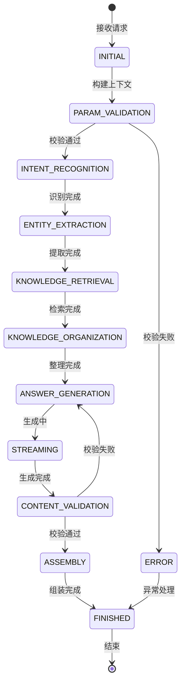
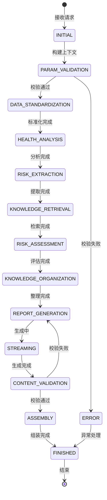

# 老人健康监测系统-健康咨询子项目 详细设计文档 v1.1

**文档版本**: v1.1\
**更新内容**: 重构文档结构，新增二、接口功能实现设计父章节，新增Trains章节，重命名Tools章节，调整模型选型为21G显存预算，新增意图模型，基于状态机机制重写编排设计，添加健康咨询和健康报告状态图，删除向量库章节，保持文档版本v1.1\
**最后更新**: 2026-04-10

## 一、接入层详细设计

### 1.1 接口定义

#### 1.1.1 健康咨询接口

**接口地址：** `POST /api/v1/health/consult`
**接口协议：** HTTP/SSE 流式响应
**请求参数：**

```python
class HealthConsultRequest(BaseModel):
    task_id: str                  # 任务唯一标识
    chat_history: List[ChatMessage]  # 历史对话记录
    
class ChatMessage(BaseModel):
    role: str                     # 角色：user/assistant
    content: str                  # 消息内容
```

**响应格式：SSE流式响应**

```
# 内容块响应
data: {"type": "content", "content": "高血压患者需要注意以下几点："}

# 内容块响应
data: {"type": "content", "content": "1. 定期监测血压，保持血压在正常范围内"}

# 结束响应
data: {"type": "end", "related_knowledge": [{"id": "neo4j_node_123", "name": "高血压", "description": "慢性心血管疾病"}], "task_id": "xxx"}
```

#### 1.1.2 健康报告生成接口

**接口地址：** `POST /api/v1/health/report/generate`
**接口协议：** HTTP/SSE 流式响应
**请求参数：**

```python
class HealthReportRequest(BaseModel):
    health_record_content: dict    # 结构化健康数据对象
    report_type: Optional[str] = "general"  # 报告类型：general/monitor/risk_assessment
```

**响应格式：SSE流式响应**

```
# 报告内容块响应
data: {"type": "content", "content": "# 健康体检报告\n\n## 一、基本信息\n"}

# 报告内容块响应
data: {"type": "content", "content": "### 1.1 健康评分：85分\n整体健康状况良好。\n"}

# 结束响应
data: {"type": "end", "summary": {"health_score": 85, "risk_alerts": ["轻度高血压风险"]}, "report_id": "xxx"}
```

### 1.2 Controller层实现

| 类名                      | 方法                                             | 职责                 |
| ----------------------- | ---------------------------------------------- | ------------------ |
| HealthConsultController | consult(request: HealthConsultRequest)         | 健康咨询接口入口，参数校验，请求封装 |
| HealthReportController  | generate\_report(request: HealthReportRequest) | 报告生成接口入口，参数校验，请求封装 |

### 1.3 Service层实现

| 类名                   | 方法                                        | 职责                 |
| -------------------- | ----------------------------------------- | ------------------ |
| HealthConsultService | process\_consult(context: ConsultContext) | 咨询业务处理，异常处理，结果封装   |
| HealthReportService  | generate\_report(context: ReportContext)  | 报告生成业务处理，异常处理，结果封装 |

## 二、接口功能实现设计

### 2.1 模型选型与21G显存分配方案

#### 显存分配总策略（总预算21G）

为确保在21G显存约束下，多模型（LLM、向量模型、医学模型、意图模型）可同时稳定运行，预留3G安全冗余，采用以下显存分配方案：

| 模型类型    | 显存占用    | 说明                                          |
| ------- | ------- | ------------------------------------------- |
| 大语言模型   | 6G      | Qwen3-4B-Instruct-2507 4bit量化，用于报告生成和对话理解   |
| 向量编码模型  | 2G      | BAAI/bge-large-zh-v1.5（1024维向量），用于语义编码和知识匹配 |
| 意图分类模型  | 1G      | 医疗意图分类模型，用于识别用户咨询意图                         |
| 医学分析模型  | 9G      | 2个轻量化医学模型总和                                 |
| 系统预留/冗余 | 3G      | 运行时内存、缓冲、峰值占用预留                             |
| **总计**  | **21G** | 满负荷分配，预留3G安全冗余                              |

#### 最终医学模型选型：

所有模型均为开源、适配中文医疗场景、轻量化设计：

1. **大语言模型**：`Qwen3-4B-Instruct-2507`（4B参数，6G显存，4bit量化）
   - 能力：回答生成、报告撰写、生活方式评估、健康建议生成
   - 输入：用户问题/健康数据+Prompt引导+检索到的医学知识
   - 输出：流式生成的回答内容/报告内容
2. **向量编码模型**：`BAAI/bge-large-zh-v1.5`（1024d，2G显存）
   - 能力：实体抽取、知识检索、医学文本编码、语义匹配
   - 输入：医学相关文本
   - 输出：1024维向量表示
3. **意图分类模型**：`医疗意图分类模型`（1G显存）
   - 能力：健康咨询意图分类、用户需求识别
   - 输入：用户问题文本
   - 输出：意图类型、置信度、关联实体提示
4. **健康风险预测模型**：`mcBERT/health-risk-prediction-small`（384M参数，4G显存）
   - 能力：慢性病风险评估、生理指标异常分析、健康风险评分
   - 输入：结构化健康指标
   - 输出：各慢性病风险概率、风险等级
5. **风险因子提取模型**：`TencentMedicalNet/medical-classification-small`（500M参数，5G显存）
   - 能力：异常指标识别、风险标签分类、健康风险因子提取
   - 输入：结构化健康数据
   - 输出：风险因子列表、异常标签
6. **生活方式评估/报告生成**：共享Qwen3-4B权重（无额外显存占用）
   - 能力：生活方式评估、健康建议生成、报告内容撰写
   - 实现方式：通过Prompt工程引导LLM完成，无需额外模型

### 2.2 健康咨询接口详细编排设计

#### 2.2.1 状态机图



#### 2.2.2 状态转换表

健康咨询接口采用状态机机制，定义以下状态及转换：

| 当前状态                    | 触发事件 | 目标状态                    | 说明       |
| ----------------------- | ---- | ----------------------- | -------- |
| INITIAL                 | 接收请求 | PARAM\_VALIDATION       | 初始化咨询上下文 |
| PARAM\_VALIDATION       | 校验通过 | INTENT\_RECOGNITION     | 参数校验成功   |
| PARAM\_VALIDATION       | 校验失败 | ERROR                   | 参数格式错误   |
| INTENT\_RECOGNITION     | 识别完成 | ENTITY\_EXTRACTION      | 意图分类完成   |
| ENTITY\_EXTRACTION      | 提取完成 | KNOWLEDGE\_RETRIEVAL    | 实体抽取完成   |
| KNOWLEDGE\_RETRIEVAL    | 检索完成 | KNOWLEDGE\_ORGANIZATION | 知识检索完成   |
| KNOWLEDGE\_ORGANIZATION | 整理完成 | ANSWER\_GENERATION      | 知识整理完成   |
| ANSWER\_GENERATION      | 生成中  | STREAMING               | 流式生成回答   |
| STREAMING               | 生成完成 | CONTENT\_VALIDATION     | 回答生成完成   |
| CONTENT\_VALIDATION     | 校验通过 | ASSEMBLY                | 内容校验通过   |
| CONTENT\_VALIDATION     | 校验失败 | ANSWER\_GENERATION      | 重新生成或修正  |
| ASSEMBLY                | 组装完成 | FINISHED                | 返回结束响应   |
| ERROR                   | 异常处理 | FINISHED                | 返回错误响应   |

#### 2.2.3 状态详细说明

**INITIAL状态**：

- 职责：接收总项目后端请求，构建ConsultContext上下文
- 调用：无外部调用
- 特殊逻辑：请求参数封装、对话记录解析

**PARAM\_VALIDATION状态**：

- 职责：验证任务ID、对话记录合法性
- 调用：内部校验逻辑
- 特殊逻辑：参数完整性检查、格式验证

**INTENT\_RECOGNITION状态**：

- 职责：识别用户咨询意图
- 调用：意图分类模型（详见三、Trains详细设计）
- 特殊逻辑：意图分类、置信度阈值判断

**ENTITY\_EXTRACTION状态**：

- 职责：基于向量匹配提取医学实体
- 调用：向量编码模型、医疗知识混合式向量检索增强（详见四、Tools详细设计）
- 特殊逻辑：
  - 使用三集合架构（medical\_entity、entity\_attributes、entity\_relations）
  - 1024维向量检索
  - 详细设计见《数据库说明文档v1.2》

**KNOWLEDGE\_RETRIEVAL状态**：

- 职责：检索相关医学知识
- 调用：医疗知识混合式向量检索增强（详见四、Tools详细设计）
- 特殊逻辑：并行检索三集合、加权融合结果

**KNOWLEDGE\_ORGANIZATION状态**：

- 职责：结构化处理检索到的知识
- 调用：内部知识整理逻辑
- 特殊逻辑：
  - Token限制处理策略
  - 知识结构化处理流程
  - Prompt管理与裁断机制
  - 知识去重和优先级排序
  - 适配健康咨询场景的特殊逻辑

**ANSWER\_GENERATION状态**：

- 职责：基于知识生成流式回答
- 调用：大语言模型（详见三、Trains详细设计）
- 特殊逻辑：流式生成控制、内容块组装

**STREAMING状态**：

- 职责：实时返回内容块
- 调用：接入层SSE回调
- 特殊逻辑：流式响应缓冲、速率控制

**CONTENT\_VALIDATION状态**：

- 职责：校验回答内容准确性
- 调用：内部校验逻辑
- 特殊逻辑：医学知识一致性检查、安全提示生成

**ASSEMBLY状态**：

- 职责：组装结束响应
- 调用：无外部调用
- 特殊逻辑：关联知识元数据组装、任务结果封装

**FINISHED状态**：

- 职责：结束咨询流程
- 调用：无外部调用
- 特殊逻辑：状态清理、日志记录

**ERROR状态**：

- 职责：异常处理
- 调用：无外部调用
- 特殊逻辑：错误信息记录、降级策略选择

#### 2.2.4 编排层特殊功能逻辑

**1. 对话上下文管理**：

- 职责：管理多轮对话的上下文信息
- 实现：基于ConsultContext的上下文累积机制
- 特殊逻辑：历史对话压缩、关键信息提取

**2. 异常降级策略**：

- 职责：处理各环节异常，保证服务可用性
- 实现：状态机异常分支处理
- 特殊逻辑：
  - 知识检索失败时使用通用模板
  - 模型调用失败时返回安全提示
  - 内容校验失败时重新生成或修正

**3. 性能监控机制**：

- 职责：监控各环节性能指标
- 实现：状态转换耗时记录
- 特殊逻辑：性能阈值告警、自动降级触发

### 2.3 健康报告生成接口详细编排设计

#### 2.3.1 状态机图



#### 2.3.2 状态转换表

健康报告生成接口采用状态机机制，定义以下状态及转换：

| 当前状态                    | 触发事件  | 目标状态                    | 说明       |
| ----------------------- | ----- | ----------------------- | -------- |
| INITIAL                 | 接收请求  | PARAM\_VALIDATION       | 初始化报告上下文 |
| PARAM\_VALIDATION       | 校验通过  | DATA\_STANDARDIZATION   | 参数校验成功   |
| PARAM\_VALIDATION       | 校验失败  | ERROR                   | 参数格式错误   |
| DATA\_STANDARDIZATION   | 标准化完成 | HEALTH\_ANALYSIS        | 数据标准化完成  |
| HEALTH\_ANALYSIS        | 分析完成  | RISK\_EXTRACTION        | 健康分析完成   |
| RISK\_EXTRACTION        | 提取完成  | KNOWLEDGE\_RETRIEVAL    | 风险因子提取完成 |
| KNOWLEDGE\_RETRIEVAL    | 检索完成  | RISK\_ASSESSMENT        | 知识检索完成   |
| RISK\_ASSESSMENT        | 评估完成  | KNOWLEDGE\_ORGANIZATION | 风险评估完成   |
| KNOWLEDGE\_ORGANIZATION | 整理完成  | REPORT\_GENERATION      | 知识整理完成   |
| REPORT\_GENERATION      | 生成中   | STREAMING               | 流式生成报告   |
| STREAMING               | 生成完成  | CONTENT\_VALIDATION     | 报告生成完成   |
| CONTENT\_VALIDATION     | 校验通过  | ASSEMBLY                | 内容校验通过   |
| CONTENT\_VALIDATION     | 校验失败  | REPORT\_GENERATION      | 重新生成或修正  |
| ASSEMBLY                | 组装完成  | FINISHED                | 返回结束响应   |
| ERROR                   | 异常处理  | FINISHED                | 返回错误响应   |

#### 2.3.3 状态详细说明

**INITIAL状态**：

- 职责：接收总项目后端请求，构建ReportContext上下文
- 调用：无外部调用
- 特殊逻辑：健康数据封装、报告类型解析

**PARAM\_VALIDATION状态**：

- 职责：验证健康数据结构合法性
- 调用：内部校验逻辑
- 特殊逻辑：字段完整性检查、数据格式验证

**DATA\_STANDARDIZATION状态**：

- 职责：格式校验、单位统一
- 调用：内部标准化逻辑
- 特殊逻辑：单位转换、异常值处理

**HEALTH\_ANALYSIS状态**：

- 职责：基于医学模型分析
- 调用：健康风险预测模型、风险因子提取模型（详见三、Trains详细设计）
- 特殊逻辑：多维度健康分析、异常点识别

**RISK\_EXTRACTION状态**：

- 职责：结合模型输出提取风险
- 调用：内部风险提取逻辑
- 特殊逻辑：风险因子关联、风险等级初判
  - **风险因子关联规则**：
    1. \*\*高血压风险因子关联：
       - 收缩压≥140mmHg → 关联"高血压"、"心血管疾病"、"脑卒中"
       - 舒张压≥90mmHg → 关联"高血压"、"肾功能不全"
       - 高血压病史 → 关联"高血压"、"冠心病"、"眼底病变"
    2. \*\*糖尿病风险因子关联：
       - 空腹血糖≥7.0mmol/L → 关联"糖尿病"、"糖尿病肾病"、"糖尿病足"
       - 餐后2小时血糖≥11.1mmol/L → 关联"糖尿病"、"视网膜病变"
       - 糖尿病病史 → 关联"糖尿病"、"神经病变"、"心血管并发症"
    3. \*\*血脂异常风险因子关联：
       - 总胆固醇≥5.2mmol/L → 关联"高血脂"、"动脉粥样硬化"
       - LDL-C≥3.4mmol/L → 关联"冠心病"、"脑梗死"
       - 甘油三酯≥1.7mmol/L → 关联"胰腺炎"、"脂肪肝"
    4. \*\*其他风险因子关联：
       - BMI≥28 → 关联"肥胖症"、"睡眠呼吸暂停"、"骨关节炎"
       - 吸烟史 → 关联"肺癌"、"慢性阻塞性肺疾病"
       - 饮酒史 → 关联"酒精性肝病"、"肝硬化"
  - \*\*风险等级初判规则（单指标风险等级）：
    | 风险等级 | 判定标准               | 颜色标识 |
    | ---- | ------------------ | ---- |
    | 低风险  | 指标在正常范围内，无异常病史     | 绿色   |
    | 轻度风险 | 1项指标轻度异常，或1项轻度病史   | 黄色   |
    | 中度风险 | 2-3项指标轻度异常，或1项中度异常 | 橙色   |
    | 高度风险 | ≥4项指标异常，或≥2项中度异常   | 红色   |
  - **风险等级初判规则（综合初判）**：
    - 取所有单指标风险等级的最高值作为初判风险等级

**KNOWLEDGE\_RETRIEVAL状态**：

- 职责：检索对应疾病知识
- 调用：医疗知识混合式向量检索增强（详见四、Tools详细设计）
- 特殊逻辑：风险知识检索、干预方案查询

**RISK\_ASSESSMENT状态**：

- 职责：量化评估风险等级
- 调用：内部风险评估逻辑
- 特殊逻辑：风险权重计算、健康评分计算
  - **风险权重计算规则**：
    | 风险类型   | 基础权重 | 调整因子                  | 说明     |
    | ------ | ---- | --------------------- | ------ |
    | 心脑血管风险 | 0.30 | 年龄>65岁+0.10，高血压+0.08  | 权重最高   |
    | 糖尿病风险  | 0.25 | 血糖异常+0.08，肥胖+0.06     | <br /> |
    | 肿瘤风险   | 0.20 | 吸烟史+0.10，家族史+0.08     | <br /> |
    | 呼吸系统风险 | 0.15 | 吸烟史+0.08，慢阻肺+0.06     | <br /> |
    | 其他风险   | 0.10 | 肝功能异常+0.05，肾功能异常+0.05 | <br /> |
    - **权重计算公式**：
      ```
      调整后权重 = 基础权重 × (1 + Σ调整因子)
      总权重归一化 = 调整后权重 / Σ所有调整后权重
      ```
    - **风险因子权重表（按重要性排序）**：
      | 风险因子       | 权重系数 | 说明      |
      | ---------- | ---- | ------- |
      | 高血压史       | 1.5  | 最重要风险因子 |
      | 糖尿病史       | 1.4  | <br />  |
      | 吸烟史        | 1.3  | <br />  |
      | 血脂异常       | 1.2  | <br />  |
      | 肥胖(BMI≥28) | 1.1  | <br />  |
      | 饮酒史        | 1.0  | <br />  |
      | 缺乏运动       | 0.9  | <br />  |
  - **健康评分计算规则（满分100分）**：
    | 评分项          | 满分 | 扣分规则               | 得分计算   |
    | ------------ | -- | ------------------ | ------ |
    | **基础健康**     | 30 | -                  | <br /> |
    | 血压正常         | 8  | 收缩压≥140：-8；≥130：-4 | <br /> |
    | 血糖正常         | 8  | 空腹≥7.0：-8；≥6.1：-4  | <br /> |
    | 血脂正常         | 7  | 总胆≥5.2：-7；≥4.5：-3  | <br /> |
    | BMI正常        | 7  | ≥28：-7；≥24：-3      | <br /> |
    | **生活方式**     | 25 | -                  | <br /> |
    | 不吸烟          | 8  | 吸烟：-8              | <br /> |
    | 不饮酒/适量       | 6  | 过量饮酒：-6            | <br /> |
    | 规律运动         | 6  | 缺乏运动：-6            | <br /> |
    | 规律作息         | 5  | 作息不规律：-5           | <br /> |
    | **病史情况**     | 25 | -                  | <br /> |
    | 无慢性病史        | 10 | 1项慢性病：-5；≥2项：-10   | <br /> |
    | 无家族病史        | 8  | 1项家族史：-4；≥2项：-8    | <br /> |
    | 定期体检         | 7  | 未定期体检：-7           | <br /> |
    | **生理指标**     | 20 | -                  | <br /> |
    | 心率正常(60-100) | 5  | 异常：-5              | <br /> |
    | 肝肾功能正常       | 5  | 1项异常：-3；2项：-5      | <br /> |
    | 睡眠质量好        | 5  | 睡眠不足：-5            | <br /> |
    | 精神状态好        | 5  | 焦虑/抑郁：-5           | <br /> |
    - **健康评分等级划分**：
      | 评分区间    | 健康等级 | 建议            |
      | ------- | ---- | ------------- |
      | 90-100分 | 优秀   | 继续保持良好生活习惯    |
      | 80-89分  | 良好   | 关注1-2项指标改善    |
      | 70-79分  | 一般   | 需要改善2-3项生活方式  |
      | 60-69分  | 较差   | 建议咨询医生，制定改善计划 |
      | <60分    | 差    | 尽快就医，全面检查     |
    - **风险等级最终判定（结合评分和风险因子）**：
      ```
      风险得分 = 100 - 健康评分 + (Σ风险因子权重 × 20)
      ```
      | 风险得分  | 最终风险等级 |
      | ----- | ------ |
      | 0-20  | 低风险    |
      | 21-40 | 轻度风险   |
      | 41-60 | 中度风险   |
      | >60   | 高度风险   |

**KNOWLEDGE\_ORGANIZATION状态**：

- 职责：整理报告相关知识
- 调用：内部知识整理逻辑
- 特殊逻辑：
  - 报告内容结构组织
  - 知识优先级排序
  - 医疗建议准确性校验
  - 适配报告生成场景的特殊逻辑

**REPORT\_GENERATION状态**：

- 职责：生成结构化报告
- 调用：大语言模型（详见三、Trains详细设计）
- 特殊逻辑：报告模板填充、流式生成控制

**STREAMING状态**：

- 职责：实时返回内容块
- 调用：接入层SSE回调
- 特殊逻辑：流式响应缓冲、速率控制

**CONTENT\_VALIDATION状态**：

- 职责：校验医学内容准确性
- 调用：内部校验逻辑
- 特殊逻辑：医学建议一致性检查、风险提示验证

**ASSEMBLY状态**：

- 职责：组装报告元数据
- 调用：无外部调用
- 特殊逻辑：健康评分、风险预警组装

**FINISHED状态**：

- 职责：结束报告生成流程
- 调用：无外部调用
- 特殊逻辑：状态清理、日志记录

**ERROR状态**：

- 职责：异常处理
- 调用：无外部调用
- 特殊逻辑：错误信息记录、降级策略选择

#### 2.3.4 编排层特殊功能逻辑

**1. 健康数据结构约定**：

- 职责：确保与上游服务数据格式一致
- 实现：与总项目后端约定统一的JSON结构
- 特殊逻辑：数据映射、缺失值处理

**2. 报告内容个性化**：

- 职责：根据报告类型生成个性化内容
- 实现：基于report\_type参数选择不同模板
- 特殊逻辑：报告类型路由、内容模板切换

**3. 健康评分计算引擎**：

- 职责：量化计算整体健康评分
- 实现：基于风险加权的评分算法
- 特殊逻辑：评分规则配置、权重动态调整

## 三、Trains详细设计

### 3.1 意图分类Train设计

#### 3.1.1 功能说明

负责用户健康咨询意图的识别和分类，支持5大类健康咨询意图。

#### 3.1.2 输入输出

- **输入**：用户问题文本（标准化后）
- **输出**：
  - 意图类型（疾病咨询类/用药咨询类/检查报告解读类/生活方式咨询类/其他健康咨询类）
  - 置信度（0-1之间）
  - 关联实体类型提示

#### 3.1.3 实现细节

1. **模型选型**：医疗领域专用意图分类模型
2. **分类体系**：5大类，15+子意图
3. **置信度阈值**：0.85，低于阈值默认归类为通用咨询类
4. **Few-shot支持**：支持小样本学习，新增意图无需重新训练

### 3.2 健康分析Train设计

#### 3.2.1 功能说明

负责基于医学模型进行多维度健康分析和风险预测。

#### 3.2.2 输入输出

- **输入**：标准化健康数据对象
- **输出**：
  - 生理指标分析结果（异常点列表）
  - 健康风险预测结果（各慢性病风险概率）
  - 风险因子提取结果（标准化风险因子列表）

#### 3.2.3 实现细节

1. **模型组合**：
   - 健康风险预测模型：mcBERT/health-risk-prediction-small
   - 风险因子提取模型：TencentMedicalNet/medical-classification-small
2. **分析维度**：6项监测指标、10+慢性病风险
3. **并行分析**：生理指标规则分析和模型预测并行执行

### 3.3 大语言模型Train设计

#### 3.3.1 功能说明

负责基于用户问题和检索到的医学知识生成流式回答或报告。

#### 3.3.2 输入输出

- **输入**：
  - 用户问题/健康数据
  - 检索到的医学知识
  - Prompt引导
- **输出**：
  - 流式生成的内容块
  - 生成完成通知

#### 3.3.3 实现细节

1. **模型选型**：Qwen3-4B-Instruct-2507（4bit量化）
2. **流式生成**：支持SSE流式响应
3. **Prompt工程**：针对健康咨询和报告生成场景优化
4. **降级策略**：模型服务不可用时返回通用提示

## 四、Tools详细设计

### 4.1 医疗知识混合式向量检索增强

#### 4.1.1 功能说明

基于Milvus三集合并行检索架构，同时检索实体名称、实体属性和实体关系，通过加权融合策略提升检索准确率和召回率。

#### 4.1.2 输入输出

- **输入**：
  - 查询文本
  - Top-K参数（默认20）
  - 检索参数配置
- **输出**：
  - 融合后的高置信度医学实体列表
  - 实体属性信息
  - 实体关系信息
  - 相似度得分

#### 4.1.3 集合架构

采用三集合架构设计，分别存储实体名称、实体属性和实体关系，支持多维度混合检索（详细设计见《数据库说明文档v1.2》）：

| 集合名称                | 存储内容     | 向量维度  |
| ------------------- | -------- | ----- |
| `medical_entity`    | 实体名称向量   | 1024维 |
| `entity_attributes` | 实体属性描述向量 | 1024维 |
| `entity_relations`  | 实体关系向量   | 1024维 |

#### 4.1.4 调用方式

```python
# 调用示例
result = hybrid_retrieval_service.hybrid_search(
    query_text="高血压的症状有哪些",
    top_k=20,
    weights={"entity": 0.4, "attribute": 0.35, "relation": 0.25}
)
```

#### 4.1.5 错误处理与降级

- 单集合检索失败：自动调整权重，使用其他集合
- 性能降级：延迟过高时降低检索精度
- 全部失败：切换为关键词匹配降级方案

## 五、错误码设计

| 错误码   | 错误信息    | 说明                 |
| ----- | ------- | ------------------ |
| 200   | 成功      | 请求处理成功             |
| 40001 | 参数错误    | 请求参数缺失或格式错误        |
| 40002 | 无效的问题   | 问题包含敏感内容或不属于健康咨询范围 |
| 40003 | 无效的健康数据 | 健康数据格式错误或包含异常值     |
| 50001 | 知识检索失败  | 向量数据库查询失败          |
| 50002 | LLM调用失败 | 大语言模型服务调用失败        |
| 50003 | 内容校验失败  | 生成的内容未通过医学知识校验     |
| 50004 | 报告生成失败  | 报告生成过程出现异常         |
| 50005 | 系统内部错误  | 其他未知系统错误           |

## 六、开发规范

1. 所有医学相关的字符串常量统一放在`constants/medical_constants.py`中管理
2. 医学知识校验规则必须可配置，支持动态更新
3. 所有Neo4j查询必须做参数化处理，防止Cypher注入
4. 接口响应时间超过阈值时必须记录慢查询日志
5. 所有用户健康数据必须脱敏处理后再进入日志系统
6. 新增医学知识查询场景必须补充对应的单元测试用例
7. 所有模型调用必须支持降级方案，模型服务不可用时返回友好提示
8. 向量检索结果必须经过阈值过滤，相似度<0.75的结果不得使用
9. 状态机实现必须可追踪，每个状态转换必须记录日志
10. 编排层特殊逻辑必须独立封装，便于维护和测试

