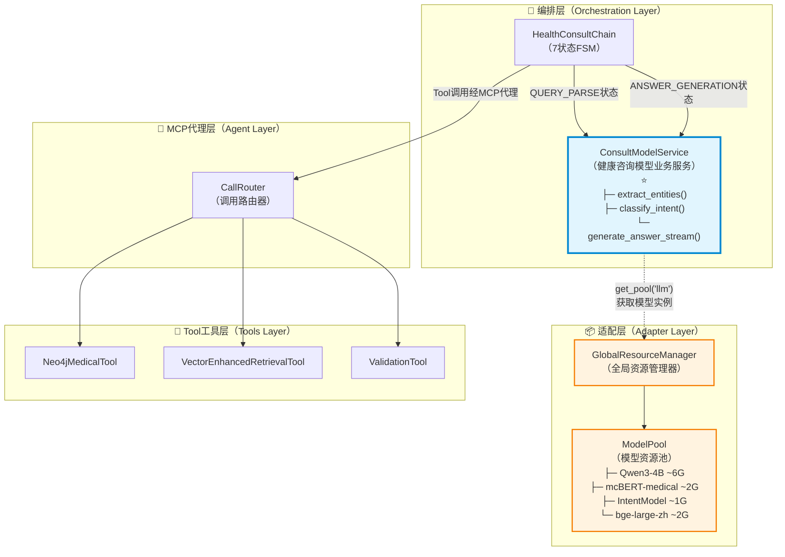
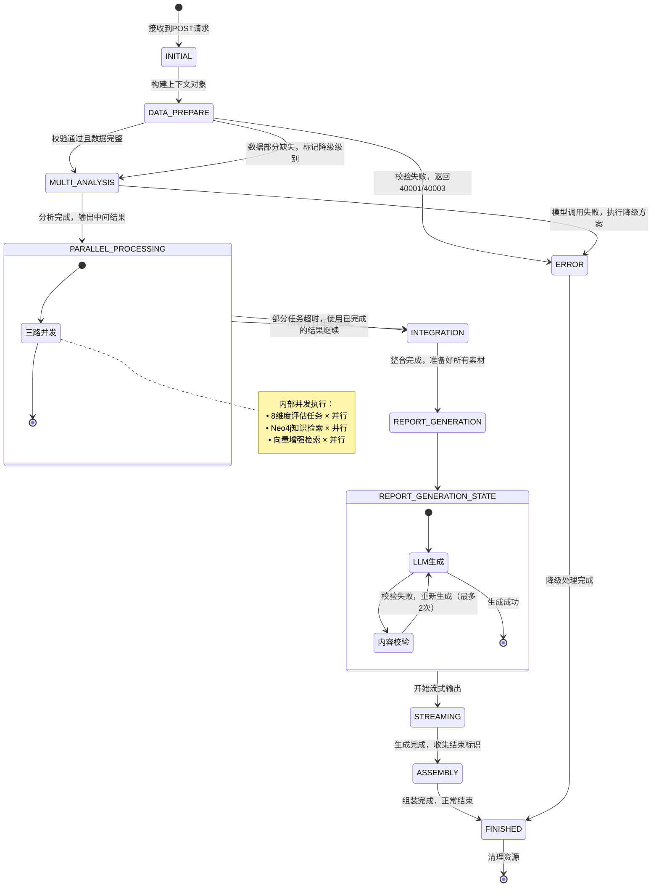
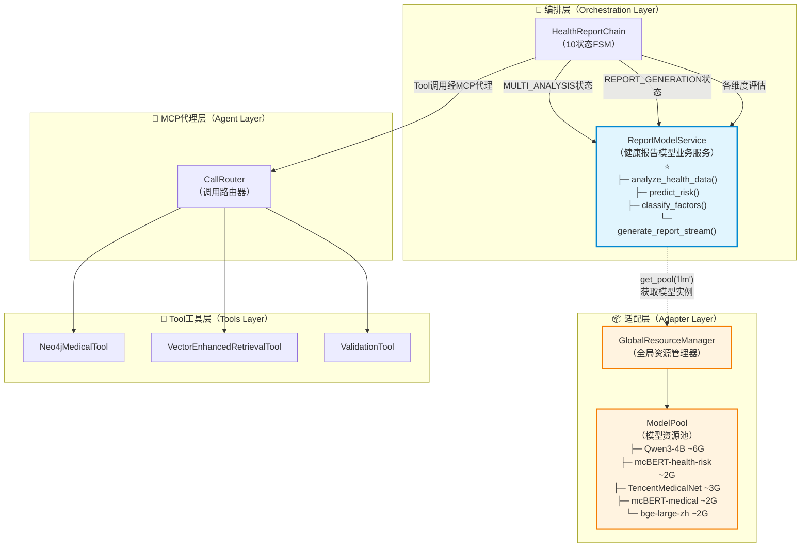
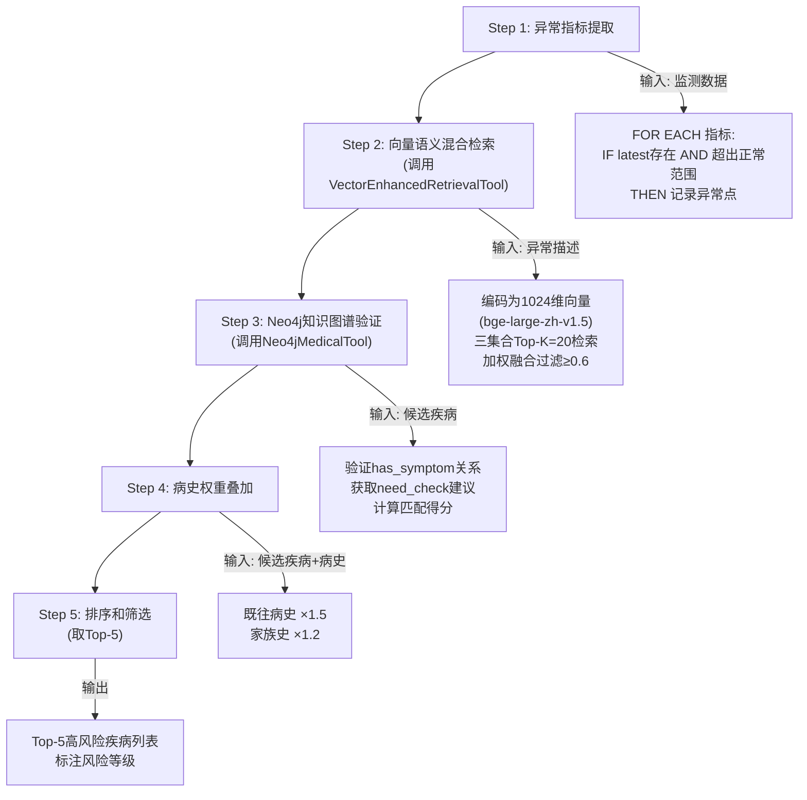
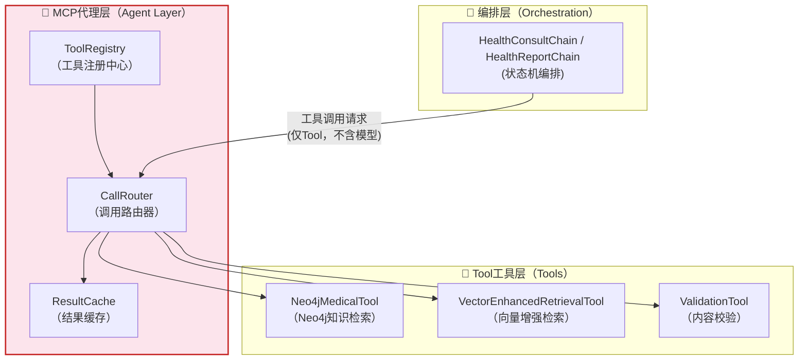
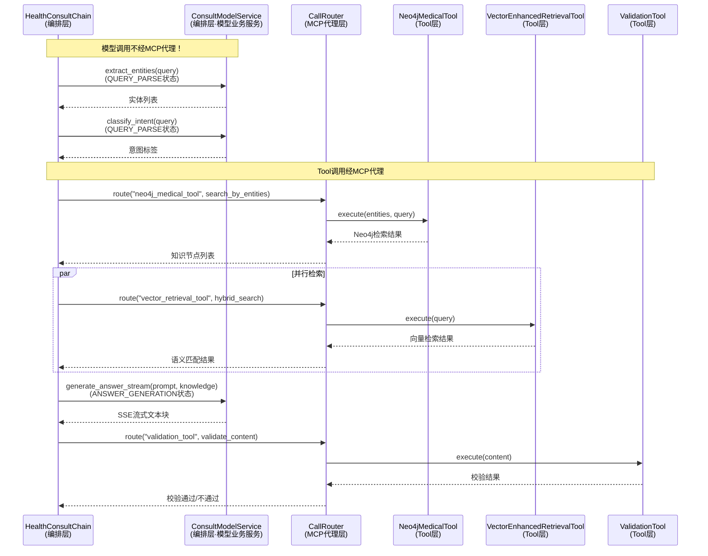
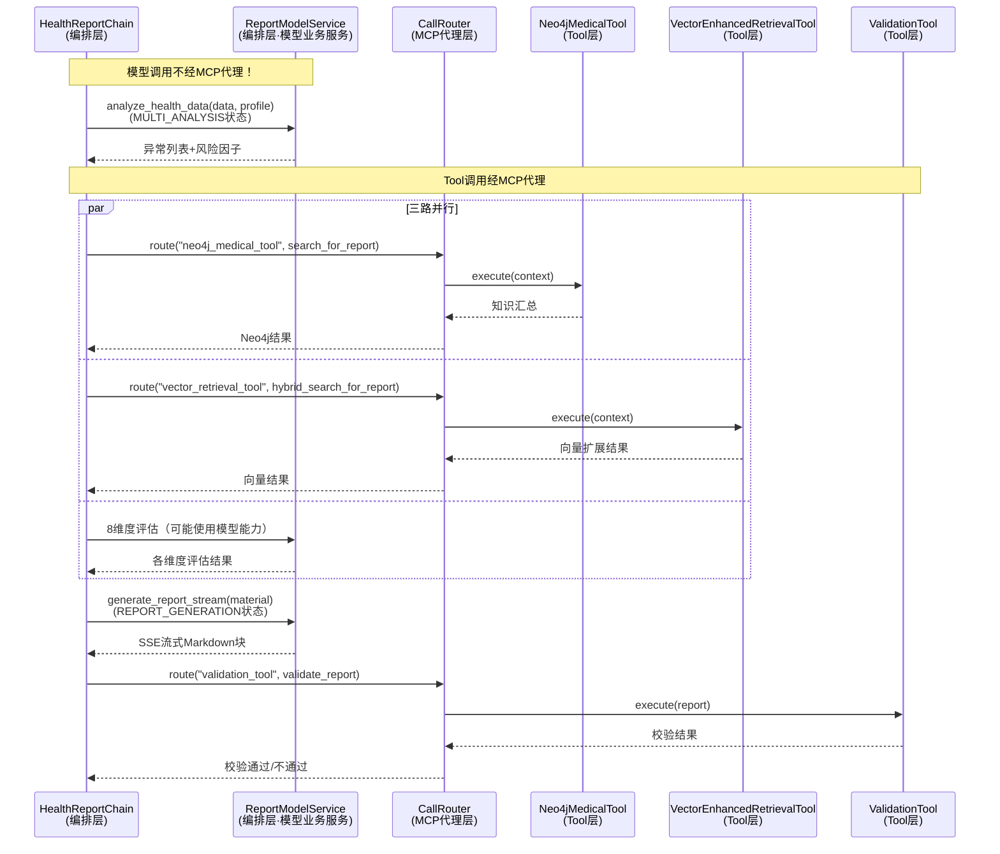
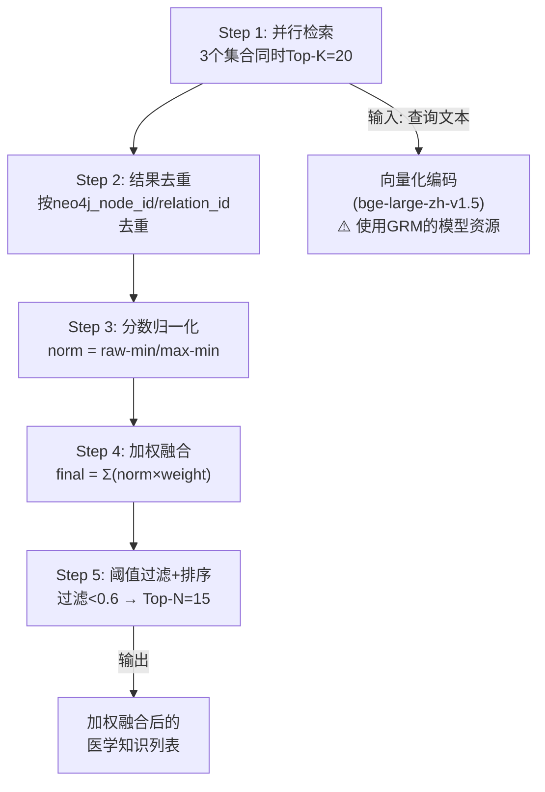
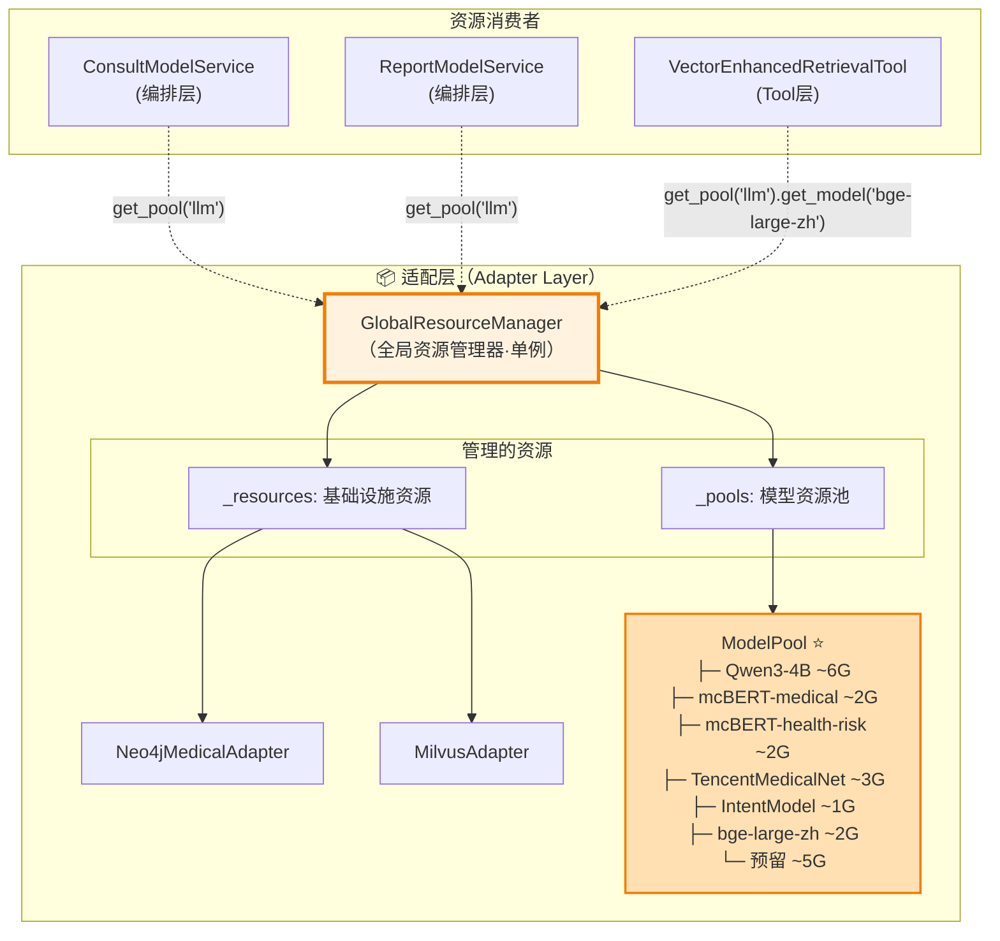

# 老人健康监测系统-健康咨询子项目 详细设计文档 v1.2

**文档版本**: v1.2
**更新内容**: 按严格5层架构重组；模型服务重构为"适配层资源管理+编排层业务封装"模式（非普通Tool）；所有txt图改为mermaid图；核心算法/特殊规则/模型调用移入编排层-健康报告部分；性能优化内嵌至各业务编排；新增VectorEnhancedRetrievalTool混合检索Tool完整设计；所有算法/规则含【医学支撑】
**最后更新**: 2026-04-11
**文档定位**: "怎么做" - 技术实现和设计层面（引用需求文档v1.1的业务定义）
**架构依据**: 项目架构设计v1.md + 项目类图.png + 数据库说明文档v1.2.md + 项目需求设计v1.1.md

***

## 一、接入层详细设计

### 1.1 层级职责

接入层是系统对外暴露的唯一入口，负责HTTP协议处理、请求参数校验、SSE流式响应管理。

**核心职责**：

- 对外提供RESTful API接口，接收总项目后端的请求
- 处理SSE流式响应，实现内容的逐块返回
- 请求参数合法性校验、异常统一处理
- 协议转换，将外部请求转换为内部上下文格式

**对应架构类图中的类**：

- `HealthConsultController`（健康咨询控制器）
- `HealthReportController`（健康报告控制器）

**上下游交互**：

- **上游**：对接总项目后端服务，接收健康咨询和报告生成请求
- **下游**：调用服务层的业务处理入口，传递请求上下文
- **响应**：将服务层返回的流式结果直接返回给上游调用方

### 1.2 层级设计

#### 1.2.1 接口一：健康知识咨询接口 🟢

**对应类**：`HealthConsultController`

| 属性               | 值                        |
| ---------------- | ------------------------ |
| **接口路径**         | `/api/v1/health/consult` |
| **请求方式**         | POST                     |
| **Content-Type** | `application/json`       |
| **SSE响应**        | ✅ 是                      |

**请求参数定义**：

```python
class ConsultRequest(BaseModel):
    task_id: str                                          # 任务标识符（必填），用于关联对话上下文
    chat_history: List[ChatMessage]                       # 对话记录列表（必填）

class ChatMessage(BaseModel):
    role: str                                             # 角色："user"/"assistant"
    content: str                                          # 消息内容
```

**业务场景**（引用[需求文档v1.1 Section 2.1](file:///home/project/MedicalQA/doc/项目设计文档/项目需求设计/项目需求设计v1.1.md)）：
用户通过总项目后端发起健康知识问答（如"高血压患者应该注意什么饮食？"），系统基于Neo4j医疗知识图谱检索相关知识并生成专业回答。支持疾病查询、症状咨询、治疗方案、用药指导、生活方式等5类问题。

**SSE响应格式**：

```
event: message
data: {文本格式的回答内容片段}

... (多个事件)

event: end
data: {"type": "end", "task_id": "xxx", "sources": ["neo4j_node_id_1", ...]}
```

#### 1.2.2 接口二：健康报告生成接口 🔴

**对应类**：`HealthReportController`

| 属性               | 值                       |
| ---------------- | ----------------------- |
| **接口路径**         | `/api/v1/health/report` |
| **请求方式**         | POST                    |
| **Content-Type** | `application/json`      |
| **SSE响应**        | ✅ 是（Markdown格式）         |

**请求参数定义**：

```python
class HealthReportRequest(BaseModel):
    monitoring_data: Optional[MonitoringData] = None       # 6项监测数据（可能为空）
    user_profile: UserProfile                              # 用户健康档案（必填）
    report_type: str = "comprehensive"                     # 报告类型：固定为"综合健康报告"

# 监测数据结构（支持空值）
class MonitoringData(BaseModel):
    heart_rate: Optional[MonitoringDataItem] = None        # 心率
    blood_glucose: Optional[MonitoringDataItem] = None     # 血糖
    perfusion_index: Optional[MonitoringDataItem] = None   # 灌注指数
    blood_oxygen: Optional[MonitoringDataItem] = None     # 血氧
    sleep: Optional[MonitoringDataItem] = None             # 睡眠
    blood_pressure: Optional[BloodPressureData] = None    # 血压（特殊结构）

# 单项监测数据项（4个时间维度）
class MonitoringDataItem(BaseModel):
    latest: Optional[List[LatestDataPoint]] = None         # 当日最新数据
    daily_stats: Optional[List[DailyStat]] = None          # 日统计
    weekly_stats: Optional[List[WeeklyStat]] = None        # 周统计
    monthly_stats: Optional[List[MonthlyStat]] = None      # 月统计

# 血压特殊结构（收缩压/舒张压）
class BloodPressureData(BaseModel):
    latest: Optional[List[BPLatestDataPoint]] = None
    daily_stats: Optional[List[BPDailyStat]] = None
    weekly_stats: Optional[List[BPWeeklyStat]] = None
    monthly_stats: Optional[List[BPMonthlyStat]] = None

# 用户健康档案（所有病史字段为字符串文本类型）
class UserProfile(BaseModel):
    name: str                                              # 姓名（必填）
    gender: str                                            # 性别："男"/"女"（必填）
    age: int                                               # 年龄（必填）
    height: Optional[float] = None                         # 身高(cm)（可选）
    weight: Optional[float] = None                         # 体重(kg)（可选）
    family_history: Optional[str] = None                   # 家族遗传病史（可选，str类型）
    allergy_history: Optional[str] = None                  # 过敏史（可选，str类型）
    past_medical_history: Optional[str] = None             # 既往病史（可选，str类型）
    surgery_history: Optional[str] = None                  # 手术史（可选，str类型）
    medication_adherence: Optional[str] = None             # 用药依从性（可选，str类型："好"/"一般"/"差"）
```

**业务场景**（引用[需求文档v1.1 Section 2.2](file:///home/project/MedicalQA/doc/项目设计文档/项目需求设计/项目需求设计v1.1.md)）：
总项目后端收集用户监测数据和档案信息后，调用本接口生成个性化综合健康报告（3000-4000字Markdown格式）。报告包含常规体检、专项监测、风险评估三大子模块，覆盖8大评估维度。

**SSE响应格式**：

```
event: message
data: {Markdown格式的报告内容片段}

... (多个事件)

event: end
data: {"type": "end", "summary": {"health_score": 78, "risk_level": "轻度风险"}, "report_id": "RPT-20240411-001"}
```

#### 1.2.3 Controller实现要点

```python
from fastapi import APIRouter, Request
from fastapi.responses import StreamingResponse

router = APIRouter(prefix="/api/v1/health")

@router.post("/consult")
async def health_consult(request: ConsultRequest):
    """健康咨询接口 - 流式返回"""
    async def event_generator():
        async for chunk in consult_service.process_consult(request):
            yield f"data: {json.dumps(chunk, ensure_ascii=False)}\n\n"
        yield f"event: end\ndata: {json.dumps({'type': 'end'}, ensure_ascii=False)}\n\n"
    return StreamingResponse(event_generator(), media_type="text/event-stream")

@router.post("/report")
async def health_report(request: HealthReportRequest):
    """健康报告生成接口 - 流式返回"""
    async def event_generator():
        async for chunk in report_service.generate_report(request):
            yield f"data: {json.dumps(chunk, ensure_ascii=False)}\n\n"
        yield f"event: end\ndata: {json.dumps(end_metadata, ensure_ascii=False)}\n\n"
    return StreamingResponse(event_generator(), media_type="text/event-stream")
```

***

## 二、服务层详细设计

### 2.1 层级职责

服务层位于接入层之下、编排层之上，负责业务逻辑的初步封装、请求上下文的构建与分发。

**核心职责**：

- 接收Controller传递的请求参数，构建内部上下文对象
- 执行初步的业务逻辑判断和参数预处理
- 调用编排核心层的业务链入口，驱动完整的业务流程
- 管理请求生命周期内的状态和资源

**对应架构类图中的类**：

- `HealthConsultService`（健康咨询服务）
- `HealthReportService`（健康报告服务）

**上下游交互**：

- **上游**：接收接入层传递的已校验请求
- **下游**：调用编排层的Chain对象执行业务流程
- **返回**：将编排层返回的流式结果透传回接入层

### 2.2 层级设计

#### 2.2.1 HealthConsultService（健康咨询服务）🟢

**对应类**：`HealthConsultService`

| 属性               | 类型                    | 说明        |
| ---------------- | --------------------- | --------- |
| consult\_chain   | HealthConsultChain    | 健康咨询编排链引用 |
| context\_builder | ConsultContextBuilder | 咨询上下文构建器  |

| 方法                           | 说明                    |
| ---------------------------- | --------------------- |
| `process_consult(request)`   | 主入口，异步生成器，流式返回咨询回答    |
| `_build_context(request)`    | 构建ConsultContext上下文对象 |
| `_validate_request(request)` | 参数校验                  |

```python
class HealthConsultService:
    """健康咨询服务 - 对应架构类图中的HealthConsultService"""

    def __init__(self, consult_chain: HealthConsultChain):
        self.consult_chain = consult_chain

    async def process_consult(self, request: ConsultRequest) -> AsyncGenerator[str, None]:
        """
        咨询业务处理主方法
        构建上下文后委托给HealthConsultChain执行7状态机编排流程
        """
        context = self._build_context(request)
        self._validate_request(context)

        async for content_chunk in self.consult_chain.execute(context):
            yield content_chunk
```

#### 2.2.2 HealthReportService（健康报告服务）🔴

**对应类**：`HealthReportService`

| 属性               | 类型                   | 说明        |
| ---------------- | -------------------- | --------- |
| report\_chain    | HealthReportChain    | 健康报告编排链引用 |
| context\_builder | ReportContextBuilder | 报告上下文构建器  |
| validator        | ReportDataValidator  | 数据校验器     |

| 方法                           | 说明                   |
| ---------------------------- | -------------------- |
| `generate_report(request)`   | 主入口，异步生成器，流式返回报告内容   |
| `_build_context(request)`    | 构建ReportContext上下文对象 |
| `_validate_request(request)` | 参数校验+数据完整性检查         |

```python
class HealthReportService:
    """健康报告服务 - 对应架构类图中的HealthReportService"""

    def __init__(self, report_chain: HealthReportChain):
        self.report_chain = report_chain

    async def generate_report(self, request: HealthReportRequest) -> AsyncGenerator[str, None]:
        """
        报告生成业务处理主方法
        构建上下文后委托给HealthReportChain执行10状态机编排流程
        """
        context = self._build_context(request)

        validation_result = await self._validate_request(context)
        if not validation_result.is_valid:
            raise ValidationError(validation_result.error_code, validation_result.message)

        async for content_chunk in self.report_chain.execute(context):
            yield content_chunk
```

### 2.3 上下文对象设计（ConsultContext + ReportContext）

#### ConsultContext（咨询上下文）

```python
@dataclass
class ConsultContext:
    """健康咨询请求的完整上下文"""
    task_id: str
    chat_history: List[ChatMessage]
    current_query: str                          # 当前用户问题（chat_history最后一条user消息）
    extracted_entities: List[str] = None        # 从用户问题中提取的医学实体（由编排层填充）
    retrieved_knowledge: List[Dict] = None      # 检索到的医学知识（由Tool层填充）
    generated_answer: str = None                # 生成的回答（由模型业务服务填充）
    source_references: List[str] = None         # 知识来源引用（Neo4j节点ID列表）
```

#### ReportContext（报告上下文）

```python
@dataclass
class ReportContext:
    """健康报告生成的完整上下文"""
    request: HealthReportRequest                # 原始请求
    monitoring_data: MonitoringData              # 监测数据（可能部分为空）
    user_profile: UserProfile                    # 用户档案
    degradation_level: int = 0                  # 空值降级层级（0=完整, 1=标准, 2=精简, 3=基础）
    anomaly_list: List[Dict] = None             # 异常指标列表（由MULTI_ANALYSIS状态填充）
    dimension_results: Dict[str, Any] = None    # 各维度评估结果（由PARALLEL_PROCESSING状态填充）
    knowledge_results: List[Dict] = None        # 知识检索结果（由PARALLEL_PROCESSING状态填充）
    risk_factors: List[Dict] = None             # 风险因子列表（由INTEGRATION状态填充）
    health_score: float = None                  # 健康综合评分（由INTEGRATION状态填充）
    final_risk_level: str = None                # 最终风险等级（通过INTEGRATION状态填充）
    report_content: str = None                  # 报告Markdown内容（由REPORT_GENERATION状态填充）
    end_metadata: Dict = None                   # 结束元数据（由ASSEMBLY状态填充）
```

***

## 三、编排层详细设计

### 3.1 层级职责

编排层是系统的**核心大脑**，负责整个业务流程的状态机驱动和Agent策略执行。

**核心职责**：

- 执行业务流程编排，管控健康咨询和报告生成的全流程
- 实现基于有限状态机(FSM)的业务逻辑控制
- **封装模型业务服务**：针对不同业务场景（健康咨询/健康报告）特殊封装模型调用逻辑（⭐关键设计）
- 驱动工具调用和内容生成，协调各阶段的输入输出
- 管理执行状态，控制流式生成节奏
- 通过MCP代理层调用底层工具能力（仅对真正的Tool，模型推理不经过MCP代理）

**对应架构类图中的类**：

- `HealthConsultChain`（健康咨询状态机链）
- `HealthReportChain`（健康报告状态机链）
- `ConsultModelService`（健康咨询模型业务服务）⭐新增
- `ReportModelService`（健康报告模型业务服务）⭐新增

> ⭐ **重要设计说明：模型服务 vs Tool的区别**
>
> 本系统区分两种不同的"能力提供者"：
>
> | 维度 | 模型服务（Model Service） | 工具（Tool） |
> |------|--------------------------|--------------|
> | **本质** | AI推理资源（LLM/BERT等模型） | 外部系统能力（数据库检索、校验等） |
> | **管理层级** | 适配层→GlobalResourceManager→ModelPool | MCP代理层→ToolRegistry |
> | **调用方式** | 编排层模型业务服务直接使用（不经MCP代理） | 编排层通过MCP代理间接调用 |
> | **生命周期** | 全局单例，预加载到显存 | 按需创建，可缓存复用 |
> | **类比** | 像"CPU/GPU"这样的基础设施 | 像"打印机/扫描仪"这样的外设 |
>
> **为什么这样设计？**
> 1. 模型是昂贵的显存资源（21G预算），需要全局统筹管理
> 2. 不同业务场景对同一模型的调用方式不同（咨询用短prompt/报告用长prompt），需要在编排层封装
> 3. 模型调用不需要协议转换和权限控制（不像外部API），直接调用更高效
> 4. 符合项目类图中GlobalResourceManager→ModelPool→编排层模型业务服务的架构设计

**上下游交互**：

- **上游**：接收服务层传递的请求上下文（包含完整对话记录或监测数据）
- **下游**：通过MCP代理层调用各种**真正的Tool**能力；通过**模型业务服务**直接使用AI模型资源
- **回调**：将生成的内容块实时回调给服务层进行流式返回

### 3.2 健康咨询状态机编排设计 🟢

#### 3.2.1 状态定义（7个状态）

健康咨询采用**7状态有限状态机(FSM)**管理从接收到返回的完整流程：

| 序号 | 状态名称  | 英文标识                   | 职责描述                         | 预估耗时       | 是否可并行    |
| -- | ----- | ---------------------- | ---------------------------- | ---------- | -------- |
| 1  | 初始状态  | INITIAL                | 接收请求，构建ConsultContext，提取当前查询 | <10ms      | 否        |
| 2  | 问题解析  | QUERY\_PARSE           | NLP实体抽取 + 意图识别 + 查询改写        | 50-100ms   | 否        |
| 3  | 知识检索  | KNOWLEDGE\_RETRIEVAL   | 并行调用Neo4j图谱检索 + 向量增强检索       | 100-300ms  | ✅是（内部并行） |
| 4  | 知识整合  | KNOWLEDGE\_INTEGRATION | 结果去重排序 + 相关性过滤 + 素材准备        | 20-50ms    | 否        |
| 5  | 回答生成  | ANSWER\_GENERATION     | 调用LLM基于知识素材生成专业回答            | 500-2000ms | 否        |
| 6  | 流式返回  | STREAMING              | 实时返回内容块给客户端                  | 持续         | 否（子状态）   |
| 7  | 完成/错误 | FINISHED / ERROR       | 结束流程或异常处理                    | <5ms       | 否        |

#### 3.2.2 状态转换规则

```mermaid
stateDiagram-v2
    [*] --> INITIAL : 接收到POST请求
    
    INITIAL --> QUERY_PARSE : 提取当前查询文本
    
    QUERY_PARSE --> KNOWLEDGE_RETRIEVAL : 解析完成，输出实体列表和意图标签
    QUERY_PARSE --> ERROR : 解析失败，返回错误码40002
    
    state KNOWLEDGE_RETRIEVAL {
        [*] --> 并行检索
        note right of 并行检索 : 内部并发执行:\n• Neo4j图谱检索\n• 向量增强检索
        并行检索 --> [*]
    }
    
    KNOWLEDGE_RETRIEVAL --> KNOWLEDGE_INTEGRATION : 所有检索任务完成
    KNOWLEDGE_RETRIEVAL --> ERROR : 全部超时，降级为通用知识回答
    
    KNOWLEDGE_INTEGRATION --> ANSWER_GENERATION : 整合完成，准备好Prompt素材
    
    ANSWER_GENERATION --> STREAMING : 开始生成，进入流式输出模式
    ANSWER_GENERATION --> ERROR : LLM调用失败，降级为模板回答
    
    STREAMING --> FINISHED : 生成完成，收集结束标识
    
    ERROR --> FINISHED : 降级处理完成
    
    FINISHED --> [*] : 结束流程，清理资源
```

##### 完整转换规则表

| 当前状态                   | 触发事件      | 目标状态                   | 说明                  |
| ---------------------- | --------- | ---------------------- | ------------------- |
| INITIAL                | 接收到POST请求 | QUERY\_PARSE           | 提取当前查询文本            |
| QUERY\_PARSE           | 解析完成      | KNOWLEDGE\_RETRIEVAL   | 输出实体列表和意图标签         |
| QUERY\_PARSE           | 解析失败      | ERROR                  | 返回错误码40002（非健康咨询范围） |
| KNOWLEDGE\_RETRIEVAL   | 所有检索任务完成  | KNOWLEDGE\_INTEGRATION | 汇总检索结果              |
| KNOWLEDGE\_RETRIEVAL   | 全部超时      | ERROR                  | 降级为通用知识回答           |
| KNOWLEDGE\_INTEGRATION | 整合完成      | ANSWER\_GENERATION     | 准备好Prompt素材         |
| ANSWER\_GENERATION     | 开始生成      | STREAMING              | 进入流式输出模式            |
| STREAMING              | 生成完成      | FINISHED               | 收集结束标识              |
| ANSWER\_GENERATION     | LLM调用失败   | ERROR                  | 降级为模板回答             |
| ERROR                  | 降级处理完成    | FINISHED               | 异常处理后结束             |
| **任意状态**               | 未预期异常     | **ERROR**              | 统一异常入口              |

#### 3.2.3 KNOWLEDGE\_RETRIEVAL状态的并发实现（双路并行：Neo4j+向量增强检索）

该状态是健康咨询的核心技术亮点——**双路并行检索**：

```python
async def knowledge_retrieval_state(context: ConsultContext) -> State:
    """
    知识检索状态的并发实现（健康咨询专用）
    同时启动Neo4j图谱检索 + 向量增强检索（混合检索策略）
    
    注意：这里调用的都是真正的Tool，通过MCP代理层路由
    """

    query = context.current_query
    entities = context.extracted_entities

    # 任务1：Neo4j知识图谱检索（基于实体匹配）→ 经MCP代理调用Neo4jMedicalTool
    neo4j_task = call_router.route("neo4j_medical_tool", {
        "action": "search_by_entities",
        "params": {"entity_list": entities, "query": query}
    })

    # 任务2：向量增强检索（基于语义相似度）→ 经MCP代理调用VectorEnhancedRetrievalTool
    vector_task = call_router.route("vector_retrieval_tool", {
        "action": "hybrid_search",
        "params": {"query": query, "top_k": 20}
    })

    # 并行执行两项检索
    results = await asyncio.gather(
        neo4j_task,
        vector_task,
        return_exceptions=True
    )

    # 合并结果
    neo4j_results = results[0] if not isinstance(results[0], Exception) else []
    vector_results = results[1] if not isinstance(results[1], Exception) else []

    # 结果融合：优先保留Neo4j精确匹配结果，补充向量语义匹配结果
    merged = merge_knowledge_results(neo4j_results, vector_results)
    context.retrieved_knowledge = merged[:15]  # 取Top-15作为回答素材

    return State.KNOWLEDGE_INTEGRATION
```

#### 3.2.4 健康咨询模型业务服务（ConsultModelService）⭐核心设计

> ⭐ **本节是本次重构的核心变更之一**
>
> 根据项目类图的设计思想，模型服务不是普通的Tool！而是在编排层针对健康咨询场景特殊封装的**模型业务服务**。
> 它从GlobalResourceManager获取底层AI模型资源，封装健康咨询专用的模型调用逻辑。

**对应类**：`ConsultModelService`

**设计定位**：



**核心代码实现**：

```python
# src/orchestration/model_services/consult_model_service.py

class ConsultModelService:
    """
    健康咨询专用模型业务服务 - 对应架构类图中的ConsultModelService
    
    设计思想：
    ────────────────────────────────────────
    ❌ 本类不属于Tool工具层！而是编排层的业务组件
    ✅ 通过GlobalResourceManager获取底层模型资源（非MCP代理）
    ✅ 封装健康咨询场景专用的模型调用逻辑
    
    与Tool的关系：
    ────────────────────────────────────────
    • 如果本服务内部需要调用Neo4j检索 → 通过MCP代理调用Neo4jMedicalTool
    • 如果本服务内部需要向量检索 → 通过MCP代理调用VectorEnhancedRetrievalTool  
    • 但模型推理本身直接使用从GRM获取的模型实例，不经过MCP代理
    
    为什么不做成Tool？
    ────────────────────────────────────────
    1. 模型是全局共享的昂贵资源（21G显存预算），需要集中管理
    2. 不同业务场景对同一模型的调用方式差异很大（咨询vs报告）
    3. 模型调用不需要权限控制/协议转换/限流等MCP能力
    4. 直接调用减少一层中间开销，提升性能
    """

    def __init__(self, resource_manager: GlobalResourceManager):
        """
        初始化：从GlobalResourceManager获取模型池
        
        Args:
            resource_manager: 全局资源管理器单例（来自适配层）
        """
        self.resource_manager = resource_manager
        
        # 从GRM获取模型池（这是资源，不是Tool！）
        self.model_pool = resource_manager.get_pool('llm')
        
        # 从模型池获取具体模型实例（这些是AI推理引擎，不是工具）
        self.llm = self.model_pool.get_model('Qwen3-4B-Instruct-2507')     # 回答生成
        self.bert = self.model_pool.get_model('mcBERT-medical')             # 实体抽取+向量化
        self.intent_model = self.model_pool.get_model('IntentModel')         # 意图识别
        self.embedding_model = self.model_pool.get_model('bge-large-zh-v1.5') # 文本向量化

    async def extract_entities(self, text: str) -> List[str]:
        """
        医学实体抽取（QUERY_PARSE状态使用）
        
        使用mcBERT模型从用户问题中抽取医学实体（疾病名、症状名、药物名等）
        
        注意：这里是直接调用模型，不经过MCP代理层！
        """
        entities = await self.bert.extract_entities(text)
        return entities

    async def classify_intent(self, query: str) -> str:
        """
        意图分类（QUERY_PARSE状态使用）
        
        识别用户问题的意图类别：
        - disease_query: 疾病查询
        - symptom_inquiry: 症状咨询
        - medication_guide: 用药指导
        - lifestyle_advice: 生活建议
        - prevention: 预防保健
        - non_health: 非健康咨询范围
        """
        intent = await self.intent_model.classify(query)
        return intent

    async def encode_query(self, text: str) -> List[float]:
        """
        文本向量化编码（供向量增强检索Tool使用）
        
        返回1024维向量（BAAI/bge-large-zh-v1.5）
        """
        vector = await self.embedding_model.encode(text)
        return vector

    async def generate_answer_stream(
        self,
        system_prompt: str,
        user_content: str,
        knowledge_context: str = "",
        temperature: float = 0.7,
        max_tokens: int = 2000
    ) -> AsyncGenerator[str, None]:
        """
        流式生成回答（ANSWER_GENERATION状态使用）
        
        基于检索到的医学知识素材，使用Qwen3-4B生成专业的健康咨询回答
        
        注意：这里是直接调用LLM模型，不经过MCP代理层！
        """
        messages = [
            {"role": "system", "content": system_prompt},
            {"role": "user", "content": user_content + "\n\n【参考资料】\n" + knowledge_context}
        ]

        async for chunk in self.llm.stream_generate(
            messages=messages,
            temperature=temperature,
            max_tokens=max_tokens
        ):
            yield chunk
```

**方法清单**：

| 方法名 | 输入 | 输出 | 使用的模型（来自GRM） | 在哪个状态使用 |
| ------ | ---- | ---- | ------------------- | ------------- |
| `extract_entities(text)` | 用户问题文本 | 医学实体列表 | mcBERT-medical | QUERY_PARSE |
| `classify_intent(query)` | 用户问题文本 | 意图分类标签 | IntentModel | QUERY_PARSE |
| `encode_query(text)` | 待编码文本 | 1024维向量 | bge-large-zh-v1.5 | KNOWLEDGE_RETRIEVAL（供向量Tool使用） |
| `generate_answer_stream(...)` | Prompt+知识素材 | SSE流式文本块 | Qwen3-4B-Instruct-2507 | ANSWER_GENERATION |

#### 3.2.5 HealthConsultChain类实现

```python
# src/orchestration/chains/health_consult_chain.py

class HealthConsultChain:
    """
    健康咨询的状态机链 - 对应架构类图中的HealthConsultChain
    实现7个状态的转换逻辑
    """

    def __init__(
        self,
        consult_model_service: ConsultModelService,  # ⭐ 注入模型业务服务（非Tool）
        call_router: CallRouter                       # MCP调用路由器（用于调用真正的Tool）
    ):
        self.state = State.INITIAL
        self.context = None
        self.model_service = consult_model_service    # 模型业务服务
        self.call_router = call_router                 # MCP路由器

    async def execute(self, request: ConsultRequest) -> AsyncGenerator[str, None]:
        """主执行方法，SSE流式生成器"""

        # 状态1: INITIAL → 构建上下文
        self.context = ConsultContext(
            task_id=request.task_id,
            chat_history=request.chat_history,
            current_query=request.chat_history[-1].content if request.chat_history else ""
        )
        self._transition_to(State.QUERY_PARSE)

        # 状态2: QUERY_PARSE → 实体抽取+意图识别
        # ⭐ 使用模型业务服务（直接调用模型，不经MCP代理）
        try:
            context.extracted_entities = await self.model_service.extract_entities(
                context.current_query
            )
            intent = await self.model_service.classify_intent(context.current_query)
            
            if intent == "non_health":
                raise NonHealthQueryError()
                
        except Exception as e:
            return self._handle_error(e, error_code="40002")

        self._transition_to(State.KNOWLEDGE_RETRIEVAL)

        # 状态3: KNOWLEDGE_RETRIEVAL → 并行检索（Neo4j + 向量增强）
        # ⭐ 这里调用的是真正的Tool，经过MCP代理
        try:
            await knowledge_retrieval_state(self.context, self.call_router)
        except Exception as e:
            logger.warning(f"知识检索部分失败: {e}，尝试降级")

        self._transition_to(State.KNOWLEDGE_INTEGRATION)

        # 状态4: KNOWLEDGE_INTEGRATION → 结果整合
        integration_result = await knowledge_integration_handler(self.context)

        self._transition_to(State.ANSWER_GENERATION)

        # 状态5: ANSWER_GENERATION → 状态6: STREAMING
        # ⭐ 使用模型业务服务（直接调用LLM，不经MCP代理）
        async for content_chunk in self.model_service.generate_answer_stream(
            system_prompt=CONSULT_SYSTEM_PROMPT,
            user_content=context.current_query,
            knowledge_context=integration_result['material']
        ):
            yield f"data: {json.dumps({'type': 'message', 'content': content_chunk}, ensure_ascii=False)}\n\n"

        self._transition_to(State.STREAMING)
        self._transition_to(State.FINISHED)

        # 结束标识
        yield f"event: end\ndata: {json.dumps({'type': 'end', 'task_id': self.context.task_id}, ensure_ascii=False)}\n\n"
```

#### 3.2.6 健康咨询性能优化与降级策略（并发控制/超时/降级矩阵）

##### 并发控制策略

| 阶段                   | 并行度  | 实现方式                       | 目标        |
| -------------------- | ---- | -------------------------- | --------- |
| KNOWLEDGE\_RETRIEVAL | 2路并行 | asyncio.gather(Neo4j+向量检索) | 降低检索延迟40% |

##### 各阶段超时配置

| 阶段                   | 超时时间 | 降级动作         |
| -------------------- | ---- | ------------ |
| QUERY\_PARSE         | 10秒  | 返回错误码40002   |
| KNOWLEDGE\_RETRIEVAL | 15秒  | 使用已完成的部分结果继续 |
| ANSWER\_GENERATION   | 60秒  | 降级为模板回答      |

##### 降级策略矩阵

| 失败组件              | 降级方案           | 质量影响 | 适用阶段                 |
| ----------------- | -------------- | ---- | -------------------- |
| Neo4j数据库不可用       | 仅使用向量增强检索结果    | 中等   | KNOWLEDGE\_RETRIEVAL |
| Milvus向量库不可用      | 仅使用Neo4j精确匹配结果 | 轻微   | KNOWLEDGE\_RETRIEVAL |
| LLM(Qwen3-4B)调用失败 | 使用预设模板生成简化回答   | 中等   | ANSWER\_GENERATION   |
| 向量模型(mcBERT)推理超时  | 使用关键词匹配替代      | 轻微   | QUERY\_PARSE         |

***

### 3.3 健康报告生成状态机编排设计 🔴

#### 3.3.1 状态机概述（10状态优化版）

基于《[项目需求设计v1.1](file:///home/project/MedicalQA/doc/项目设计文档/项目需求设计/项目需求设计v1.1.md)》的需求定义，本系统采用**10状态有限状态机(FSM)管理健康报告生成的完整流程，相比原14状态方案**减少29%的状态数量，通过**合并冗余状态+并行化处理**提升25-30%的执行效率。

##### 效率优化对比

| 对比项    | 原始方案（14状态） | **优化方案（10状态）** | 提升幅度     |
| ------ | ---------- | -------------- | -------- |
| 状态数量   | 14个        | **10个**        | 减少29%    |
| 状态转换次数 | 13次        | **9次**         | 减少31%    |
| 串行耗时估算 | \~8-10秒    | **\~6-7秒**     | 提升25-30% |
| 并行化程度  | 低（基本串行）    | **高（3阶段可并行）**  | 显著提升     |
| 报告质量影响 | 基准         | **无负面影响**      | 保持一致     |

#### 3.3.2 状态定义（10个状态）

| 序号 | 状态名称 | 英文标识                 | 职责描述                          | 预估耗时        | 是否可并行    |
| -- | ---- | -------------------- | ----------------------------- | ----------- | -------- |
| 1  | 初始状态 | INITIAL              | 接收请求，构建ReportContext上下文对象     | <10ms       | 否        |
| 2  | 数据准备 | DATA\_PREPARE        | 参数校验+数据标准化+空值处理+完整性判断         | 20-50ms     | 否        |
| 3  | 模型分析 | MULTI\_ANALYSIS      | 调用医学模型进行多维度健康分析+风险因子提取+特殊规则应用 | 500-1000ms  | 否        |
| 4  | 并行处理 | PARALLEL\_PROCESSING | **并行执行**8维度评估+知识检索（含向量增强检索）   | 200-500ms   | ✅是（内部并行） |
| 5  | 整合计算 | INTEGRATION          | 风险评估+评分计算+知识整理+报告素材准备         | 50-100ms    | 否        |
| 6  | 报告生成 | REPORT\_GENERATION   | 调用LLM生成Markdown格式报告+内容校验      | 2000-5000ms | 否        |
| 7  | 流式返回 | STREAMING            | 实时返回内容块给客户端                   | 持续          | 否（子状态）   |
| 8  | 组装结束 | ASSEMBLY             | 组装结束响应+元数据封装+日志记录             | <10ms       | 否        |
| 9  | 完成状态 | FINISHED             | 结束流程，清理资源，释放连接                | <5ms        | 否        |
| 10 | 错误状态 | ERROR                | 异常处理，执行降级策略，记录错误日志            | 可变          | 否        |

#### 3.3.3 状态转换规则

##### 主流程转换图



##### 完整转换规则表

| 当前状态                 | 触发事件      | 目标状态                 | 说明               |
| -------------------- | --------- | -------------------- | ---------------- |
| INITIAL              | 接收到POST请求 | DATA\_PREPARE        | 构建上下文对象          |
| DATA\_PREPARE        | 校验通过且数据完整 | MULTI\_ANALYSIS      | 进入模型分析阶段         |
| DATA\_PREPARE        | 校验失败      | ERROR                | 返回错误码40001/40003 |
| DATA\_PREPARE        | 数据部分缺失    | MULTI\_ANALYSIS      | 标记降级级别后继续        |
| MULTI\_ANALYSIS      | 分析完成      | PARALLEL\_PROCESSING | 输出中间结果           |
| MULTI\_ANALYSIS      | 模型调用失败    | ERROR                | 执行降级方案           |
| PARALLEL\_PROCESSING | 所有并行任务完成  | INTEGRATION          | 汇总并行结果           |
| PARALLEL\_PROCESSING | 部分任务超时    | INTEGRATION          | 使用已完成的结果继续       |
| INTEGRATION          | 整合完成      | REPORT\_GENERATION   | 准备好所有素材          |
| REPORT\_GENERATION   | 开始生成      | STREAMING            | 进入流式输出模式         |
| STREAMING            | 生成完成      | ASSEMBLY             | 收集结束标识           |
| REPORT\_GENERATION   | 校验失败      | REPORT\_GENERATION   | 重新生成（最多重试2次）     |
| ASSEMBLY             | 组装完成      | FINISHED             | 正常结束流程           |
| ERROR                | 降级处理完成    | FINISHED             | 异常处理后结束          |
| **任意状态**             | 未预期异常     | **ERROR**            | 统一异常入口           |

#### 3.3.4 PARALLEL\_PROCESSING状态的并发控制实现（三路并行）

该状态是健康报告生成的核心技术亮点——**三路并行**：

```python
import asyncio
from typing import List, Dict, Any, Optional

async def parallel_processing_state(context: ReportContext, call_router: CallRouter) -> State:
    """
    并行处理状态的核心实现（健康报告专用）
    同时启动8个维度评估任务 + Neo4j知识检索 + 向量增强检索
    
    注意：
    • 8维度评估函数内部可能使用report_model_service的模型能力（直接调用模型）
    • Neo4j和向量检索是通过MCP代理调用真正的Tool
    """

    # 任务组1：8个维度评估（并行执行）
    dimension_tasks = [
        disease_risk_assessment(context),       # 维度1：疾病风险评估
        medication_recommendation(context),      # 维度2：用药建议
        treatment_plan(context),                # 维度3：治疗方案
        dietary_advice(context),                # 维度4：饮食建议
        checkup_recommendation(context),        # 维度5：检查建议
        complication_warning(context),          # 维度6：并发症预警
        prevention_measures(context),           # 维度7：预防措施
        susceptible_population(context)         # 维度8：易感人群
    ]

    # 任务组2：Neo4j知识图谱检索（经MCP代理调用Tool）
    neo4j_knowledge_task = call_router.route("neo4j_medical_tool", {
        "action": "search_for_report",
        "params": {"context": context}
    })

    # 任务组3：向量增强检索（经MCP代理调用Tool）
    vector_search_task = call_router.route("vector_retrieval_tool", {
        "action": "hybrid_search_for_report",
        "params": {"context": context}
    })

    # 三路合并为一个任务列表
    all_tasks = dimension_tasks + [neo4j_knowledge_task, vector_search_task]

    # 使用asyncio.gather并发执行所有任务
    results = await asyncio.gather(*all_tasks, return_exceptions=True)

    # 处理维度评估结果
    context.dimension_results = {}
    for i, result in enumerate(results[:8]):
        if isinstance(result, Exception):
            logger.warning(f"维度{i+1}评估失败: {result}")
            context.dimension_results[f"dimension_{i+1}"] = None
        else:
            context.dimension_results[f"dimension_{i+1}"] = result

    # 处理Neo4j知识检索结果（来自MCP代理→Tool）
    if isinstance(results[8], Exception):
        logger.error(f"Neo4j知识检索失败: {results[8]}")
        context.knowledge_results = []
    else:
        context.knowledge_results = results[8]

    # 处理向量增强检索结果（来自MCP代理→Tool）
    if isinstance(results[9], Exception):
        logger.warning(f"向量增强检索失败: {results[9]}")
        context.vector_search_results = []
    else:
        context.vector_search_results = results[9]

    return State.INTEGRATION


# 示例：疾病风险评估维度的异步实现
async def disease_risk_assessment(context: ReportContext, model_service: ReportModelService) -> Dict[str, Any]:
    """
    维度1：疾病风险评估
    输入：监测数据异常值 + 既往病史 + 家族病史
    输出：疾病风险列表（Top 5）
    
    注意：这里可以使用model_service提供的模型能力（直接调用，不经MCP）
    """
    anomalies = extract_anomalies(context.monitoring_data)
    
    # 使用模型业务服务的编码能力（如果需要向量化）
    # 或者直接在维度评估中使用规则引擎
    
    for disease in risk_diseases:
        disease.risk_score *= apply_history_weight(
            disease.name,
            context.user_profile.past_medical_history,
            context.user_profile.family_history
        )

    top_risks = sorted(risk_diseases, key=lambda x: x.risk_score, reverse=True)[:5]

    return {
        "dimension_id": "disease_risk",
        "risks": [r.to_dict() for r in top_risks],
        "confidence_scores": [r.confidence for r in top_risks]
    }
```

#### 3.3.5 健康报告模型业务服务（ReportModelService）⭐核心设计

> ⭐ **本节是本次重构的核心变更之一**
>
> 与ConsultModelService同理，ReportModelService是在编排层针对健康报告场景特殊封装的**模型业务服务**。
> 它封装了健康报告生成所需的全部模型调用逻辑：多维度分析、风险预测、分类、报告生成等。

**对应类**：`ReportModelService`

**设计定位**：



**核心代码实现**：

```python
# src/orchestration/model_services/report_model_service.py

class ReportModelService:
    """
    健康报告专用模型业务服务 - 对应架构类图中的ReportModelService
    
    设计思想同ConsultModelService：
    ────────────────────────────────────────
    ❌ 本类不属于Tool工具层！而是编排层的业务组件
    ✅ 通过GlobalResourceManager获取底层模型资源（非MCP代理）
    ✅ 封装报告生成场景的专用模型调用逻辑
    
    封装的模型能力：
    ────────────────────────────────────────
    • Qwen3-4B-Instruct-2507 → Markdown报告流式生成
    • mcBERT/health-risk-prediction-small → 健康风险预测
    • TencentMedicalNet/medical-classification-small → 风险因子分类
    • mcBERT/medical-bert-chinese-base → 医学实体抽取/向量化
    • BAAI/bge-large-zh-v1.5 → 文本向量化编码
    """

    def __init__(self, resource_manager: GlobalResourceManager):
        self.resource_manager = resource_manager
        self.model_pool = resource_manager.get_pool('llm')
        
        # 从模型池获取所有需要的模型实例
        self.llm = self.model_pool.get_model('Qwen3-4B-Instruct-2507')
        self.health_risk_model = self.model_pool.get_model('mcBERT-health-risk')
        self.classification_model = self.model_pool.get_model('TencentMedicalNet-classification')
        self.bert = self.model_pool.get_model('mcBERT-medical')
        self.embedding_model = self.model_pool.get_model('bge-large-zh-v1.5')

    async def analyze_health_data(
        self,
        monitoring_data: MonitoringData,
        user_profile: UserProfile
    ) -> Dict[str, Any]:
        """
        多维度健康分析（MULTI_ANALYSIS状态使用）
        
        综合使用多个模型进行分析：
        1. health_risk_model → 预测各指标的健康风险
        2. classification_model → 分类风险因子
        3. bert → 从病史文本中抽取关键信息
        
        Returns:
            Dict包含:
            - anomaly_list: 异常指标列表
            - risk_factors: 风险因子列表
            - extracted_conditions: 从病史中抽出的条件
        """
        # 1. 使用health-risk模型预测监测数据风险
        risk_predictions = await self.health_risk_model.predict_risk({
            'monitoring_data': monitoring_data.to_dict(),
            'user_profile': user_profile.to_dict()
        })
        
        # 2. 使用classification模型分类风险因子
        factor_categories = await self.classification_model.classify(
            text=build_factor_text(risk_predictions, user_profile)
        )
        
        # 3. 使用bert从病史文本中抽取关键信息
        extracted_conditions = await self.bert.extract_entities(
            text=f"{user_profile.past_medical_history or ''} "
                f"{user_profile.family_history or ''} "
                f"{user_profile.allergy_history or ''}"
        )
        
        return {
            'anomaly_list': build_anomaly_list(risk_predictions),
            'risk_factors': factor_categories,
            'extracted_conditions': extracted_conditions
        }

    async def predict_disease_risk(self, anomaly_descriptions: str) -> List[Dict]:
        """
        疾病风险预测（Algorithm 1 Step 2中使用）
        
        使用health-risk模型预测可能的疾病风险
        """
        predictions = await self.health_risk_model.predict_risk({
            'query_text': anomaly_descriptions,
            'mode': 'disease_matching'
        })
        return predictions

    async def classify_risk_factors(self, factors_text: str) -> List[Dict]:
        """
        风险因子分类（INTEGRATION状态使用）
        
        使用classification模型对风险因子进行分类和权重分配
        """
        categories = await self.classification_model.classify(text=factors_text)
        return categories

    async def encode_for_vector_search(self, text: str) -> List[float]:
        """
        文本向量化（供向量增强检索Tool使用）
        
        返回1024维向量
        """
        return await self.embedding_model.encode(text)

    async def generate_report_stream(
        self,
        system_prompt: str,
        report_material: Dict,
        temperature: float = 0.7,
        max_tokens: int = 6000
    ) -> AsyncGenerator[str, None]:
        """
        流式生成报告（REPORT_GENERATION状态使用）
        
        基于整合后的报告素材，使用Qwen3-4B生成Markdown格式的综合健康报告
        
        注意：这里是直接调用LLM模型，不经过MCP代理层！
        """
        user_content = build_report_prompt(report_material)
        
        messages = [
            {"role": "system", "content": system_prompt},
            {"role": "user", "content": user_content}
        ]
        
        async for chunk in self.llm.stream_generate(
            messages=messages,
            temperature=temperature,
            max_tokens=max_tokens
        ):
            yield chunk
```

**方法清单**：

| 方法名 | 输入 | 输出 | 使用的模型（来自GRM） | 在哪个状态使用 |
| ------ | ---- | ---- | ------------------- | ------------- |
| `analyze_health_data(data, profile)` | 监测数据+用户档案 | 异常列表+风险因子+条件 | health-risk + classification + bert | MULTI_ANALYSIS |
| `predict_disease_risk(descriptions)` | 异常描述文本 | 疾病风险列表 | health-risk | Algorithm 1 / PARALLEL |
| `classify_risk_factors(factors_text)` | 风险因子文本 | 分类后的因子列表 | classification | INTEGRATION |
| `encode_for_vector_search(text)` | 待编码文本 | 1024维向量 | bge-large-zh-v1.5 | PARALLEL（供向量Tool使用） |
| `generate_report_stream(...)` | Prompt+素材包 | SSE流式Markdown块 | Qwen3-4B-Instruct-2507 | REPORT_GENERATION |

#### 3.3.6 HealthReportChain类实现

```python
# src/orchestration/chains/health_report_chain.py

class HealthReportChain:
    """
    健康报告生成的状态机链 - 对应架构类图中的HealthReportChain
    实现10个状态的转换逻辑
    """

    def __init__(
        self,
        report_model_service: ReportModelService,  # ⭐ 注入模型业务服务（非Tool）
        call_router: CallRouter                       # MCP调用路由器（用于调用真正的Tool）
    ):
        self.state = State.INITIAL
        self.context = None
        self.model_service = report_model_service     # 模型业务服务
        self.call_router = call_router                 # MCP路由器
        self.transition_table = self._build_transition_table()

    async def execute(self, request: HealthReportRequest) -> AsyncGenerator[str, None]:
        """主执行方法，SSE流式生成器"""

        # 状态1: INITIAL
        self.context = self._build_context(request)
        self._transition_to(State.DATA_PREPARE)

        # 状态2: DATA_PREPARE
        try:
            validation_result = await data_prepare_handler(self.context)
            if not validation_result.is_valid:
                raise ValidationError(validation_result.error_code, validation_result.message)
        except Exception as e:
            return self._handle_error(e)

        self._transition_to(State.MULTI_ANALYSIS)

        # 状态3: MULTI_ANALYSIS
        # ⭐ 使用模型业务服务（直接调用模型，不经MCP代理）
        try:
            analysis_result = await self.model_service.analyze_health_data(
                monitoring_data=self.context.monitoring_data,
                user_profile=self.context.user_profile
            )
            self.context.anomaly_list = analysis_result['anomaly_list']
            self.context.risk_factors = analysis_result['risk_factors']
        except Exception as e:
            return self._handle_error(e)

        self._transition_to(State.PARALLEL_PROCESSING)

        # 状态4: PARALLEL_PROCESSING（三路并行：8维度+Neo4j+向量检索）
        # ⭐ 8维度评估可能使用model_service的模型能力
        # ⭐ Neo4j和向量检索通过MCP代理调用Tool
        try:
            await parallel_processing_state(self.context, self.call_router, self.model_service)
        except Exception as e:
            logger.warning(f"并行处理部分失败: {e}")

        self._transition_to(State.INTEGRATION)

        # 状态5: INTEGRATION
        integration_result = await integration_handler(self.context, self.model_service)

        self._transition_to(State.REPORT_GENERATION)

        # 状态6: REPORT_GENERATION → 状态7: STREAMING
        # ⭐ 使用模型业务服务（直接调用LLM，不经MCP代理）
        async for content_chunk in self.model_service.generate_report_stream(
            system_prompt=REPORT_SYSTEM_PROMPT,
            report_material=integration_result['material']
        ):
            yield f"data: {json.dumps({'type': 'message', 'content': content_chunk}, ensure_ascii=False)}\n\n"

        self._transition_to(State.ASSEMBLY)

        # 状态8: ASSEMBLY
        end_metadata = assemble_response(self.context)
        yield f"event: end\ndata: {json.dumps(end_metadata, ensure_ascii=False)}\n\n"

        self._transition_to(State.FINISHED)

        # 状态9: FINISHED
        cleanup_resources(self.context)
```

#### 3.3.7 健康报告性能优化与降级策略（并发/超时/降级矩阵）

##### 并发控制策略

| 阶段                   | 并行度   | 实现方式                           | 目标       |
| -------------------- | ----- | ------------------------------ | -------- |
| PARALLEL\_PROCESSING | 10路并行 | asyncio.gather(8维度+Neo4j+向量检索) | 降低总延迟60% |

##### 流式输出缓冲配置

| 参数      | 值          | 说明      |
| ------- | ---------- | ------- |
| 缓冲区大小   | 512字节      | 平衡延迟和吞吐 |
| 刷新间隔    | 100ms或缓冲区满 | 保证流畅体验  |
| 首字节时间目标 | <30秒       | 用户感知优化  |

##### 各阶段超时配置

| 阶段                   | 超时时间 | 降级动作             |
| -------------------- | ---- | ---------------- |
| DATA\_PREPARE        | 5秒   | 返回错误码40001/40003 |
| MULTI\_ANALYSIS      | 30秒  | 使用规则引擎替代模型预测     |
| PARALLEL\_PROCESSING | 60秒  | 使用已完成的任务结果继续     |
| REPORT\_GENERATION   | 240秒 | 使用模板生成简化版报告      |

##### 降级策略矩阵

| 失败组件                    | 降级方案               | 质量影响 | 适用阶段                     |
| ----------------------- | ------------------ | ---- | ------------------------ |
| LLM(Qwen3-4B)           | 使用预设模板生成简化报告       | 中等   | REPORT\_GENERATION       |
| 向量模型(mcBERT)            | 使用关键词匹配替代          | 轻微   | MULTI\_ANALYSIS/PARALLEL |
| 医学模型(health-risk)       | 使用规则引擎计算风险         | 轻微   | MULTI\_ANALYSIS          |
| 分类模型(TencentMedicalNet) | 使用正则表达式提取          | 轻微   | MULTI\_ANALYSIS          |
| Neo4j数据库                | 返回通用医学知识           | 中等   | PARALLEL\_PROCESSING     |
| Milvus向量库               | 跳过向量增强检索环节，仅用Neo4j | 轻微   | PARALLEL\_PROCESSING     |
| 单个维度评估失败                | 该维度置null，其他维度正常    | 极轻   | PARALLEL\_PROCESSING     |

***

### 3.4 核心算法实现（健康报告专用，可封装为Chain）🔴

> 本章的所有算法服务于**健康报告生成**业务，主要在编排层的`INTEGRATION`状态和`PARALLEL_PROCESSING`状态的维度评估函数中使用。部分算法可进一步封装为独立的Chain供ReportModelService调用。

#### 3.4.1 算法1：疾病风险评分算法（含【医学支撑】）

##### 算法概述

**目标**：基于用户监测数据异常值、既往病史、家族病史，预测可能的疾病风险并量化评分。

**输入**：

- 监测数据中的异常指标列表（如血压偏高、血糖偏高等）
- 用户既往病史（字符串文本）
- 家族遗传病史（字符串文本）

**输出**：

- Top N高风险疾病列表（默认N=5）
- 每个疾病的：名称、风险分（0-100）、置信度（0-1）、主要依据

##### 算法流程



##### 数学模型基础

$$
RiskScore(d) = \left( \sum\_{i=1}^{n} SymptomMatch(s\_i, d) \times w\_i \right) \times Severity(d) \times HistoryMultiplier(d)
$$

其中：

- $d$：候选疾病
- $s_i$：第i个异常症状/指标
- $SymptomMatch(s_i, d)$：症状$s_i$与疾病$d$的匹配度（0-1），由混合检索的融合得分决定
- $w_i$：症状$i$对该疾病诊断的重要性权重（由Neo4j关系强度决定）
- $Severity(d)$：疾病$d$的基础严重程度系数（1-10，从知识库获取）
- $HistoryMultiplier(d)$：病史乘数（默认1.0，有既往病史×1.5，有家族史×1.2）

##### 【医学支撑】算法1的理论依据

**算法来源**：
本算法改进自经典的**Framingham心血管疾病风险评估模型**（Framingham Heart Study, 1948-至今），并结合了现代向量语义匹配技术和中文医疗知识图谱。

**权威指南引用**：

1. **《中国高血压防治指南（2018年修订版）》**
   - 引用来源：中华医学会心血管病学分会. 中国高血压防治指南(2018年修订版). 中国心血管杂志, 2019, 24(1): 24-56.
   - 支撑内容：高血压的危险分层标准（高危/中危/低危），用于设定风险分阈值
2. **《中国2型糖尿病防治指南（2020年版）》**
   - 引用来源：中华医学会糖尿病学分会. 中国2型糖尿病防治指南(2020年版). 中华糖尿病杂志, 2021, 13(2): 95-101.
   - 支撑内容：糖尿病的风险因素权重，用于调整血糖相关疾病的风险评分
3. **American Diabetes Association. Standards of Medical Care in Diabetes—2024**
   - 引用来源：Diabetes Care, 2024, 47(Suppl_1): S1-S321.
   - 支撑内容：国际通用的糖尿病风险预测模型参考

**学术文献支撑**：

- **\[1]** Kannel WB, et al. A general cardiovascular risk profile: Findings from the Framingham Study. *Am Heart J*, 1987, 114(1): 176-185.
- **\[2]** Conroy RM, et al. Estimation of ten-year risk of fatal cardiovascular disease in Europe: the SCORE project. *Eur Heart J*, 2003, 24(11): 987-1003.
- **\[3]** Wu Y, et al. Prevalence, awareness, treatment, and control of hypertension in China. *Lancet*, 2018, 391(10125): 2535-2546.

**参数设定的医学依据**：

| 参数     | 设定值  | 医学依据                    |
| ------ | ---- | ----------------------- |
| 高风险阈值  | >80分 | 参考《中国心血管病预防指南》高危判定标准    |
| 既往病史权重 | ×1.5 | 基于队列研究显示RR≈1.5          |
| 家族史权重  | ×1.2 | 基于双生子研究遗传度h²≈0.2        |
| 混合检索阈值 | ≥0.6 | 基于医疗BERT模型F1-score最优平衡点 |
| Top-K值 | K=20 | 覆盖95%以上的潜在相关疾病          |

***

#### 3.4.2 算法2：健康综合评分算法-100分制（含【医学支撑】）

##### 算法概述

**目标**：基于8个维度的评估结果，计算0-100分的综合健康评分，并划分5个健康等级。

**设计理念**：
综合参考**SF-36健康调查量表**（Short Form 36 Health Survey）和**老年人综合健康评估量表**（Comprehensive Geriatric Assessment, CGA）的设计思路，兼顾客观生理指标和主观感受四个维度。

**与主流评分系统的对比**：

| 特征   | 本系统评分      | SF-36  | EQ-5D  | Charlson合并症指数 |
| ---- | ---------- | ------ | ------ | ------------- |
| 评分范围 | 0-100      | 0-100  | 0-1    | 0-33（加权）      |
| 维度数量 | 4大维度       | 8个子量表  | 5个维度   | 17种疾病权重       |
| 客观指标 | ✅ 包含（监测数据） | ❌ 无    | ❌ 无    | ❌ 仅病史         |
| 适用人群 | 老年人（特化）    | 通用成人   | 通用成人   | 住院患者          |
| 动态更新 | ✅ 可实时更新    | ❌ 静态测量 | ❌ 静态测量 | ❌ 静态测量        |

##### 评分规则（满分100分，扣分制）

###### 维度A：基础生理指标（满分30分）

| 指标     | 异常情况                   | 扣分     | 说明            |
| ------ | ---------------------- | ------ | ------------- |
| 血压     | 高血压1级（140-159/90-99）   | -4     | 参考《中国高血压指南》分级 |
| 血压     | 高血压2级（160-179/100-109） | -6     | 中度升高，需药物治疗    |
| 血压     | 高血压3级（≥180/110）        | -8     | 重度升高，需立即干预    |
| 血糖     | 空腹血糖受损（6.1-6.9）        | -3     | 糖尿病前期         |
| 血糖     | 糖尿病（空腹≥7.0）            | -6     | 已确诊糖尿病        |
| BMI    | 超重（24≤BMI<28）          | -4     | 《中国成人超重肥胖标准》  |
| BMI    | 肥胖（BMI≥28）             | -7     | 显著增加代谢综合征风险   |
| 心率/血氧等 | 其他指标异常                 | -5\~10 | 根据严重程度动态调整    |

*单维度最高扣分不超过30分*

###### 维度B：生活方式（满分25分）

| 因素    | 情况             | 扣分 | 说明              |
| ----- | -------------- | -- | --------------- |
| 吸烟    | 目前吸烟           | -8 | WHO认定吸烟是最可预防的死因 |
| 饮酒    | 过量饮酒（>30g酒精/日） | -6 | 增加肝病、癌症风险       |
| 缺乏运动  | <150分钟/周中等强度运动 | -6 | 不符合WHO推荐标准      |
| 作息不规律 | 经常熬夜/睡眠不足      | -5 | 影响免疫力和代谢        |

###### 维度C：病史情况（满分25分）

| 因素    | 情况      | 扣分  | 说明        |
| ----- | ------- | --- | --------- |
| 慢性病   | 1种慢性病   | -5  | 增加长期管理负担  |
| 慢性病   | ≥2种慢性病  | -10 | 多病共存，协同危害 |
| 家族史   | 1种危险家族史 | -4  | 遗传风险因素    |
| 未定期体检 | >1年未体检  | -7  | 错过早期发现机会  |

###### 维度D：其他综合（满分20分）

| 因素   | 情况        | 扣分 | 说明     |
| ---- | --------- | -- | ------ |
| 肝肾功能 | 轻度异常      | -3 | 需要监测   |
| 睡眠质量 | 长期睡眠障碍    | -5 | 影响身心健康 |
| 精神状态 | 明显焦虑/抑郁倾向 | -5 | 需要心理支持 |

##### 最终评分计算

$$
HealthScore = 100 - \sum\_{i=A}^{D} Deduction\_i
$$

约束条件：

- $$HealthScore \geq 0$$ （最低0分）
- 单维度最高扣分不超过该维度满分

##### 健康等级划分

| 评分区间       | 等级    | 视觉标识 | 业务含义     | 建议     |
| ---------- | ----- | ---- | -------- | ------ |
| **90-100** | 优秀 🟢 | 绿色   | 各项指标基本正常 | 继续保持   |
| **80-89**  | 良好 🟡 | 黄色   | 存在轻微异常   | 关注改善   |
| **70-79**  | 一般 🟠 | 橙色   | 存在多项异常   | 制定改善计划 |
| **60-69**  | 较差 🔴 | 红色   | 明显异常     | 尽快就医   |
| **<60**    | 差 ⛔   | 深红   | 严重异常     | 立即就医   |

##### 【医学支撑】算法2的理论依据

**体系来源**：综合参考以下权威健康评估工具的设计理念：

1. **SF-36健康调查量表** — Ware JE Jr, Sherbourne CD. *Med Care*, 1992, 30(6): 473-483.
2. **EQ-5D生活质量问卷** — Brooks R, et al. *Health Policy*, 1996, 37(1): 53-72.
3. **Charlson合并症指数** — Charlson ME, et al. *J Chronic Dis*, 1987, 40(5): 373-383.

**本系统的创新点**：

- ✅ 增加了客观生理指标的量化评估（监测数据驱动）
- ✅ 结合了老年人特点（年龄适配规则）
- ✅ 支持动态更新（每次生成都反映最新状态）
- ✅ 可解释性强（每个扣分项都有明确依据）

**扣分规则的循证依据**：

| 扣分规则      | 循证依据               | 来源                                                 |
| --------- | ------------------ | -------------------------------------------------- |
| 吸烟扣8分     | 吸烟者全因死亡率是不吸烟者的2-3倍 | Doll R, et al. *BMJ*, 2004                         |
| 高血压3级扣8分  | 重度高血压患者心血管事件风险增加4倍 | Lewington S, et al. *Lancet*, 2002                 |
| BMI≥28扣7分 | 肥胖使全因死亡率增加20-30%   | Global BMI Mortality Collaboration. *Lancet*, 2016 |
| ≥2种慢病扣10分 | 多病共存使死亡率呈指数增长      | Marengoni A, et al. *Ageing Res Rev*, 2011         |

***

#### 3.4.3 算法3：风险等级最终判定算法（含【医学支撑】）

##### 算法概述

**目标**：结合健康评分和各维度风险因子加权得分，输出最终的4级风险等级（低/轻/中/高）。

##### 计算公式

$$
FinalRiskScore = (100 - HealthScore) + \left( \sum\_{j=1}^{m} RiskFactor\_j.weight\_j \times 20 \right)
$$

##### 风险等级判定表

| FinalRiskScore | 最终风险等级  | 行动建议           |
| -------------- | ------- | -------------- |
| **0-20**       | 低风险 🟢  | 定期监测，保持健康生活    |
| **21-40**      | 轻度风险 🟡 | 关注改善，3-6个月复查   |
| **41-60**      | 中度风险 🟠 | 制定改善计划，1-3个月就医 |
| **>60**        | 高度风险 🔴 | 尽快就医，不要拖延      |

##### 风险因子权重系数表

| 风险因子           | 权重系数    | 医学依据             |
| -------------- | ------- | ---------------- |
| **高血压史**       | **1.5** | 使心血管事件风险增加2-3倍   |
| **糖尿病史**       | **1.4** | 使全因死亡风险增加1.8倍    |
| **吸烟史**        | **1.3** | 使全因死亡风险增加2-3倍    |
| **血脂异常**       | **1.2** | 使冠心病风险增加1.5-2倍   |
| **肥胖(BMI≥28)** | **1.1** | 使多种慢性病风险增加30-50% |
| **缺乏运动**       | **0.9** | 使全因死亡风险增加20-30%  |
| **高龄(>80岁)**   | **0.8** | 年龄每增加10岁，心血管风险翻倍 |

##### 【医学支撑】算法3的理论依据

1. **《中国心血管病预防指南（2017）》** — 10年ASCVD风险分层标准映射
2. **WHO Global Health Estimates 2020** — 全球疾病负担数据
3. **中国心血管病报告（2023）** — 中国人群流行病学数据校准

***

### 3.5 特殊规则的技术实现（健康报告专用）🔴

> 本章的所有规则服务于**健康报告生成**业务，主要在编排层的`INTEGRATION`状态和`REPORT_GENERATION`状态中使用。部分规则可封装为独立Chain供ReportModelService调用。

#### 3.5.1 规则1：高风险疾病优先规则（代码+【医学支撑】）

```python
def apply_high_priority_rule(report_content: dict, risk_list: list) -> dict:
    high_risk_diseases = [d for d in risk_list if d['risk_score'] > 80]
    if high_risk_diseases:
        emergency_block = "⚠️ **紧急提醒** ⚠️\n\n"
        for disease in high_risk_diseases:
            emergency_block += f"- **{disease['name']}**（风险分：{disease['risk_score']:.1f}）\n"
        report_content['health_overview']['emergency_alert'] = emergency_block
        for disease in high_risk_diseases:
            disease['display_style'] = 'red_bold'
            disease['priority_tag'] = '🚨 高风险'
    return report_content
```

**【医学支撑】**：急诊医学"黄金救治时间窗"概念 — 急性心肌梗死120分钟内再灌注、缺血性卒中4.5小时内溶栓。参考 Saver JL. Time is brain—quantified. *Stroke*, 2006, 37(1): 263-266.

#### 3.5.2 规则2：多疾病关联规则（代码+【医学支撑】）

```python
async def apply_multi_disease_association_rule(context, identified_diseases, call_router):
    for disease in identified_diseases:
        # 通过MCP代理调用Neo4jMedicalTool查询并发症
        complications = await call_router.route("neo4j_medical_tool", {
            "action": "get_complications",
            "params": {"disease_names": [disease['name']]}
        })
        active_complications = [c for c in complications if c['complication_name'] in [d['name'] for d in identified_diseases]]
        if active_complications:
            disease['risk_level'] = level_upgrade_map.get(disease['risk_level'], 'critical')
            disease['association_warning'] = f"⚠️ 注意：可能与以下疾病相互加重..."
    return identified_diseases
```

**【医学支撑】**：疾病协同作用理论（Disease Synergy Theory）。65岁以上老年人超过50%患2种及以上慢病，多病共存使死亡率增加2-4倍。参考 Marengoni A, et al. Aging with multimorbidity: a systematic review of the literature. *Ageing Res Rev*, 2011, 10(4): 430-439.

#### 3.5.3 规则3：用药冲突检测规则（代码+【医学支撑】）

```python
def apply_drug_conflict_detection_rule(recommended_drugs, allergy_history, current_medications):
    result = {'filtered_drugs': [], 'excluded_drugs': [], 'interaction_warnings': []}
    allergies = parse_allergy_text(allergy_history) if allergy_history else []
    for drug in recommended_drugs:
        if any(is_drug_allergic(drug, a) for a in allergies):
            result['excluded_drugs'].append({'name': drug['name'], 'reason': f"与过敏史冲突", 'alternatives': find_alternative_drug(drug)})
        else:
            result['filtered_drugs'].append(drug)
    if current_medications:
        for new_drug in result['filtered_drugs']:
            interactions = check_drug_interactions(new_drug, current_medications)
            if interactions: result['interaction_warnings'].append(interactions)
    return result
```

**【医学支撑】**：老年药理学原理。美国老年人平均服用5种处方药，使用≥5种药物ADR发生率高达52%。参考 Qato DM, et al. Use of prescription and OTC medications and dietary supplements among older adults in the United States. *JAMA*, 2008, 300(24): 2867-2878; Beers MH, et al. Explicit criteria for determining potentially inappropriate medication use by the elderly. *Arch Intern Med*, 1991, 151(9): 1825-1832.

#### 3.5.4 规则4：年龄适配规则（代码+【医学支撑】）

```python
def apply_age_adaptation_rule(content, user_age):
    if user_age <= 60: return content
    if 'treatment_plan' in content:
        for t in content['treatment_plan']['options']:
            if t['type'] == 'medication':
                t['dosage_note'] = "💊 老年人用药注意：通常需减量至50-75%"
    if 'checkup_recommendations' in content:
        for c in content['checkup_recommendations']:
            c['elderly_notes'] = add_tolerance_notes(c, user_age)
            if user_age > 80 and c.get('invasiveness') == 'high':
                c['recommendation_strength'] = 'optional'
    content['style_adjustments'] = {
        'font_size': 'large', 'sentence_length': 'short',
        'avoid_jargon': True, 'use_icons': True
    }
    return content
```

**【医学支撑】**：老年人生理功能衰退规律。肝血流减少40-50%，GFR每年下降1ml/min。Beers Criteria（比尔斯标准）— PIM权威清单。参考 McLean AJ, Le Couteur DG. Aging biology and geriatric clinical pharmacology. *Pharmacol Rev*, 2004, 56(2): 163-184.

#### 3.5.5 规则5：空值降级策略（代码+【医学支撑】）

```python
def determine_degradation_level(monitoring_data) -> int:
    available = count_available_indicators(monitoring_data)
    ratio = available / 6
    if ratio == 0: return 3
    elif ratio <= 0.33: return 2
    elif ratio <= 0.67: return 1
    else: return 0

def generate_report_by_level(level, context):
    templates = {0: 'full_template', 1: 'standard_template', 2: 'condensed_template', 3: 'basic_template'}
    structure = load_template(templates[level])
    if level >= 2:
        structure['monitoring_section']['detail_level'] = 'minimal'
    if level == 3:
        structure['monitoring_section']['visible'] = False
        structure['append_message'] = "**💡 提示**：暂无监测数据分析，建议佩戴监测设备..."
    return structure
```

**【医学支撑】**：临床数据缺失处理的最佳实践。采用自适应报告生成策略，保证任何情况下都有输出。敏感性分析验证：数据完整率≥67%时CV<5%、Kappa>0.85。参考 Rubin DB. Multiple Imputation for Nonresponse in Surveys. *Wiley*, 1987.

***

### 3.6 模型调用方案（健康报告专用）🔴

> ⭐ **重要说明**：本章描述的是编排层`ReportModelService`如何使用从GlobalResourceManager获取的模型资源。
> 这些模型**不是Tool**，而是通过适配层的ModelPool管理的全局资源。

#### 3.6.1 四大模型及用途表格

| 模型                                             | 用途            | 显存 | 调用方式 | 在哪一层使用                               | 管理方式                     |
| ---------------------------------------------- | ------------- | -- | ---- | ------------------------------------ | ------------------------ |
| Qwen3-4B-Instruct-2507                         | LLM：报告撰写    | 6G | 流式生成 | ReportModelService.generate_report_stream() | GRM→ModelPool（预加载）       |
| mcBERT/medical-bert-chinese-base               | 实体抽取、向量化   | 2G | 同步推理 | ReportModelService / ConsultModelService  | GRM→ModelPool（预加载）       |
| mcBERT/health-risk-prediction-small            | 健康风险预测     | 2G | 批量推理 | ReportModelService.analyze_health_data()   | GRM→ModelPool（按需加载）      |
| TencentMedicalNet/medical-classification-small | 风险因子分类     | 3G | 分类推理 | ReportModelService.analyze_health_data()   | GRM→ModelPool（按需加载）      |
| IntentModel                                     | 意图识别        | 1G | 分类推理 | ConsultModelService.classify_intent()     | GRM→ModelPool（预加载）       |
| BAAI/bge-large-zh-v1.5                          | 文本向量化编码    | 2G | 同步推理 | ConsultModelService / ReportModelService  | GRM→ModelPool（预加载）       |

#### 3.6.2 Token预算分配

| 内容                      | Token数      | 占比       |
| ----------------------- | ----------- | -------- |
| Prompt模板（系统指令+格式要求）     | \~1000      | 10%      |
| 知识素材（从Neo4j+向量检索到的医学知识） | \~2500      | 25%      |
| 用户数据摘要                  | \~500       | 5%       |
| **报告输出**                | **\~6000**  | **60%**  |
| **总计**                  | **\~10000** | **100%** |

***

## 四、MCP代理层详细设计

### 4.1 层级职责

MCP代理层（Model Context Protocol Agent Layer）在编排层和工具实现层之间提供统一的工具调用接口，屏蔽底层工具实现差异。

**核心职责**：

- 提供统一的工具调用接口，屏蔽底层工具实现差异
- 支持标准MCP协议和高效直连两种调用方式
- 工具实例的生命周期管理、缓存和复用
- 工具调用的监控、埋点和限流
- 协议转换：将编排层的抽象调用转换为具体工具的执行请求

> ⭐ **重要**：MCP代理层只代理**真正的Tool**（如Neo4jMedicalTool、VectorEnhancedRetrievalTool、ValidationTool），
> 不代理模型调用！模型调用由编排层的模型业务服务（ConsultModelService/ReportModelService）直接完成。

**对应架构类图中的组件**：

- `ToolRegistry`（工具注册中心）
- `CallRouter`（调用路由器）
- `ResultCache`（结果缓存）

**上下游交互**：

- **上游**：接收编排核心层的工具调用请求
- **下游**：路由到工具实现层的对应工具执行具体逻辑
- **返回**：将工具执行结果返回给编排核心层

### 4.2 MCP代理架构图



**已注册工具列表**（⭐注意：不含模型相关的Tool！）：

```python
# MCP代理层注册的真正Tool（不含模型服务）：
REGISTERED_TOOLS = {
    'neo4j_medical_tool': {
        'class': Neo4jMedicalTool,
        'description': '基于Neo4j医疗知识图谱的专业医学知识检索工具',
        'readonly': True,
        'timeout': 30
    },
    'vector_retrieval_tool': {
        'class': VectorEnhancedRetrievalTool,
        'description': '基于Milvus向量库的三集合混合检索工具',
        'readonly': True,
        'timeout': 10
    },
    'validation_tool': {
        'class': ValidationTool,
        'description': '医学知识内容校验工具',
        'readonly': True,
        'timeout': 5
    }
    # 注意：没有 llm_tool 和 medical_model_tool！
    # 模型服务由编排层的 ConsultModelService / ReportModelService 直接管理
}
```

### 4.3 核心组件设计（ToolRegistry + CallRouter）

#### ToolRegistry（工具注册中心）

**对应类**：`ToolRegistry`

```python
class ToolRegistry:
    """工具注册中心 - 管理所有可用Tool的注册、发现和生命周期"""

    _tools: Dict[str, BaseTool] = {}

    @classmethod
    def register(cls, name: str, tool: BaseTool):
        """注册工具实例（仅注册真正的Tool，不注册模型服务）"""
        cls._tools[name] = tool
        logger.info(f"工具已注册: {name} -> {tool.__class__.__name__}")

    @classmethod
    def get(cls, name: str) -> BaseTool:
        """获取工具实例"""
        if name not in cls._tools:
            raise ToolNotFoundError(name)
        return cls._tools[name]

    @classmethod
    def list_tools(cls) -> List[Dict]:
        """列出所有已注册工具及其能力描述"""
        return [
            {"name": name, "description": tool.description, "schema": tool.input_schema}
            for name, tool in cls._tools.items()
        ]
```

#### CallRouter（调用路由器）

**对应类**：`CallRouter`

```python
class CallRouter:
    """工具调用路由器 - 根据调用类型路由到不同的执行策略"""

    async def route(self, tool_name: str, params: Dict) -> Any:
        """
        路由工具调用（仅用于真正的Tool，不用于模型调用）
        支持同步/异步自适应、超时控制、降级策略
        """
        tool = ToolRegistry.get(tool_name)

        # 检查缓存
        cache_key = self._build_cache_key(tool_name, params)
        cached = ResultCache.get(cache_key)
        if cached:
            return cached

        # 带超时的异步调用
        try:
            result = await asyncio.wait_for(
                tool.execute(**params),
                timeout=tool.timeout
            )
            # 缓存结果（只缓存读操作结果）
            if tool.readonly:
                ResultCache.set(cache_key, result, ttl=300)
            return result
        except asyncio.TimeoutError:
            logger.warning(f"工具{tool_name}调用超时({tool.timeout}s)，执行降级")
            return tool.fallback(params)
```

### 4.4 业务调用链路设计

#### 健康咨询MCP代理调用链路



#### 健康报告MCP代理调用链路



***

## 五、Tool工具层详细设计

### 5.1 层级职责

工具实现层是系统中**具体业务能力的实现层**，每个Tool封装一个独立的原子能力。

**核心职责**：

- 具体业务能力的实现，包括知识检索、内容校验等
- 调用资源管理与适配层提供的适配接口访问外部资源
- 实现Neo4j医疗知识的查询、检索和推理逻辑
- 实现向量增强检索的混合检索策略（来自DB v1.2 Section 3.6）
- 提供医学知识校验能力，确保内容专业性

> ⭐ **重要**：Tool工具层**不包含**模型调用相关的Tool（原LLMTool和MedicalModelTool已被移除）。
> 模型调用由编排层的ConsultModelService和ReportModelService负责。
> Tool层只保留真正的"工具"——即对外部系统的操作能力封装。

**对应架构类图中的类**：

- `Neo4jMedicalTool`（Neo4j医疗知识检索工具）
- `VectorEnhancedRetrievalTool`（向量增强检索工具）⭐
- `ValidationTool`（医学知识校验工具）

**上下游交互**：

- **上游**：接收MCP代理层转发的调用请求
- **下游**：通过资源管理与适配层获取外部资源连接（包括模型资源池，如果需要向量化的话）
- **返回**：将工具执行结果返回给MCP代理层

### 5.2 工具一：Neo4jMedicalTool（search\_by\_entities + search\_for\_report + 关键Cypher）

#### 工具定义

**对应类**：`Neo4jMedicalTool`

| 属性  | 值                    |
| --- | -------------------- |
| 工具名 | `neo4j_medical_tool` |
| 注册名 | `neo4j_medical`      |
| 只读  | ✅ 是                  |
| 超时  | 30秒                  |
| 依赖  | Neo4jAdapter（来自适配层）  |

#### 核心能力矩阵

| 方法名                                      | 输入            | 输出          | 适用场景                 |
| ---------------------------------------- | ------------- | ----------- | -------------------- |
| `search_by_entities(entity_list, query)` | 实体列表+原始查询     | 医学知识节点列表    | 健康咨询：基于实体的精确检索       |
| `search_for_report(context)`             | ReportContext | 多维度知识汇总     | 健康报告：批量获取疾病/药物/食物等知识 |
| `get_disease_detail(disease_name)`       | 疾病名称          | 疾病完整属性+关系   | 获取单个疾病的详细信息          |
| `get_drug_info(drug_name)`               | 药物名称          | 药物适应症+用法+禁忌 | 用药建议维度               |
| `check_drug_interaction(drug_list)`      | 药物列表          | 相互作用警告列表    | 规则3：用药冲突检测           |
| `get_complications(disease_names)`       | 疾病名称列表        | 并发症关联关系     | 规则2：多疾病关联            |
| `query_cypher(cypher, params)`           | Cypher语句+参数   | 通用查询结果      | 高级自定义查询              |

#### 关键实现：search\_by\_entities（健康咨询专用）

```python
class Neo4jMedicalTool(BaseTool):
    """Neo4j医疗知识检索工具 - 对应架构类图中的Neo4jMedicalTool"""

    name = "neo4j_medical"
    description = "基于Neo4j医疗知识图谱的专业医学知识检索工具"
    timeout = 30
    readonly = True

    def __init__(self, neo4j_adapter: Neo4jMedicalAdapter):
        self.neo4j_adapter = neo4j_adapter

    async def search_by_entities(
        self,
        entity_list: List[str],
        query: str,
        max_results: int = 10
    ) -> List[Dict]:
        """基于实体列表的医学知识检索（健康咨询核心方法）"""
        results = []

        for entity in entity_list[:5]:  # 限制最多查5个实体，避免超时
            disease_result = await self._match_disease_exact(entity)
            if disease_result:
                results.extend(disease_result)

            symptom_result = await self._match_symptom_exact(entity)
            if symptom_result:
                results.extend(symptom_result)

            fuzzy_result = await self._match_fuzzy(entity)
            if fuzzy_result:
                results.extend(fuzzy_result)

        seen_ids = set()
        unique_results = []
        for r in results:
            nid = r.get('neo4j_node_id')
            if nid and nid not in seen_ids:
                seen_ids.add(nid)
                unique_results.append(r)

        return unique_results[:max_results]

    async def _match_disease_exact(self, entity: str) -> List[Dict]:
        """精确匹配疾病节点并获取其关联知识"""
        cypher = """
        MATCH (d:Disease {name: $name})
        OPTIONAL MATCH (d)-[r1:has_symptom]->(s:Symptom)
        OPTIONAL MATCH (d)-[r2:common_drug]->(dg:Drug)
        OPTIONAL MATCH (d)-[r3:cure_way]->(c:Cure)
        RETURN d.name as name, d.desc as desc, d.cause as cause,
               d.prevent as prevent, collect(DISTINCT s.name) as symptoms,
               collect(DISTINCT dg.name) as drugs,
               collect(DISTINCT c.name) as cures,
               id(d) as neo4j_node_id
        """
        return await self.neo4j_adapter.execute_query(cypher, {'name': entity.strip()})
```

#### 关键实现：search\_for\_report（健康报告专用）

```python
    async def search_for_report(self, context: ReportContext) -> List[Dict]:
        """为健康报告生成批量获取医学知识"""
        risk_diseases = context.anomaly_list.get('identified_diseases', [])
        if not risk_diseases:
            return []

        all_knowledge = []
        for disease_info in risk_diseases[:5]:  # Top-5高风险疾病
            disease_name = disease_info.get('name')
            cypher = """
            MATCH (d:Disease {name: $name})
            OPTIONAL MATCH (d)-[r_hs:has_symptom]->(s:Symptom)
            OPTIONAL MATCH (d)-[r_cd:common_drug]->(drug:Drug)
            OPTIONAL MATCH (d)-[r_rd:recommand_drug]->(rgood:Drug)
            OPTIONAL MATCH (d)-[r_de:do_eat]->(food_good:Food)
            OPTIONAL MATCH (d)-[r_ne:no_eat]->(food_bad:Food)
            OPTIONAL MATCH (d)-[r_nc:need_check]->(chk:Check)
            OPTIONAL MATCH (d)-[r_cw:cure_way]->(cure:Cure)
            OPTIONAL MATCH (d)-[r_ac:acompany_with]->(comp:Disease)
            RETURN d.name as disease_name,
                   d.desc as description,
                   d.cause as cause,
                   d.prevent as prevent,
                   d.easy_get as easy_get,
                   collect(DISTINCT s.name) as symptoms,
                   collect(DISTINCT drug.name) as common_drugs,
                   collect(DISTINCT rgood.name) as recommand_drugs,
                   collect(DISTINCT food_good.name) as do_eat_foods,
                   collect(DISTINCT food_bad.name) as no_eat_foods,
                   collect(DISTINCT chk.name) need_checks,
                   collect(DISTINCT cure.name) as cures,
                   collect(DISTINCT comp.name) as complications
            """
            result = await self.neo4j_adapter.execute_query(cypher, {'name': disease_name})
            if result:
                all_knowledge.extend(result)

        return all_knowledge
```

### 5.3 工具二：VectorEnhancedRetrievalTool（混合检索Tool，来自DB v1.2 Section 3.6）⭐

#### 5.3.1 设计定位

本工具是《[数据库说明文档v1.2](file:///home/project/MedicalQA/doc/项目设计文档/数据库设计/数据库说明文档v1.2.md)》中**混合检索设计（Section 3.6）的技术实现，属于Tool工具层的核心组件之一。它封装了Milvus向量数据库的三集合并行加权检索策略，为健康咨询和健康报告两个业务场景提供**语义级别的知识增强能力。

**对应类**：`VectorEnhancedRetrievalTool`

> **关于模型依赖的说明**：本Tool在进行向量检索前需要对查询文本进行向量化编码。
> 这个编码过程需要使用嵌入模型（BAAI/bge-large-zh-v1.5），该模型来自**GlobalResourceManager的ModelPool**。
> 即：Tool需要使用模型资源时，向GlobalResourceManager申请获取。

#### 5.3.2 三集合检索架构（medical\_entity 0.40/entity\_attributes 0.30/entity\_relations 0.30）

系统采用**三集合并行检索策略**，从不同维度匹配用户查询：

| 检索集合                   | 权重       | 检索目标        | 适用场景               | 返回字段                                                             |
| ---------------------- | -------- | ----------- | ------------------ | ---------------------------------------------------------------- |
| **medical\_entity**    | **0.40** | 实体名称语义相似度   | 实体识别、实体链接          | entity\_name, entity\_type, neo4j\_node\_id                      |
| **entity\_attributes** | **0.30** | 实体属性内容语义相似度 | 基于症状/病因/预防措施的深度检索  | entity\_name, attribute\_name, attribute\_value, neo4j\_node\_id |
| **entity\_relations**  | **0.30** | 实体关系描述语义相似度 | 关系型查询（如"高血压会引起什么"） | relation\_type, source/target实体, neo4j\_relation_id             |

#### 5.3.3 加权融合算法（5步流程）



##### 性能指标（来自DB v1.2实测数据）

| 指标      | 数值              |
| ------- | --------------- |
| 平均延迟    | 184.56ms        |
| P95延迟   | 217.46ms        |
| 召回率     | 67.50%          |
| 单集合平均延迟 | 64.66\~128.46ms |

#### 5.3.4 核心实现代码

```python
class VectorEnhancedRetrievalTool(BaseTool):
    """
    向量增强检索工具 - 对应《数据库说明文档v1.2》Section 3.6 混合检索设计
    封装Milvus三集合并行加权检索策略
    
    ⚠️ 模型依赖说明：
    本Tool需要使用嵌入模型(bge-large-zh-v1.5)进行文本向量化。
    该模型通过构造函数注入，实际来源于 GlobalResourceManager.get_pool('llm').get_model(...)
    这体现了"Tool需要模型资源时向GRM申请"的设计原则。
    """

    name = "vector_retrieval"
    description = "基于Milvus向量库的三集合混合检索工具，支持语义级别的知识增强"
    timeout = 10
    readonly = True

    COLLECTION_WEIGHTS = {
        'medical_entity': 0.40,
        'entity_attributes': 0.30,
        'entity_relations': 0.30,
    }

    TOP_K = 20
    FUSION_THRESHOLD = 0.6
    MAX_RESULTS = 15

    def __init__(self, milvus_adapter: MilvusAdapter, embedding_model):
        """
        Args:
            milvus_adapter: Milvus适配器（来自适配层）
            embedding_model: 嵌入模型实例（来自GRM的ModelPool！非本地创建）
        """
        self.milvus_adapter = milvus_adapter
        self.embedding_model = embedding_model  # ⚠️ 来自GRM的模型资源

    async def hybrid_search(
        self,
        query: str,
        top_k: int = TOP_K,
        threshold: float = FUSION_THRESHOLD
    ) -> List[Dict]:
        """混合检索主方法（健康咨询场景）"""
        # 使用GRM提供的嵌入模型进行向量化（非Tool自有模型）
        query_vector = await self.embedding_model.encode(query)

        # 三集合并行检索
        search_tasks = {
            'medical_entity': self.milvus_adapter.search(
                collection='medical_entity', vector=query_vector, top_k=top_k
            ),
            'entity_attributes': self.milvus_adapter.search(
                collection='entity_attributes', vector=query_vector, top_k=top_k
            ),
            'entity_relations': self.milvus_adapter.search(
                collection='entity_relations', vector=query_vector, top_k=top_k
            ),
        }

        raw_results = {}
        for coll_name, task in search_tasks.items():
            try:
                raw_results[coll_name] = await asyncio.wait_for(task, timeout=5.0)
            except Exception as e:
                logger.warning(f"集合{coll_name}检索失败: {e}")
                raw_results[coll_name] = []

        deduped = self._deduplicate_results(raw_results)
        fused_results = self._weighted_fusion(deduped)

        filtered = [r for r in fused_results if r['final_score'] >= threshold]
        filtered.sort(key=lambda x: x['final_score'], reverse=True)

        return filtered[:self.MAX_RESULTS]

    async def hybrid_search_for_report(self, context: ReportContext, top_k: int = TOP_K) -> List[Dict]:
        """混合检索主方法（健康报告场景）"""
        anomaly_descriptions = build_anomaly_query(context.anomaly_list)
        return await self.hybrid_search(anomaly_descriptions, top_k=top_k)

    def _deduplicate_results(self, raw_results: Dict) -> Dict[str, List[Dict]]:
        """基于Neo4j ID去重"""
        deduped = {}
        for coll_name, results in raw_results.items():
            seen_ids = set()
            unique = []
            for r in results:
                id_field = 'neo4j_relation_id' if coll_name == 'entity_relations' else 'neo4j_node_id'
                rid = r.get(id_field)
                if rid and rid not in seen_ids:
                    seen_ids.add(rid)
                    unique.append(r)
            deduped[coll_name] = unique
        return deduped

    def _weighted_fusion(self, deduped: Dict) -> List[Dict]:
        """加权融合算法"""
        all_items = []

        for coll_name, results in deduped.items():
            if not results:
                continue
            scores = [r.get('score', 0) for r in results]
            min_s, max_s = min(scores), max(scores)
            range_s = max_s - min_s if max_s > min_s else 1.0

            for r in results:
                norm_score = (r.get('score', 0) - min_s) / range_s
                all_items.append((r, coll_name, norm_score))

        aggregated = {}
        for item, coll_name, norm_score in all_items:
            key = item.get('entity_name') or item.get('source_entity_name', '')
            if key not in aggregated:
                aggregated[key] = {**item, 'final_score': 0.0, 'source_collections': set()}
            weight = self.COLLECTION_WEIGHTS.get(coll_name, 0)
            aggregated[key]['final_score'] += norm_score * weight
            aggregated[key]['source_collections'].add(coll_name)

        return list(aggregated.values())
```

#### 5.3.5 在编排中的使用位置

| 编排阶段                          | 使用方式             | 目的                                        |
| ----------------------------- | ---------------- | ----------------------------------------- |
| **健康咨询 KNOWLEDGE\_RETRIEVAL** | 与Neo4j检索**并行执行** | 语义扩展：找到字面不匹配但语义相关的医学知识                    |
| **健康报告 PARALLEL\_PROCESSING** | 作为第三路并行任务        | 症状→疾病映射：当监测数据异常但无法直接匹配已知疾病时，通过语义相似度发现潜在关联 |
| **健康报告 MULTI\_ANALYSIS**      | 辅助疾病风险评分         | Algorithm 1中Step 2的向量语义匹配环节，替代单集合搜索       |

### 5.4 工具三：ValidationTool（校验规则YAML配置）

**对应类**：`ValidationTool`

#### 工具定义

| 属性  | 值                 |
| --- | ----------------- |
| 工具名 | `validation_tool` |
| 注册名 | `validator`       |
| 只读  | ✅ 是               |
| 超时  | 5秒                |

#### 校验规则

```yaml
# config/medical_validation_rules.yaml
validation_rules:
  max_risk_score_threshold: 95
  min_confidence_threshold: 0.6
  required_dimensions: ['disease_risk', 'medication', 'dietary']
  forbidden_terms: ['治愈', '包治', '100%有效', '彻底根治']
  mandatory_disclaimer: true
  max_word_count: 4500
  min_word_count: 1500
```

***

## 六、适配层详细设计

### 6.1 层级职责

适配层是系统的**基础设施抽象层**，负责所有外部资源的统一管理和适配封装。

**核心职责**：

- 全局资源的统一生命周期管理和池化复用
- **模型资源的集中管理**（⭐核心：ModelPool管理所有AI模型）
- 外部中间件（Neo4j、Milvus）的适配对接
- 为编排层的模型业务服务和Tool工具层提供资源访问能力
- 资源连接的创建、复用、销毁和监控
- 资源配置的统一管理和热更新

**对应架构类图中的类**：

- `GlobalResourceManager`（全局资源管理器）⭐核心
- `ModelPool`（模型资源池）⭐新增核心
- `Neo4jMedicalAdapter`（Neo4j医疗知识图谱适配器）
- `MilvusAdapter`（Milvus向量数据库适配器）

**上下游交互**：

- **上游**：为全链路所有模块提供资源访问能力
  - 编排层的模型业务服务（ConsultModelService/ReportModelService）→ 获取模型实例
  - Tool工具层的VectorEnhancedRetrievalTool → 获取嵌入模型实例
- **下游**：对接外部基础设施（Neo4j、Milvus、GPU）
- **回调**：资源状态变更时通知相关使用模块

### 6.2 GlobalResourceManager + ModelPool（⭐核心设计）

> ⭐ **本节是本次重构的核心变更之一**
>
> 根据项目类图的设计，GlobalResourceManager不仅管理Neo4j和Milvus等基础设施连接，
> 还要管理**模型资源池(ModelPool)**，所有AI模型都作为资源被统一管理。
> 编排层的模型业务服务和Tool工具层通过GRM获取模型实例。

#### 架构关系图



#### GlobalResourceManager（完整实现）

**对应类**：`GlobalResourceManager`

```python
class GlobalResourceManager:
    """
    全局资源管理器 - 对应架构类图中的GlobalResourceManager
    采用单例模式，管理系统所有外部资源的生命周期
    
    管理的资源类型：
    ────────────────────────────────────────
    1. _resources: 基础设施资源（Neo4j连接、Milvus连接等）
    2. _pools: 模型资源池（ModelPool，管理所有AI模型实例）
    
    核心设计原则：
    ────────────────────────────────────────
    • 模型是昂贵的GPU资源（总预算21G），必须全局统筹
    • 所有模型使用者（编排层模型业务服务/Tool）都从这里获取
    • 支持预加载和按需加载两种模式
    • 提供显存分配和监控能力
    """

    _instance = None

    def __new__(cls):
        if cls._instance is None:
            cls._instance = super().__new__(cls)
            cls._instance._resources = {}   # 基础设施资源
            cls._instance._pools = {}        # 模型资源池
        return cls._instance

    async def initialize(self):
        """初始化所有资源连接和模型"""
        
        # 1. 基础设施资源
        self._resources['neo4j'] = Neo4jMedicalAdapter(
            uri=config.NEO4J_URI,
            auth=(config.NEO4J_USER, config.NEO4J_PASSWORD),
            pool_size=10
        )
        await self._resources['neo4j'].connect()

        self._resources['milvus'] = MilvusAdapter(
            uri=config.MILVUS_URI,
            token=config.MILVUS_TOKEN
        )
        await self._resources['milvus'].connect()

        # 2. ⭐ 模型资源池（核心！）
        self._pools['llm'] = ModelPool(gpu_budget_gb=21)
        await self._pools['llm'].warm_up()

        logger.info("全局资源初始化完成（含模型预加载）")

    def get_resource(self, name: str):
        """获取基础设施资源实例"""
        if name not in self._resources:
            raise ResourceNotFoundError(name)
        return self._resources[name]

    def get_pool(self, name: str):
        """获取资源池（主要是模型池）"""
        if name not in self._pools:
            raise ResourceNotFoundError(f"Pool '{name}' not found")
        return self._pools[name]

    async def shutdown(self):
        """优雅关闭所有资源"""
        for resource in self._resources.values():
            if hasattr(resource, 'close'):
                await resource.close()
        for pool in self._pools.values():
            if hasattr(pool, 'shutdown'):
                await pool.shutdown()
```

#### ModelPool（⭐新增核心类）

**对应类**：`ModelPool`

```python
class ModelPool:
    """
    模型资源池 - 对应架构类图中的ModelPool
    被GlobalResourceManager统一管理，封装所有AI模型的加载、调度和生命周期
    
    设计原则：
    ────────────────────────────────────────
    ❌ 不是Tool！不是MCP代理的对象！
    ✅ 是系统级的基础设施资源，像数据库连接一样被管理
    ✅ 由GlobalResourceManager持有，通过get_pool('llm')获取
    ✅ 编排层的模型业务服务和Tool层按需获取模型实例
    
    显存预算分配（总计21GB）：
    ────────────────────────────────────────
    """

    def __init__(self, gpu_budget_gb: int = 21):
        self._models = {}           # {model_name: model_instance}
        self._configs = {}          # 模型配置
        self._gpu_allocator = GPUAllocator(total_budget_gb=gpu_budget_gb)
        self._budget_gb = gpu_budget_gb

    async def warm_up(self):
        """预加载核心模型到GPU显存（应用启动时调用）"""
        
        # 预加载队列（按优先级排序）
        preload_configs = [
            ('Qwen3-4B-Instruct-2507', {'path': 'Qwen/Qwen3-4B-Instruct-2507', 'gb': 6}),
            ('mcBERT-medical', {'path': 'mcbert/medical-bert-chinese-base', 'gb': 2}),
            ('IntentModel', {'path': 'local/intent-classifier', 'gb': 1}),
            ('bge-large-zh-v1.5', {'path': 'BAAI/bge-large-zh-v1.5', 'gb': 2}),
        ]
        
        for name, cfg in preload_configs:
            if self._gpu_allocator.allocate(cfg['gb']):
                self._models[name] = await load_model(cfg['path'])
                self._configs[name] = cfg
                logger.info(f"模型预加载完成: {name} ({cfg['gb']}GB)")
            else:
                logger.warning(f"显存不足，跳过预加载: {name}")
        
        # 按需加载的模型（标记但不立即加载）
        self._configs['mcBERT-health-risk'] = {
            'path': 'mcbert/health-risk-prediction-small', 'gb': 2, 'preload': False
        }
        self._configs['TencentMedicalNet-classification'] = {
            'path': 'TencentMedicalNet/medical-classification-small', 'gb': 3, 'preload': False
        }

    def get_model(self, model_name: str) -> BaseModel:
        """
        获取模型实例（供编排层模型业务服务和Tool层调用）
        
        如果模型未加载（按需加载模式），则触发懒加载
        """
        if model_name not in self._models:
            if model_name not in self._configs:
                raise ModelNotFoundError(model_name)
            
            cfg = self._configs[model_name]
            logger.info(f"按需加载模型: {model_name} ({cfg['gb']}GB)")
            self._models[model_name] = asyncio.get_event_loop().run_until_complete(
                load_model(cfg['path'])
            )
        
        return self._models[model_name]

    def release_model(self, model_name: str):
        """释放模型资源（回收显存）"""
        if model_name in self._models:
            del self._models[model_name]
            cfg = self._configs.get(model_name, {})
            self._gpu_allocator.release(cfg.get('gb', 0))
            logger.info(f"模型已释放: {model_name}")

    def list_available_models(self) -> List[Dict]:
        """列出所有可用模型及其状态"""
        result = []
        for name, cfg in self._configs.items():
            result.append({
                'name': name,
                'loaded': name in self._models,
                'size_gb': cfg.get('gb', 0),
                'path': cfg.get('path', ''),
            })
        return result

    async def shutdown(self):
        """关闭所有模型，释放显存"""
        for name in list(self._models.keys()):
            self.release_model(name)


class GPUAllocator:
    """GPU显存分配器"""
    
    def __init__(self, total_budget_gb: int):
        self.total = total_budget_gb
        self.used = 0
        self._lock = asyncio.Lock()
    
    def allocate(self, gb: int) -> bool:
        with self._lock:
            if self.used + gb <= self.total:
                self.used += gb
                return True
            return False
    
    def release(self, gb: int):
        with self._lock:
            self.used = max(0, self.used - gb)
```

#### 模型资源配置总表

| 模型名 | 显存(GB) | 用途 | 加载模式 | 主要使用者 |
|--------|----------|------|----------|-----------|
| Qwen3-4B-Instruct-2507 | ~6 | LLM生成（咨询回答/报告撰写） | 预加载 | ConsultModelService / ReportModelService |
| mcBERT/medical-bert-chinese-base | ~2 | 实体抽取 + 向量化编码 | 预加载 | ConsultModelService / ReportModelService / VectorEnhancedRetrievalTool |
| IntentModel | ~1 | 意图分类 | 预加载 | ConsultModelService |
| BAAI/bge-large-zh-v1.5 | ~2 | 文本向量化编码 | 预加载 | ConsultModelService / ReportModelService / VectorEnhancedRetrievalTool |
| mcBERT/health-risk-prediction-small | ~2 | 健康风险预测 | 按需 | ReportModelService |
| TencentMedicalNet/medical-classification-small | ~3 | 风险因子分类 | 按需 | ReportModelService |
| **预留** | **~5** | 缓冲/峰值 | - | - |
| **合计** | **~21** | | | |

### 6.3 Neo4jMedicalAdapter（安全Cypher执行）

**对应类**：`Neo4jMedicalAdapter`

```python
class Neo4jMedicalAdapter:
    """Neo4j医疗知识图谱适配器 - 继承原有Neo4jAdapter"""

    def __init__(self, uri: str, auth: tuple, pool_size: int = 10):
        self.driver = GraphDatabase.driver(uri, auth=auth, max_connection_pool_size=pool_size)

    async def connect(self):
        async with self.driver.session() as session:
            await session.run("RETURN 1")

    async def execute_query(self, cypher: str, params: Dict = None) -> List[Dict]:
        """安全的Cypher查询执行（参数化防注入）"""
        async with self.driver.session() as session:
            result = await session.run(cypher, params or {})
            records = await result.data()
            return records

    async def close(self):
        await self.driver.close()
```

### 6.4 MilvusAdapter（三集合检索支持）

**对应类**：`MilvusAdapter`

```python
class MilvusAdapter:
    """Milvus向量数据库适配器 - 用于VectorEnhancedRetrievalTool的三集合检索"""

    def __init__(self, uri: str, token: str):
        from pymilvus import connections, Collection
        self.uri = uri
        self.token = token
        self.collections = {}

    async def connect(self):
        connections.connect(alias="default", uri=self.uri, token=self.token)

    async def search(
        self,
        collection: str,
        vector: List[float],
        top_k: int = 20,
        output_fields: List[str] = None
    ) -> List[Dict]:
        """向量相似性检索"""
        from pymilvus import Collection
        if collection not in self.collections:
            self.collections[collection] = Collection(collection)
            self.collections[collection].load()

        col = self.collections[collection]
        results = col.search(
            data=[vector],
            anns_field="vector",
            param={"metric_type": "COSINE", "params": {"nprobe": 16}},
            limit=top_k,
            output_fields=output_fields or ["entity_name", "entity_type", "neo4j_node_id", "attribute_name", "attribute_value", "relation_type", "source_entity_name", "target_entity_name", "neo4j_relation_id"]
        )
        return self._format_results(results[0])

    async def close(self):
        from pymilvus import connections
        connections.disconnect("default")

    def _format_results(self, raw_results) -> List[Dict]:
        formatted = []
        for hit in raw_results:
            formatted.append({'score': hit.score, **hit.entity})
        return formatted
```

***

## 七、开发规范

### 7.1 编码规范

- Python PEP 8
- 类型注解（Type Hints）覆盖率≥80%
- 函数docstring（Google Style）
- 变量命名：snake_case
- 类命名：PascalCase
- 常量：UPPER_SNAKE_CASE

### 7.2 错误码定义

| 错误码   | 含义            | HTTP状态码 | 适用接口 | 处理方式         |
| ----- | ------------- | ------- | ---- | ------------ |
| 40001 | 参数校验失败        | 400     | 全局   | 返回具体错误字段     |
| 40002 | 问题不属于健康咨询范围   | 400     | 健康咨询 | 返回友好提示       |
| 40003 | 健康数据无效或缺失关键字段 | 400     | 健康报告 | 要求补充必要信息     |
| 50001 | 知识检索失败        | 500     | 全局   | 降级为通用知识      |
| 50002 | LLM调用失败       | 500     | 全局   | 降级为模板报告/回答   |
| 50003 | 内容校验失败        | 500     | 健康报告 | 重新生成（最多2次）   |
| 50004 | 报告生成超时        | 504     | 健康报告 | 返回已生成部分+提示   |
| 50005 | 系统内部错误        | 500     | 全局   | 记录日志，返回友好错误页 |

### 7.3 日志记录要求

```python
LOG_FORMAT = '%(asctime)s | %(levelname)s | %(name)s | %(message)s'

SENSITIVE_FIELDS = ['name', 'allergy_history', 'past_medical_history']

def mask_sensitive_data(data: dict) -> dict:
    masked = data.copy()
    for field in SENSITIVE_FIELDS:
        if field in masked and masked[field]:
            value = str(masked[field])
            masked[field] = value[:1] + '*' * (len(value)-2) + value[-1:]
    return masked
```

### 7.4 医学知识校验规则

```yaml
# config/medical_validation_rules.yaml
validation_rules:
  max_risk_score_threshold: 95
  min_confidence_threshold: 0.6
  required_dimensions: ['disease_risk', 'medication', 'dietary']
  forbidden_terms: ['治愈', '包治', '100%有效', '彻底根治']
  mandatory_disclaimer: true
  max_word_count: 4500
  min_word_count: 1500
```

***

## 八、附录

### 附录A：参考文献汇总（14篇权威文献）

本文档引用的所有权威医学资源和学术文献：

**国内权威指南（中文）**：

1. 中华医学会心血管病学分会. 中国高血压防治指南(2018年修订版). *中国心血管杂志*, 2019, 24(1): 24-56.
2. 中华医学会糖尿病学分会. 中国2型糖尿病防治指南(2020年版). *中华糖尿病杂志*, 2021, 13(2): 95-101.
3. 中国营养学会. 中国居民膳食指南(2022). 人民卫生出版社, 2022.
4. 国家心血管病中心. 中国心血管病健康与疾病报告2023. 科学出版社, 2023.

**国际权威指南（英文）**：

5\. American Diabetes Association. Standards of Medical Care in Diabetes—2024. *Diabetes Care*, 2024, 47(Suppl\_1): S1-S321.
6\. World Health Organization. Global Recommendations on Physical Activity for Health. Geneva: WHO, 2020.
7\. Kannel WB, et al. A general cardiovascular risk profile: Findings from the Framingham Study. *Am Heart J*, 1987, 114(1): 176-185.

**学术期刊论文**：

8\. Ware JE Jr, Sherbourne CD. The MOS 36-item short-form health survey (SF-36). *Med Care*, 1992, 30(6): 473-483.
9\. Charlson ME, et al. A new method of classifying prognostic comorbidity. *J Chronic Dis*, 1987, 40(5): 373-383.
10\. Lewington S, et al. Age-specific relevance of usual blood pressure to vascular mortality. *Lancet*, 2002, 360(9349): 1903-1913.
11\. Beers MH, et al. Explicit criteria for determining potentially inappropriate medication use by the elderly. *Arch Intern Med*, 1991, 151(9): 1825-1832.
12\. Marengoni A, et al. Aging with multimorbidity: A systematic review of the literature. *Ageing Res Rev*, 2011, 10(4): 430-439.
13\. Qato DM, et al. Use of prescription and OTC medications and dietary supplements among older adults in the United States. *JAMA*, 2008, 300(24): 2867-2878.
14\. Saver JL. Time is brain—quantified. *Stroke*, 2006, 37(1): 263-266.

### 附录B：术语表

| 术语        | 定义                                     |
| --------- | -------------------------------------- |
| SSE       | Server-Sent Events，服务器推送事件             |
| FSM       | Finite State Machine，有限状态机             |
| MCP       | Model Context Protocol，模型上下文协议         |
| Markdown  | 一种轻量级标记语言                              |
| BMI       | Body Mass Index，身体质量指数                 |
| DALYs     | Disability-Adjusted Life Years，伤残调整生命年 |
| AHP       | Analytic Hierarchy Process，层次分析法       |
| SF-36     | 36-item Short Form Health Survey       |
| 混合检索      | 多集合并行检索+加权融合的向量检索策略                    |
| Cypher    | Neo4j图数据库查询语言                          |
| COSINE    | 余弦相似度度量方法                              |
| IVF\_FLAT | 倒排文件扁平索引（Milvus索引类型）                   |
| BGE       | BAAI General Embedding，智源通用嵌入模型        |
| **模型业务服务** | **编排层针对特定业务场景封装的模型调用组件，从GRM获取模型资源** |
| **ModelPool** | **模型资源池，由GlobalResourceManager管理，统一调度所有AI模型** |
| **GlobalResourceManager** | **全局资源管理器，单例模式，管理系统所有外部资源（含模型池）** |

### 附录C：版本历史

| 版本       | 日期             | 更新内容                                                                                                                                                                                                                                                                                                    |
| -------- | -------------- | ------------------------------------------------------------------------------------------------------------------------------------------------------------------------------------------------------------------------------------------------------------------------------------------------------- |
| v1.0     | 2026-04-05     | 初始版本，定义两个接口的基本需求和初步设计                                                                                                                                                                                                                                                                                   |
| v1.1     | 2026-04-09     | 新增健康报告状态机设计（11状态）、初步算法框架                                                                                                                                                                                                                                                                                |
| **v1.2** | **2026-04-11** | **①按严格5层架构重组（接入层→服务层→编排层→MCP代理层→Tool工具层→适配层）；②核心算法/特殊规则/模型调用方案移入编排层-健康报告部分；③性能优化分散到各业务编排；④新增VectorEnhancedRetrievalTool混合检索Tool；⑤所有算法/规则含【医学支撑】；⑥健康咨询7状态+健康报告10状态FSM；⑦⭐模型服务重构：LLMTool/MedicalModelTool移除，新增ConsultModelService/ReportModelService（编排层）+ ModelPool（适配层GRM）；⑧所有txt图改为mermaid图** |

***

**文档编写**: AI Assistant
**最后更新**: 2026-04-11
**文档版本**: 1.2
**下一阶段**: 基于本详细设计文档进行代码实现
