# 老人健康监测系统-健康咨询子项目 详细设计文档 v1.3

**版本**: v1.3
**更新内容**: ①每章结构标准化（X.1层级职责→X.2层级设计模式→X.3层级业务设计）；②新增各层设计模式类的完整定义（接入层BaseController、编排层11个泛型Protocol/策略模式/状态机、MCP代理层11个Protocol/工厂/数据类、Tool层Tool Protocol+RetrieverTool接口、适配层10个泛型Resource管理类）；③每个业务实现类补充完整的属性表和方法表；④术语表大幅扩充至~59项；⑤所有类定义严格对齐项目类图.png及各子类图
**最后更新**: 2026-04-13
**文档定位**: "怎么做" - 技术实现和设计层面（引用需求文档v1.1的业务定义）
**架构依据**: 项目架构设计v1.md + 项目类图.png + 数据库说明文档v1.2.md + 项目需求设计v1.1.md

***

## 一、接入层详细设计

### 1.1 层级职责

接入层是系统对外暴露的唯一入口，负责HTTP协议处理、请求参数校验、SSE流式响应管理。

**核心职责**：

- 对外提供RESTful API接口，接收总项目后端的请求
- 处理SSE流式响应，实现内容的逐块返回
- 请求参数合法性校验、异常统一处理
- 协议转换，将外部请求转换为内部上下文格式

**对应架构类图中的类**：

- `HealthConsultController`（健康咨询控制器）
- `HealthReportController`（健康报告控制器）

**上下游交互**：

- **上游**：对接总项目后端服务，接收健康咨询和报告生成请求
- **下游**：调用服务层的业务处理入口，传递请求上下文
- **响应**：将服务层返回的流式结果直接返回给上游调用方

### 1.2 层级设计模式：BaseController ⭐新增

#### BaseController（基础控制器）

| 属性 | 类型 | 值 | 说明 | 定位 |
|------|------|-----|------|------|
| 类名 | class | BaseController | 基础控制器抽象类 | src/controller/base_controller.py |
| 继承关系 | - | 无 | 顶层基类 | - |
| 定位与作用 | - | - | 为所有Controller提供通用的SSE响应构建、异常处理、日志记录能力 | - |

**属性表**：

| 属性名 | 类型 | 默认值 | 说明 | 定位 |
|--------|------|--------|------|------|
| router | APIRouter | - | FastAPI路由器实例 | 实例属性 |
| logger | Logger | - | 日志记录器 | 实例属性 |

**方法表**：

| 方法名 | 签名 | 输入 | 输出 | 作用 | 调用时机/场景 |
|--------|------|------|------|------|---------------|
| `_build_sse_response` | `async def _build_sse_response(event_generator: AsyncGenerator)` | 异步生成器 | StreamingResponse | 构建SSE流式响应对象 | 所有Controller的主入口方法调用 |
| `_handle_error` | `def _handle_error(error: Exception, error_code: str)` | 异常对象+错误码 | JSONResponse | 统一异常处理并格式化错误响应 | 捕获到异常时 |
| `_log_request` | `def _log_request(request: BaseRequest)` | 请求对象 | None | 记录请求日志（脱敏） | 接收到请求时 |

```python
# src/controller/base_controller.py

from fastapi import APIRouter
from fastapi.responses import StreamingResponse, JSONResponse
from typing import AsyncGenerator
import logging

class BaseController:
    """
    基础控制器抽象类 ⭐v1.3新增
    
    设计思想：
    ────────────────────────────────────────
    • 提供通用的SSE响应构建能力
    • 统一异常处理机制
    • 标准化日志记录（含敏感数据脱敏）
    
    所有具体Controller（HealthConsultController / HealthReportController）继承此类
    """

    def __init__(self):
        self.router = APIRouter()
        self.logger = logging.getLogger(self.__class__.__name__)

    async def _build_sse_response(
        self,
        event_generator: AsyncGenerator,
        media_type: str = "text/event-stream"
    ) -> StreamingResponse:
        """构建SSE流式响应"""
        return StreamingResponse(
            event_generator(),
            media_type=media_type
        )

    def _handle_error(
        self,
        error: Exception,
        error_code: str = "50005",
        http_status: int = 500
    ) -> JSONResponse:
        """统一异常处理"""
        self.logger.error(f"错误码 {error_code}: {str(error)}")
        return JSONResponse(
            status_code=http_status,
            content={
                "code": error_code,
                "message": str(error),
                "data": None
            }
        )

    def _log_request(self, request):
        """记录请求日志（自动脱敏敏感字段）"""
        pass
```

### 1.3 层级业务设计

#### 1.3.1 HealthConsultController 🟢

**对应类**：`HealthConsultController`

| 属性 | 类型 | 值 | 说明 | 定位 |
|------|------|-----|------|------|
| 类名 | class | HealthConsultController | 健康咨询控制器 | src/controller/health_consult_controller.py |
| 继承关系 | - | BaseController | 继承基础控制器 | - |
| 定位与作用 | - | - | 处理健康知识咨询API请求，管理SSE流式响应生命周期 | - |

| 属性名 | 类型 | 默认值 | 说明 | 定位 |
|--------|------|--------|------|------|
| consult_service | HealthConsultService | 通过依赖注入 | 健康咨询服务实例 | 实例属性 |

| 方法名 | 签名 | 输入 | 输出 | 作用 | 调用时机/场景 |
|--------|------|------|------|------|---------------|
| `health_consult` | `@router.post("/consult") async def health_consult(request: ConsultRequest)` | 咨询请求体 | StreamingResponse(SSE) | 健康咨询主接口，流式返回回答 | POST /api/v1/health/consult |

**接口路径**：`/api/v1/health/consult`
**请求方式**：POST
**Content-Type**：`application/json`
**SSE响应**：✅ 是

**请求参数定义**：

```python
class ConsultRequest(BaseModel):
    task_id: str                                          # 任务标识符（必填），用于关联对话上下文
    chat_history: List[ChatMessage]                       # 对话记录列表（必填）

class ChatMessage(BaseModel):
    role: str                                             # 角色："user"/"assistant"
    content: str                                          # 消息内容
```

**业务场景**（引用[需求文档v1.1 Section 2.1](file:///home/project/MedicalQA/doc/项目设计文档/项目需求设计/项目需求设计v1.1.md)）：
用户通过总项目后端发起健康知识问答（如"高血压患者应该注意什么饮食？"），系统基于Neo4j医疗知识图谱检索相关知识并生成专业回答。支持疾病查询、症状咨询、治疗方案、用药指导、生活方式等5类问题。

**SSE响应格式**：

```
event: message
data: {文本格式的回答内容片段}

... (多个事件)

event: end
data: {"type": "end", "task_id": "xxx", "sources": ["neo4j_node_id_1", ...]}
```

**核心代码实现**：

```python
class HealthConsultController(BaseController):
    """
    健康咨询控制器 - 对应架构类图中的HealthConsultController
    继承BaseController，获得通用SSE响应和异常处理能力
    """

    def __init__(self, consult_service: HealthConsultService):
        super().__init__()
        self.consult_service = consult_service
        self.router.add_api_route(
            "/consult",
            self.health_consult,
            methods=["POST"],
            response_class=StreamingResponse
        )

    async def health_consult(self, request: ConsultRequest) -> StreamingResponse:
        """健康咨询接口 - 流式返回"""

        async def event_generator():
            try:
                async for chunk in self.consult_service.process_consult(request):
                    yield f"data: {json.dumps(chunk, ensure_ascii=False)}\n\n"
                yield f"event: end\ndata: {json.dumps({'type': 'end', 'task_id': request.task_id}, ensure_ascii=False)}\n\n"
            except Exception as e:
                error_response = self._handle_error(e, "50001")
                yield f"data: {json.dumps(error_response.body, ensure_ascii=False)}\n\n"

        return await self._build_sse_response(event_generator)
```

#### 1.3.2 HealthReportController 🔴

**对应类**：`HealthReportController`

| 属性 | 类型 | 值 | 说明 | 定位 |
|------|------|-----|------|------|
| 类名 | class | HealthReportController | 健康报告控制器 | src/controller/health_report_controller.py |
| 继承关系 | - | BaseController | 继承基础控制器 | - |
| 定位与作用 | - | - | 处理健康报告生成API请求，管理Markdown格式SSE流式响应 | - |

| 属性名 | 类型 | 默认值 | 说明 | 定位 |
|--------|------|--------|------|------|
| report_service | HealthReportService | 通过依赖注入 | 健康报告服务实例 | 实例属性 |

| 方法名 | 签名 | 输入 | 输出 | 作用 | 调用时机/场景 |
|--------|------|------|------|------|---------------|
| `health_report` | `@router.post("/report") async def health_report(request: HealthReportRequest)` | 报告请求体 | StreamingResponse(SSE) | 健康报告主接口，流式返回Markdown报告 | POST /api/v1/health/report |

**接口路径**：`/api/v1/health/report`
**请求方式**：POST
**Content-Type**：`application/json`
**SSE响应**：✅ 是（Markdown格式）

**请求参数定义**：

```python
class HealthReportRequest(BaseModel):
    monitoring_data: Optional[MonitoringData] = None       # 6项监测数据（可能为空）
    user_profile: UserProfile                              # 用户健康档案（必填）
    report_type: str = "comprehensive"                     # 报告类型：固定为"综合健康报告"

# 监测数据结构（支持空值）
class MonitoringData(BaseModel):
    heart_rate: Optional[MonitoringDataItem] = None        # 心率
    blood_glucose: Optional[MonitoringDataItem] = None     # 血糖
    perfusion_index: Optional[MonitoringDataItem] = None   # 灌注指数
    blood_oxygen: Optional[MonitoringDataItem] = None     # 血氧
    sleep: Optional[MonitoringDataItem] = None             # 睡眠
    blood_pressure: Optional[BloodPressureData] = None    # 血压（特殊结构）

# 单项监测数据项（4个时间维度）
class MonitoringDataItem(BaseModel):
    latest: Optional[List[LatestDataPoint]] = None         # 当日最新数据
    daily_stats: Optional[List[DailyStat]] = None          # 日统计
    weekly_stats: Optional[List[WeeklyStat]] = None        # 周统计
    monthly_stats: Optional[List[MonthlyStat]] = None      # 月统计

# 血压特殊结构（收缩压/舒张压）
class BloodPressureData(BaseModel):
    latest: Optional[List[BPLatestDataPoint]] = None
    daily_stats: Optional[List[BPDailyStat]] = None
    weekly_stats: Optional[List[BPWeeklyStat]] = None
    monthly_stats: Optional[List[BPMonthlyStat]] = None

# 用户健康档案（所有病史字段为字符串文本类型）
class UserProfile(BaseModel):
    name: str                                              # 姓名（必填）
    gender: str                                            # 性别："男"/"女"（必填）
    age: int                                               # 年龄（必填）
    height: Optional[float] = None                         # 身高(cm)（可选）
    weight: Optional[float] = None                         # 体重(kg)（可选）
    family_history: Optional[str] = None                   # 家族遗传病史（可选，str类型）
    allergy_history: Optional[str] = None                  # 过敏史（可选，str类型）
    past_medical_history: Optional[str] = None             # 既往病史（可选，str类型）
    surgery_history: Optional[str] = None                  # 手术史（可选，str类型）
    medication_adherence: Optional[str] = None             # 用药依从性（可选，str类型："好"/"一般"/"差"）
```

**业务场景**（引用[需求文档v1.1 Section 2.2](file:///home/project/MedicalQA/doc/项目设计文档/项目需求设计/项目需求设计v1.1.md)）：
总项目后端收集用户监测数据和档案信息后，调用本接口生成个性化综合健康报告（3000-4000字Markdown格式）。报告包含常规体检、专项监测、风险评估三大子模块，覆盖8大评估维度。

**SSE响应格式**：

```
event: message
data: {Markdown格式的报告内容片段}

... (多个事件)

event: end
data: {"type": "end", "summary": {"health_score": 78, "risk_level": "轻度风险"}, "report_id": "RPT-20240411-001"}
```

**核心代码实现**：

```python
class HealthReportController(BaseController):
    """
    健康报告控制器 - 对应架构类图中的HealthReportController
    继承BaseController，获得通用SSE响应和异常处理能力
    """

    def __init__(self, report_service: HealthReportService):
        super().__init__()
        self.report_service = report_service
        self.router.add_api_route(
            "/report",
            self.health_report,
            methods=["POST"],
            response_class=StreamingResponse
        )

    async def health_report(self, request: HealthReportRequest) -> StreamingResponse:
        """健康报告生成接口 - 流式返回Markdown"""

        async def event_generator():
            try:
                end_metadata = None
                async for chunk in self.report_service.generate_report(request):
                    yield f"data: {json.dumps(chunk, ensure_ascii=False)}\n\n"
                yield f"event: end\ndata: {json.dumps(end_metadata, ensure_ascii=False)}\n\n"
            except ValidationError as e:
                error_response = self._handle_error(e, e.error_code, 400)
                yield f"data: {json.dumps(error_response.body, ensure_ascii=False)}\n\n"
            except Exception as e:
                error_response = self._handle_error(e, "50002")
                yield f"data: {json.dumps(error_response.body, ensure_ascii=False)}\n\n"

        return await self._build_sse_response(event_generator)
```

***

## 二、服务层详细设计

### 2.1 层级职责

服务层位于接入层之下、编排层之上，负责业务逻辑的初步封装、请求上下文的构建与分发。

**核心职责**：

- 接收Controller传递的请求参数，构建内部上下文对象
- 执行初步的业务逻辑判断和参数预处理
- 调用编排核心层的业务链入口，驱动完整的业务流程
- 管理请求生命周期内的状态和资源

**对应架构类图中的类**：

- `HealthConsultService`（健康咨询服务）
- `HealthReportService`（健康报告服务）

**上下游交互**：

- **上游**：接收接入层传递的已校验请求
- **下游**：调用编排层的Chain对象执行业务流程
- **返回**：将编排层返回的流式结果透传回接入层

> **说明**：服务层无独立的设计模式类，直接进入业务设计章节。

### 2.2 层级业务设计

#### 2.2.1 HealthConsultService 🟢

**对应类**：`HealthConsultService`

| 属性 | 类型 | 值 | 说明 | 定位 |
|------|------|-----|------|------|
| 类名 | class | HealthConsultService | 健康咨询服务 | src/service/health_consult_service.py |
| 继承关系 | - | 无 | 顶层业务服务类 | - |
| 定位与作用 | - | - | 封装健康咨询的业务逻辑，构建上下文并驱动编排链执行7状态FSM流程 | - |

**属性表**：

| 属性名 | 类型 | 默认值 | 说明 | 定位 |
|--------|------|--------|------|------|
| consult_chain | ConsultWithKnowledgeChain | 通过依赖注入 | 健康咨询编排链引用 | 实例属性 |
| context_builder | ConsultContextBuilder | 内部创建 | 咨询上下文构建器 | 实例属性 |

**方法表**：

| 方法名 | 签名 | 输入 | 输出 | 作用 | 调用时机/场景 |
|--------|------|------|------|------|---------------|
| `process_consult` | `async def process_consult(request: ConsultRequest) -> AsyncGenerator[Dict, None]` | 咨询请求 | 异步生成器(字典流) | 主入口，异步生成器，流式返回咨询回答 | Controller调用 |
| `_build_context` | `def _build_context(request: ConsultRequest) -> ConsultContext` | 咨询请求 | ConsultContext | 构建ConsultContext上下文对象 | process_consult内部调用 |
| `_validate_request` | `def _validate_request(context: ConsultContext) -> None` | 上下文对象 | None(抛异常) | 参数校验，失败抛ValidationError | process_consult内部调用 |

```python
class HealthConsultService:
    """健康咨询服务 - 对应架构类图中的HealthConsultService"""

    def __init__(self, consult_chain: 'ConsultWithKnowledgeChain'):
        self.consult_chain = consult_chain
        self.context_builder = ConsultContextBuilder()

    async def process_consult(
        self,
        request: ConsultRequest
    ) -> AsyncGenerator[Dict[str, Any], None]:
        """
        咨询业务处理主方法
        
        构建上下文后委托给ConsultWithKnowledgeChain执行7状态机编排流程
        返回字典格式的SSE数据块
        """
        context = self._build_context(request)
        self._validate_request(context)

        async for content_chunk in self.consult_chain.execute(context):
            yield {
                "type": "message",
                "content": content_chunk
            }

    def _build_context(self, request: ConsultRequest) -> ConsultContext:
        """构建ConsultContext上下文对象"""
        return self.context_builder.build(request)

    def _validate_request(self, context: ConsultContext) -> None:
        """参数校验"""
        if not context.chat_history:
            raise ValidationError("40001", "对话记录不能为空")
        if not context.current_query:
            raise ValidationError("40001", "当前查询不能为空")
```

#### 2.2.2 HealthReportService 🔴

**对应类**：`HealthReportService`

| 属性 | 类型 | 值 | 说明 | 定位 |
|------|------|-----|------|------|
| 类名 | class | HealthReportService | 健康报告服务 | src/service/health_report_service.py |
| 继承关系 | - | 无 | 顶层业务服务类 | - |
| 定位与作用 | - | - | 封装健康报告生成的业务逻辑，构建上下文并驱动编排链执行10状态FSM流程 | - |

**属性表**：

| 属性名 | 类型 | 默认值 | 说明 | 定位 |
|--------|------|--------|------|------|
| report_chain | HealthReportChain | 通过依赖注入 | 健康报告编排链引用 | 实例属性 |
| context_builder | ReportContextBuilder | 内部创建 | 报告上下文构建器 | 实例属性 |
| validator | ReportDataValidator | 内部创建 | 数据校验器 | 实例属性 |

**方法表**：

| 方法名 | 签名 | 输入 | 输出 | 作用 | 调用时机/场景 |
|--------|------|------|------|------|---------------|
| `generate_report` | `async def generate_report(request: HealthReportRequest) -> AsyncGenerator[Dict, None]` | 报告请求 | 异步生成器(字典流) | 主入口，异步生成器，流式返回报告内容 | Controller调用 |
| `_build_context` | `def _build_context(request: HealthReportRequest) -> ReportContext` | 报告请求 | ReportContext | 构建ReportContext上下文对象 | generate_report内部调用 |
| `_validate_request` | `async def _validate_request(context: ReportContext) -> ValidationResult` | 上下文对象 | ValidationResult | 参数校验+数据完整性检查 | generate_report内部调用 |

```python
class HealthReportService:
    """健康报告服务 - 对应架构类图中的HealthReportService"""

    def __init__(self, report_chain: 'HealthReportChain'):
        self.report_chain = report_chain
        self.context_builder = ReportContextBuilder()
        self.validator = ReportDataValidator()

    async def generate_report(
        self,
        request: HealthReportRequest
    ) -> AsyncGenerator[Dict[str, Any], None]:
        """
        报告生成业务处理主方法
        
        构建上下文后委托给HealthReportChain执行10状态机编排流程
        返回字典格式的SSE数据块（Markdown片段）
        """
        context = self._build_context(request)

        validation_result = await self._validate_request(context)
        if not validation_result.is_valid:
            raise ValidationError(
                validation_result.error_code,
                validation_result.message
            )

        async for content_chunk in self.report_chain.execute(context):
            yield {
                "type": "message",
                "content": content_chunk
            }

    def _build_context(self, request: HealthReportRequest) -> ReportContext:
        """构建ReportContext上下文对象"""
        return self.context_builder.build(request)

    async def _validate_request(
        self,
        context: ReportContext
    ) -> ValidationResult:
        """参数校验+数据完整性检查"""
        return await self.validator.validate(context)
```

### 2.3 上下文对象设计（ConsultContext + ReportContext）

#### ConsultContext（咨询上下文）

```python
@dataclass
class ConsultContext:
    """健康咨询请求的完整上下文"""
    task_id: str
    chat_history: List[ChatMessage]
    current_query: str                          # 当前用户问题（chat_history最后一条user消息）
    extracted_entities: List[str] = None        # 从用户问题中提取的医学实体（由编排层填充）
    retrieved_knowledge: List[Dict] = None      # 检索到的医学知识（由Tool层填充）
    generated_answer: str = None                # 生成的回答（由模型业务服务填充）
    source_references: List[str] = None         # 知识来源引用（Neo4j节点ID列表）
```

#### ReportContext（报告上下文）

```python
@dataclass
class ReportContext:
    """健康报告生成的完整上下文"""
    request: HealthReportRequest                # 原始请求
    monitoring_data: MonitoringData              # 监测数据（可能部分为空）
    user_profile: UserProfile                    # 用户档案
    degradation_level: int = 0                  # 空值降级层级（0=完整, 1=标准, 2=精简, 3=基础）
    anomaly_list: List[Dict] = None             # 异常指标列表（由MULTI_ANALYSIS状态填充）
    dimension_results: Dict[str, Any] = None    # 各维度评估结果（由PARALLEL_PROCESSING状态填充）
    knowledge_results: List[Dict] = None        # 知识检索结果（由PARALLEL_PROCESSING状态填充）
    risk_factors: List[Dict] = None             # 风险因子列表（由INTEGRATION状态填充）
    health_score: float = None                  # 健康综合评分（由INTEGRATION状态填充）
    final_risk_level: str = None                # 最终风险等级（通过INTEGRATION状态填充）
    report_content: str = None                  # 报告Markdown内容（由REPORT_GENERATION状态填充）
    end_metadata: Dict = None                   # 结束元数据（由ASSEMBLY状态填充）
```

***

## 三、编排层详细设计 ⭐核心

### 3.1 层级职责（保留v1.2 + 模型服务vs Tool说明）

编排层是系统的**核心大脑**，负责整个业务流程的状态机驱动和Agent策略执行。

**核心职责**：

- 执行业务流程编排，管控健康咨询和报告生成的全流程
- 实现基于有限状态机(FSM)的业务逻辑控制
- **封装模型业务服务**：针对不同业务场景（健康咨询/健康报告）特殊封装模型调用逻辑（⭐关键设计）
- 驱动工具调用和内容生成，协调各阶段的输入输出
- 管理执行状态，控制流式生成节奏
- 通过MCP代理层调用底层工具能力（仅对真正的Tool，模型推理不经过MCP代理）

**对应架构类图中的类**：

- `ConsultWithKnowledgeChain`（健康咨询链）
- `HealthReportChain`（健康报告链）
- `ConsultLlmServiceImpl`（健康咨询LLM服务实现）
- `ReportLlmServiceImpl`（健康报告LLM服务实现）

> ⭐ **重要设计说明：模型服务 vs Tool的区别**
>
> 本系统区分两种不同的"能力提供者"：
>
> | 维度 | 模型服务（Model Service） | 工具（Tool） |
> |------|--------------------------|--------------|
> | **本质** | AI推理资源（LLM/BERT等模型） | 外部系统能力（数据库检索、校验等） |
> | **管理层级** | 适配层→GlobalResourceManager→ModelPool | MCP代理层→ToolRegistry |
> | **调用方式** | 编排层模型业务服务直接使用（不经MCP代理） | 编排层通过MCP代理间接调用 |
> | **生命周期** | 全局单例，预加载到显存 | 按需创建，可缓存复用 |
> | **类比** | 像"CPU/GPU"这样的基础设施 | 像"打印机/扫描仪"这样的外设 |
>
> **为什么这样设计？**
> 1. 模型是昂贵的显存资源（21G预算），需要全局统筹管理
> 2. 不同业务场景对同一模型的调用方式不同（咨询用短prompt/报告用长prompt），需要在编排层封装
> 3. 模型调用不需要协议转换和权限控制（不像外部API），直接调用更高效
> 4. 符合项目类图中GlobalResourceManager→ModelPool→编排层模型业务服务的架构设计

**上下游交互**：

- **上游**：接收服务层传递的请求上下文（包含完整对话记录或监测数据）
- **下游**：通过MCP代理层调用各种**真正的Tool**能力；通过**模型业务服务**直接使用AI模型资源
- **回调**：将生成的内容块实时回调给服务层进行流式返回

### 3.2 层级设计模式 ⭐⭐⭐ 新增（11个泛型Protocol类）

编排层采用**泛型协议+策略模式+状态机**的组合设计模式，提供高度可扩展的业务编排框架。

#### 3.2.1 Chain系列（3个泛型类）

##### Chain[T] Protocol

| 属性 | 类型 | 值 | 说明 | 定位 |
|------|------|-----|------|------|
| 类名 | Protocol | Chain[T] | 业务链统一接口 | src/orchestration/chain/chain.py |
| 泛型参数 | T | - | 链处理的上下文类型 | 泛型约束 |
| 继承关系 | - | Protocol | Python Protocol接口 | - |
| 定位与作用 | - | - | 定义业务链的标准执行契约，所有具体业务链（ConsultWithKnowledgeChain/HealthReportChain）必须实现此接口 | - |

**方法表**：

| 方法名 | 签名 | 输入 | 输出 | 作用 | 调用时机/场景 |
|--------|------|------|------|------|---------------|
| `execute` | `async def execute(context: T) -> AsyncGenerator[Any, None]` | 泛型上下文T | 异步生成器 | 执行完整的业务链流程（包含状态机驱动） | 服务层调用 |

```python
from typing import Protocol, TypeVar, AsyncGenerator

T = TypeVar('T')

class Chain(Protocol[T]):
    """
    业务链统一接口 ⭐v1.3新增
    
    设计思想：
    ────────────────────────────────────────
    • 泛型接口，支持不同类型的上下文对象
    • 定义业务链的标准执行契约
    • 具体的Chain实现类负责状态机的驱动逻辑
    
    实现类：
    • ConsultWithKnowledgeChain (T=ConsultContextBody)
    • HealthReportChain (T=ReportContextBody)
    """
    
    async def execute(self, context: T) -> AsyncGenerator[Any, None]:
        """执行完整的业务链流程"""
        ...
```

##### ChainContext[T] 数据类

| 属性 | 类型 | 值 | 说明 | 定位 |
|------|------|-----|------|------|
| 类名 | dataclass | ChainContext[T] | 链上下文数据类 | src/orchestration/chain/chain_context.py |
| 泛型参数 | T | - | 业务上下文体类型 | 泛型约束 |
| 继承关系 | - | 无 | 顶级数据类 | - |
| 定位与作用 | - | - | 包装业务链执行所需的完整上下文信息，包括会话ID、状态机、资源等 | - |

**属性表**：

| 属性名 | 类型 | 默认值 | 说明 | 定位 |
|--------|------|--------|------|------|
| session_id | str | 必填 | 会话唯一标识 | dataclass字段 |
| body | T | 必填 | 业务上下文体（ConsultContextBody或ReportContextBody） | dataclass字段 |
| state_machine | StateMachine | 必填 | 状态机实例 | dataclass字段 |
| chain_registry | Dict[str, Any] | {} | 链注册表（存放中间结果） | dataclass字段 |

##### ChainResult[T] 数据类

| 属性 | 类型 | 值 | 说明 | 定位 |
|------|------|-----|------|------|
| 类名 | dataclass | ChainResult[T] | 链执行结果数据类 | src/orchestration/chain/chain_result.py |
| 泛型参数 | T | - | 结果数据类型 | 泛型约束 |
| 继承关系 | - | 无 | 顶级数据类 | - |
| 定位与作用 | - | - | 封装业务链执行的最终结果和元数据 | - |

**属性表**：

| 属性名 | 类型 | 默认值 | 说明 | 定位 |
|--------|------|--------|------|------|
| success | bool | False | 执行是否成功 | dataclass字段 |
| data | T | None | 结果数据（ConsultResultData或ReportResultData） | dataclass字段 |
| metadata | Dict[str, Any] | {} | 执行元数据（耗时、状态转换次数等） | dataclass字段 |
| error | Optional[str] | None | 错误信息（如果失败） | dataclass字段 |

#### 3.2.2 Agent系列（5个泛型类）

##### Agent[I,O] 类 ⭐⭐⭐ 双泛型设计

| 属性 | 类型 | 值 | 说明 | 定位 |
|------|------|-----|------|------|
| 类名 | class | Agent[I,O] | 智能体类（双泛型！） | src/orchestration/agent/agent.py |
| 泛型参数 | I, O | - | I=输入类型，O=输出类型 | 双泛型约束 |
| 继承关系 | - | 无 | 顶级类（非dataclass！） | - |
| 定位与作用 | - | - | 编排层的核心智能体，组合策略模式和资源管理，驱动业务执行 | - |

**属性表**：

| 属性名 | 类型 | 默认值 | 说明 | 定位 |
|--------|------|--------|------|------|
| strategy | AgentStrategy[I,O] | 通过构造函数注入 | 策略接口实例（多态） | 实例属性 |
| resources | AgentResource | 通过构造函数注入 | 资源数据类（含state_machine等） | 实例属性 |

**方法表**：

| 方法名 | 签名 | 输入 | 输出 | 作用 | 调用时机/场景 |
|--------|------|------|------|------|---------------|
| `run` | `async def run(context: AgentContext[I]) -> AgentResult[O]` | AgentContext包装器 | AgentResult包装器 | 执行智能体主流程（委托给strategy.execute()） | Chain.execute()内部调用 |

```python
I = TypeVar('I')
O = TypeVar('O')

class Agent(Generic[I, O]):
    """
    智能体类 ⭐⭐⭐ v1.3双泛型重大重构！
    
    设计思想：
    ────────────────────────────────────────
    ❌ 不是dataclass！而是普通类
    ✅ 双泛型参数：I（输入类型）、O（输出类型）
    ✅ 只有2个核心属性：strategy + resources
    ✅ run()方法是唯一入口，委托给strategy执行
    
    为什么这样设计？
    ────────────────────────────────────────
    1. 策略模式：不同业务场景注入不同Strategy
    2. 组合模式：资源通过AgentResource数据类组合
    3. 泛型约束：编译期类型安全
    """

    def __init__(
        self,
        strategy: 'AgentStrategy[I, O]',
        resources: 'AgentResource'
    ):
        self.strategy = strategy
        self.resources = resources

    async def run(
        self,
        context: 'AgentContext[I]'
    ) -> 'AgentResult[O]':
        """
        智能体主执行方法
        
        将AgentContext[I]解包后传递给strategy，
        并将返回值包装为AgentResult[O]
        """
        result = await self.strategy.execute(
            context=context,
            resource=self.resources
        )
        return result
```

##### AgentStrategy[I,O] Protocol

| 属性 | 类型 | 值 | 说明 | 定位 |
|------|------|-----|------|------|
| 类名 | Protocol | AgentStrategy[I,O] | 智能体策略接口 | src/orchestration/agent/agent_strategy.py |
| 泛型参数 | I, O | - | I=输入类型，O=输出类型 | 双泛型约束 |
| 继承关系 | - | Protocol | Python Protocol接口 | - |
| 定位与作用 | - | - | 定义智能体策略的标准执行契约，实现"通用与定制分离"的设计原则 | - |

**方法表**：

| 方法名 | 签名 | 输入 | 输出 | 作用 | 调用时机/场景 |
|--------|------|------|------|------|---------------|
| `execute` | `async def execute(context: AgentContext[I], resource: AgentResource) -> AgentResult[O]` | 上下文包装器+资源 | 结果包装器 | 执行具体的业务策略逻辑 | Agent.run()调用 |

```python
class AgentStrategy(Protocol[I, O]):
    """
    智能体策略接口 ⭐v1.3签名修正
    
    使用包装器参数和返回值，实现通用与定制分离：
    ────────────────────────────────────────
    • 输入：AgentContext[I]包装器（包含session_id、body等）
    • 输出：AgentResult[O]包装器（包含data、state等）
    • 资源：AgentResource数据类（包含state_machine、model_service等）
    
    实现类：
    • ConsultStrategy (I=ConsultContextBody, O=ConsultResultData)
    • ReportStrategy (I=ReportContextBody, O=ReportResultData)
    """

    async def execute(
        self,
        context: 'AgentContext[I]',
        resource: 'AgentResource'
    ) -> 'AgentResult[O]':
        """执行策略逻辑"""
        ...
```

##### AgentContext[I] 泛型包装器

| 属性 | 类型 | 值 | 说明 | 定位 |
|------|------|-----|------|------|
| 类名 | dataclass | AgentContext[I] | 智能体上下文包装器 | src/orchestration/agent/agent_context.py |
| 泛型参数 | I | - | 业务上下文体类型 | 泛型约束 |
| 继承关系 | - | 无 | 顶级数据类 | - |
| 定位与作用 | - | - | 包装智能体执行所需的输入数据，使用body属性承载具体业务上下文 | - |

**属性表**：

| 属性名 | 类型 | 默认值 | 说明 | 定位 |
|--------|------|--------|------|------|
| session_id | str | 必填 | 会话唯一标识 | dataclass字段 |
| body | I | 必填 | **业务上下文体**（ConsultContextBody或ReportContextBody） | dataclass字段 |

##### AgentResult[O] 泛型包装器

| 属性 | 类型 | 值 | 说明 | 定位 |
|------|------|-----|------|------|
| 类名 | dataclass | AgentResult[O] | 智能体结果包装器 | src/orchestration/agent/agent_result.py |
| 泛型参数 | O | - | 结果数据类型 | 泛型约束 |
| 继承关系 | - | 无 | 顶级数据类 | - |
| 定位与作用 | - | - | 封装智能体执行的结果数据和状态信息 | - |

**属性表**：

| 属性名 | 类型 | 默认值 | 说明 | 定位 |
|--------|------|--------|------|------|
| data | O | 必填 | **结果数据**（ConsultResultData或ReportResultData） | dataclass字段 |
| state | State | 必填 | 最终状态（FINISHED/ERROR） | dataclass字段 |
| metadata | Dict[str, Any] | {} | 执行元数据 | dataclass字段 |

##### AgentResource 数据类

| 属性 | 类型 | 值 | 说明 | 定位 |
|------|------|-----|------|------|
| 类名 | dataclass | AgentResource | 智能体资源数据类 | src/orchestration/agent/agent_resource.py |
| 继承关系 | - | 无 | 顶级数据类 | - |
| 定位与作用 | - | - | 组合智能体所需的所有资源：状态机、模型服务、工具处理器、链注册表 | - |

**属性表**：

| 属性名 | 类型 | 默认值 | 说明 | 定位 |
|--------|------|--------|------|------|
| state_machine | StateMachine | 必填 | 状态机实例 | dataclass字段 |
| model_service | LLMBusinessService | 必填 | LLM业务服务实例（多态） | dataclass字段 |
| tool_handler | ToolCallHandler | 必填 | 工具调用处理器实例（多态） | dataclass字段 |
| chain_registry | Dict[str, Any] | {} | 链注册表（存放中间结果） | dataclass字段 |

#### 3.2.3 其他核心类（3个）

##### StateMachine 类

| 属性 | 类型 | 值 | 说明 | 定位 |
|------|------|-----|------|------|
| 类名 | class | StateMachine | 状态机类（独立类，非基类！） | src/orchestration/state_machine/state_machine.py |
| 继承关系 | - | 无 | 独立类（通过组合使用） | - |
| 定位与作用 | - | - | 实现有限状态机(FSM)的核心逻辑，管理状态转换和事件触发 | - |

**属性表**：

| 属性名 | 类型 | 默认值 | 说明 | 定位 |
|--------|------|--------|------|------|
| current_state | State | State.INITIAL | 当前状态 | 实例属性 |
| transition_table | Dict[State, Dict[str, State]] | {} | 状态转换表 | 实例属性 |
| state_handlers | Dict[State, Callable] | {} | 状态处理函数映射 | 实例属性 |

**方法表**：

| 方法名 | 签名 | 输入 | 输出 | 作用 | 调用时机/场景 |
|--------|------|------|------|------|---------------|
| `transition_to` | `def transition_to(target_state: State) -> None` | 目标状态 | None | 执行状态转换（验证合法性） | 各状态处理完成后 |
| `register_handler` | `def register_handler(state: State, handler: Callable)` | 状态+处理函数 | None | 注册状态的处理函数 | 初始化时 |
| `get_current_state` | `def get_current_state() -> State` | 无 | 当前状态 | 获取当前状态 | 任意时刻 |

```python
class StateMachine:
    """
    状态机类 ⭐v1.3明确：独立类，非基类！
    
    设计原则：
    ────────────────────────────────────────
    • 通过组合使用（被AgentResource持有）
    • 不强制继承，灵活性好
    • 支持动态注册状态和处理函数
    • 内置状态转换验证
    """

    def __init__(self, initial_state: State = State.INITIAL):
        self.current_state = initial_state
        self.transition_table = {}
        self.state_handlers = {}

    def transition_to(self, target_state: State) -> None:
        """执行状态转换（验证合法性）"""
        current = self.current_state
        valid_transitions = self.transition_table.get(current, {})
        
        if target_state not in valid_transitions.values():
            raise InvalidStateTransitionError(
                current, target_state, valid_transitions
            )
        
        self.current_state = target_state

    def register_handler(
        self,
        state: State,
        handler: Callable
    ) -> None:
        """注册状态的处理函数"""
        self.state_handlers[state] = handler

    def get_current_state(self) -> State:
        """获取当前状态"""
        return self.current_state
```

##### LLMBusinessService[T] Protocol

| 属性 | 类型 | 值 | 说明 | 定位 |
|------|------|-----|------|------|
| 类名 | Protocol | LLMBusinessService[T] | LLM业务服务统一接口 | src/orchestration/llm_business_service/llm_business_service.py |
| 泛型参数 | T | - | 上下文类型 | 泛型约束 |
| 继承关系 | - | Protocol | Python Protocol接口 | - |
| 定位与作用 | - | - | 定义LLM业务服务的标准接口，支持不同场景的模型调用封装 | - |

**方法表**：

| 方法名 | 签名 | 输入 | 输出 | 作用 | 调用时机/场景 |
|--------|------|------|------|------|---------------|
| `process` | `async def process(context: T, **kwargs) -> AsyncGenerator[str, None]` | 上下文+额外参数 | 异步生成器(文本流) | 执行LLM推理任务（流式返回） | 各状态的模型调用环节 |

**实现类**：
- `ConsultLlmServiceImpl`（T=ConsultContextBody）：健康咨询专用LLM服务
- `ReportLlmServiceImpl`（T=ReportContextBody）：健康报告专用LLM服务

##### ToolCallHandler[T] Protocol

| 属性 | 类型 | 值 | 说明 | 定位 |
|------|------|-----|------|------|
| 类名 | Protocol | ToolCallHandler[T] | 工具调用处理器统一接口 | src/orchestration/tool_call_handler/tool_call_handler.py |
| 泛型参数 | T | - | 上下文类型 | 泛型约束 |
| 继承关系 | - | Protocol | Python Protocol接口 | - |
| 定位与作用 | - | - | 定义工具调用的标准接口，支持不同场景的工具路由和执行 | - |

**方法表**：

| 方法名 | 签名 | 输入 | 输出 | 作用 | 调用时机/场景 |
|--------|------|------|------|------|---------------|
| `handle_call` | `async def handle_call(tool_name: str, params: Dict, context: T) -> Any` | 工具名+参数+上下文 | 任意类型 | 处理工具调用请求（经MCP代理路由） | 各状态需要调用Tool时 |

**实现类**：
- `ConsultToolCallHandlerImpl`（T=ConsultContextBody）：健康咨询工具调用处理器
- `ReportToolCallHandlerImpl`（T=ReportContextBody）：健康报告工具调用处理器

### 3.3 健康咨询业务设计 🟢

#### 3.3.1 ConsultWithKnowledgeChain（咨询链）

**对应类**：`ConsultWithKnowledgeChain`

| 属性 | 类型 | 值 | 说明 | 定位 |
|------|------|-----|------|------|
| 类名 | class | ConsultWithKnowledgeChain | 健康咨询链（实现Chain[ConsultContextBody]） | src/orchestration/chain/consult_with_knowledge_chain/consult_with_knowledge_chain.py |
| 继承关系 | - | 实现 Chain[ConsultContextBody] | 实现业务链接口 | - |
| 定位与作用 | - | - | 驱动健康咨询的7状态有限状态机，协调实体抽取、知识检索、回答生成等环节 | - |

**属性表**：

| 属性名 | 类型 | 默认值 | 说明 | 定位 |
|--------|------|--------|------|------|
| agent | Agent[ConsultContextBody, ConsultResultData] | 通过构造函数注入 | 智能体实例（组合策略+资源） | 实例属性 |
| state_machine | StateMachine | 内部创建 | 7状态FSM实例 | 实例属性 |

**方法表**：

| 方法名 | 签名 | 输入 | 输出 | 作用 | 调用时机/场景 |
|--------|------|------|------|------|---------------|
| `execute` | `async def execute(context: ConsultContextBody) -> AsyncGenerator[str, None]` | 咨询上下文体 | 异步生成器(文本流) | 主入口，驱动7状态FSM流程 | HealthConsultService调用 |
| `_build_transition_table` | `def _build_transition_table() -> Dict` | 无 | 状态转换字典 | 构建7状态的合法转换规则 | 构造函数调用 |
| `_register_state_handlers` | `def _register_state_handlers() -> None` | 无 | None | 注册每个状态的处理函数 | 构造函数调用 |

#### 3.3.2 ConsultStrategy（咨询策略）

**对应类**：`ConsultStrategy`

| 属性 | 类型 | 值 | 说明 | 定位 |
|------|------|-----|------|------|
| 类名 | class | ConsultStrategy | 健康咨询策略（实现AgentStrategy[ConsultContextBody, ConsultResultData]） | src/orchestration/agent/consult_strategy/consult_strategy.py |
| 继承关系 | - | 实现 AgentStrategy[ConsultContextBody, ConsultResultData] | 实现策略接口 | - |
| 定位与作用 | - | - | 封装健康咨询的具体业务逻辑：实体抽取、意图识别、知识整合、回答生成 | - |

**属性表**：

| 属性名 | 类型 | 默认值 | 说明 | 定位 |
|--------|------|--------|------|------|
| llm_service | ConsultLlmServiceImpl | 通过构造函数注入 | 咨询LLM服务实例 | 实例属性 |
| tool_handler | ConsultToolCallHandlerImpl | 通过构造函数注入 | 咨询工具处理器实例 | 实例属性 |

**方法表**：

| 方法名 | 签名 | 输入 | 输出 | 作用 | 调用时机/场景 |
|--------|------|------|------|------|---------------|
| `execute` | `async def execute(context: AgentContext[ConsultContextBody], resource: AgentResource) -> AgentResult[ConsultResultData]` | 上下文+资源 | 结果包装器 | 执行咨询策略的核心逻辑 | Agent.run()调用 |
| `_query_parse_phase` | `async def _query_parse_phase(context: ConsultContextBody) -> None` | 上下文体 | None(修改context) | QUERY_PARSE状态：实体抽取+意图识别 | execute内部调用 |
| `_knowledge_retrieval_phase` | `async def _knowledge_retrieval_phase(context: ConsultContextBody) -> None` | 上下文体 | None(修改context) | KNOWLEDGE_RETRIEVAL状态：并行检索 | execute内部调用 |
| `_answer_generation_phase` | `async def _answer_generation_phase(context: ConsultContextBody) -> AsyncGenerator[str, None]` | 上下文体 | 文本流 | ANSWER_GENERATION状态：LLM生成 | execute内部调用 |

#### 3.3.3 ConsultContextBody（咨询上下文体）

**对应类**：`ConsultContextBody`

| 属性 | 类型 | 值 | 说明 | 定位 |
|------|------|-----|------|------|
| 类名 | dataclass | ConsultContextBody | 健康咨询上下文体（独立数据类，零继承） | src/orchestration/agent/consult_strategy/consult_context_body.py |
| 继承关系 | - | 无 | 独立数据类 | - |
| 定位与作用 | - | - | 承载健康咨询业务的所有输入数据和中间结果 | - |

**属性表**：

| 属性名 | 类型 | 默认值 | 说明 | 定位 |
|--------|------|--------|------|------|
| task_id | str | 必填 | 任务标识符 | dataclass字段 |
| chat_history | List[ChatMessage] | 必填 | 对话历史 | dataclass字段 |
| current_query | str | 必填 | 当前用户问题 | dataclass字段 |
| extracted_entities | List[str] | [] | 提取的医学实体（QUERY_PARSE填充） | dataclass字段 |
| intent | str | "" | 意图分类标签（QUERY_PARSE填充） | dataclass字段 |
| retrieved_knowledge | List[Dict] | [] | 检索到的医学知识（KNOWLEDGE_RETRIEVAL填充） | dataclass字段 |
| generated_answer | str | "" | 生成的回答（ANSWER_GENERATION填充） | dataclass字段 |
| source_references | List[str] | [] | 知识来源引用 | dataclass字段 |

#### 3.3.4 ConsultResultData（咨询结果数据）

**对应类**：`ConsultResultData`

| 属性 | 类型 | 值 | 说明 | 定位 |
|------|------|-----|------|------|
| 类名 | dataclass | ConsultResultData | 健康咨询结果数据（独立数据类，零继承） | src/orchestration/agent/consult_strategy/consult_result_data.py |
| 继承关系 | - | 无 | 独立数据类 | - |
| 定位与作用 | - | - | 封装健康咨询执行的最终结果 | - |

**属性表**：

| 属性名 | 类型 | 默认值 | 说明 | 定位 |
|--------|------|--------|------|------|
| answer | str | "" | 生成的回答文本 | dataclass字段 |
| sources | List[str] | [] | 知识来源节点ID列表 | dataclass字段 |
| execution_time_ms | int | 0 | 总执行耗时（毫秒） | dataclass字段 |
| state_count | int | 0 | 经过的状态数 | dataclass字段 |

#### 3.3.5 ConsultLlmServiceImpl（咨询LLM服务实现）

**对应类**：`ConsultLlmServiceImpl`

| 属性 | 类型 | 值 | 说明 | 定位 |
|------|------|-----|------|------|
| 类名 | class | ConsultLlmServiceImpl | 健康咨询LLM服务实现（实现LLMBusinessService[ConsultContextBody]） | src/orchestration/llm_business_service/impl/consult_llm_service.py |
| 继承关系 | - | 实现 LLMBusinessService[ConsultContextBody] | 实现LLM服务接口 | - |
| 定位与作用 | - | - | 封装健康咨询场景专用的模型调用逻辑：实体抽取、意图分类、向量化编码、回答生成 | - |

**属性表**：

| 属性名 | 类型 | 默认值 | 说明 | 定位 |
|--------|------|--------|------|------|
| llm | BaseModel | 从GRM获取 | Qwen3-4B-Instruct-2507（回答生成） | 实例属性 |
| bert | BaseModel | 从GRM获取 | mcBERT-medical（实体抽取+向量化） | 实例属性 |
| intent_model | BaseModel | 从GRM获取 | IntentModel（意图识别） | 实例属性 |
| embedding_model | BaseModel | 从GRM获取 | bge-large-zh-v1.5（文本向量化） | 实例属性 |

**方法表**：

| 方法名 | 签名 | 输入 | 输出 | 作用 | 调用时机/场景 |
|--------|------|------|------|------|---------------|
| `extract_entities` | `async def extract_entities(text: str) -> List[str]` | 用户问题文本 | 医学实体列表 | 医学实体抽取（使用mcBERT） | QUERY_PARSE状态 |
| `classify_intent` | `async def classify_intent(query: str) -> str` | 用户问题文本 | 意图分类标签 | 意图分类（6类+非健康范围） | QUERY_PARSE状态 |
| `encode_query` | `async def encode_query(text: str) -> List[float]` | 待编码文本 | 1024维向量 | 文本向量化（使用bge-large-zh） | KNOWLEDGE_RETRIEVAL状态（供向量Tool使用） |
| `generate_answer_stream` | `async def generate_answer_stream(system_prompt: str, user_content: str, knowledge_context: str, temperature: float, max_tokens: int) -> AsyncGenerator[str, None]` | Prompt+知识素材 | SSE流式文本块 | 流式生成回答（使用Qwen3-4B） | ANSWER_GENERATION状态 |
| `process` | `async def process(context: ConsultContextBody, **kwargs) -> AsyncGenerator[str, None]` | 上下文+额外参数 | 异步生成器(文本流) | LLMBusinessService接口主入口（分发到上述方法） | Strategy调用 |

#### 3.3.6 ConsultToolCallHandlerImpl（咨询工具调用处理器）

**对应类**：`ConsultToolCallHandlerImpl`

| 属性 | 类型 | 值 | 说明 | 定位 |
|------|------|-----|------|------|
| 类名 | class | ConsultToolCallHandlerImpl | 健康咨询工具调用处理器（实现ToolCallHandler[ConsultContextBody]） | src/orchestration/tool_call_handler/impl/consult_tool_call_handler_impl.py |
| 继承关系 | - | 实现 ToolCallHandler[ConsultContextBody] | 实现工具调用接口 | - |
| 定位与作用 | - | - | 处理健康咨询场景的工具调用请求，经MCP代理路由到具体Tool | - |

**属性表**：

| 属性名 | 类型 | 默认值 | 说明 | 定位 |
|--------|------|--------|------|------|
| call_router | CallRouter | 通过构造函数注入 | MCP调用路由器 | 实例属性 |

**方法表**：

| 方法名 | 签名 | 输入 | 输出 | 作用 | 调用时机/场景 |
|--------|------|------|------|------|---------------|
| `handle_call` | `async def handle_call(tool_name: str, params: Dict, context: ConsultContextBody) -> Any` | 工具名+参数+上下文 | 任意类型 | 处理工具调用（经MCP代理路由） | Strategy需要调用Tool时 |

#### 3.3.7 7状态FSM（mermaid stateDiagram-v2）

健康咨询采用**7状态有限状态机(FSM)**管理从接收到返回的完整流程：

| 序号 | 状态名称 | 英文标识 | 职责描述 | 预估耗时 | 是否可并行 |
| -- | ----- | -------- | ---------------------------- | ---------- | -------- |
| 1 | 初始状态 | INITIAL | 接收请求，构建ConsultContext，提取当前查询 | <10ms | 否 |
| 2 | 问题解析 | QUERY_PARSE | NLP实体抽取 + 意图识别 + 查询改写 | 50-100ms | 否 |
| 3 | 知识检索 | KNOWLEDGE_RETRIEVAL | 并行调用Neo4j图谱检索 + 向量增强检索 | 100-300ms | ✅是（内部并行） |
| 4 | 知识整合 | KNOWLEDGE_INTEGRATION | 结果去重排序 + 相关性过滤 + 素材准备 | 20-50ms | 否 |
| 5 | 回答生成 | ANSWER_GENERATION | 调用LLM基于知识素材生成专业回答 | 500-2000ms | 否 |
| 6 | 流式返回 | STREAMING | 实时返回内容块给客户端 | 持续 | 否（子状态） |
| 7 | 完成/错误 | FINISHED / ERROR | 结束流程或异常处理 | <5ms | 否 |

**状态转换规则（mermaid格式）**：

```mermaid
stateDiagram-v2
    [*] --> INITIAL : 接收到POST请求
    
    INITIAL --> QUERY_PARSE : 提取当前查询文本
    
    QUERY_PARSE --> KNOWLEDGE_RETRIEVAL : 解析完成，输出实体列表和意图标签
    QUERY_PARSE --> ERROR : 解析失败，返回错误码40002
    
    state KNOWLEDGE_RETRIEVAL {
        [*] --> 并行检索
        note right of 并行检索 : 内部并发执行:\n• Neo4j图谱检索\n• 向量增强检索
        并行检索 --> [*]
    }
    
    KNOWLEDGE_RETRIEVAL --> KNOWLEDGE_INTEGRATION : 所有检索任务完成
    KNOWLEDGE_RETRIEVAL --> ERROR : 全部超时，降级为通用知识回答
    
    KNOWLEDGE_INTEGRATION --> ANSWER_GENERATION : 整合完成，准备好Prompt素材
    
    ANSWER_GENERATION --> STREAMING : 开始生成，进入流式输出模式
    ANSWER_GENERATION --> ERROR : LLM调用失败，降级为模板回答
    
    STREAMING --> FINISHED : 生成完成，收集结束标识
    
    ERROR --> FINISHED : 降级处理完成
    
    FINISHED --> [*] : 结束流程，清理资源
```

#### 3.3.8 性能优化降级策略

##### 并发控制策略

| 阶段 | 并行度 | 实现方式 | 目标 |
| ---- | ------ | -------- | ---- |
| KNOWLEDGE_RETRIEVAL | 2路并行 | asyncio.gather(Neo4j+向量检索) | 降低检索延迟40% |

##### 各阶段超时配置

| 阶段 | 超时时间 | 降级动作 |
| ---- | -------- | -------- |
| QUERY_PARSE | 10秒 | 返回错误码40002 |
| KNOWLEDGE_RETRIEVAL | 15秒 | 使用已完成的部分结果继续 |
| ANSWER_GENERATION | 60秒 | 降级为模板回答 |

##### 降级策略矩阵

| 失败组件 | 降级方案 | 质量影响 | 适用阶段 |
| ------- | -------- | -------- | -------- |
| Neo4j数据库不可用 | 仅使用向量增强检索结果 | 中等 | KNOWLEDGE_RETRIEVAL |
| Milvus向量库不可用 | 仅使用Neo4j精确匹配结果 | 轻微 | KNOWLEDGE_RETRIEVAL |
| LLM(Qwen3-4B)调用失败 | 使用预设模板生成简化回答 | 中等 | ANSWER_GENERATION |
| 向量模型(mcBERT)推理超时 | 使用关键词匹配替代 | 轻微 | QUERY_PARSE |

### 3.4 健康报告业务设计 🔴⭐重点

#### 3.4.1 HealthReportChain（报告链）

**对应类**：`HealthReportChain`

| 属性 | 类型 | 值 | 说明 | 定位 |
|------|------|-----|------|------|
| 类名 | class | HealthReportChain | 健康报告链（实现Chain[ReportContextBody]） | src/orchestration/chain/health_report_chain/health_report_chain.py |
| 继承关系 | - | 实现 Chain[ReportContextBody] | 实现业务链接口 | - |
| 定位与作用 | - | - | 驱动健康报告生成的10状态有限状态机，协调数据分析、维度评估、知识检索、报告生成等环节 | - |

**属性表**：

| 属性名 | 类型 | 默认值 | 说明 | 定位 |
|--------|------|--------|------|------|
| agent | Agent[ReportContextBody, ReportResultData] | 通过构造函数注入 | 智能体实例（组合策略+资源） | 实例属性 |
| state_machine | StateMachine | 内部创建 | 10状态FSM实例 | 实例属性 |

**方法表**：

| 方法名 | 签名 | 输入 | 输出 | 作用 | 调用时机/场景 |
|--------|------|------|------|------|---------------|
| `execute` | `async def execute(context: ReportContextBody) -> AsyncGenerator[str, None]` | 报告上下文体 | 异步生成器(Markdown流) | 主入口，驱动10状态FSM流程 | HealthReportService调用 |
| `_build_transition_table` | `def _build_transition_table() -> Dict` | 无 | 状态转换字典 | 构建10状态的合法转换规则 | 构造函数调用 |
| `_register_state_handlers` | `def _register_state_handlers() -> None` | 无 | None | 注册每个状态的处理函数 | 构造函数调用 |

#### 3.4.2 ReportStrategy（报告策略）

**对应类**：`ReportStrategy`

| 属性 | 类型 | 值 | 说明 | 定位 |
|------|------|-----|------|------|
| 类名 | class | ReportStrategy | 健康报告策略（实现AgentStrategy[ReportContextBody, ReportResultData]） | src/orchestration/agent/report_strategy/report_strategy.py |
| 继承关系 | - | 实现 AgentStrategy[ReportContextBody, ReportResultData] | 实现策略接口 | - |
| 定位与作用 | - | - | 封装健康报告生成的具体业务逻辑：数据分析、风险评估、维度评估、报告撰写 | - |

**属性表**：

| 属性名 | 类型 | 默认值 | 说明 | 定位 |
|--------|------|--------|------|------|
| llm_service | ReportLlmServiceImpl | 通过构造函数注入 | 报告LLM服务实例 | 实例属性 |
| tool_handler | ReportToolCallHandlerImpl | 通过构造函数注入 | 报告工具处理器实例 | 实例属性 |

**方法表**：

| 方法名 | 签名 | 输入 | 输出 | 作用 | 调用时机/场景 |
|--------|------|------|------|------|---------------|
| `execute` | `async def execute(context: AgentContext[ReportContextBody], resource: AgentResource) -> AgentResult[ReportResultData]` | 上下文+资源 | 结果包装器 | 执行报告策略的核心逻辑 | Agent.run()调用 |
| `_data_prepare_phase` | `async def _data_prepare_phase(context: ReportContextBody) -> None` | 上下文体 | None(修改context) | DATA_PREPARE状态：参数校验+数据标准化 | execute内部调用 |
| `_multi_analysis_phase` | `async def _multi_analysis_phase(context: ReportContextBody) -> None` | 上下文体 | None(修改context) | MULTI_ANALYSIS状态：模型分析+风险因子提取 | execute内部调用 |
| `_parallel_processing_phase` | `async def _parallel_processing_phase(context: ReportContextBody) -> None` | 上下文体 | None(修改context) | PARALLEL_PROCESSING状态：三路并行 | execute内部调用 |
| `_integration_phase` | `async def _integration_phase(context: ReportContextBody) -> None` | 上下文体 | None(修改context) | INTEGRATION状态：评分计算+素材准备 | execute内部调用 |
| `_report_generation_phase` | `async def _report_generation_phase(context: ReportContextBody) -> AsyncGenerator[str, None]` | 上下文体 | Markdown流 | REPORT_GENERATION状态：LLM生成报告 | execute内部调用 |

#### 3.4.3 ReportContextBody（报告上下文体）

**对应类**：`ReportContextBody`

| 属性 | 类型 | 值 | 说明 | 定位 |
|------|------|-----|------|------|
| 类名 | dataclass | ReportContextBody | 健康报告上下文体（独立数据类，零继承） | src/orchestration/agent/report_strategy/report_context_body.py |
| 继承关系 | - | 无 | 独立数据类 | - |
| 定位与作用 | - | - | 承载健康报告业务的所有输入数据和中间结果 | - |

**属性表**：

| 属性名 | 类型 | 默认值 | 说明 | 定位 |
|--------|------|--------|------|------|
| monitoring_data | MonitoringData | 必填 | 监测数据（6项Optional） | dataclass字段 |
| user_profile | UserProfile | 必填 | 用户健康档案 | dataclass字段 |
| degradation_level | int | 0 | 空值降级层级（0=完整, 1=标准, 2=精简, 3=基础） | dataclass字段 |
| anomaly_list | List[Dict] | [] | 异常指标列表（MULTI_ANALYSIS填充） | dataclass字段 |
| risk_factors | List[Dict] | [] | 风险因子列表（MULTI_ANALYSIS填充） | dataclass字段 |
| dimension_results | Dict[str, Any] | {} | 各维度评估结果（PARALLEL_PROCESSING填充） | dataclass字段 |
| knowledge_results | List[Dict] | [] | 知识检索结果（PARALLEL_PROCESSING填充） | dataclass字段 |
| health_score | float | None | 健康综合评分（INTEGRATION填充） | dataclass字段 |
| final_risk_level | str | "" | 最终风险等级（INTEGRATION填充） | dataclass字段 |
| report_content | str | "" | 报告Markdown内容（REPORT_GENERATION填充） | dataclass字段 |
| end_metadata | Dict | {} | 结束元数据（ASSEMBLY填充） | dataclass字段 |

#### 3.4.4 ReportResultData（报告结果数据）

**对应类**：`ReportResultData`

| 属性 | 类型 | 值 | 说明 | 定位 |
|------|------|-----|------|------|
| 类名 | dataclass | ReportResultData | 健康报告结果数据（独立数据类，零继承） | src/orchestration/agent/report_strategy/report_result_data.py |
| 继承关系 | - | 无 | 独立数据类 | - |
| 定位与作用 | - | - | 封装健康报告生成的最终结果 | - |

**属性表**：

| 属性名 | 类型 | 默认值 | 说明 | 定位 |
|--------|------|--------|------|------|
| report_markdown | str | "" | 生成的Markdown报告 | dataclass字段 |
| health_score | float | 0.0 | 健康综合评分 | dataclass字段 |
| risk_level | str | "" | 最终风险等级 | dataclass字段 |
| report_id | str | "" | 报告唯一标识 | dataclass字段 |
| summary | Dict | {} | 报告摘要（用于end事件） | dataclass字段 |
| execution_time_ms | int | 0 | 总执行耗时（毫秒） | dataclass字段 |

#### 3.4.5 ReportLlmServiceImpl（报告LLM服务实现）

**对应类**：`ReportLlmServiceImpl`

| 属性 | 类型 | 值 | 说明 | 定位 |
|------|------|-----|------|------|
| 类名 | class | ReportLlmServiceImpl | 健康报告LLM服务实现（实现LLMBusinessService[ReportContextBody]） | src/orchestration/llm_business_service/impl/report_llm_service.py |
| 继承关系 | - | 实现 LLMBusinessService[ReportContextBody] | 实现LLM服务接口 | - |
| 定位与作用 | - | - | 封装健康报告场景专用的模型调用逻辑：多维度分析、风险预测、分类、报告生成 | - |

**属性表**：

| 属性名 | 类型 | 默认值 | 说明 | 定位 |
|--------|------|--------|------|------|
| llm | BaseModel | 从GRM获取 | Qwen3-4B-Instruct-2507（报告生成） | 实例属性 |
| health_risk_model | BaseModel | 从GRM获取 | mcBERT-health-risk（健康风险预测） | 实例属性 |
| classification_model | BaseModel | 从GRM获取 | TencentMedicalNet-classification（风险因子分类） | 实例属性 |
| bert | BaseModel | 从GRM获取 | mcBERT-medical（实体抽取/向量化） | 实例属性 |
| embedding_model | BaseModel | 从GRM获取 | bge-large-zh-v1.5（文本向量化） | 实例属性 |

**方法表**：

| 方法名 | 签名 | 输入 | 输出 | 作用 | 调用时机/场景 |
|--------|------|------|------|------|---------------|
| `analyze_health_data` | `async def analyze_health_data(monitoring_data: MonitoringData, user_profile: UserProfile) -> Dict[str, Any]` | 监测数据+用户档案 | 分析结果字典 | 多维度健康分析（使用多个模型） | MULTI_ANALYSIS状态 |
| `predict_disease_risk` | `async def predict_disease_risk(anomaly_descriptions: str) -> List[Dict]` | 异常描述文本 | 疾病风险列表 | 疾病风险预测（Algorithm 1 Step 2） | PARALLEL/INTEGRATION状态 |
| `classify_risk_factors` | `async def classify_risk_factors(factors_text: str) -> List[Dict]` | 风险因子文本 | 分类后的因子列表 | 风险因子分类 | INTEGRATION状态 |
| `encode_for_vector_search` | `async def encode_for_vector_search(text: str) -> List[float]` | 待编码文本 | 1024维向量 | 文本向量化（供向量Tool使用） | PARALLEL状态 |
| `generate_report_stream` | `async def generate_report_stream(system_prompt: str, report_material: Dict, temperature: float, max_tokens: int) -> AsyncGenerator[str, None]` | Prompt+素材包 | SSE流式Markdown块 | 流式生成报告（使用Qwen3-4B） | REPORT_GENERATION状态 |
| `process` | `async def process(context: ReportContextBody, **kwargs) -> AsyncGenerator[str, None]` | 上下文+额外参数 | 异步生成器(Markdown流) | LLMBusinessService接口主入口 | Strategy调用 |

#### 3.4.6 ReportToolCallHandlerImpl（报告工具调用处理器）

**对应类**：`ReportToolCallHandlerImpl`

| 属性 | 类型 | 值 | 说明 | 定位 |
|------|------|-----|------|------|
| 类名 | class | ReportToolCallHandlerImpl | 健康报告工具调用处理器（实现ToolCallHandler[ReportContextBody]） | src/orchestration/tool_call_handler/impl/report_tool_call_handler_impl.py |
| 继承关系 | - | 实现 ToolCallHandler[ReportContextBody] | 实现工具调用接口 | - |
| 定位与作用 | - | - | 处理健康报告场景的工具调用请求，经MCP代理路由到具体Tool | - |

**属性表**：

| 属性名 | 类型 | 默认值 | 说明 | 定位 |
|--------|------|--------|------|------|
| call_router | CallRouter | 通过构造函数注入 | MCP调用路由器 | 实例属性 |

**方法表**：

| 方法名 | 签名 | 输入 | 输出 | 作用 | 调用时机/场景 |
|--------|------|------|------|------|---------------|
| `handle_call` | `async def handle_call(tool_name: str, params: Dict, context: ReportContextBody) -> Any` | 工具名+参数+上下文 | 任意类型 | 处理工具调用（经MCP代理路由） | Strategy需要调用Tool时 |

#### 3.4.7 10状态FSM（mermaid stateDiagram-v2）

基于《[项目需求设计v1.1](file:///home/project/MedicalQA/doc/项目设计文档/项目需求设计/项目需求设计v1.1.md)》的需求定义，本系统采用**10状态有限状态机(FSM)管理健康报告生成的完整流程，相比原14状态方案减少29%的状态数量，通过合并冗余状态+并行化处理提升25-30%的执行效率**。

##### 效率优化对比

| 对比项 | 原始方案（14状态） | **优化方案（10状态）** | 提升幅度 |
| ------ | ---------- | -------------- | -------- |
| 状态数量 | 14个 | **10个** | 减少29% |
| 状态转换次数 | 13次 | **9次** | 减少31% |
| 串行耗时估算 | ~8-10秒 | **~6-7秒** | 提升25-30% |
| 并行化程度 | 低（基本串行） | **高（3阶段可并行）** | 显著提升 |
| 报告质量影响 | 基准 | **无负面影响** | 保持一致 |

##### 状态定义（10个状态）

| 序号 | 状态名称 | 英文标识 | 职责描述 | 预估耗时 | 是否可并行 |
| -- | ---- | -------------------- | ----------------------------- | ----------- | -------- |
| 1 | 初始状态 | INITIAL | 接收请求，构建ReportContext上下文对象 | <10ms | 否 |
| 2 | 数据准备 | DATA_PREPARE | 参数校验+数据标准化+空值处理+完整性判断 | 20-50ms | 否 |
| 3 | 模型分析 | MULTI_ANALYSIS | 调用医学模型进行多维度健康分析+风险因子提取+特殊规则应用 | 500-1000ms | 否 |
| 4 | 并行处理 | PARALLEL_PROCESSING | **并行执行**8维度评估+知识检索（含向量增强检索） | 200-500ms | ✅是（内部并行） |
| 5 | 整合计算 | INTEGRATION | 风险评估+评分计算+知识整理+报告素材准备 | 50-100ms | 否 |
| 6 | 报告生成 | REPORT_GENERATION | 调用LLM生成Markdown格式报告+内容校验 | 2000-5000ms | 否 |
| 7 | 流式返回 | STREAMING | 实时返回内容块给客户端 | 持续 | 否（子状态） |
| 8 | 组装结束 | ASSEMBLY | 组装结束响应+元数据封装+日志记录 | <10ms | 否 |
| 9 | 完成状态 | FINISHED | 结束流程，清理资源，释放连接 | <5ms | 否 |
| 10 | 错误状态 | ERROR | 异常处理，执行降级策略，记录错误日志 | 可变 | 否 |

##### 状态转换规则（mermaid格式）

```mermaid
stateDiagram-v2
    [*] --> INITIAL : 接收到POST请求
    
    INITIAL --> DATA_PREPARE : 构建上下文对象
    
    DATA_PREPARE --> MULTI_ANALYSIS : 校验通过且数据完整
    DATA_PREPARE --> ERROR : 校验失败，返回40001/40003
    DATA_PREPARE --> MULTI_ANALYSIS : 数据部分缺失，标记降级级别
    
    MULTI_ANALYSIS --> PARALLEL_PROCESSING : 分析完成，输出中间结果
    MULTI_ANALYSIS --> ERROR : 模型调用失败，执行降级方案
    
    state PARALLEL_PROCESSING {
        [*] --> 三路并发
        note right of 三路并发 : 内部并发执行：<br/>• 8维度评估任务 × 并行<br/>• Neo4j知识检索 × 并行<br/>• 向量增强检索 × 并行
        三路并发 --> [*]
    }
    
    PARALLEL_PROCESSING --> INTEGRATION : 所有并行任务完成
    PARALLEL_PROCESSING --> INTEGRATION : 部分任务超时，使用已完成的结果继续
    
    INTEGRATION --> REPORT_GENERATION : 整合完成，准备好所有素材
    
    state REPORT_GENERATION_STATE {
        [*] --> LLM生成
        LLM生成 --> 内容校验
        内容校验 --> LLM生成 : 校验失败，重新生成（最多2次）
        LLM生成 --> [*] : 生成成功
    }
    
    REPORT_GENERATION --> REPORT_GENERATION_STATE
    REPORT_GENERATION_STATE --> STREAMING : 开始流式输出
    
    STREAMING --> ASSEMBLY : 生成完成，收集结束标识
    
    ASSEMBLY --> FINISHED : 组装完成，正常结束
    
    ERROR --> FINISHED : 降级处理完成
    
    FINISHED --> [*] : 释放资源
```



#### 3.4.8 核心算法(3) 含【医学支撑】

> 本章的所有算法服务于**健康报告生成**业务，主要在编排层的`INTEGRATION`状态和`PARALLEL_PROCESSING`状态的维度评估函数中使用。

##### 算法1：疾病风险评分算法（含【医学支撑】）

**目标**：基于用户监测数据异常值、既往病史、家族病史，预测可能的疾病风险并量化评分。

**数学模型基础**：

$$
RiskScore(d) = \left( \sum\_{i=1}^{n} SymptomMatch(s\_i, d) \times w\_i \right) \times Severity(d) \times HistoryMultiplier(d)
$$

其中：
- $d$：候选疾病
- $s_i$：第i个异常症状/指标
- $SymptomMatch(s_i, d)$：症状$s_i$与疾病$d$的匹配度（0-1），由混合检索的融合得分决定
- $w_i$：症状$i$对该疾病诊断的重要性权重（由Neo4j关系强度决定）
- $Severity(d)$：疾病$d$的基础严重程度系数（1-10，从知识库获取）
- $HistoryMultiplier(d)$：病史乘数（默认1.0，有既往病史×1.5，有家族史×1.2）

**【医学支撑】算法1的理论依据**

改进自经典的**Framingham心血管疾病风险评估模型**（Framingham Heart Study, 1948-至今），并结合现代向量语义匹配技术和中文医疗知识图谱。

**权威指南引用**：
1. **《中国高血压防治指南（2018年修订版）》**
2. **《中国2型糖尿病防治指南（2020年版）》**
3. **American Diabetes Association. Standards of Medical Care in Diabetes—2024**

##### 算法2：健康综合评分算法-100分制（含【医学支撑】）

**目标**：基于8个维度的评估结果，计算0-100分的综合健康评分，并划分5个健康等级。

**设计理念**：综合参考**SF-36健康调查量表**和**老年人综合健康评估量表（CGA）**的设计思路。

**评分规则（满分100分，扣分制）**：

###### 维度A：基础生理指标（满分30分）

| 指标 | 异常情况 | 扣分 | 说明 |
| ---- | -------- | ---- | ---- |
| 血压 | 高血压1级（140-159/90-99） | -4 | 参考《中国高血压指南》分级 |
| 血压 | 高血压2级（160-179/100-109） | -6 | 中度升高，需药物治疗 |
| 血压 | 高血压3级（≥180/110） | -8 | 重度升高，需立即干预 |
| 血糖 | 空腹血糖受损（6.1-6.9） | -3 | 糖尿病前期 |
| 血糖 | 糖尿病（空腹≥7.0） | -6 | 已确诊糖尿病 |
| BMI | 超重（24≤BMI<28） | -4 | 《中国成人超重肥胖标准》 |
| BMI | 肥胖（BMI≥28） | -7 | 显著增加代谢综合征风险 |
| 心率/血氧等 | 其他指标异常 | -5~10 | 根据严重程度动态调整 |

*单维度最高扣分不超过30分*

###### 维度B：生活方式（满分25分）

| 因素 | 情况 | 扣分 | 说明 |
| ---- | ---- | -- | --------------- |
| 吸烟 | 目前吸烟 | -8 | WHO认定吸烟是最可预防的死因 |
| 饮酒 | 过量饮酒（>30g酒精/日） | -6 | 增加肝病、癌症风险 |
| 缺乏运动 | <150分钟/周中等强度运动 | -6 | 不符合WHO推荐标准 |
| 作息不规律 | 经常熬夜/睡眠不足 | -5 | 影响免疫力和代谢 |

###### 维度C：病史情况（满分25分）

| 因素 | 情况 | 扣分 | 说明 |
| ---- | ---- | --- | --------- |
| 慢性病 | 1种慢性病 | -5 | 增加长期管理负担 |
| 慢性病 | ≥2种慢性病 | -10 | 多病共存，协同危害 |
| 家族史 | 1种危险家族史 | -4 | 遗传风险因素 |
| 未定期体检 | >1年未体检 | -7 | 错过早期发现机会 |

###### 维度D：其他综合（满分20分）

| 因素 | 情况 | 扣分 | 说明 |
| ---- | ---- | -- | ------ |
| 肝肾功能 | 轻度异常 | -3 | 需要监测 |
| 睡眠质量 | 长期睡眠障碍 | -5 | 影响身心健康 |
| 精神状态 | 明显焦虑/抑郁倾向 | -5 | 需要心理支持 |

**最终评分计算**：$$HealthScore = 100 - \sum\_{i=A}^{D} Deduction\_i$$

**健康等级划分**：

| 评分区间 | 等级 | 视觉标识 | 业务含义 | 建议 |
| -------- | ----- | -------- | -------- | ---- |
| **90-100** | 优秀 🟢 | 绿色 | 各项指标基本正常 | 继续保持 |
| **80-89** | 良好 🟡 | 黄色 | 存在轻微异常 | 关注改善 |
| **70-79** | 一般 🟠 | 橙色 | 存在多项异常 | 制定改善计划 |
| **60-69** | 较差 🔴 | 红色 | 明显异常 | 尽快就医 |
| **<60** | 差 ⛔ | 深红 | 严重异常 | 立即就医 |

##### 算法3：风险等级最终判定算法（含【医学支撑】）

**计算公式**：$$FinalRiskScore = (100 - HealthScore) + \left( \sum\_{j=1}^{m} RiskFactor\_j.weight\_j \times 20 \right)$$

**风险等级判定表**：

| FinalRiskScore | 最终风险等级 | 行动建议 |
| -------------- | ------- | -------------- |
| **0-20** | 低风险 🟢 | 定期监测，保持健康生活 |
| **21-40** | 轻度风险 🟡 | 关注改善，3-6个月复查 |
| **41-60** | 中度风险 🟠 | 制定改善计划，1-3个月就医 |
| **>60** | 高度风险 🔴 | 尽快就医，不要拖延 |

**风险因子权重系数表**：

| 风险因子 | 权重系数 | 医学依据 |
| ------- | ------- | ---------------- |
| **高血压史** | **1.5** | 使心血管事件风险增加2-3倍 |
| **糖尿病史** | **1.4** | 使全因死亡风险增加1.8倍 |
| **吸烟史** | **1.3** | 使全因死亡风险增加2-3倍 |
| **血脂异常** | **1.2** | 使冠心病风险增加1.5-2倍 |
| **肥胖(BMI≥28)** | **1.1** | 使多种慢性病风险增加30-50% |
| **缺乏运动** | **0.9** | 使全因死亡风险增加20-30% |
| **高龄(>80岁)** | **0.8** | 年龄每增加10岁，心血管风险翻倍 |

#### 3.4.9 特殊规则(5) 含【医学支撑】

> 本章的所有规则服务于**健康报告生成**业务，主要在编排层的`INTEGRATION`状态和`REPORT_GENERATION`状态中使用。

##### 规则1：高风险疾病优先规则

```python
def apply_high_priority_rule(report_content: dict, risk_list: list) -> dict:
    high_risk_diseases = [d for d in risk_list if d['risk_score'] > 80]
    if high_risk_diseases:
        emergency_block = "⚠️ **紧急提醒** ⚠️\n\n"
        for disease in high_risk_diseases:
            emergency_block += f"- **{disease['name']}**（风险分：{disease['risk_score']:.1f}）\n"
        report_content['health_overview']['emergency_alert'] = emergency_block
        for disease in high_risk_diseases:
            disease['display_style'] = 'red_bold'
            disease['priority_tag'] = '🚨 高风险'
    return report_content
```
**【医学支撑】**：急诊医学"黄金救治时间窗"概念 — 急性心肌梗死120分钟内再灌注、缺血性卒中4.5小时内溶栓。参考 Saver JL. Time is brain—quantified. *Stroke*, 2006, 37(1): 263-266.

##### 规则2：多疾病关联规则

```python
async def apply_multi_disease_association_rule(context, identified_diseases, call_router):
    for disease in identified_diseases:
        complications = await call_router.route("neo4j_medical_tool", {
            "action": "get_complications",
            "params": {"disease_names": [disease['name']]}
        })
        active_complications = [c for c in complications if c['complication_name'] in [d['name'] for d in identified_diseases]]
        if active_complications:
            disease['risk_level'] = level_upgrade_map.get(disease['risk_level'], 'critical')
            disease['association_warning'] = f"⚠️ 注意：可能与以下疾病相互加重..."
    return identified_diseases
```
**【医学支撑】**：疾病协同作用理论（Disease Synergy Theory）。65岁以上老年人超过50%患2种及以上慢病，多病共存使死亡率增加2-4倍。参考 Marengoni A, et al. Aging with multimorbidity: a systematic review of the literature. *Ageing Res Rev*, 2011, 10(4): 430-439.

##### 规则3：用药冲突检测规则

```python
def apply_drug_conflict_detection_rule(recommended_drugs, allergy_history, current_medications):
    result = {'filtered_drugs': [], 'excluded_drugs': [], 'interaction_warnings': []}
    allergies = parse_allergy_text(allergy_history) if allergy_history else []
    for drug in recommended_drugs:
        if any(is_drug_allergic(drug, a) for a in allergies):
            result['excluded_drugs'].append({'name': drug['name'], 'reason': f"与过敏史冲突", 'alternatives': find_alternative_drug(drug)})
        else:
            result['filtered_drugs'].append(drug)
    if current_medications:
        for new_drug in result['filtered_drugs']:
            interactions = check_drug_interactions(new_drug, current_medications)
            if interactions: result['interaction_warnings'].append(interactions)
    return result
```
**【医学支撑】**：老年药理学原理。美国老年人平均服用5种处方药，使用≥5种药物ADR发生率高达52%。参考 Qato DM, et al. Use of prescription and OTC medications and dietary supplements among older adults in the United States. *JAMA*, 2008, 300(24): 2867-2878; Beers MH, et al. Explicit criteria for determining potentially inappropriate medication use by the elderly. *Arch Intern Med*, 1991, 151(9): 1825-1832.

##### 规则4：年龄适配规则

```python
def apply_age_adaptation_rule(content, user_age):
    if user_age <= 60: return content
    if 'treatment_plan' in content:
        for t in content['treatment_plan']['options']:
            if t['type'] == 'medication':
                t['dosage_note'] = "💊 老年人用药注意：通常需减量至50-75%"
    if 'checkup_recommendations' in content:
        for c in content['checkup_recommendations']:
            c['elderly_notes'] = add_tolerance_notes(c, user_age)
            if user_age > 80 and c.get('invasiveness') == 'high':
                c['recommendation_strength'] = 'optional'
    content['style_adjustments'] = {
        'font_size': 'large', 'sentence_length': 'short',
        'avoid_jargon': True, 'use_icons': True
    }
    return content
```
**【医学支撑】**：老年人生理功能衰退规律。肝血流减少40-50%，GFR每年下降1ml/min。Beers Criteria（比尔斯标准）— PIM权威清单。参考 McLean AJ, Le Couteur DG. Aging biology and geriatric clinical pharmacology. *Pharmacol Rev*, 2004, 56(2): 163-184.

##### 规则5：空值降级策略

```python
def determine_degradation_level(monitoring_data) -> int:
    available = count_available_indicators(monitoring_data)
    ratio = available / 6
    if ratio == 0: return 3
    elif ratio <= 0.33: return 2
    elif ratio <= 0.67: return 1
    else: return 0

def generate_report_by_level(level, context):
    templates = {0: 'full_template', 1: 'standard_template', 2: 'condensed_template', 3: 'basic_template'}
    structure = load_template(templates[level])
    if level >= 2:
        structure['monitoring_section']['detail_level'] = 'minimal'
    if level == 3:
        structure['monitoring_section']['visible'] = False
        structure['append_message'] = "**💡 提示**：暂无监测数据分析，建议佩戴监测设备..."
    return structure
```
**【医学支撑】**：临床数据缺失处理的最佳实践。采用自适应报告生成策略，保证任何情况下都有输出。敏感性分析验证：数据完整率≥67%时CV<5%、Kappa>0.85。参考 Rubin DB. Multiple Imputation for Nonresponse in Surveys. *Wiley*, 1987.

#### 3.4.10 模型调用方案

> ⭐ **重要说明**：本章描述的是编排层`ReportLlmServiceImpl`如何使用从GlobalResourceManager获取的模型资源。
> 这些模型**不是Tool**，而是通过适配层的ModelPool管理的全局资源。

##### 四大模型及用途表格

| 模型 | 用途 | 显存 | 调用方式 | 在哪一层使用 | 管理方式 |
| ---- | ---- | -- | ---- | ------------ | -------- |
| Qwen3-4B-Instruct-2507 | LLM：报告撰写 | 6G | 流式生成 | ReportLlmServiceImpl.generate_report_stream() | GRM→ModelPool（预加载） |
| mcBERT/medical-bert-chinese-base | 实体抽取、向量化 | 2G | 同步推理 | ReportLlmServiceImpl / ConsultLlmServiceImpl | GRM→ModelPool（预加载） |
| mcBERT/health-risk-prediction-small | 健康风险预测 | 2G | 批量推理 | ReportLlmServiceImpl.analyze_health_data() | GRM→ModelPool（按需加载） |
| TencentMedicalNet/medical-classification-small | 风险因子分类 | 3G | 分类推理 | ReportLlmServiceImpl.analyze_health_data() | GRM→ModelPool（按需加载） |
| IntentModel | 意图识别 | 1G | 分类推理 | ConsultLlmServiceImpl.classify_intent() | GRM→ModelPool（预加载） |
| BAAI/bge-large-zh-v1.5 | 文本向量化编码 | 2G | 同步推理 | ConsultLlmServiceImpl / ReportLlmServiceImpl | GRM→ModelPool（预加载） |

##### Token预算分配

| 内容 | Token数 | 占比 |
| ---- | ------- | ---- |
| Prompt模板（系统指令+格式要求） | ~1000 | 10% |
| 知识素材（从Neo4j+向量检索到的医学知识） | ~2500 | 25% |
| 用户数据摘要 | ~500 | 5% |
| **报告输出** | **~6000** | **60%** |
| **总计** | **~10000** | **100%** |

#### 3.4.11 性能优化降级策略

##### 并发控制策略

| 阶段 | 并行度 | 实现方式 | 目标 |
| ---- | ----- | ------------------------------ | -------- |
| PARALLEL_PROCESSING | 10路并行 | asyncio.gather(8维度+Neo4j+向量检索) | 降低总延迟60% |

##### 流式输出缓冲配置

| 参数 | 值 | 说明 |
| --- | --- | ---- |
| 缓冲区大小 | 512字节 | 平衡延迟和吞吐 |
| 刷新间隔 | 100ms或缓冲区满 | 保证流畅体验 |
| 首字节时间目标 | <30秒 | 用户感知优化 |

##### 各阶段超时配置

| 阶段 | 超时时间 | 降级动作 |
| ---- | -------- | ---------------- |
| DATA_PREPARE | 5秒 | 返回错误码40001/40003 |
| MULTI_ANALYSIS | 30秒 | 使用规则引擎替代模型预测 |
| PARALLEL_PROCESSING | 60秒 | 使用已完成的任务结果继续 |
| REPORT_GENERATION | 240秒 | 使用模板生成简化版报告 |

##### 降级策略矩阵

| 失败组件 | 降级方案 | 质量影响 | 适用阶段 |
| ------- | -------- | ---- | ----------------------- |
| LLM(Qwen3-4B) | 使用预设模板生成简化报告 | 中等 | REPORT_GENERATION |
| 向量模型(mcBERT) | 使用关键词匹配替代 | 轻微 | MULTI_ANALYSIS/PARALLEL |
| 医学模型(health-risk) | 使用规则引擎计算风险 | 轻微 | MULTI_ANALYSIS |
| 分类模型(TencentMedicalNet) | 使用正则表达式提取 | 轻微 | MULTI_ANALYSIS |
| Neo4j数据库 | 返回通用医学知识 | 中等 | PARALLEL_PROCESSING |
| Milvus向量库 | 跳过向量增强检索环节，仅用Neo4j | 轻微 | PARALLEL_PROCESSING |
| 单个维度评估失败 | 该维度置null，其他维度正常 | 极轻 | PARALLEL_PROCESSING |

***

## 四、MCP代理层详细设计

### 4.1 层级职责

MCP代理层（Model Context Protocol Agent Layer）在编排层和工具实现层之间提供统一的工具调用接口，屏蔽底层工具实现差异。

**核心职责**：

- 提供统一的工具调用接口，屏蔽底层工具实现差异
- 支持标准MCP协议和高效直连两种调用方式
- 工具实例的生命周期管理、缓存和复用
- 工具调用的监控、埋点和限流
- 协议转换：将编排层的抽象调用转换为具体工具的执行请求

> ⭐ **重要**：MCP代理层只代理**真正的Tool**（如Neo4jMedicalTool、VectorEnhancedRetrievalTool、ValidationTool），不代理模型调用！模型调用由编排层的模型业务服务（ConsultLlmServiceImpl/ReportLlmServiceImpl）直接完成。

**对应架构类图中的组件**：

- `ToolRegistry`（工具注册中心）
- `CallRouter`（调用路由器）
- `ResultCache`（结果缓存）

**上下游交互**：

- **上游**：接收编排核心层的工具调用请求
- **下游**：路由到工具实现层的对应工具执行具体逻辑
- **返回**：将工具执行结果返回给编排核心层

### 4.2 层级设计模式 ⭐新增（11个Protocol/工厂/数据类）

MCP代理层采用**工厂模式+代理模式+数据类**的组合设计，提供灵活的工具代理管理能力。

#### 4.2.1 MCPTool Protocol（MCP工具统一接口）

| 属性 | 类型 | 值 | 说明 | 定位 |
|------|------|-----|------|------|
| 类名 | Protocol | MCPTool | MCP工具统一接口 | src/mcp/proxy/interfaces/mcp_tool.py |
| 继承关系 | - | Protocol | Python Protocol接口 | - |
| 定位与作用 | - | - | 定义MCP代理的标准操作契约：资源管理、核心调用、工具信息获取 | - |

**方法表**：

| 方法名 | 签名 | 输入 | 输出 | 作用 | 调用时机/场景 |
|--------|------|------|------|------|---------------|
| `_init_resource` | `def _init_resource()` | 无 | None | 初始化MCP代理所需资源 | 创建代理实例时 |
| `release_resource` | `def release_resource(tool: Tool)` | Tool对象 | None | 释放指定工具的资源 | 销毁代理实例时 |
| `call` | `async def call(method_name: str, params: Dict[str, Any]) -> Any` | 方法名+参数字典 | 任意类型 | **核心调用方法**：调用被代理工具的指定方法 | 编排层发起工具调用时 |
| `get_tool_info` | `def get_tool_info() -> ToolInfo` | 无 | ToolInfo数据类 | 获取工具信息（名称、描述、方法列表等） | 查询工具能力时 |

```python
class MCPTool(Protocol):
    """
    MCP工具统一接口 ⭐v1.3按类图精确对齐！
    
    类图显示的方法：
    --------------
    - _init_resource(): 初始化MCP代理所需资源
    - release_resource(tool: Tool): 释放指定工具资源
    - call(method_name: String, params: Map<String,Object>): Object  ← 核心调用方法！
    - get_tool_info(): ToolInfo  ← 获取工具信息
    """

    def _init_resource(self):
        """初始化MCP代理资源"""
        ...

    def release_resource(self, tool: 'Tool'):
        """释放指定工具的资源"""
        ...

    async def call(self, method_name: str, params: Dict[str, Any]) -> Any:
        """核心调用方法 ⭐v1.3：调用被代理工具的指定方法"""
        ...

    def get_tool_info(self) -> 'ToolInfo':
        """获取工具信息"""
        ...
```

#### 4.2.2 MCPFakeProxy Protocol（伪代理接口）

| 属性 | 类型 | 值 | 说明 | 定位 |
|------|------|-----|------|------|
| 类名 | Protocol | MCPFakeProxy | MCP伪代理接口（继承MCPTool） | src/mcp/proxy/interfaces/mcp_fake_proxy.py |
| 继承关系 | - | MCPTool | 继承MCP工具统一接口 | - |
| 定位与作用 | - | - | 定义伪代理的特殊能力：Mock数据管理、调用日志记录（用于测试和调试） | - |

**方法表**（除继承MCPTool的方法外）：

| 方法名 | 签名 | 输入 | 输出 | 作用 | 调用时机/场景 |
|--------|------|------|------|------|---------------|
| `get_connection_info` | `def get_connection_info() -> DirectConnectionInfo` | 无 | 直连信息数据类 | 获取连接信息（MCP规范要求，即使fake也要提供） | 查询连接状态时 |
| `set_mock_response` | `async def set_mock_response(method_name: str, response: Any)` | 方法名+Mock响应 | None | 设置特定方法的mock响应（伪代理核心能力） | 测试前设置Mock数据 |
| `get_call_log` | `async def get_call_log() -> List[Dict]` | 无 | 调用日志列表 | 获取所有调用记录（用于测试验证） | 测试后验证调用 |
| `clear_log` | `async def clear_log()` | 无 | None | 清空调用日志 | 测试清理时 |

#### 4.2.3 MCPStandardProxy Protocol（标准代理接口）

| 属性 | 类型 | 值 | 说明 | 定位 |
|------|------|-----|------|------|
| 类名 | Protocol | MCPStandardProxy | MCP标准代理接口（继承MCPTool） | src/mcp/proxy/interfaces/mcp_standard_proxy.py |
| 继承关系 | - | MCPTool | 继承MCP工具统一接口 | - |
| 定位与作用 | - | - | 定义真代理的MCP协议规范和运行时监控能力 | - |

**方法表**（除继承MCPTool的方法外）：

| 方法名 | 签名 | 输入 | 输出 | 作用 | 调用时机/场景 |
|--------|------|------|------|------|---------------|
| `get_MCP_protocol_version` | `def get_MCP_protocol_version() -> str` | 无 | 版本字符串 | 获取MCP协议版本号（MCP规范要求） | 协议握手时 |
| `perform_handshake` | `def perform_handshake() -> bool` | None | bool | 执行握手，建立与底层Tool的真实连接 | 初始化连接时 |
| `is_available` | `async def is_available() -> bool` | None | bool | 检查底层Tool是否可用（运行时监控） | 健康检查时 |
| `get_metrics` | `async def get_metrics() -> Dict[str, Any]` | None | 性能指标字典 | 获取性能指标（latency/success_rate等）（运行时监控） | 监控采集时 |

#### 4.2.4 数据模型类（4个数据类）

##### ToolInfo（工具信息）

| 属性 | 类型 | 值 | 说明 | 定位 |
|------|------|-----|------|------|
| 类名 | dataclass | ToolInfo | 工具信息数据类 | src/mcp/proxy/models/tool_info.py |
| 继承关系 | - | 无 | 顶级数据类 | - |
| 定位与作用 | - | - | 描述一个工具的基本信息和能力清单 | - |

**属性表**：

| 属性名 | 类型 | 默认值 | 说明 | 定位 |
|--------|------|--------|------|------|
| name | str | 必填 | 工具名称 | dataclass字段 |
| description | str | "" | 工具描述 | dataclass字段 |
| methods | List[ToolMethod] | [] | 方法列表 | dataclass字段 |
| readonly | bool | True | 是否只读 | dataclass字段 |
| timeout | int | 30 | 超时时间（秒） | dataclass字段 |

##### ToolMethod（方法描述）

| 属性 | 类型 | 值 | 说明 | 定位 |
|------|------|-----|------|------|
| 类名 | dataclass | ToolMethod | 方法描述数据类 | src/mcp/proxy/models/tool_method.py |
| 继承关系 | - | 无 | 顶级数据类 | - |
| 定位与作用 | - | - | 描述工具的单个方法签名 | - |

**属性表**：

| 属性名 | 类型 | 默认值 | 说明 | 定位 |
|--------|------|--------|------|------|
| name | str | 必填 | 方法名 | dataclass字段 |
| description | str | "" | 方法描述 | dataclass字段 |
| parameters | List[MethodParam] | [] | 参数列表 | dataclass字段 |

##### MethodParam（参数描述）

| 属性 | 类型 | 值 | 说明 | 定位 |
|------|------|-----|------|------|
| 类名 | dataclass | MethodParam | 参数描述数据类 | src/mcp/proxy/models/method_param.py |
| 继承关系 | - | 无 | 顶级数据类 | - |
| 定位与作用 | - | - | 描述方法参数的类型和约束 | - |

**属性表**：

| 属性名 | 类型 | 默认值 | 说明 | 定位 |
|--------|------|--------|------|------|
| name | str | 必填 | 参数名 | dataclass字段 |
| type | str | "string" | 参数类型 | dataclass字段 |
| required | bool | False | 是否必填 | dataclass字段 |
| description | str | "" | 参数描述 | dataclass字段 |

##### DirectConnectionInfo（直连信息）

| 属性 | 类型 | 值 | 说明 | 定位 |
|------|------|-----|------|------|
| 类名 | dataclass | DirectConnectionInfo | 直连信息数据类 | src/mcp/proxy/models/direct_connection_info.py |
| 继承关系 | - | 无 | 顶级数据类 | - |
| 定位与作用 | - | - | 描述直连模式的连接信息（绕过MCP协议） | - |

**属性表**：

| 属性名 | 类型 | 默认值 | 说明 | 定位 |
|--------|------|--------|------|------|
| endpoint | str | "" | 直连端点URL | dataclass字段 |
| auth_token | str | "" | 认证令牌 | dataclass字段 |
| protocol_version | str | "1.0" | 协议版本 | dataclass字段 |

#### 4.2.5 工厂模式类（3个类）

##### ProxyType 枚举

| 属性 | 类型 | 值 | 说明 | 定位 |
|------|------|-----|------|------|
| 类名 | enum | ProxyType | MCP代理类型枚举 | src/mcp/factory/proxy_type.py |
| 继承关系 | - | Enum | Python枚举基类 | - |
| 定位与作用 | - | - | 定义两种代理类型：标准代理（真实转发）和伪代理（测试/模拟） | - |

**枚举值**：

| 枚举值 | 值 | 说明 |
| ------ | - | ---- |
| STANDARD | "standard" | 标准代理（真实转发到Tool） |
| FAKE | "fake" | 伪代理（用于测试/模拟） |

##### ToolProxyConfig 数据类

| 属性 | 类型 | 值 | 说明 | 定位 |
|------|------|-----|------|------|
| 类名 | dataclass | ToolProxyConfig | 工具代理配置数据类 | src/mcp/factory/tool_proxy_config.py |
| 继承关系 | - | 无 | 顶级数据类 | - |
| 定位与作用 | - | - | 封装单个工具的代理配置信息 | - |

**属性表**：

| 属性名 | 类型 | 默认值 | 说明 | 定位 |
|--------|------|--------|------|------|
| tool_name | str | 必填 | 工具名称 | dataclass字段 |
| proxy_type | ProxyType | 必填 | 代理类型 | dataclass字段 |
| timeout | int | 30 | 超时时间（秒） | dataclass字段 |
| cache_enabled | bool | True | 是否启用缓存 | dataclass字段 |
| cache_ttl | int | 300 | 缓存存活时间（秒） | dataclass字段 |
| fallback_enabled | bool | True | 是否启用降级 | dataclass字段 |
| connection_info | Optional[DirectConnectionInfo] | None | 直连信息（可选） | dataclass字段 |
| mock_data | Optional[Dict[str, Any]] | None | Mock数据（仅FAKE类型） | dataclass字段 |

##### MCPProxyFactory（MCP代理工厂）

| 属性 | 类型 | 值 | 说明 | 定位 |
|------|------|-----|------|------|
| 类名 | class | MCPProxyFactory | MCP代理工厂（全局静态类） | src/mcp/factory/mcp_proxy_factory.py |
| 继承关系 | - | 无 | 顶级工厂类（静态方法） | - |
| 定位与作用 | - | - | 全局唯一的MCP代理工厂，负责代理实例的创建、注册、查找和管理 | - |

**属性表**：

| 属性名 | 类型 | 默认值 | 说明 | 定位 |
|--------|------|--------|------|------|
| _proxies | Dict[str, MCPTool] | {} | 已创建的代理实例缓存 | 类属性（私有） |
| _configs | Dict[str, ToolProxyConfig] | {} | 代理配置注册表 | 类属性（私有） |

**方法表**：

| 方法名 | 签名 | 输入 | 输出 | 作用 | 调用时机/场景 |
|--------|------|------|------|------|---------------|
| `register_config` | `@classmethod def register_config(config: ToolProxyConfig) -> None` | 配置对象 | None | 注册工具代理配置 | 系统启动时 |
| `create` | `@classmethod def create(tool_name: str, tool: Tool) -> MCPTool` | 工具名+Tool对象 | MCPTool代理实例 | 创建代理实例（根据配置选择STANDARD或FAKE） | 首次调用时 |
| `get_proxy` | `@classmethod def get_proxy(tool_name: str) -> MCPTool` | 工具名 | MCPTool代理实例 | 获取已创建的代理实例 | 运行时调用 |
| `list_proxies` | `@classmethod def list_proxies() -> List[Dict]` | None | 代理信息列表 | 列出所有已注册的代理及其状态 | 管理接口调用 |

### 4.3 层级业务设计（5个Impl实现类）

#### 4.3.1 MCPStandardProxyRetriever（标准代理-检索工具）

**对应类**：`MCPStandardProxyRetriever`

| 属性 | 类型 | 值 | 说明 | 定位 |
|------|------|-----|------|------|
| 类名 | class | MCPStandardProxyRetriever | 标准代理-检索工具实现（实现MCPStandardProxy） | src/mcp/proxy/impl/mcp_standard_proxy_retriever.py |
| 继承关系 | - | 实现 MCPStandardProxy | 实现标准代理接口 | - |
| 定位与作用 | - | - | 为RetrieverTool（检索工具）提供真实的MCP协议转发能力 | - |

**属性表**：

| 属性名 | 类型 | 默认值 | 说明 | 定位 |
|--------|------|--------|------|------|
| tool | RetrieverTool | 通过构造函数注入 | 被代理的检索工具实例 | 实例属性 |
| config | ToolProxyConfig | 通过构造函数注入 | 代理配置 | 实例属性 |
| metrics | Dict[str, Any] | {} | 性能指标收集器 | 实例属性 |

**方法表**：

| 方法名 | 签名 | 输入 | 输出 | 作用 | 调用时机/场景 |
|--------|------|------|------|------|---------------|
| `call` | `async def call(method_name: str, params: Dict) -> Any` | 方法名+参数 | 调用结果 | **核心方法**：真实转发调用到RetrieverTool | 编排层调用 |
| `_record_metrics` | `def _record_metrics(method_name: str, latency: float, success: bool) -> None` | 方法名+耗时+成功标志 | None | 记录性能指标 | 每次调用后 |

#### 4.3.2 MCPFakeProxyRetriever（伪代理-检索工具）

**对应类**：`MCPFakeProxyRetriever`

| 属性 | 类型 | 值 | 说明 | 定位 |
|------|------|-----|------|------|
| 类名 | class | MCPFakeProxyRetriever | 伪代理-检索工具实现（实现MCPFakeProxy） | src/mcp/proxy/impl/mcp_fake_proxy_retriever.py |
| 继承关系 | - | 实现 MCPFakeProxy | 实现伪代理接口 | - |
| 定位与作用 | - | - | 为RetrieverTool提供Mock能力，用于单元测试和集成测试 | - |

**属性表**：

| 属性名 | 类型 | 默认值 | 说明 | 定位 |
|--------|------|--------|------|------|
| mock_responses | Dict[str, Any] | {} | Mock响应存储 | 实例属性 |
| call_log | List[Dict] | [] | 调用日志记录 | 实例属性 |

**方法表**：

| 方法名 | 签名 | 输入 | 输出 | 作用 | 调用时机/场景 |
|--------|------|------|------|------|---------------|
| `call` | `async def call(method_name: str, params: Dict) -> Any` | 方法名+参数 | Mock响应或原始数据 | 返回预设的Mock响应（如果有的话） | 测试时调用 |
| `set_mock_response` | `async def set_mock_response(method_name: str, response: Any) -> None` | 方法名+响应 | None | 设置特定方法的Mock响应 | 测试准备阶段 |
| `get_call_log` | `async def get_call_log() -> List[Dict]` | None | 调用日志 | 获取所有调用记录 | 测试验证阶段 |
| `clear_log` | `async def clear_log() -> None` | None | None | 清空调用日志 | 测试清理阶段 |

#### 4.3.3 MCPStandardProxyNeo4j（标准代理-Neo4j工具）

**对应类**：`MCPStandardProxyNeo4j`

| 属性 | 类型 | 值 | 说明 | 定位 |
|------|------|-----|------|------|
| 类名 | class | MCPStandardProxyNeo4j | 标准代理-Neo4j工具实现（实现MCPStandardProxy） | src/mcp/proxy/impl/mcp_standard_proxy_neo4j.py |
| 继承关系 | - | 实现 MCPStandardProxy | 实现标准代理接口 | - |
| 定位与作用 | - | - | 为Neo4jMedicalTool提供真实的MCP协议转发能力 | - |

**属性表**：同MCPStandardProxyRetriever结构，tool类型为Neo4jMedicalTool

**方法表**：同MCPStandardProxyRetriever结构，但call方法内部调用Neo4jMedicalTool的具体方法

#### 4.3.4 MCPFakeProxyNeo4j（伪代理-Neo4j工具）

**对应类**：`MCPFakeProxyNeo4j`

| 属性 | 类型 | 值 | 说明 | 定位 |
|------|------|-----|------|------|
| 类名 | class | MCPFakeProxyNeo4j | 伪代理-Neo4j工具实现（实现MCPFakeProxy） | src/mcp/proxy/impl/mcp_fake_proxy_neo4j.py |
| 继承关系 | - | 实现 MCPFakeProxy | 实现伪代理接口 | - |
| 定位与作用 | - | - | 为Neo4jMedicalTool提供Mock能力 | - |

**属性表**：同MCPFakeProxyRetriever结构

**方法表**：同MCPFakeProxyRetriever结构

#### 4.3.5 MCPValidationImpl（校验工具代理实现）

**对应类**：`MCPValidationImpl`

| 属性 | 类型 | 值 | 说明 | 定位 |
|------|------|-----|------|------|
| 类名 | class | MCPValidationImpl | 校验工具代理实现（实现MCPStandardProxy） | src/mcp/proxy/impl/mcp_validation_impl.py |
| 继承关系 | - | 实现 MCPStandardProxy | 实现标准代理接口 | - |
| 定位与作用 | - | - | 为ValidationTool提供真实的MCP协议转发能力 | - |

**属性表**：同MCPStandardProxyRetriever结构，tool类型为ValidationTool

**方法表**：同MCPStandardProxyRetriever结构，但call方法内部调用ValidationTool的具体方法

***

## 五、Tool工具层详细设计

### 5.1 层级职责

工具实现层是系统中**具体业务能力的实现层**，每个Tool封装一个独立的原子能力。

**核心职责**：

- 具体业务能力的实现，包括知识检索、内容校验等
- 调用资源管理与适配层提供的适配接口访问外部资源
- 实现Neo4j医疗知识的查询、检索和推理逻辑
- 实现向量增强检索的混合检索策略（来自DB v1.2 Section 3.6）
- 提供医学知识校验能力，确保内容专业性

> ⭐ **重要**：Tool工具层**不包含**模型调用相关的Tool（原LLMTool和MedicalModelTool已被移除）。模型调用由编排层的ConsultLlmServiceImpl和ReportLlmServiceImpl负责。Tool层只保留真正的"工具"——即对外部系统的操作能力封装。

**对应架构类图中的类**：

- `Neo4jMedicalTool`（Neo4j医疗知识检索工具）
- `VectorEnhancedRetrievalTool`（向量增强检索工具）⭐
- `ValidationTool`（医学知识校验工具）

**上下游交互**：

- **上游**：接收MCP代理层转发的调用请求
- **下游**：通过资源管理与适配层获取外部资源连接（包括模型资源池，如果需要向量化的话）
- **返回**：将工具执行结果返回给MCP代理层

### 5.2 层级设计模式 ⭐新增（Tool Protocol + RetrieverTool接口）

#### Tool Protocol（工具统一接口）

| 属性 | 类型 | 值 | 说明 | 定位 |
|------|------|-----|------|------|
| 类名 | Protocol | Tool | 工具统一接口 | src/tools/tool.py |
| 继承关系 | - | Protocol | Python Protocol接口 | - |
| 定位与作用 | - | - | 定义所有Tool必须实现的资源生命周期管理方法 | - |

**方法表**：

| 方法名 | 签名 | 输入 | 输出 | 作用 | 调用时机/场景 |
|--------|------|------|------|------|---------------|
| `_init_resource` | `def _init_resource()` | 无 | None | 初始化工具所需的资源（数据库连接、模型加载等） | 创建Tool实例时 |
| `release_source` | `def release_source()` | 无 | None | 释放工具占用的资源（关闭连接、卸载模型等） | 销毁Tool实例时 |

```python
class Tool(Protocol):
    """
    工具统一接口 ⭐v1.3按类图修正
    
    设计思想：
    --------
    Tool接口主要关注**资源生命周期管理**，
    业务执行方法由具体的Tool子接口（如RetrieverTool）定义。
    
    所有具体Tool（Neo4jMedicalTool / VectorEnhancedRetrievalTool / ValidationTool）
    都必须实现此接口。
    """

    def _init_resource(self):
        """初始化工具资源"""
        ...

    def release_source(self):
        """释放工具资源"""
        ...
```

#### RetrieverTool 接口（检索工具接口）

| 属性 | 类型 | 值 | 说明 | 定位 |
|------|------|-----|------|------|
| 类名 | Protocol | RetrieverTool | 检索工具接口（继承Tool） | src/tools/retriever/retriever_tool.py |
| 继承关系 | - | Tool, Protocol | 同时继承Tool接口和Protocol | - |
| 定位与作用 | - | - | 在Tool的资源管理方法基础上，添加检索特有的业务方法 | - |

**方法表**（除继承Tool的方法外）：

| 方法名 | 签名 | 输入 | 输出 | 作用 | 调用时机/场景 |
|--------|------|------|------|------|---------------|
| `search` | `async def search(query: str, **kwargs) -> RetrieverToolResult` | 查询字符串+额外参数 | 检索结果数据类 | 执行标准检索 | 需要精确检索时 |
| `hybrid_search` | `async def hybrid_search(query: str, **kwargs) -> RetrieverToolResult` | 查询字符串+额外参数 | 检索结果数据类 | 执行混合检索（语义+关键词） | 需要增强检索时 |

### 5.3 层级业务设计（按tool包分子章节）

#### 5.3.1 retriever包（RetrieverToolService + Context + Result）

##### RetrieverToolService（检索工具服务实现）

**对应类**：`RetrieverToolService`

| 属性 | 类型 | 值 | 说明 | 定位 |
|------|------|-----|------|------|
| 类名 | class | RetrieverToolService | 检索工具服务实现（实现RetrieverTool） | src/tools/retriever/retriever_tool_service.py |
| 继承关系 | - | 实现 RetrieverTool | 实现检索工具接口 | - |
| 定位与作用 | - | - | 检索工具包的核心实现类，组合Context+Result，包含实际检索逻辑 | - |

**属性表**：

| 属性名 | 类型 | 默认值 | 说明 | 定位 |
|--------|------|--------|------|------|
| _context | Optional[RetrieverToolContext] | None | 当前检索上下文（输入） | 实例属性 |
| _result | Optional[RetrieverToolResult] | None | 当前检索结果（输出） | 实例属性 |

**方法表**：

| 方法名 | 签名 | 输入 | 输出 | 作用 | 调用时机/场景 |
|--------|------|------|------|------|---------------|
| `_init_resource` | `def _init_resource()` | 无 | None | 初始化Neo4j/Milvus等资源连接 | 创建实例时 |
| `release_source` | `def release_source()` | 无 | None | 释放资源连接 | 销毁实例时 |
| `search` | `async def search(query: str, **kwargs) -> RetrieverToolResult` | 查询+参数 | 检索结果 | 执行标准检索 | MCP代理调用 |
| `hybrid_search` | `async def hybrid_search(query: str, **kwargs) -> RetrieverToolResult` | 查询+参数 | 检索结果 | 执行混合检索 | MCP代理调用 |

##### RetrieverToolContext（检索上下文）

**对应类**：`RetrieverToolContext`

| 属性 | 类型 | 值 | 说明 | 定位 |
|------|------|-----|------|------|
| 类名 | dataclass | RetrieverToolContext | 检索工具上下文数据类 | src/tools/retriever/retriever_context.py |
| 继承关系 | - | 无 | 顶级数据类 | - |
| 定位与作用 | - | - | 封装检索操作的输入参数 | - |

**属性表**：

| 属性名 | 类型 | 默认值 | 说明 | 定位 |
|--------|------|--------|------|------|
| query | str | 必填 | 查询文本 | dataclass字段 |
| filters | Dict[str, Any] | {} | 过滤条件 | dataclass字段 |
| top_k | int | 20 | 返回数量上限 | dataclass字段 |

##### RetrieverToolResult（检索结果）

**对应类**：`RetrieverToolResult`

| 属性 | 类型 | 值 | 说明 | 定位 |
|------|------|-----|------|------|
| 类名 | dataclass | RetrieverToolResult | 检索工具结果数据类 | src/tools/retriever/retriever_result.py |
| 继承关系 | - | 无 | 顶级数据类 | - |
| 定位与作用 | - | - | 封装检索操作的输出结果 | - |

**属性表**：

| 属性名 | 类型 | 默认值 | 说明 | 定位 |
|--------|------|--------|------|------|
| results | List[Dict] | [] | 检索结果列表 | dataclass字段 |
| scores | List[float] | [] | 相关性得分列表 | dataclass字段 |
| sources | List[str] | [] | 来源标识列表 | dataclass字段 |
| total_count | int | 0 | 总命中数 | dataclass字段 |

#### 5.3.2 neo4j_medical包（Neo4jMedicalService + Context + Result + CypherBuilder）

##### Neo4jMedicalService（Neo4j医疗服务实现）

**对应类**：`Neo4jMedicalService`

| 属性 | 类型 | 值 | 说明 | 定位 |
|------|------|-----|------|------|
| 类名 | class | Neo4jMedicalService | Neo4j医疗服务实现（实现Neo4jMedicalTool接口） | src/tools/neo4j_medical/neo4j_medical_service.py |
| 继承关系 | - | 实现 Neo4jMedicalTool（继承Tool） | 实现Neo4j医疗工具接口 | - |
| 定位与作用 | - | - | 封装Neo4j医疗知识图谱的所有查询操作 | - |

**属性表**：

| 属性名 | 类型 | 默认值 | 说明 | 定位 |
|--------|------|--------|------|------|
| neo4j_adapter | Neo4jAdapter | 通过构造函数注入 | Neo4j适配器（来自适配层） | 实例属性 |

**方法表**：

| 方法名 | 签名 | 输入 | 输出 | 作用 | 调用时机/场景 |
|--------|------|------|------|------|---------------|
| `_init_resource` | `def _init_resource()` | 无 | None | 初始化Neo4j连接 | 创建实例时 |
| `release_source` | `def release_source()` | 无 | None | 关闭Neo4j连接 | 销毁实例时 |
| `search_by_entities` | `async def search_by_entities(entity_list: List[str], query: str, max_results: int) -> List[Dict]` | 实体列表+查询+上限 | 医学知识节点列表 | 基于实体的精确检索（健康咨询核心方法） | 健康咨询KNOWLEDGE_RETRIEVAL状态 |
| `search_for_report` | `async def search_for_report(context: ReportContext) -> List[Dict]` | 报告上下文 | 多维度知识汇总 | 批量获取疾病/药物/食物等知识 | 健康报告PARALLEL_PROCESSING状态 |
| `get_disease_detail` | `async def get_disease_detail(disease_name: str) -> Dict` | 疾病名称 | 疾病完整属性+关系 | 获取单个疾病的详细信息 | 规则2：多疾病关联 |
| `get_drug_info` | `async def get_drug_info(drug_name: str) -> Dict` | 药物名称 | 药物适应症+用法+禁忌 | 获取药物详细信息 | 维度2：用药建议 |
| `check_drug_interaction` | `async def check_drug_interaction(drug_list: List[str]) -> List[Dict]` | 药物列表 | 相互作用警告列表 | 检查药物相互作用 | 规则3：用药冲突检测 |
| `get_complications` | `async def get_complications(disease_names: List[str]) -> List[Dict]` | 疾病名称列表 | 并发症关联关系 | 获取并发症信息 | 规则2：多疾病关联 |
| `query_cypher` | `async def query_cypher(cypher: str, params: Dict) -> List[Dict]` | Cypher语句+参数 | 通用查询结果 | 高级自定义查询 | 特殊需求时 |

##### Neo4jContext（Neo4j上下文）

**对应类**：`Neo4jContext`

| 属性 | 类型 | 值 | 说明 | 定位 |
|------|------|-----|------|------|
| 类名 | dataclass | Neo4jContext | Neo4j工具上下文数据类 | src/tools/neo4j_medical/neo4j_context.py |
| 继承关系 | - | 无 | 顶级数据类 | - |
| 定位与作用 | - | - | 封装Neo4j查询的输入参数 | - |

**属性表**：

| 属性名 | 类型 | 默认值 | 说明 | 定位 |
|--------|------|--------|------|------|
| entity_list | List[str] | [] | 实体列表 | dataclass字段 |
| query | str | "" | 原始查询文本 | dataclass字段 |
| cypher | str | "" | Cypher语句（高级模式） | dataclass字段 |
| params | Dict | {} | Cypher参数 | dataclass字段 |

##### Neo4jResult（Neo4j结果）

**对应类**：`Neo4jResult`

| 属性 | 类型 | 值 | 说明 | 定位 |
|------|------|-----|------|------|
| 类名 | dataclass | Neo4jResult | Neo4j工具结果数据类 | src/tools/neo4j_medical/neo4j_result.py |
| 继承关系 | - | 无 | 顶级数据类 | - |
| 定位与作用 | - | - | 封装Neo4j查询的输出结果 | - |

**属性表**：

| 属性名 | 类型 | 默认值 | 说明 | 定位 |
|--------|------|--------|------|------|
| nodes | List[Dict] | [] | 节点数据列表 | dataclass字段 |
| relationships | List[Dict] | [] | 关系数据列表 | dataclass字段 |
| query_time_ms | int | 0 | 查询耗时 | dataclass字段 |

##### CypherBuilder（Cypher构建器）

**对应类**：`CypherBuilder`

| 属性 | 类型 | 值 | 说明 | 定位 |
|------|------|-----|------|------|
| 类名 | class | CypherBuilder | Cypher语句构建器（辅助类） | src/tools/neo4j_medical/cypher_builder.py |
| 继承关系 | - | 无 | 顶级辅助类 | - |
| 定位与作用 | - | - | 安全地构建Cypher查询语句，防止注入攻击 | - |

**方法表**：

| 方法名 | 签名 | 输入 | 输出 | 作用 | 调用时机/场景 |
|--------|------|------|------|------|---------------|
| `build_match_disease` | `def build_match_disease(name: str) -> Tuple[str, Dict]` | 疾病名称 | (Cypher语句, 参数字典) | 构建疾病精确匹配Cypher | search_by_entities内部调用 |
| `build_match_symptom` | `def build_match_symptom(name: str) -> Tuple[str, Dict]` | 症状名称 | (Cypher语句, 参数字典) | 构建症状精确匹配Cypher | search_by_entities内部调用 |
| `build_relation_query` | `def build_relation_query(source: str, relation: str, target: str) -> Tuple[str, Dict]` | 源+关系+目标 | (Cypher语句, 参数字典) | 构建关系查询Cypher | get_complications内部调用 |

#### 5.3.3 vector_retrieval包（VectorRetrievalService + Context + Result + FusionAlgorithm混合检索）

##### VectorRetrievalService（向量检索服务实现）

**对应类**：`VectorRetrievalService`

| 属性 | 类型 | 值 | 说明 | 定位 |
|------|------|-----|------|------|
| 类名 | class | VectorRetrievalService | 向量检索服务实现（实现VectorEnhancedRetrievalTool接口） | src/tools/vector_retrieval/vector_retrieval_service.py |
| 继承关系 | - | 实现 VectorEnhancedRetrievalTool（继承Tool） | 实现向量增强检索工具接口 | - |
| 定位与作用 | - | - | 封装Milvus向量库的三集合并行加权检索策略 | - |

**属性表**：

| 属性名 | 类型 | 默认值 | 说明 | 定位 |
|--------|------|--------|------|------|
| milvus_adapter | MilvusAdapter | 通过构造函数注入 | Milvus适配器（来自适配层） | 实例属性 |
| embedding_model | BaseModel | 通过构造函数注入 | 嵌入模型（来自GRM的ModelPool！） | 实例属性 |
| COLLECTION_WEIGHTS | Dict[str, float] | {medical_entity: 0.40, entity_attributes: 0.30, entity_relations: 0.30} | 三集合权重配置 | 类常量 |
| TOP_K | int | 20 | 每集合Top-K值 | 类常量 |
| FUSION_THRESHOLD | float | 0.6 | 融合阈值 | 类常量 |
| MAX_RESULTS | int | 15 | 最大返回数 | 类常量 |

**方法表**：

| 方法名 | 签名 | 输入 | 输出 | 作用 | 调用时机/场景 |
|--------|------|------|------|------|---------------|
| `_init_resource` | `def _init_resource()` | 无 | None | 初始化Milvus连接 | 创建实例时 |
| `release_source` | `def release_source()` | 无 | None | 关闭Milvus连接 | 销毁实例时 |
| `hybrid_search` | `async def hybrid_search(query: str, top_k: int, threshold: float) -> List[Dict]` | 查询+Top-K+阈值 | 加权融合后的知识列表 | 混合检索主方法（健康咨询场景） | 健康咨询KNOWLEDGE_RETRIEVAL状态 |
| `hybrid_search_for_report` | `async def hybrid_search_for_report(context: ReportContext, top_k: int) -> List[Dict]` | 报告上下文+Top-K | 加权融合后的知识列表 | 混合检索主方法（健康报告场景） | 健康报告PARALLEL_PROCESSING状态 |
| `_deduplicate_results` | `def _deduplicate_results(raw_results: Dict) -> Dict` | 原始结果字典 | 去重后结果字典 | 基于Neo4j ID去重 | hybrid_search内部调用 |
| `_weighted_fusion` | `def _weighted_fusion(deduped: Dict) -> List[Dict]` | 去重结果字典 | 融合后结果列表 | 加权融合算法 | hybrid_search内部调用 |

##### VectorContext（向量检索上下文）

**对应类**：`VectorContext`

| 属性 | 类型 | 值 | 说明 | 定位 |
|------|------|-----|------|------|
| 类名 | dataclass | VectorContext | 向量检索上下文数据类 | src/tools/vector_retrieval/vector_context.py |
| 继承关系 | - | 无 | 顶级数据类 | - |
| 定位与作用 | - | - | 封装向量检索的输入参数 | - |

**属性表**：

| 属性名 | 类型 | 默认值 | 说明 | 定位 |
|--------|------|--------|------|------|
| query | str | 必填 | 查询文本 | dataclass字段 |
| query_vector | Optional[List[float]] | None | 预计算的查询向量（可选） | dataclass字段 |
| collections | List[str] | ['medical_entity', 'entity_attributes', 'entity_relations'] | 要检索的集合列表 | dataclass字段 |
| top_k | int | 20 | 每集合返回数 | dataclass字段 |
| threshold | float | 0.6 | 过滤阈值 | dataclass字段 |

##### VectorResult（向量检索结果）

**对应类**：`VectorResult`

| 属性 | 类型 | 值 | 说明 | 定位 |
|------|------|-----|------|------|
| 类名 | dataclass | VectorResult | 向量检索结果数据类 | src/tools/vector_retrieval/vector_result.py |
| 继承关系 | - | 无 | 顶级数据类 | - |
| 定位与作用 | - | - | 封装向量检索的输出结果 | - |

**属性表**：

| 属性名 | 类型 | 默认值 | 说明 | 定位 |
|--------|------|--------|------|------|
| fused_results | List[Dict] | [] | 加权融合后的结果列表 | dataclass字段 |
| collection_scores | Dict[str, List[float]] | {} | 各集合的原始得分 | dataclass字段 |
| retrieval_time_ms | int | 0 | 检索总耗时 | dataclass字段 |

##### FusionAlgorithm（加权融合算法）

**对应类**：`FusionAlgorithm`

| 属性 | 类型 | 值 | 说明 | 定位 |
|------|------|-----|------|------|
| 类名 | class | FusionAlgorithm | 加权融合算法（辅助类） | src/tools/vector_retrieval/fusion_algorithm.py |
| 继承关系 | - | 无 | 顶级辅助类 | - |
| 定位与作用 | - | - | 实现三集合并行检索结果的去重、归一化、加权融合、过滤排序 | - |

**方法表**：

| 方法名 | 签名 | 输入 | 输出 | 作用 | 调用时机/场景 |
|--------|------|------|------|------|---------------|
| `deduplicate` | `def deduplicate(results: Dict[str, List[Dict]]) -> Dict[str, List[Dict]]` | 原始结果字典 | 去重结果字典 | 基于ID去重 | 融合第1步 |
| `normalize` | `def normalize(scores: List[float]) -> List[float]` | 原始得分列表 | 归一化得分列表 | Min-Max归一化 | 融合第2步 |
| `weighted_sum` | `def weighted_sum(normalized_results: Dict[str, List[Tuple]], weights: Dict[str, float]) -> List[Dict]` | 归一化结果+权重 | 加权融合结果 | 加权求和 | 融合第3步 |
| `filter_and_sort` | `def filter_and_sort(fused: List[Dict], threshold: float, max_n: int) -> List[Dict]` | 融合结果+阈值+最大数 | 最终结果列表 | 过滤并按得分排序 | 融合第4步 |

#### 5.3.4 validation包（ValidationService + Context + Rules）

##### ValidationService（校验服务实现）

**对应类**：`ValidationService`

| 属性 | 类型 | 值 | 说明 | 定位 |
|------|------|-----|------|------|
| 类名 | class | ValidationService | 医学知识校验服务实现（实现ValidationTool接口） | src/tools/validation/validation_service.py |
| 继承关系 | - | 实现 ValidationTool（继承Tool） | 实现校验工具接口 | - |
| 定位与作用 | - | - | 对生成的医学内容进行专业性校验 | - |

**属性表**：

| 属性名 | 类型 | 默认值 | 说明 | 定位 |
|--------|------|--------|------|------|
| validation_rules | List[ValidationRule] | 从YAML加载 | 校验规则列表 | 实例属性 |

**方法表**：

| 方法名 | 签名 | 输入 | 输出 | 作用 | 调用时机/场景 |
|--------|------|------|------|------|---------------|
| `_init_resource` | `def _init_resource()` | 无 | None | 加载校验规则 | 创建实例时 |
| `release_source` | `def release_source()` | 无 | None | 释放规则资源 | 销毁实例时 |
| `validate_content` | `async def validate_content(content: str, context: ValidationContext) -> ValidationResult` | 内容+上下文 | 校验结果 | 执行医学内容校验 | REPORT_GENERATION状态 |
| `check_violations` | `def check_violations(content: str) -> List[Violation]` | 内容文本 | 违规项列表 | 检查违规项 | validate_content内部调用 |

##### ValidationContext（校验上下文）

**对应类**：`ValidationContext`

| 属性 | 类型 | 值 | 说明 | 定位 |
|------|------|-----|------|------|
| 类名 | dataclass | ValidationContext | 校验工具上下文数据类 | src/tools/validation/validation_context.py |
| 继承关系 | - | 无 | 顶级数据类 | - |
| 定位与作用 | - | - | 封装校验操作的输入参数 | - |

**属性表**：

| 属性名 | 类型 | 默认值 | 说明 | 定位 |
|--------|------|--------|------|------|
| content_type | str | "consult" | 内容类型（consult/report） | dataclass字段 |
| user_profile | Optional[UserProfile] | None | 用户档案（可选） | dataclass字段 |
| strict_mode | bool | False | 是否严格模式 | dataclass字段 |

##### ValidationRules（校验规则）

**对应类**：`ValidationRules`

| 属性 | 类型 | 值 | 说明 | 定位 |
|------|------|-----|------|------|
| 类名 | class | ValidationRules | 校验规则定义（从YAML加载） | src/tools/validation/validation_rules.py |
| 继承关系 | - | 无 | 顶级配置类 | - |
| 定位与作用 | - | - | 定义VETO规则和WARNING规则 | - |

**核心规则示例**（详见第7章7.4节）：

| 规则ID | 规则名称 | 类型 | 触发条件 | 处置动作 |
| ------ | -------- | ---- | -------- | -------- |
| V001 | 禁止诊断性表述 | VETO | 包含"确诊""诊断为"等词 | 直接拒绝 |
| V002 | 禁止处方建议 | VETO | 包含具体药物剂量推荐 | 直接拒绝 |
| V003 | 禁止绝对化表述 | VOTO | 包含"一定""必然"等词 | 标记WARNING |
| W001 | 缺乏来源引用 | WARNING | 医学论断无引用支撑 | 标记WARNING |
| W002 | 年龄不适配 | WARNING | 推荐不适合老年人 | 标记WARNING |

***

## 六、适配层详细设计 ⭐资源管理体系

### 6.1 层级职责（保留v1.2 + 双重角色说明）

适配层位于系统最底层，承担**双重角色**：
1. **资源管理者**：统一管理系统所有外部资源的生命周期（数据库连接池、模型实例池等）
2. **适配器提供者**：为上层提供标准化的资源访问接口，屏蔽底层技术差异

**核心职责**：

- 全局资源注册、创建、销毁的生命周期管理
- 资源池化管理（连接池、对象池），提升资源复用率
- 为上层各层提供统一的资源获取接口（通过GlobalResourceManager单例）
- 封装外部技术栈的差异（Neo4j/Milvus/PyTorch等），提供标准化适配器接口
- 监控资源使用情况，支持优雅关闭和资源回收

**对应架构类图中的组件**：

- `GlobalResourceManager`（全局资源管理器单例）
- `ResourcePoolManager`（资源池管理器）
- `ResourceFactory`（资源工厂）
- `ResourceRegistry`（资源注册中心）
- 各资源包（LLM/Neo4j/Milvus）：Resource + ResourceClient + ResourceConfig + PoolConfig
- 外部适配器：Qwen3Adapter / Neo4jAdapterImpl / MilvusAdapterImpl / BGE / Intent / Tencent / mcBERT系列

**上下游交互**：

- **上游**：被Tool工具层、MCP代理层、编排层的模型业务服务和工具处理器依赖
- **下游**：直接对接外部基础设施（Neo4j数据库、Milvus向量库、GPU显存等）
- **返回**：向上层提供标准化的资源访问接口（ResourceClient[T]）

> ⭐ **重要设计说明**：
>
> 1. **模型资源 vs 数据库资源的区别**：模型资源通过`ModelPool`管理（预加载到显存），数据库资源通过各自的`ResourcePool`管理（连接复用）
> 2. **适配器的双重用途**：既被`ResourceClient`内部使用（如Neo4jClient内部持有Neo4jAdapterImpl），也可被上层直接使用（如VectorRetrievalService直接持有MilvusAdapter进行向量计算）
> 3. **GlobalResourceManager的单例模式**：整个系统只有一个GRM实例，在应用启动时初始化，负责所有资源的统筹管理

### 6.2 层级设计模式 ⭐⭐⭐ 新增（10个泛型Resource管理类）

适配层采用**泛型Protocol+工厂模式+单例模式+对象池模式**的组合设计，提供高度可扩展的资源管理体系。

#### 6.2.1 Resource Protocol（资源统一接口）

| 属性 | 类型 | 值 | 说明 | 定位 |
|------|------|-----|------|------|
| 类名 | Protocol | Resource | 资源统一接口 | src/adapter/resource/resource.py |
| 继承关系 | - | Protocol | Python Protocol接口 | - |
| 定位与作用 | - | - | 定义所有资源必须实现的标准化契约 | - |

**方法表**：

| 方法名 | 签名 | 输入 | 输出 | 作用 | 调用时机/场景 |
|--------|------|------|------|------|---------------|
| `initialize` | `async def initialize(config: 'ResourceConfig') -> bool` | 资源配置 | bool | 初始化资源（建立连接/加载模型） | 资源首次创建时 |
| `is_healthy` | `async def is_healthy() -> bool` | None | bool | 健康检查 | 定期巡检时 |
| `cleanup` | `async def cleanup()` | None | None | 清理资源（关闭连接/卸载模型） | 资源销毁时 |
| `get_client` | `def get_client() -> 'ResourceClient'` | None | ResourceClient | 获取资源客户端实例 | 上层请求资源时 |

```python
class Resource(Protocol):
    """
    资源统一接口 ⭐v1.3按类图精确修正
    
    设计思想：
    ────────────────────────────────────────
    • 所有外部资源（LLM/Neo4j/Milvus）都必须实现此接口
    • 标准化的生命周期管理：initialize → is_healthy → cleanup
    • 通过get_client()向上层暴露资源访问能力
    
    实现类：
    • LLMResource (T=LLMResourceConfig)
    • Neo4jResource (T=Neo4jResourceConfig)
    • MilvusResource (T=MilvusResourceConfig)
    """

    async def initialize(self, config: 'ResourceConfig') -> bool:
        """初始化资源"""
        ...

    async def is_healthy(self) -> bool:
        """健康检查"""
        ...

    async def cleanup(self):
        """清理资源"""
        ...

    def get_client(self) -> 'ResourceClient':
        """获取资源客户端"""
        ...
```

#### 6.2.2 ResourceHandle[T] 泛型类 ⭐⭐⭐ 泛型继承修正

| 属性 | 类型 | 值 | 说明 | 定位 |
|------|------|-----|------|------|
| 类名 | class | ResourceHandle[T] | 资源句柄泛型类（继承ResourceClient[T]！） | src/adapter/resource/resource_handle.py |
| 泛型参数 | T | - | 资源配置类型 | 泛型约束 |
| 继承关系 | - | **ResourceClient[T]** | ⭐关键：继承客户端接口！ | - |
| 定位与作用 | - | - | 资源的运行时句柄，包装实际的资源实例，提供引用计数和状态跟踪 | - |

**属性表**：

| 属性名 | 类型 | 默认值 | 说明 | 定位 |
|--------|------|--------|------|------|
| resource_id | str | 必填 | 资源唯一标识 | dataclass字段 |
| config | T | 必填 | 资源配置 | dataclass字段 |
| ref_count | int | 0 | 引用计数 | 实例属性 |
| created_at | datetime | 创建时间 | 创建时间戳 | dataclass字段 |
| last_used_at | datetime | 最后使用时间 | 最后使用时间戳 | dataclass字段 |
| status | ResourceStatus | IDLE | 当前状态（IDLE/IN_USE/ERROR） | 实例属性 |

#### 6.2.3 ResourceClient[T] Protocol

| 属性 | 类型 | 值 | 说明 | 定位 |
|------|------|-----|------|------|
| 类名 | Protocol | ResourceClient[T] | 资源客户端接口 | src/adapter/resource/resource_client.py |
| 泛型参数 | T | - | 资源配置类型 | 泛型约束 |
| 继承关系 | - | Protocol | Python Protocol接口 | - |
| 定位与作用 | - | - | 定义资源客户端的标准操作接口 | - |

**方法表**：

| 方法名 | 签名 | 输入 | 输出 | 作用 | 调用时机/场景 |
|--------|------|------|------|------|---------------|
| `acquire` | `async def acquire(timeout: float = 30.0) -> ResourceHandle[T]` | 超时时间 | 资源句柄 | 获取资源（可能等待） | 上层请求资源时 |
| `release` | `async def release(handle: ResourceHandle[T])` | 资源句柄 | None | 释放资源 | 使用完毕后 |
| `execute` | `async def execute(operation: Callable, *args, **kwargs) -> Any` | 操作函数+参数 | 操作结果 | 在资源上执行操作（自动管理获取/释放） | 快捷操作时 |

#### 6.2.4 ResourceConfig[T] 数据类

| 属性 | 类型 | 值 | 说明 | 定位 |
|------|------|-----|------|------|
| 类名 | dataclass | ResourceConfig[T] | 资源配置基类 | src/adapter/resource/resource_config.py |
| 泛型参数 | T | - | 具体配置类型 | 泛型约束 |
| 继承关系 | - | 无 | 顶级数据类 | - |
| 定位与作用 | - | - | 资源配置的基类，所有具体资源配置都继承此类 | - |

**属性表**：

| 属性名 | 类型 | 默认值 | 说明 | 定位 |
|--------|------|--------|------|------|
| resource_name | str | 必填 | 资源名称 | dataclass字段 |
| resource_type | ResourceType | 必填 | 资源类型枚举 | dataclass字段 |
| enabled | bool | True | 是否启用 | dataclass字段 |
| health_check_interval | int | 60 | 健康检查间隔（秒） | dataclass字段 |

#### 6.2.5 PoolConfig 数据类

| 属性 | 类型 | 值 | 说明 | 定位 |
|------|------|-----|------|------|
| 类名 | dataclass | PoolConfig | 池配置数据类 | src/adapter/resource/pool_config.py |
| 继承关系 | - | 无 | 顶级数据类 | - |
| 定位与作用 | - | - | 定义资源池的容量和行为参数 | - |

**属性表**：

| 属性名 | 类型 | 默认值 | 说明 | 定位 |
|--------|------|--------|------|------|
| min_size | int | 1 | 最小连接/实例数 | dataclass字段 |
| max_size | int | 10 | 最大连接/实例数 | dataclass字段 |
| idle_timeout | int | 300 | 空闲超时（秒） | dataclass字段 |
| max_lifetime | int | 3600 | 最大存活时间（秒） | dataclass字段 |
| blocking | bool | True | 当池满时是否阻塞等待 | dataclass字段 |

#### 6.2.6 GlobalResourceManager（全局资源管理器单例）

| 属性 | 类型 | 值 | 说明 | 定位 |
|------|------|-----|------|------|
| 类名 | class | GlobalResourceManager | 全局资源管理器（单例！） | src/adapter/global_resource_manager.py |
| 继承关系 | - | 无 | 顶级单例类 | - |
| 定位与作用 | - | - | 系统唯一的资源管理中心，统筹所有资源的生命周期 | - |

**属性表**：

| 属性名 | 类型 | 默认值 | 说明 | 定位 |
|--------|------|--------|------|------|
| _instance | GlobalResourceManager | None | 单例实例（类属性） | 类属性（私有） |
| resource_registry | ResourceRegistry | 内部创建 | 资源注册中心 | 实例属性 |
| pool_manager | ResourcePoolManager | 内部创建 | 资源池管理器 | 实例属性 |
| factory | ResourceFactory | 内部创建 | 资源工厂 | 实例属性 |
| global_config | GlobalConfig | 从文件加载 | 全局配置 | 实例属性 |

**方法表**：

| 方法名 | 签名 | 输入 | 输出 | 作用 | 调用时机/场景 |
|--------|------|------|------|------|---------------|
| `@classmethod instance` | `@classmethod def instance() -> GlobalResourceManager` | None | 单例实例 | 获取全局唯一的GRM实例 | 任意时刻 |
| `register_resource` | `async def register_resource(resource_type: str, config: ResourceConfig)` | 资源类型+配置 | None | 注册资源 | 应用启动时 |
| `get_resource` | `def get_resource(resource_type: str) -> Resource` | 资源类型 | 资源实例 | 获取资源实例 | 运行时 |
| `shutdown` | `async def shutdown()` | None | None | 优雅关闭所有资源 | 应用退出时 |
| `health_check_all` | `async def health_check_all() -> Dict[str, bool]` | None | 健康状态字典 | 全局健康检查 | 定期巡检 |

#### 6.2.7 ResourceRegistry（资源注册中心）

| 属性 | 类型 | 值 | 说明 | 定位 |
|------|------|-----|------|------|
| 类名 | class | ResourceRegistry | 资源注册中心 | src/adapter/resource_registry.py |
| 继承关系 | - | 无 | 顶级类 | - |
| 定位与作用 | - | - | 维护所有已注册资源的索引表，支持按名称/类型查找 | - |

**属性表**：

| 属性名 | 类型 | 默认值 | 说明 | 定位 |
|--------|------|--------|------|------|
| _registry | Dict[str, ResourceHandle] | {} | 资源注册表 | 实例属性（私有） |

**方法表**：

| 方法名 | 签名 | 输入 | 输出 | 作用 | 调用时机/场景 |
|--------|------|------|------|------|---------------|
| `register` | `def register(name: str, handle: ResourceHandle) -> None` | 名称+句柄 | None | 注册资源 | 注册资源时 |
| `get` | `def get(name: str) -> Optional[ResourceHandle]` | 名称 | 资源句柄或None | 按名称查找 | 查找资源时 |
| `list_all` | `def list_all() -> List[str]` | None | 名称列表 | 列出所有已注册资源 | 管理接口 |
| `unregister` | `def unregister(name: str) -> None` | 名称 | None | 注销资源 | 销毁资源时 |

#### 6.2.8 ResourceFactory（资源工厂）

| 属性 | 类型 | 值 | 说明 | 定位 |
|------|------|-----|------|------|
| 类名 | class | ResourceFactory | 资源工厂 | src/adapter/resource_factory.py |
| 继承关系 | - | 无 | 顶级工厂类 | - |
| 定位与作用 | - | - | 根据配置动态创建各种类型的资源实例 | - |

**方法表**：

| 方法名 | 签名 | 输入 | 输出 | 作用 | 调用时机/场景 |
|--------|------|------|------|------|---------------|
| `create` | `def create(config: ResourceConfig) -> Resource` | 资源配置 | 资源实例 | 创建资源实例 | GRM.register_resource内部调用 |
| `create_pool` | `def create_pool(config: ResourceConfig, pool_config: PoolConfig) -> ResourcePool` | 资源配置+池配置 | 资源池实例 | 创建资源池 | GRM.register_resource内部调用 |

#### 6.2.9 ResourcePoolManager（资源池管理器）

| 属性 | 类型 | 值 | 说明 | 定位 |
|------|------|-----|------|------|
| 类名 | class | ResourcePoolManager | 资源池管理器 | src/adapter/resource_pool_manager.py |
| 继承关系 | - | 无 | 顶级管理类 | - |
| 定位与作用 | - | - | 管理所有资源池的创建、扩缩容、回收 | - |

**方法表**：

| 方法名 | 签名 | 输入 | 输出 | 作用 | 调用时机/场景 |
|--------|------|------|------|------|---------------|
| `create_pool` | `def create_pool(resource_type: str, pool_config: PoolConfig) -> ResourcePool` | 资源类型+池配置 | 资源池 | 创建资源池 | GRM内部调用 |
| `get_pool` | `def get_pool(resource_type: str) -> Optional[ResourcePool]` | 资源类型 | 资源池或None | 获取资源池 | 运行时 |
| `close_all` | `async def close_all()` | None | None | 关闭所有资源池 | 应用退出时 |

#### 6.2.10 GlobalConfig（全局配置）

| 属性 | 类型 | 值 | 说明 | 定位 |
|------|------|-----|------|------|
| 类名 | dataclass | GlobalConfig | 全局配置数据类 | src/adapter/global_config.py |
| 继承关系 | - | 无 | 顶级数据类 | - |
| 定位与作用 | - | - | 从配置文件/YAML加载的全局配置 | - |

**属性表**：

| 属性名 | 类型 | 默认值 | 说明 | 定位 |
|--------|------|--------|------|------|
| environment | str | "development" | 运行环境 | dataclass字段 |
| log_level | str | "INFO" | 日志级别 | dataclass字段 |
| model_base_path | str | "/models" | 模型基础路径 | dataclass字段 |
| neo4j_uri | str | "" | Neo4j连接URI | dataclass字段 |
| milvus_uri | str | "" | Milvus连接URI | dataclass字段 |

### 6.3 层级业务设计（按资源包分子章节）

#### 6.3.1 LLM资源包（LLMResource/Client/Config/PoolConfig + Qwen3Adapter）

##### LLMResource（LLM资源实现）

**对应类**：`LLMResource`

| 属性 | 类型 | 值 | 说明 | 定位 |
|------|------|-----|------|------|
| 类名 | class | LLMResource | LLM资源实现（实现Resource） | src/adapter/llm/llm_resource.py |
| 继承关系 | - | 实现 Resource | 实现资源接口 | - |
| 定位与作用 | - | - | 管理LLM模型的生命周期（加载/卸载/推理） | - |

**属性表**：

| 属性名 | 类型 | 默认值 | 说明 | 定位 |
|--------|------|--------|------|------|
| model_name | str | "Qwen3-4B-Instruct-2507" | 模型名称 | 实例属性 |
| adapter | Qwen3Adapter | 内部创建 | Qwen3适配器 | 实例属性 |
| device | str | "cuda:0" | 推理设备 | 实例属性 |
| dtype | str | "float16" | 推理精度 | 实例属性 |

##### LLMClient（LLM客户端）

**对应类**：`LLMClient`

| 属性 | 类型 | 值 | 说明 | 定位 |
|------|------|-----|------|------|
| 类名 | class | LLMClient | LLM客户端（实现ResourceClient[LLMResourceConfig]） | src/adapter/llm/llm_client.py |
| 继承关系 | - | 实现 ResourceClient[LLMResourceConfig] | 实现客户端接口 | - |
| 定位与作用 | - | - | 向上层提供LLM推理能力的标准化接口 | - |

**方法表**：

| 方法名 | 签名 | 输入 | 输出 | 作用 | 调用时机/场景 |
|--------|------|------|------|------|---------------|
| `generate_stream` | `async def generate_stream(prompt: str, **kwargs) -> AsyncGenerator[str, None]` | Prompt+参数 | 文本流 | 流式文本生成 | ConsultLlmServiceImpl/ReportLlmServiceImpl |
| `generate` | `async def generate(prompt: str, **kwargs) -> str` | Prompt+参数 | 文本 | 同步文本生成 | 非流式场景 |
| `tokenize` | `def tokenize(text: str) -> List[int]` | 文本 | Token列表 | 文本分词 | Prompt构建时 |

##### LLMResourceConfig（LLM资源配置）

**对应类**：`LLMResourceConfig`

| 属性 | 类型 | 值 | 说明 | 定位 |
|------|------|-----|------|------|
| 类名 | dataclass | LLMResourceConfig | LLM资源配置（继承ResourceConfig） | src/adapter/llm/llm_resource_config.py |
| 继承关系 | - | ResourceConfig[LLMResourceConfig] | 继承基类 | - |
| 定位与作用 | - | - | LLM模型的专用配置 | - |

**属性表**（除继承外）：

| 属性名 | 类型 | 默认值 | 说明 | 定位 |
|--------|------|--------|------|------|
| model_path | str | 必填 | 模型文件路径 | dataclass字段 |
| max_tokens | int | 8192 | 最大Token数 | dataclass字段 |
| temperature | float | 0.7 | 生成温度 | dataclass字段 |
| gpu_memory_mb | int | 6144 | GPU显存预算(MB) | dataclass字段 |

##### LLMPoolConfig（LLM池配置）

**对应类**：`LLMPoolConfig`

| 属性 | 类型 | 值 | 说明 | 定位 |
|------|------|-----|------|------|
| 类名 | dataclass | LLMPoolConfig | LLM池配置（继承PoolConfig） | src/adapter/llm/llm_pool_config.py |
| 继承关系 | - | PoolConfig | 继承基类 | - |
| 定位与作用 | - | - | LLM模型池的专用配置 | - |

**属性表**（除继承外）：

| 属性名 | 类型 | 默认值 | 说明 | 定位 |
|--------|------|--------|------|------|
| preload_models | List[str] | ["Qwen3-4B-Instruct-2507"] | 预加载模型列表 | dataclass字段 |
| total_gpu_budget_mb | int | 21000 | 总GPU显存预算(MB) | dataclass字段 |

##### Qwen3Adapter（Qwen3适配器）

**对应类**：`Qwen3Adapter`

| 属性 | 类型 | 值 | 说明 | 定位 |
|------|------|-----|------|------|
| 类名 | class | Qwen3Adapter | Qwen3-4B模型适配器 | src/adapter/external_adapters/qwen3_adapter.py |
| 继承关系 | - | 无 | 顶层适配器 | - |
| 定位与作用 | - | - | 封装Qwen3-4B-Instruct-2507模型的加载和推理细节 | - |

**方法表**：

| 方法名 | 签名 | 输入 | 输出 | 作用 | 调用时机/场景 |
|--------|------|------|------|------|---------------|
| `load_model` | `def load_model(model_path: str, device: str, dtype: str) -> BaseModel` | 路径+设备+精度 | PyTorch模型 | 加载模型到显存 | initialize时 |
| `stream_generate` | `async def stream_generate(model: BaseModel, prompt: str, **kwargs) -> AsyncGenerator[str, None]` | 模型+Prompt+参数 | 文本流 | 流式推理 | generate_stream时 |
| `encode` | `def encode(text: str, tokenizer) -> List[int]` | 文本+分词器 | Token列表 | 文本编码 | tokenize时 |

#### 6.3.2 Neo4j资源包（Neo4jResource/Client/Config/PoolConfig + Neo4jAdapterImpl）

##### Neo4jResource（Neo4j资源实现）

**对应类**：`Neo4jResource`

| 属性 | 类型 | 值 | 说明 | 定位 |
|------|------|-----|------|------|
| 类名 | class | Neo4jResource | Neo4j资源实现（实现Resource） | src/adapter/neo4j/neo4j_resource.py |
| 继承关系 | - | 实现 Resource | 实现资源接口 | - |
| 定位与作用 | - | - | 管理Neo4j数据库连接的生命周期 | - |

**属性表**：

| 属性名 | 类型 | 默认值 | 说明 | 定位 |
|--------|------|--------|------|------|
| uri | str | 从配置读取 | Neo4j URI | 实例属性 |
| auth | Tuple | 从配置读取 | (username, password) | 实例属性 |
| database | str | "medical_kg" | 数据库名称 | 实例属性 |

##### Neo4jClient（Neo4j客户端）

**对应类**：`Neo4jClient`

| 属性 | 类型 | 值 | 说明 | 定位 |
|------|------|-----|------|------|
| 类名 | class | Neo4jClient | Neo4j客户端（实现ResourceClient[Neo4jResourceConfig]） | src/adapter/neo4j/neo4j_client.py |
| 继承关系 | - | 实现 ResourceClient[Neo4jResourceConfig] | 实现客户端接口 | - |
| 定位与作用 | - | - | 向上层提供Neo4j图数据库操作能力 | - |

**方法表**：

| 方法名 | 签名 | 输入 | 输出 | 作用 | 调用时机/场景 |
|--------|------|------|------|------|---------------|
| `execute_cypher` | `async def execute_cypher(cypher: str, params: Dict) -> List[Dict]` | Cypher+参数 | 结果列表 | 执行Cypher查询 | Neo4jMedicalService |
| `execute_read_transaction` | `async def execute_read_transaction(callback: Callable) -> Any` | 回调函数 | 事务结果 | 执行只读事务 | 复杂查询时 |
| `verify_connectivity` | `async def verify_connectivity() -> bool` | None | bool | 验证连接可用性 | 健康检查时 |

##### Neo4jResourceConfig（Neo4j资源配置）

**对应类**：`Neo4jResourceConfig`

| 属性 | 类型 | 值 | 说明 | 定位 |
|------|------|-----|------|------|
| 类名 | dataclass | Neo4jResourceConfig | Neo4j资源配置（继承ResourceConfig） | src/adapter/neo4j/neo4j_resource_config.py |
| 继承关系 | - | ResourceConfig[Neo4jResourceConfig] | 继承基类 | - |
| 定位与作用 | - | - | Neo4j数据库的专用配置 | - |

**属性表**（除继承外）：

| 属性名 | 类型 | 默认值 | 说明 | 定位 |
|--------|------|--------|------|------|
| uri | str | "bolt://localhost:7687" | Bolt协议URI | dataclass字段 |
| username | str | "neo4j" | 用户名 | dataclass字段 |
| password | str | "" | 密码 | dataclass字段 |
| max_connection_pool_size | int | 50 | 连接池大小 | dataclass字段 |

##### Neo4jPoolConfig（Neo4j池配置）

**对应类**：`Neo4jPoolConfig`

| 属性 | 类型 | 值 | 说明 | 定位 |
|------|------|-----|------|------|
| 类名 | dataclass | Neo4jPoolConfig | Neo4j池配置（继承PoolConfig） | src/adapter/neo4j/neo4j_pool_config.py |
| 继承关系 | - | PoolConfig | 继承基类 | - |
| 定位与作用 | - | - | Neo4j连接池的专用配置 | - |

##### Neo4jAdapterImpl（Neo4j适配器实现）

**对应类**：`Neo4jAdapterImpl`

| 属性 | 类型 | 值 | 说明 | 定位 |
|------|------|-----|------|------|
| 类名 | class | Neo4jAdapterImpl | Neo4j适配器实现 | src/adapter/external_adapters/neo4j_adapter.py |
| 继承关系 | - | 无 | 顶层适配器 | - |
| 定位与作用 | - | - | 封装Neo4j Python Driver的操作细节 | - |

**方法表**：

| 方法名 | 签名 | 输入 | 输出 | 作用 | 调用时机/场景 |
|--------|------|------|------|------|---------------|
| `connect` | `async def connect(uri: str, auth: Tuple) -> Driver` | URI+认证 | Driver | 建立连接 | initialize时 |
| `run_query` | `async def run_query(driver: Driver, cypher: str, params: Dict) -> Result` | Driver+Cypher+参数 | 查询结果 | 执行查询 | execute_cypher时 |
| `close` | `async def close(driver: Driver)` | Driver | None | 关闭连接 | cleanup时 |

#### 6.3.3 Milvus资源包（MilvusResource/Client/Config/PoolConfig + MilvusAdapterImpl三集合检索）

##### MilvusResource（Milvus资源实现）

**对应类**：`MilvusResource`

| 属性 | 类型 | 值 | 说明 | 定位 |
|------|------|-----|------|------|
| 类名 | class | MilvusResource | Milvus资源实现（实现Resource） | src/adapter/milvus/milvus_resource.py |
| 继承关系 | - | 实现 Resource | 实现资源接口 | - |
| 定位与作用 | - | - | 管理Milvus向量库连接的生命周期 | - |

**属性表**：

| 属性名 | 类型 | 默认值 | 说明 | 定位 |
|--------|------|--------|------|------|
| host | str | "localhost" | Milvus主机地址 | 实例属性 |
| port | int | 19530 | Milvus端口 | 实例属性 |
| collections | List[str] | ["medical_entity", "entity_attributes", "entity_relations"] | 三集合名称 | 实例属性 |

##### MilvusClient（Milvus客户端）

**对应类**：`MilvusClient`

| 属性 | 类型 | 值 | 说明 | 定位 |
|------|------|-----|------|------|
| 类名 | class | MilvusClient | Milvus客户端（实现ResourceClient[MilvusResourceConfig]） | src/adapter/milvus/milvus_client.py |
| 继承关系 | - | 实现 ResourceClient[MilvusResourceConfig] | 实现客户端接口 | - |
| 定位与作用 | - | - | 向上层提供Milvus向量检索能力（支持三集合并行检索） | - |

**方法表**：

| 方法名 | 签名 | 输入 | 输出 | 作用 | 调用时机/场景 |
|--------|------|------|------|------|---------------|
| `search_collection` | `async def search_collection(collection: str, vectors: List[List[float]], top_k: int, params: Dict) -> List[SearchResult]` | 集合+向量+Top-K+参数 | 搜索结果 | 单集合向量搜索 | hybrid_search内部调用 |
| `parallel_search` | `async def parallel_search(collections: List[str], vectors: List[List[float]], top_k: int) -> Dict[str, List[SearchResult]]` | 多集合+向量+Top-K | 各集合结果字典 | 并行多集合搜索 | hybrid_search核心方法 |
| `get_collection_stats` | `async def get_collection_stats(collection: str) -> Dict` | 集合名 | 统计信息 | 获取集合统计 | 监控时 |

##### MilvusResourceConfig（Milvus资源配置）

**对应类**：`MilvusResourceConfig`

| 属性 | 类型 | 值 | 说明 | 定位 |
|------|------|-----|------|------|
| 类名 | dataclass | MilvusResourceConfig | Milvus资源配置（继承ResourceConfig） | src/adapter/milvus/milvus_resource_config.py |
| 继承关系 | - | ResourceConfig[MilvusResourceConfig] | 继承基类 | - |
| 定位与作用 | - | - | Milvus向量库的专用配置 | - |

**属性表**（除继承外）：

| 属性名 | 类型 | 默认值 | 说明 | 定位 |
|--------|------|--------|------|------|
| host | str | "localhost" | 主机地址 | dataclass字段 |
| port | int | 19530 | 服务端口 | dataclass字段 |
| dimension | int | 1024 | 向量维度 | dataclass字段 |
| index_type | str | "IVF_FLAT" | 索引类型 | dataclass字段 |
| metric_type | str | "COSINE" | 相似度度量 | dataclass字段 |

##### MilvusPoolConfig（Milvus池配置）

**对应类**：`MilvusPoolConfig`

| 属性 | 类型 | 值 | 说明 | 定位 |
|------|------|-----|------|------|
| 类名 | dataclass | MilvusPoolConfig | Milvus池配置（继承PoolConfig） | src/adapter/milvus/milvus_pool_config.py |
| 继承关系 | - | PoolConfig | 继承基类 | - |
| 定位与作用 | - | - | Milvus连接池的专用配置 | - |

##### MilvusAdapterImpl（Milvus适配器实现）

**对应类**：`MilvusAdapterImpl`

| 属性 | 类型 | 值 | 说明 | 定位 |
|------|------|-----|------|------|
| 类名 | class | MilvusAdapterImpl | Milvus适配器实现 | src/adapter/external_adapters/milvus_adapter.py |
| 继承关系 | - | 无 | 顶层适配器 | - |
| 定位与作用 | - | - | 封装pymilvus SDK的操作细节，支持三集合并行检索 | - |

**方法表**：

| 方法名 | 签名 | 输入 | 输出 | 作用 | 调用时机/场景 |
|--------|------|------|------|------|---------------|
| `connect` | `async def connect(host: str, port: int) -> MilvusClient` | 主机+端口 | MilvusClient | 建立连接 | initialize时 |
| `search` | `async def search(client: MilvusClient, collection: str, vector: List[float], top_k: int) -> SearchResult` | Client+集合+向量+Top-K | 搜索结果 | 单集合搜索 |
| `batch_search` | `async def batch_search(client: MilvusClient, searches: List[SearchParam]) -> List[SearchResult]` | Client+批量参数 | 批量搜索结果 | 并行多集合搜索 |
| `disconnect` | `async def disconnect(client: MilvusClient)` | Client | None | 断开连接 | cleanup时 |

#### 6.3.4 External Adapters（BGE/Intent/Tencent/mcbert_medical/mcbert_risk共5个适配器）

本小节列出系统中使用的5个外部模型适配器。这些适配器封装了第三方模型的加载和推理细节，供编排层的模型业务服务使用。

##### BGE Adapter（BGE嵌入模型适配器）

| 属性 | 类型 | 值 | 说明 | 定位 |
|------|------|-----|------|------|
| 类名 | class | BGEAdapter | BGE-large-zh-v1.5嵌入模型适配器 | src/adapter/external_adapters/bge_adapter.py |
| 用途 | - | 文本向量化编码 | 将中文文本编码为1024维稠密向量 | - |
| 显存 | - | ~2GB | GPU显存占用 | - |

##### Intent Adapter（意图识别模型适配器）

| 属性 | 类型 | 值 | 说明 | 定位 |
|------|------|-----|------|------|
| 类名 | class | IntentAdapter | IntentModel意图分类适配器 | src/adapter/external_adapters/intent_adapter.py |
| 用途 | - | 用户问题意图分类 | 6类意图分类+非健康范围检测 | - |
| 显存 | - | ~1GB | GPU显存占用 | - |

##### Tencent Adapter（腾讯医学分类适配器）

| 属性 | 类型 | 值 | 说明 | 定位 |
|------|------|-----|------|------|
| 类名 | class | TencentAdapter | TencentMedicalNet分类适配器 | src/adapter/external_adapters/tencent_adapter.py |
| 用途 | - | 风险因子分类 | 将风险因子分类为不同类别 | - |
| 显存 | - | ~3GB | GPU显存占用 | - |

##### mcBERT Medical Adapter（mcBERT医学实体抽取适配器）

| 属性 | 类型 | 值 | 说明 | 定位 |
|------|------|-----|------|------|
| 类名 | class | McbertMedicalAdapter | mcBERT-medical实体抽取适配器 | src/adapter/external_adapters/mcbert_medical_adapter.py |
| 用途 | - | 医学实体抽取+文本向量化 | NER任务+语义编码 | - |
| 显存 | - | ~2GB | GPU显存占用 | - |

##### mcBERT Risk Adapter（mcBERT健康风险预测适配器）

| 属性 | 类型 | 值 | 说明 | 定位 |
|------|------|-----|------|------|
| 类名 | class | McbertRiskAdapter | mcBERT-health-risk预测适配器 | src/adapter/external_adapters/mcbert_risk_adapter.py |
| 用途 | - | 健康风险预测 | 基于监测数据预测疾病风险 | - |
| 显存 | - | ~2GB | GPU显存占用 | - |

***

## 七、开发规范

### 7.1 编码规范（PEP 8 + Protocol优先原则 + 设计模式使用规范）

#### 7.1.1 PEP 8基础规范

本项目严格遵循 [PEP 8](https://peps.python.org/pep-0008/) 编码风格指南：

| 规范项 | 要求 | 示例 |
| ------ | ---- | ---- |
| 缩进 | 4空格，禁止Tab | ✅ 正确 |
| 行长度 | 最大79字符（文档字符串可至72字符） | 超长需换行 |
| 导入顺序 | 标准库→第三方库→本地模块 | 分组间空一行 |
| 命名约定 | 类名PascalCase，函数/变量snake_case，常量UPPER_SNAKE_CASE | `HealthConsultController`, `process_consult`, `MAX_RETRIES` |
| 类型注解 | 所有公开API必须添加类型注解 | `async def process(request: ConsultRequest) -> AsyncGenerator` |
| docstring | Google Style或NumPy Style | 函数/类必须有docstring |

#### 7.1.2 Protocol优先原则 ⭐v1.3新增

本项目**强制要求**使用Python Protocol（结构子类型）替代传统继承：

| 场景 | 要求 | 示例 |
| ---- | ---- | ---- |
| 接口定义 | 使用`Protocol`而非抽象基类(ABC) | `class Chain(Protocol[T]): ...` |
| 多态实现 | 使用Protocol作为类型注解 | `chain: Chain[ConsultContextBody]` |
| 组合优于继承 | 优先组合而非继承 | Agent组合Strategy而非继承BaseAgent |
| 泛型约束 | 使用TypeVar定义泛型参数 | `T = TypeVar('T')` |

**为什么使用Protocol？**
1. **鸭子类型安全**：编译期类型检查，运行时零开销
2. **解耦**：实现类无需import接口定义
3. **灵活性**：一个类可实现多个Protocol（多重接口）
4. **IDE友好**：更好的代码补全和重构支持

#### 7.1.3 设计模式使用规范

本项目明确规定了以下设计模式的使用场景和规范：

| 设计模式 | 使用位置 | 规范要求 |
| -------- | -------- | -------- |
| **策略模式** | 编排层Agent+Strategy | Strategy必须定义为Protocol，Agent通过构造函数注入 |
| **工厂模式** | MCP代理层MCPProxyFactory | 必须为静态方法/类方法，禁止实例化多个Factory |
| **代理模式** | MCP代理层Standard/Fake Proxy | 必须实现完整的MCPTool接口 |
| **单例模式** | 适配层GlobalResourceManager | 使用`@classmethod instance()`或模块级单例，禁止线程不安全的实现 |
| **对象池模式** | 适配层ResourcePoolManager | 必须支持max_size限制和idle_timeout回收 |
| **组合模式** | Tool层Service+Context+Result | Service组合Context和Result，避免大类的God Object反模式 |
| **模板方法模式** | 编排层Chain.execute() | 固定流程骨架，子步骤由Strategy决定 |
| **状态机模式** | 编排层FSM | 必须有合法转换验证，禁止非法跳转 |

### 7.2 错误码定义（40001-40005 + 50001-50005 完整表格）

#### 7.2.1 客户端错误码（4xx）

| 错误码 | HTTP状态码 | 错误消息 | 触发场景 | 处置建议 |
| ------ | ---------- | -------- | -------- | -------- |
| **40001** | 400 Bad Request | 请求参数缺失或格式错误 | task_id/chat_history/user_profile必填字段缺失 | 检查请求体JSON格式 |
| **40002** | 400 Bad Request | 问题解析失败 | NLP实体抽取或意图识别异常 | 检查用户问题是否为有效中文 |
| **40003** | 400 Bad Request | 数据完整性校验失败 | report请求中user_profile必填字段缺失 | 补全用户档案信息 |
| **40004** | 400 Bad Request | 不支持的报告类型 | report_type不是"comprehensive" | 仅支持综合健康报告 |
| **40005** | 400 Bad Request | 对话记录过长 | chat_history超过最大轮次限制 | 保留最近N轮对话 |

#### 7.2.2 服务端错误码（5xx）

| 错误码 | HTTP状态码 | 错误消息 | 触发场景 | 处置建议 |
| ------ | ---------- | -------- | -------- | -------- |
| **50001** | 500 Internal Error | 健康咨询服务异常 | 咨询流程中发生未预期错误 | 查看服务端日志堆栈 |
| **50002** | 500 Internal Error | 健康报告服务异常 | 报告生成流程中发生未预期错误 | 查看服务端日志堆栈 |
| **50003** | 503 Service Unavailable | Neo4j数据库不可用 | Neo4j连接超时或认证失败 | 检查Neo4j服务状态 |
| **50004** | 503 Service Unavailable | Milvus向量库不可用 | Milvus连接超时或集合不存在 | 检查Milvus服务状态 |
| **50005** | 500 Internal Error | 通用内部错误 | 其他未分类的服务端错误 | 查看完整错误日志 |

### 7.3 日志记录要求（双通道日志 + 敏感数据脱敏）

#### 7.3.1 双通道日志架构

| 通道 | 用途 | 存储位置 | 保留期限 | 示例 |
| ---- | ---- | -------- | -------- | ---- |
| **应用日志通道** | 业务流程追踪、调试信息 | logs/app.log（本地磁盘） | 7天滚动 | `[INFO] ConsultChain: QUERY_PARSE completed in 85ms` |
| **审计日志通道** | 安全事件、敏感操作、合规记录 | logs/audit.log（只追加） | 永久保存 | `[AUDIT] User XXX requested health_report at 2024-04-11T10:30:00Z` |

#### 7.3.2 日志级别规范

| 级别 | 使用场景 | 示例 |
| ---- | -------- | ---- |
| DEBUG | 开发调试详细信息 | 模型推理中间结果、SQL语句 |
| INFO | 关键业务节点 | 状态转换开始/完成、SSE事件发送 |
| WARNING | 可恢复的异常 | 降级策略触发、部分数据缺失 |
| ERROR | 需要关注的错误 | 单次请求失败、超时 |
| CRITICAL | 系统级故障 | 资源耗尽、数据库不可用 |

#### 7.3.3 敏感数据脱敏规则

| 数据类型 | 脱敏规则 | 示例 |
| -------- | -------- | ---- |
| 用户姓名 | 保留首字，其余用*替换 | `张**` |
| 身份证号 | 保留前3后4，中间用****替换 | `110***********1234` |
| 手机号 | 保留前3后4，中间用****替换 | `138****5678` |
| 地址信息 | 保留省市区，街道详情隐藏 | `北京市朝阳区******` |
| 病史详情 | 保留疾病名称，隐藏具体描述 | `高血压（详情已脱敏）` |

### 7.4 医学知识校验规则（YAML结构 + consultation/report两套规则 + 5条VETO规则）

#### 7.4.1 YAML配置结构

```yaml
# medical_validation_rules.yml
validation_rules:
  consultation:                    # 健康咨询规则集
    veto_rules: [...]              # 否决规则列表
    warning_rules: [...]          # 警告规则列表
  
  report:                          # 健康报告规则集
    veto_rules: [...]
    warning_rules: [...]
    
global_settings:
  strict_mode: false              # 是否严格模式（VETO直接阻断）
  auto_fix: true                  # 是否自动修复WARNING问题
```

#### 7.4.2 健康咨询规则集（consultation）

| 规则ID | 类型 | 规则名称 | 检测模式 | 处置动作 |
| ------ | ---- | -------- | -------- | -------- |
| C-V01 | VETO | 禁止给出确定性诊断 | `/(确诊\|诊断为\|一定是)/` | 阻断输出，提示用户就医 |
| C-V02 | VETO | 禁止开具处方 | `/(服用\|每日.*次\|mg)/` | 阻断输出，建议咨询医生 |
| C-V03 | VETO | 禁止承诺疗效 | `/(治愈\|保证\|100%)/` | 阻断输出，提醒个体差异 |
| C-W01 | WARNING | 缺乏来源引用 | 医学论断无`[^n]`标记 | 自动补充通用声明 |
| C-W02 | WARNING | 超出知识范围 | 无法匹配Neo4j实体 | 标注"仅供参考" |
| C-W03 | WARNING | 建议过于激进 | 包含"立即手术""必须住院"等 | 改为"建议尽快就医" |

#### 7.4.3 健康报告规则集（report）

| 规则ID | 类型 | 规则名称 | 检测模式 | 处置动作 |
| ------ | ---- | -------- | -------- | -------- |
| R-V01 | VETO | 禁止诊断性结论 | 报告中出现"诊断为XXX病" | 改为"存在XXX相关风险" |
| R-V02 | VETO | 禁止具体用药方案 | 出现具体药品名称+剂量 | 改为"建议咨询医生调整用药" |
| R-V03 | VETO | 禁止绝对化预后判断 | "预计寿命X年""必然恶化" | 改为统计学概率表述 |
| R-W01 | WARNING | 评分无依据 | 健康评分缺少扣分明细 | 自动补充扣分依据表 |
| R-W02 | WARNING | 风险等级与评分矛盾 | score=90但risk_level="高" | 自动校正为一致 |
| R-W03 | WARNING | 缺少免责声明 | 报告末尾无"非医疗诊断"声明 | 自动追加免责声明 |
| R-W04 | WARNING | 年龄不适配建议 | >80岁用户出现高强度运动建议 | 标注"请遵医嘱" |

#### 7.4.4 5条核心VETO规则详解

**VETO规则**是最严格的校验规则，触发后将**完全阻止**内容输出或强制修改：

| 序号 | 规则名称 | 核心检测逻辑 | 医学依据 | 影响范围 |
| ---- | -------- | -------------- | -------- | -------- |
| 1 | **禁止诊断性表述** | 正则匹配"确诊""诊断为""明确是"等强断言词汇 | AI无法完成临床诊断，只能提供参考意见 | 全文 |
| 2 | **禁止处方建议** | 检测具体药物名称+剂量/频次的组合 | 只有执业医师有权开具处方，AI建议可能导致用药错误 | 用药建议段落 |
| 3 | **禁止绝对化表述** | 匹配"一定""必然""绝对""100%"等绝对化副词 | 医学存在个体差异，任何概率性陈述都不应绝对化 | 全文 |
| 4 | **禁止承诺疗效** | 匹配"治愈""根治""保证有效"等疗效承诺 | 违反循证医学原则，误导患者 | 治疗建议段落 |
| 5 | **禁止超出执业范围** | 检测涉及手术方案、放射治疗等专业医疗操作的详细指导 | 这些操作需要专业医师现场评估，AI远程指导极其危险 | 专业治疗段落 |

***

## 八、附录

### 附录A：参考文献汇总（14篇权威文献）

本系统的算法设计和特殊规则均基于以下权威文献：

| 序号 | 文献 | 作者/机构 | 年份 | 应用章节 |
| ---- | ---- | --------- | ---- | -------- |
| 1 | Framingham Heart Study | Kannel WB et al. | 1948-至今 | 3.4.8 Algorithm 1 |
| 2 | SF-36 Health Survey | Ware JE Jr, Sherbourne CD | 1992 | 3.4.8 Algorithm 2 |
| 3 | SCORE Project | Conroy RM et al. | 2003 | 3.4.8 Algorithm 1 |
| 4 | 中国高血压防治指南2018 | 中华医学会心血管病学分会 | 2019 | 3.4.8 Algorithm 1&2 |
| 5 | 中国2型糖尿病防治指南2020 | 中华医学会糖尿病学分会 | 2021 | 3.4.8 Algorithm 1 |
| 6 | ADA Standards of Care 2024 | American Diabetes Association | 2024 | 3.4.8 Algorithm 1 |
| 7 | Time is brain—quantified | Saver JL | 2006 | 3.4.9 Rule 1 |
| 8 | Aging with multimorbidity | Marengoni A et al. | 2011 | 3.4.9 Rule 2 |
| 9 | Medication use among older adults | Qato DM et al. | 2008 | 3.4.9 Rule 3 |
| 10 | Beers Criteria | Beers MH et al. | 1991 | 3.4.9 Rule 4 |
| 11 | Aging biology and geriatric pharmacology | McLean AJ, Le Couteur DG | 2004 | 3.4.9 Rule 4 |
| 12 | Multiple Imputation for Nonresponse | Rubin DB | 1987 | 3.4.9 Rule 5 |
| 13 | 中国心血管病报告2023 | 国家心血管病中心 | 2024 | 3.4.8 Algorithm 3 |
| 14 | WHO Global Health Estimates 2020 | World Health Organization | 2020 | 3.4.8 Algorithm 3 |

### 附录B：术语表 ⭐大幅补充

#### B.1 基础技术术语（11项）

| 术语 | 英文 | 定义 |
| ---- | ---- | ---- |
| SSE | Server-Sent Events | 服务器推送事件，HTTP长连接单向通信协议 |
| FSM | Finite State Machine | 有限状态机，一种数学计算模型 |
| Protocol | Python Protocol | Python的结构子类型（Structural Subtyping）机制 |
| TypeVar | Type Variable | 类型变量，用于泛型编程 |
| AsyncGenerator | 异步生成器 | 支持异步迭代的生成器对象 |
| Dataclass | 数据类 | Python 3.7+的装饰器，自动生成__init__等方法 |
| Dependency Injection | 依赖注入 | 控制反转的一种实现方式，解耦组件依赖 |
| Cypher | Cypher Query Language | Neo4j图数据库的声明式查询语言 |
| Embedding | 嵌入向量 | 将离散符号映射到连续向量空间的表示 |
| Hybrid Search | 混合检索 | 结合多种检索策略（如关键词+语义）的综合检索 |
| Fusion Algorithm | 融合算法 | 将多个检索结果合并、排序、去重的算法 |

#### B.2 编排层泛型协议术语（11项）

| 术语 | 英文 | 定义 |
| ---- | ---- | ---- |
| Chain[T] | Chain Generic | 业务链泛型接口，定义execute()标准契约 |
| ChainContext[T] | Chain Context Generic | 包装链执行的完整上下文（session_id/body/state_machine） |
| ChainResult[T] | Chain Result Generic | 包装链执行的最终结果（success/data/error） |
| Agent[I,O] | Agent Generic (Dual) | 双泛型智能体类，组合Strategy+Resources |
| AgentStrategy[I,O] | Agent Strategy Generic | 智能体策略接口，定义execute()业务逻辑 |
| AgentContext[I] | Agent Context Generic | 智能体输入包装器（session_id/body） |
| AgentResult[O] | Agent Result Generic | 智能体输出包装器（data/state/metadata） |
| AgentResource | Agent Resource Dataclass | 智能体资源数据类（state_machine/model_service/tool_handler） |
| StateMachine | State Machine | 独立的状态机类（非基类！通过组合使用） |
| LLMBusinessService[T] | LLM Business Service Generic | LLM业务服务统一接口（process()流式返回） |
| ToolCallHandler[T] | Tool Call Handler Generic | 工具调用处理器统一接口（handle_call()经MCP路由） |

#### B.3 适配层资源管理术语（10项）

| 术语 | 英文 | 定义 |
| ---- | ---- | ---- |
| Resource | Resource Protocol | 资源统一接口（initialize/is_healthy/cleanup/get_client） |
| ResourceHandle[T] | Resource Handle Generic | 资源句柄泛型类（继承ResourceClient[T]！） |
| ResourceClient[T] | Resource Client Generic | 资源客户端接口（acquire/release/execute） |
| ResourceConfig[T] | Resource Config Generic | 资源配置基类（resource_name/type/enabled） |
| PoolConfig | Pool Configuration | 池配置数据类（min/max/idle_timeout等） |
| GlobalResourceManager | Global Resource Manager | 全局资源管理器单例（系统唯一的资源管理中心） |
| ResourceRegistry | Resource Registry | 资源注册中心（维护name→handle索引表） |
| ResourceFactory | Resource Factory | 资源工厂（根据配置动态创建资源实例） |
| ResourcePoolManager | Resource Pool Manager | 资源池管理器（管理所有资源池的创建/回收） |
| GlobalConfig | Global Configuration | 全局配置数据类（从YAML/环境变量加载） |

#### B.4 MCP代理层术语（10项）

| 术语 | 英文 | 定义 |
| ---- | ---- | ---- |
| MCPTool | MCP Tool Protocol | MCP工具统一接口（_init_resource/release_resource/call/get_tool_info） |
| MCPFakeProxy | MCP Fake Proxy Protocol | 伪代理接口（继承MCPTool，增加Mock/Log能力） |
| MCPStandardProxy | MCP Standard Proxy Protocol | 标准代理接口（继承MCPTool，增加协议版本/握手/监控） |
| ToolInfo | Tool Information | 工具信息数据类（name/description/methods/readonly/timeout） |
| ToolMethod | Tool Method Description | 方法描述数据类（name/description/parameters） |
| MethodParam | Method Parameter Description | 参数描述数据类（name/type/required/description） |
| DirectConnectionInfo | Direct Connection Info | 直连信息数据类（endpoint/auth_token/protocol_version） |
| ProxyType | Proxy Type Enumeration | 代理类型枚举（STANDARD/FAKE） |
| ToolProxyConfig | Tool Proxy Configuration | 工具代理配置数据类（tool_name/proxy_type/timeout/cache等） |
| MCPProxyFactory | MCP Proxy Factory | MCP代理工厂（全局静态类，create/get_proxy/list_proxies） |

#### B.5 Tool工具层术语（6项）

| 术语 | 英文 | 定义 |
| ---- | ---- | ---- |
| Tool | Tool Protocol | 工具统一接口（_init_resource/release_source） |
| RetrieverTool | Retriever Tool Interface | 检索工具接口（继承Tool，增加search/hybrid_search） |
| RetrieverToolService | Retriever Tool Service | 检索工具实现类（组合Context+Result） |
| RetrieverToolContext | Retriever Tool Context | 检索上下文数据类（query/filters/top_k） |
| RetrieverToolResult | Retriever Tool Result | 检索结果数据类（results/scores/sources/total_count） |
| FusionAlgorithm | Fusion Algorithm | 加权融合算法辅助类（deduplicate/normalize/weighted_sum/filter_and_sort） |

#### B.6 模型服务术语（2项）

| 术语 | 英文 | 定义 |
| ---- | ---- | ---- |
| Model Service | Model Business Service | 模型业务服务（封装特定场景的模型调用逻辑，不经MCP代理） |
| Model Pool | Model Resource Pool | 模型资源池（全局单例，预加载模型到显存，21G总预算） |

#### B.7 设计模式术语（9项）

| 术语 | 英文 | 定义 |
| ---- | ---- | ---- |
| Strategy Pattern | Strategy Pattern | 策略模式：定义算法族，使它们可以互相替换 |
| Factory Pattern | Factory Pattern | 工厂模式：通过工厂接口创建对象，屏蔽创建细节 |
| Proxy Pattern | Proxy Pattern | 代理模式：为其他对象提供代理以控制对这个对象的访问 |
| Singleton Pattern | Singleton Pattern | 单例模式：确保一个类只有一个实例 |
| Object Pool Pattern | Object Pool Pattern | 对象池模式：维护一组可重用对象，避免频繁创建销毁 |
| Composition Pattern | Composition Pattern | 组合模式：将对象组合成树形结构以表示"部分-整体"层次 |
| Template Method Pattern | Template Method Pattern | 模板方法模式：定义算法骨架，某些步骤由子类实现 |
| State Machine Pattern | State Machine Pattern | 状态机模式：对象的行为取决于其内部状态 |
| Protocol-based Polymorphism | Protocol-based Polymorphism | 基于Protocol的多态（Python特有，结构子类型） |

### 附录C：版本历史（v1.0→v1.1→v1.2→v1.3）

| 版本 | 日期 | 主要变更内容 | 变更原因 |
| ---- | ---- | ----------- | -------- |
| **v1.0** | 2024-04-10 | 初版发布，包含基础架构设计和7状态/14状态FSM | 项目启动 |
| **v1.1** | 2024-04-10 | 新增：①MCP代理层设计；②Tool工具层拆分为retriever/neo4j_medical/vector_retrieval/validation四包；③适配层Resource管理体系；④双通道日志；⑤错误码体系；⑥医学知识校验规则 | 架构评审反馈 |
| **v1.2** | 2024-04-11 | ①新增数据库说明文档引用；②完善SSE响应格式定义；③优化报告请求的数据结构（MonitoringData支持空值）；④补充性能优化降级策略；⑤更新术语表 | 详细设计细化 |
| **v1.3** | 2026-04-13 | ①每章结构标准化（X.1层级职责→X.2层级设计模式→X.3层级业务设计）；②新增各层设计模式类的完整定义（接入层BaseController、编排层11个泛型Protocol/策略模式/状态机、MCP代理层11个Protocol/工厂/数据类、Tool层Tool Protocol+RetrieverTool接口、适配层10个泛型Resource管理类）；③每个业务实现类补充完整的属性表和方法表；④术语表大幅扩充至~59项；⑤所有类定义严格对齐项目类图.png及各子类图；⑥健康报告FSM从14状态优化为10状态（减少29%，效率提升25-30%） | 类图对齐+设计规范化+v10重大重构 |

---

**文档结束**

*本文档由项目架构师编写，基于《[项目架构设计v1](file:///home/project/MedicalQA/doc/项目设计文档/项目架构设计/项目架构设计v1.md)》和《[项目类图](file:///home/project/MedicalQA/doc/项目设计文档/项目类图.png）》生成。*
*如有疑问请联系项目负责人。*
