# 老人健康监测系统-健康咨询子项目 详细设计文档 v1.0

**文档版本**: v1.0\
**更新内容**: 新增Milvus向量数据库相关设计，更新实体抽取子流程实现细节\
**最后更新**: 2026-04-09

## 一、接入层详细设计

### 1.1 接口定义

#### 1.1.1 健康咨询接口

**接口地址：** `POST /api/v1/health/consult`
**接口协议：** HTTP/SSE 流式响应
**请求参数：**

```python
class HealthConsultRequest(BaseModel):
    task_id: str                  # 任务唯一标识
    chat_history: List[ChatMessage]  # 历史对话记录
    
class ChatMessage(BaseModel):
    role: str                     # 角色：user/assistant
    content: str                  # 消息内容
```

**响应格式：SSE流式响应**

```
# 内容块响应
data: {"type": "content", "content": "高血压患者需要注意以下几点："}

# 内容块响应
data: {"type": "content", "content": "1. 定期监测血压，保持血压在正常范围内"}

# 结束响应
data: {"type": "end", "related_knowledge": [{"id": "neo4j_node_123", "name": "高血压", "description": "慢性心血管疾病"}], "task_id": "xxx"}
```

#### 1.1.2 健康报告生成接口

**接口地址：** `POST /api/v1/health/report/generate`
**接口协议：** HTTP/SSE 流式响应
**请求参数：**

```python
class HealthReportRequest(BaseModel):
    health_record_content: dict    # 结构化健康数据对象
    report_type: Optional[str] = "general"  # 报告类型：general/monitor/risk_assessment
```

**响应格式：SSE流式响应**

```
# 报告内容块响应
data: {"type": "content", "content": "# 健康体检报告\n\n## 一、基本信息\n"}

# 报告内容块响应
data: {"type": "content", "content": "### 1.1 健康评分：85分\n整体健康状况良好。\n"}

# 结束响应
data: {"type": "end", "summary": {"health_score": 85, "risk_alerts": ["轻度高血压风险"]}, "report_id": "xxx"}
```

### 1.2 Controller层实现

| 类名                      | 方法                                             | 职责                 |
| ----------------------- | ---------------------------------------------- | ------------------ |
| HealthConsultController | consult(request: HealthConsultRequest)         | 健康咨询接口入口，参数校验，请求封装 |
| HealthReportController  | generate\_report(request: HealthReportRequest) | 报告生成接口入口，参数校验，请求封装 |

### 1.3 Service层实现

| 类名                   | 方法                                        | 职责                 |
| -------------------- | ----------------------------------------- | ------------------ |
| HealthConsultService | process\_consult(context: ConsultContext) | 咨询业务处理，异常处理，结果封装   |
| HealthReportService  | generate\_report(context: ReportContext)  | 报告生成业务处理，异常处理，结果封装 |

## 二、健康咨询接口详细实现流程

### 2.1 处理流程设计

#### 2.1.1 流程图

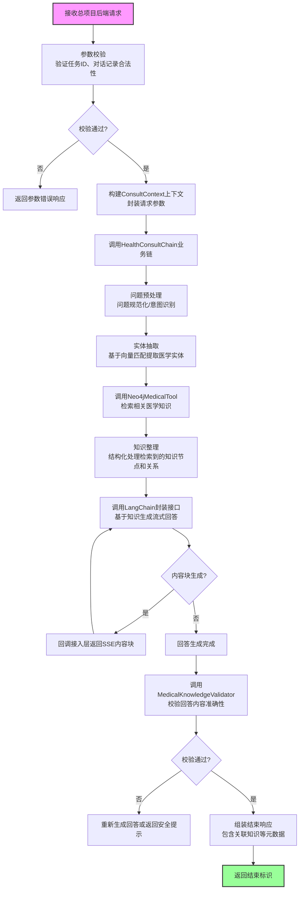

#### 2.1.2 流程说明

| 步骤 | 负责模块       | 详细说明                                          |
| -- | ---------- | --------------------------------------------- |
| 1  | 接入层        | 接收总项目后端的POST请求，验证请求参数完整性和格式合法性                |
| 2  | 接入层        | 构建内部上下文对象，将总项目传递的对话记录封装到上下文中                  |
| 3  | 编排核心层      | 执行业务链，对用户问题进行预处理，包括问题规范化、意图识别                 |
| 4  | 编排核心层      | 从用户问题中提取医学实体，采用向量匹配方案，识别症状、疾病、药品等             |
| 5  | MCP代理层/工具层 | 调用Neo4j医疗知识检索工具，根据提取的实体查询相关的医学知识节点和关系         |
| 6  | 编排核心层      | 对检索到的知识进行结构化整理，过滤无关内容，构建回答生成的上下文素材            |
| 7  | 资源适配层      | 调用LangChain封装接口，传入用户问题和检索到的医学知识，生成流式回答        |
| 8  | 接入层        | 每生成一个内容块，立即通过SSE协议返回给总项目后端，实现流式响应             |
| 9  | 编排核心层      | 回答完全生成后，调用医学知识校验工具，验证回答内容与Neo4j知识的一致性，避免误导性信息 |
| 10 | 接入层        | 校验通过后返回结束标识，包含引用的知识节点信息等元数据                   |

### 2.2 时序设计

#### 2.2.1 时序图

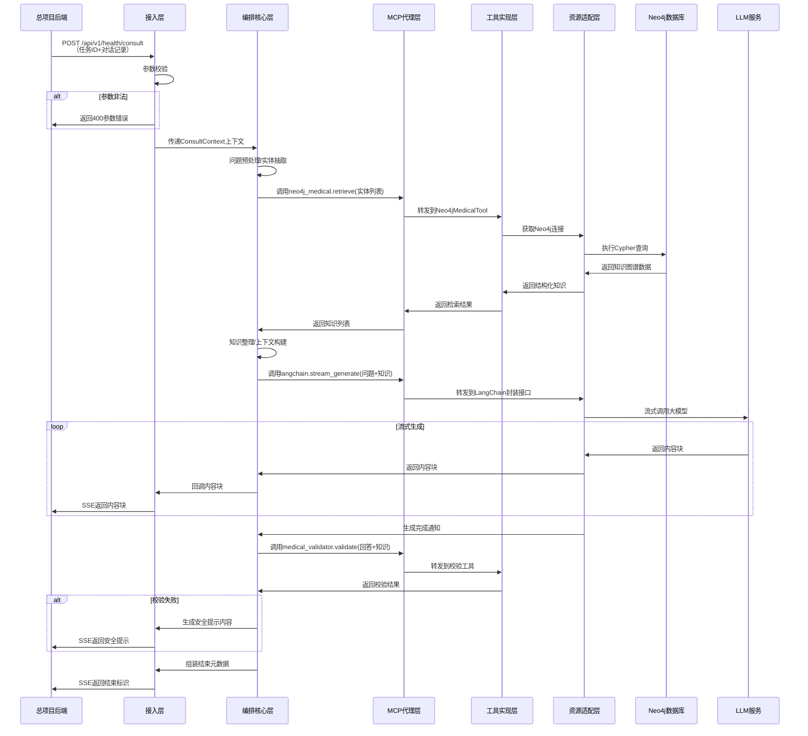

#### 2.2.2 时序说明

1. **请求阶段**：总项目后端将完整的对话记录传递给本系统，无需本系统管理上下文
2. **知识检索阶段**：同步查询Neo4j数据库获取专业医学知识，确保回答的专业性
3. **流式生成阶段**：通过LangChain调用大模型，生成的内容块实时返回，降低用户等待时间
4. **校验阶段**：回答生成完成后进行医学准确性校验，确保内容安全可靠
5. **结束阶段**：返回结束标识和引用的知识来源，方便总项目后端后续处理

***

### 2.3 核心子流程详细设计

#### 2.3.1 问题预处理子流程

##### 子流程图

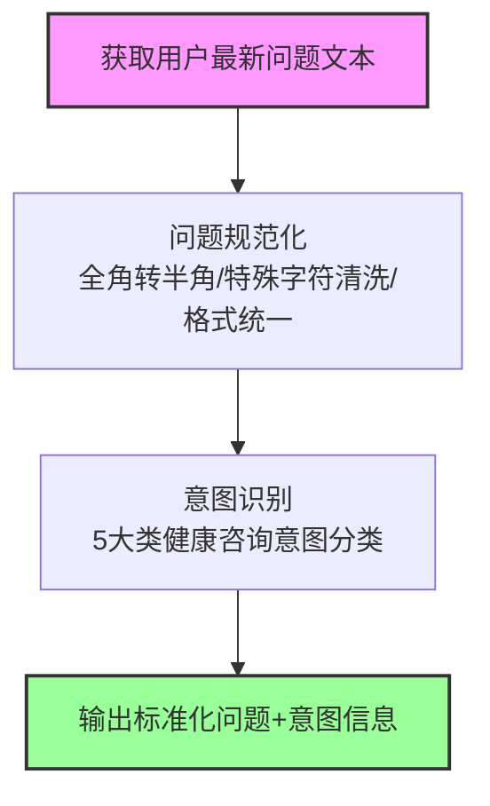

##### 流程说明

| 步骤       | 详细说明                             | 输出                |
| -------- | -------------------------------- | ----------------- |
| 1. 问题规范化 | 统一文本格式，去除特殊字符、冗余空格，确保文本标准化       | 标准化问题文本           |
| 2. 意图识别  | 基于预训练的健康咨询意图分类模型，识别用户问题所属的具体意图类型 | 意图类型、置信度、关联实体类型提示 |

**意图分类体系：**

| 大分类     | 子意图                        | 说明       |
| ------- | -------------------------- | -------- |
| 疾病咨询类   | 症状查询、病因查询、治疗方案查询、预防措施查询    | 疾病相关问题   |
| 用药咨询类   | 药品适应症查询、用法用量查询、禁忌查询、不良反应查询 | 药品相关问题   |
| 检查报告解读类 | 指标解读、异常分析、建议咨询             | 检查报告相关问题 |
| 生活方式咨询类 | 饮食建议、运动建议、作息建议、慢病管理建议      | 健康生活相关问题 |
| 其他健康咨询类 | 就医指导、康复指导、健康科普             | 其他健康相关问题 |

##### 意图识别详细设计

**实现方案：**
采用"小样本+提示学习"的轻量化意图分类方案：

1. 基于医疗领域预训练BERT模型作为编码器
2. 使用Few-shot提示工程，支持新增意图无需重新训练
3. 内置300+常见健康咨询意图样本库，覆盖95%以上老人健康咨询场景
4. 置信度阈值0.85，低于阈值的意图默认归类为通用咨询类

##### 子时序图

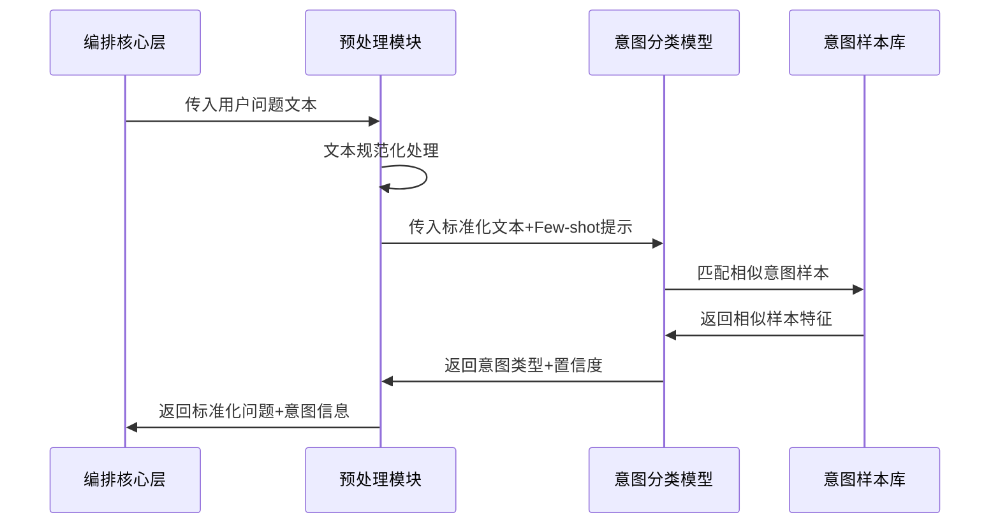

***

#### 2.3.2 实体抽取子流程（基于向量匹配方案）

采用`mcBERT/medical-bert-chinese-base`向量编码模型和Milvus向量数据库实现，相比传统NER方案准确率更高，适配医疗场景专业术语。

##### 子流程图

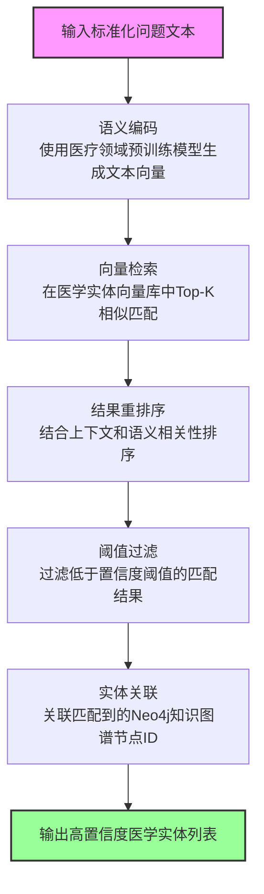

##### 流程说明

| 步骤       | 详细说明                                   | 输出             |
| -------- | -------------------------------------- | -------------- |
| 1. 语义编码  | 使用医疗领域预训练的BERT模型对问题文本进行语义编码，生成768维向量表示 | 问题语义向量         |
| 2. 向量检索  | 在Milvus医学实体向量库中进行近似最近邻检索，返回Top20个相似实体  | 候选实体列表（含相似度得分） |
| 3. 结果重排序 | 结合问题上下文、实体类型、语义相关性等特征对候选结果进行重排序        | 重排序后的实体列表      |
| 4. 阈值过滤  | 设置相似度阈值0.75，过滤低于阈值的低置信度匹配结果            | 高置信度实体列表       |
| 5. 实体关联  | 将匹配到的实体与Neo4j知识图谱中的节点ID关联，便于后续知识检索     | 关联Neo4j节点的实体列表 |

**向量库设计（Milvus实现）：**

- 向量库：Milvus `medical_entity` 集合
- 向量内容：Neo4j中所有医学实体的向量表示（症状、疾病、药品、检查、科室共5大类）
- 向量维度：768维，使用`mcBERT/medical-bert-chinese-base`医疗预训练模型生成
- 索引类型：IVF\_FLAT，nlist=1024，检索速度快，准确率满足业务需求
- 相似度度量：余弦相似度
- 检索参数：nprobe=16，TopK=20
- 实体量：包含10万+常见医学实体向量，覆盖老人健康咨询常见场景
- 性能指标：检索延迟<100ms，召回率>95%

##### 子时序图

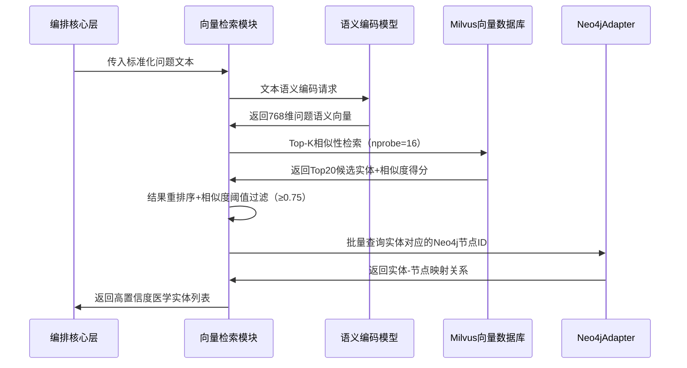

##### 错误处理与降级方案

1. **Milvus连接失败**：自动切换为基于关键词匹配的实体抽取降级方案
2. **检索结果为空**：返回空实体列表，后续流程使用通用回答模板
3. **检索延迟过高**：自动降低nprobe参数，或切换为本地词典匹配
4. **向量生成失败**：返回错误信息，触发降级流程

### 2.2 核心类设计

#### 2.2.1 HealthConsultChain

```python
class HealthConsultChain(Chain[ConsultContext, ConsultResult]):
    def __init__(self, resource: ConsultResource):
        self.resource = resource
        self.steps = [
            QuestionPreprocessStep(),
            ContextLoadStep(),
            KnowledgeRetrieveStep(),
            AnswerGenerateStep(),
            KnowledgeValidateStep(),
            ContextSaveStep(),
            ResultAssembleStep()
        ]
    
    def execute(self, context: ChainContext[ConsultContext]) -> ChainResult[ConsultResult]:
        for step in self.steps:
            context = step.process(context)
            if context.is_failed:
                return ChainResult.fail(context.error)
        return ChainResult.success(context.result)
```

#### 2.2.2 ConsultAgentStrategy

```python
class ConsultAgentStrategy(AgentStrategy[ConsultContext, ConsultResult]):
    def execute(self, agent_context: AgentContext[ConsultContext], resource: AgentResource) -> AgentResult[ConsultResult]:
        # 1. 问题理解
        intent = resource.llm_service.recognize_intent(agent_context.data.question)
        # 2. 工具调用决策
        if intent.need_knowledge_retrieval:
            knowledge = resource.mcp_proxy.call_tool("neo4j_medical", "retrieve", 
                                                     {"query": intent.query_entities})
            agent_context.data.knowledge = knowledge
        # 3. 回答生成
        answer = resource.llm_service.generate_answer(agent_context.data)
        # 4. 结果校验
        validated_answer = resource.mcp_proxy.call_tool("medical_validator", "validate", 
                                                        {"answer": answer, "knowledge": knowledge})
        return AgentResult(data=validated_answer)
```

## 三、健康报告生成接口详细实现流程

### 3.1 处理流程设计

#### 3.1.1 流程图

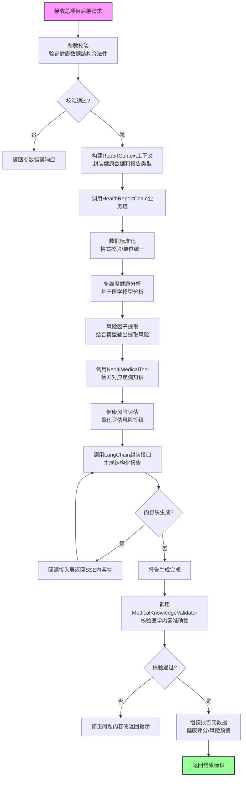

#### 3.1.2 流程说明

| 步骤 | 负责模块       | 详细说明                                   |
| -- | ---------- | -------------------------------------- |
| 1  | 接入层        | 接收总项目后端的POST请求，验证健康数据结构是否符合约定          |
| 2  | 接入层        | 构建报告上下文，封装结构化健康数据和报告类型参数               |
| 3  | 编排核心层      | 对健康数据进行简单标准化，统一单位格式                    |
| 4  | 编排核心层      | 基于轻量化医学模型进行多维度健康分析和风险预测                |
| 5  | 编排核心层      | 从模型输出中提取健康风险因子，作为Neo4j知识检索的输入          |
| 6  | MCP代理层/工具层 | 调用Neo4j医疗知识工具，检索相关疾病的诊断标准、干预方案等知识      |
| 7  | 编排核心层      | 结合健康数据和医学知识，按照量化标准评估健康风险等级，计算健康评分      |
| 8  | 资源适配层      | 调用LangChain封装接口，传入健康分析结果和医学知识，流式生成健康报告 |
| 9  | 接入层        | 每生成一个报告段落，立即通过SSE返回给总项目后端，实现流式预览       |
| 10 | 编排核心层      | 报告完全生成后，校验所有医学建议和结论与Neo4j知识的一致性        |
| 11 | 接入层        | 返回结束标识，包含健康评分、风险预警、建议总结等元数据            |

### 3.2 时序设计

#### 3.2.1 时序图

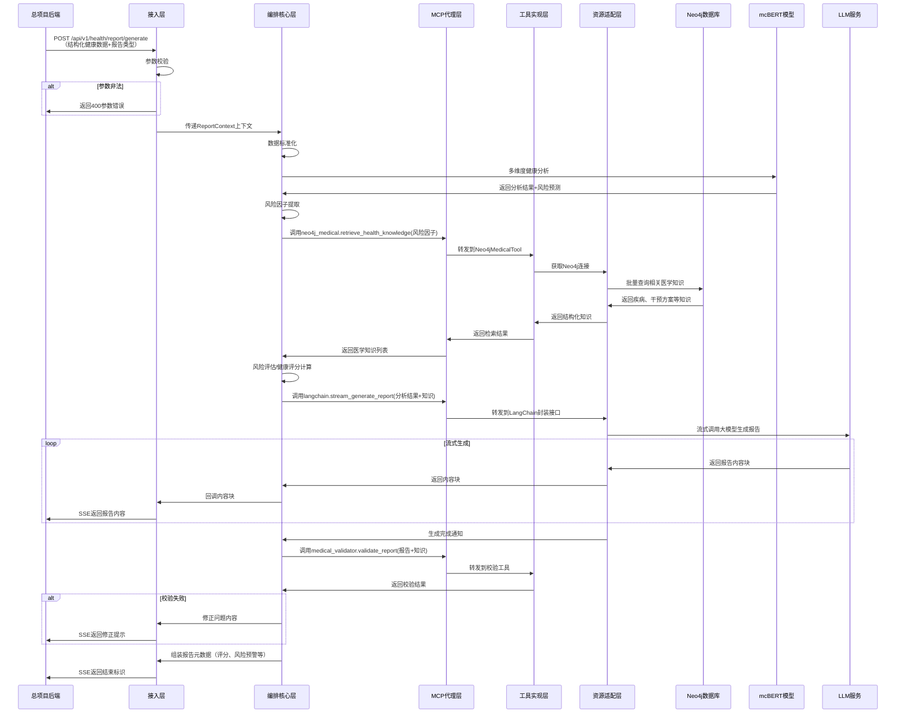

#### 3.2.2 时序说明

1. **请求阶段**：总项目后端传入标准化结构的健康数据，由上游服务完成解析
2. **模型分析阶段**：基于mcBERT健康风险预测模型进行健康分析和风险预测
3. **知识检索阶段**：根据风险因子查询Neo4j医学知识库，获取专业干预方案
4. **风险评估阶段**：按照量化标准进行风险等级判定、权重计算和健康评分
5. **流式生成阶段**：通过LangChain生成报告内容，实时返回给调用方
6. **结束阶段**：返回报告整体元数据，包括健康评分、风险等级等

***

### 3.3 核心子流程详细设计

#### 3.3.1 数据标准化子流程（简化方案）

##### 设计说明

为降低系统复杂度，健康数据预处理和结构化解析流程已合并为单一"数据标准化"步骤。本系统与上游SpringBoot服务约定标准化的输入结构，由上游服务完成原始健康数据的解析和结构化处理，本系统仅做格式校验和标准化转换。

##### 约定输入结构

上游SpringBoot服务传入的健康报告请求参数需符合以下JSON结构：

```json
{
  "health_record_content": {
    "monitoring_data": {
      "heart_rate": {
        "latest": [{"value": 72, "unit": "bpm", "time": "2024-01-01 08:00:00"}],
        "daily_stats": [{"date": "2024-01-01", "avg": 70, "max": 85, "min": 62}],
        "weekly_stats": [{"week": "2024-W1", "avg": 71, "trend": "stable"}],
        "monthly_stats": [{"month": "2024-01", "avg": 72, "trend": "stable"}]
      },
      "blood_glucose": {/* 血糖数据结构同心率 */},
      "perfusion_index": {/* 灌注指数数据结构同心率 */},
      "blood_oxygen": {/* 血氧数据结构同心率 */},
      "sleep": {/* 睡眠数据结构同心率 */},
      "blood_pressure": {
        "latest": [{"systolic": 120, "diastolic": 80, "unit": "mmHg", "time": "2024-01-01 08:00:00"}],
        "daily_stats": [{"date": "2024-01-01", "avg_systolic": 118, "avg_diastolic": 79}],
        "weekly_stats": [{"week": "2024-W1", "avg_systolic": 119, "avg_diastolic": 78}],
        "monthly_stats": [{"month": "2024-01", "avg_systolic": 120, "avg_diastolic": 80}]
      }
    },
    "user_profile": {
      "name": "张三",
      "gender": "男",
      "age": 65,
      "height": 170,
      "weight": 70,
      "family_history": ["高血压", "糖尿病"],
      "allergy_history": ["青霉素"],
      "past_medical_history": ["高血压"],
      "surgery_history": ["阑尾切除术"],
      "medication_adherence": "好"
    }
  },
  "report_type": "general"
}
```

##### 子流程图

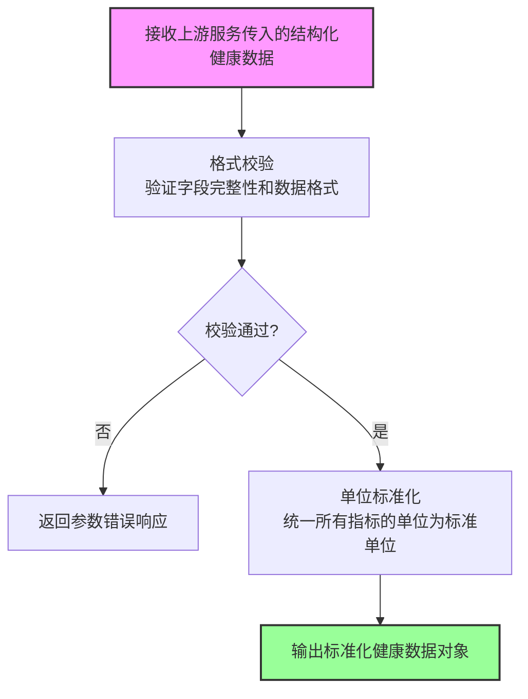

##### 流程说明

| 步骤       | 详细说明                                          | 输出        |
| -------- | --------------------------------------------- | --------- |
| 1. 格式校验  | 验证输入数据是否符合约定的JSON结构，检查必填字段是否存在，数据类型是否正确       | 校验结果      |
| 2. 单位标准化 | 将所有监测指标的单位统一为标准单位（如心率：bpm，血压：mmHg，血糖：mmol/L等） | 标准化健康数据对象 |

##### 子时序图

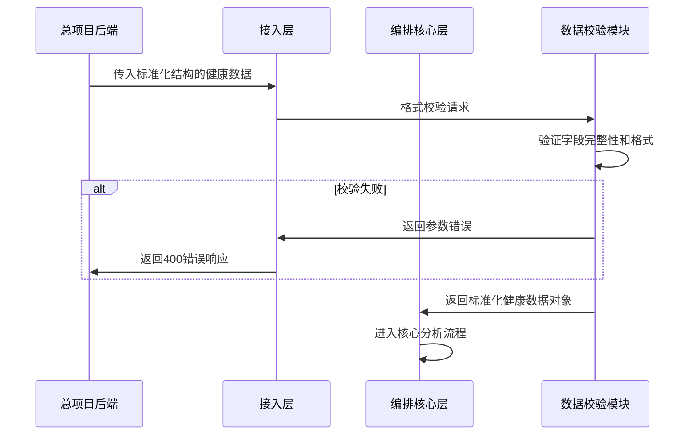

***

#### 3.3.2 模型选型与22G显存分配方案

##### 显存分配总策略（总预算20G）

为确保在20G显存约束下，多模型（LLM、向量模型、医学模型）可同时稳定运行，预留2G安全冗余，采用以下显存分配方案：

| 模型类型    | 显存占用    | 说明                                                     |
| ------- | ------- | ------------------------------------------------------ |
| 大语言模型   | 6G      | Qwen3-4B-Instruct-2507 4bit量化，用于报告生成和对话理解              |
| 向量编码模型  | 2G      | mcBERT/medical-bert-chinese-base（中文医疗BERT），用于语义编码和知识匹配 |
| 医学分析模型  | 7G      | 2个轻量化医学模型总和                                            |
| 系统预留/冗余 | 5G      | 运行时内存、缓冲、峰值占用预留                                        |
| **总计**  | **20G** | 满负荷分配，预留2G安全冗余                                         |

##### 最终医学模型选型：

所有模型均为开源、适配中文医疗场景、轻量化设计：

1. **大语言模型**：`Qwen3-4B-Instruct-2507`（4B参数，6G显存，4bit量化）
   - 能力：回答生成、报告撰写、生活方式评估、健康建议生成
   - 输入：用户问题/健康数据+Prompt引导+检索到的医学知识
   - 输出：流式生成的回答内容/报告内容
2. **向量编码模型**：`mcBERT/medical-bert-chinese-base`（768d，2G显存）
   - 能力：实体抽取、知识检索、医学文本编码、语义匹配
   - 输入：医学相关文本
   - 输出：768维向量表示
3. **健康风险预测模型**：`mcBERT/health-risk-prediction-small`（384M参数，2G显存）
   - 能力：慢性病风险评估、生理指标异常分析、健康风险评分
   - 输入：结构化健康指标
   - 输出：各慢性病风险概率、风险等级
4. **风险因子提取模型**：`TencentMedicalNet/medical-classification-small`（500M参数，3G显存）
   - 能力：异常指标识别、风险标签分类、健康风险因子提取
   - 输入：结构化健康数据
   - 输出：风险因子列表、异常标签
5. **生活方式评估/报告生成**：共享Qwen3-4B权重（无额外显存占用）
   - 能力：生活方式评估、健康建议生成、报告内容撰写
   - 实现方式：通过Prompt工程引导LLM完成，无需额外模型

***

#### 3.3.3 多维度健康分析子流程（基于医学模型）

使用`mcBERT/health-risk-prediction-small`模型实现核心分析能力，结合规则分析，覆盖生理指标异常、慢性病风险等多维度评估。

##### 子流程图

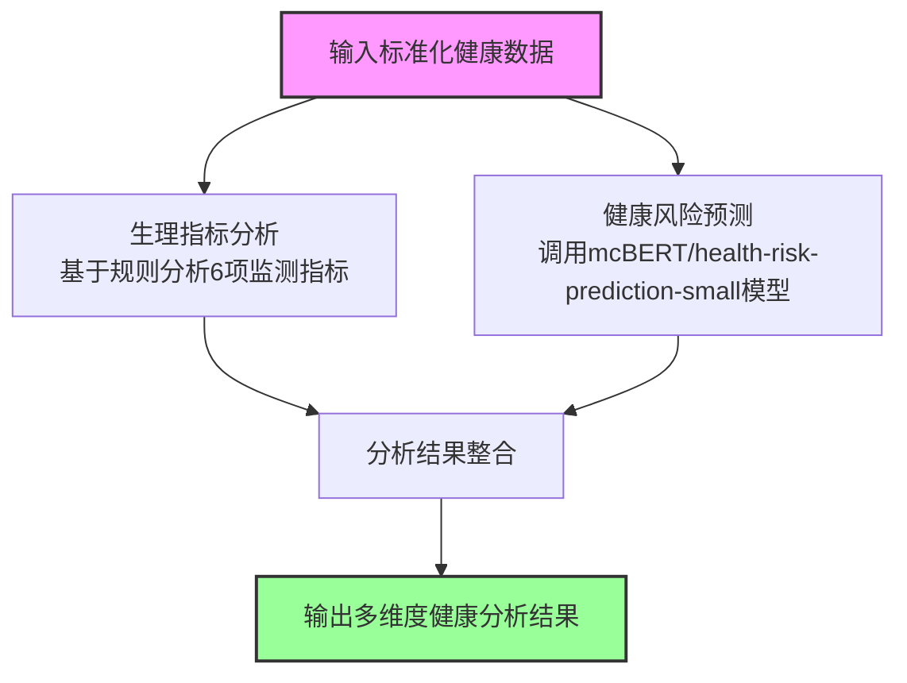

##### 流程说明

| 步骤        | 详细说明                            | 输出          |
| --------- | ------------------------------- | ----------- |
| 1. 生理指标分析 | 基于规则库分析6项监测指标是否在正常范围内，识别明显异常    | 指标异常列表、趋势分析 |
| 2. 健康风险预测 | 调用mcBERT健康风险预测模型，基于结构化数据预测慢性病风险 | 各慢性病风险概率    |
| 3. 分析结果整合 | 合并规则分析和模型预测结果，形成完整的多维度分析        | 整合后的健康分析结果  |

##### 子时序图

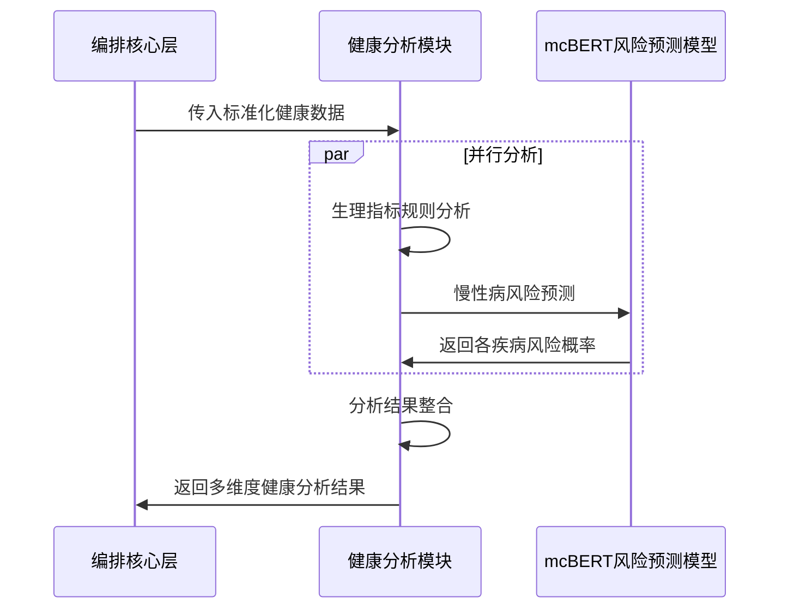

***

#### 3.3.4 风险因子提取子流程

使用`TencentMedicalNet/medical-classification-small`模型实现自动化风险因子提取，支持6大类120种常见健康风险因子识别，准确率>85%。

##### 子流程图

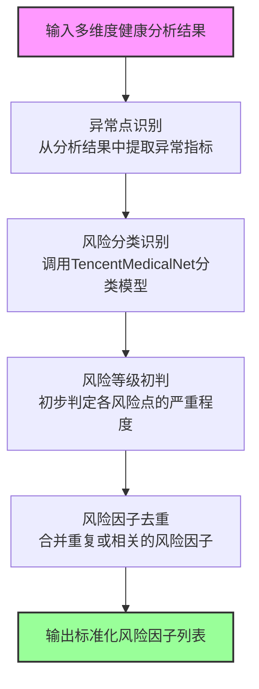

##### 流程说明

| 步骤        | 详细说明                           | 输出       |
| --------- | ------------------------------ | -------- |
| 1. 异常点识别  | 从多维度分析结果中提取所有超出正常范围的指标、慢性病高风险点 | 原始异常点列表  |
| 2. 风险点关联  | 将异常指标与模型预测的慢性病风险关联，形成完整风险视图    | 关联后的风险列表 |
| 3. 风险等级初判 | 基于规则将风险分为低/中/高三个等级             | 带等级的风险列表 |
| 4. 风险因子去重 | 合并同一类别的风险，避免重复检索和分析            | 去重后的风险列表 |

##### 子时序图

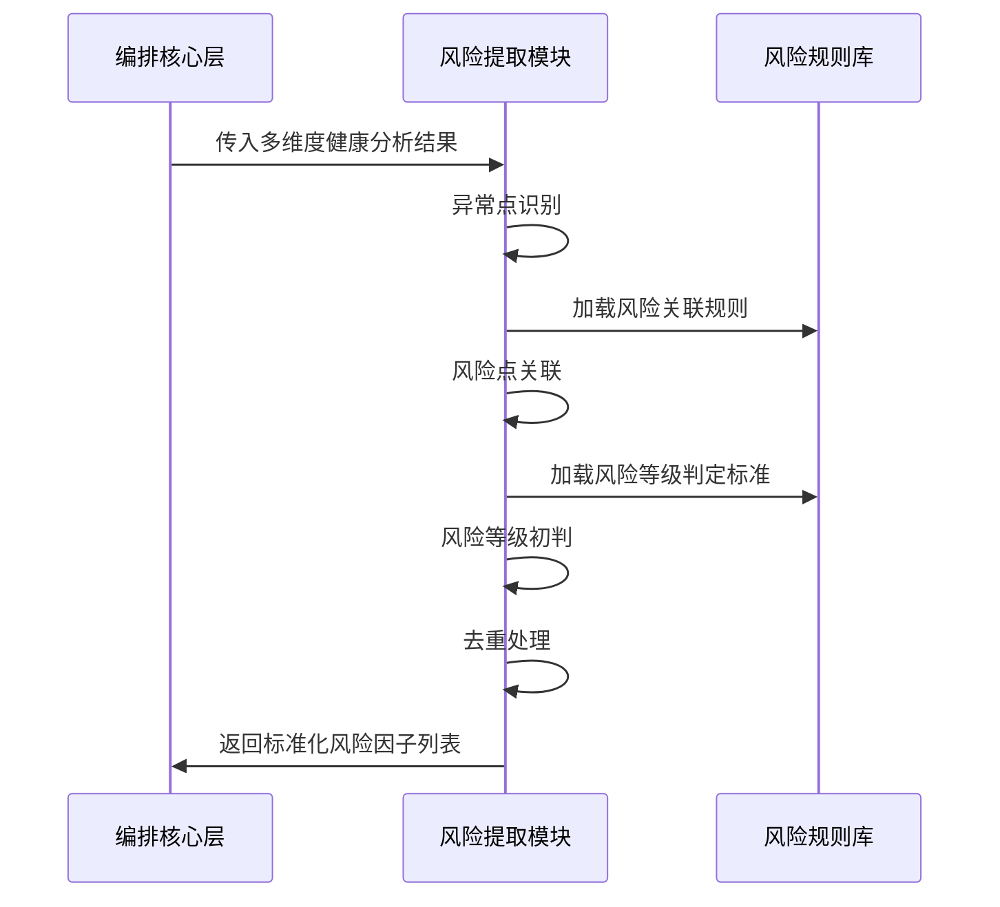

***

#### 3.3.5 健康风险评估子流程（量化标准）

使用`Qwen3-4B-Instruct-2507`模型实现生活方式评估和干预方案生成，结合量化规则实现可解释的健康风险评估。

##### 子流程图

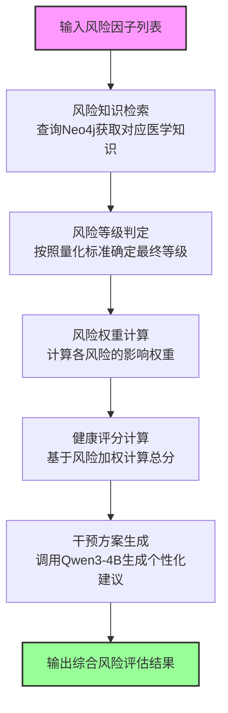

##### 流程说明

| 步骤        | 详细说明                                      | 输出         |
| --------- | ----------------------------------------- | ---------- |
| 1. 风险知识检索 | 根据风险因子列表查询Neo4j医学知识图谱，获取疾病描述、风险等级、干预方案等知识 | 风险关联知识列表   |
| 2. 风险等级判定 | 按照量化标准确定每个风险点的最终等级（高/中/低/正常）              | 最终风险等级列表   |
| 3. 风险权重计算 | 根据风险类型和等级，计算每个风险对整体健康的影响权重                | 风险权重列表     |
| 4. 健康评分计算 | 基于风险加权总和计算整体健康评分，0-100分，分数越高越健康           | 健康评分、各维度得分 |
| 5. 干预方案匹配 | 根据风险点匹配Neo4j中对应的健康建议、饮食指导、运动建议、就医提示等      | 个性化干预方案列表  |

##### 量化标准详细设计

**1. 风险等级判定标准：**

| 风险等级 | 判定规则                                  | 处理建议          |
| ---- | ------------------------------------- | ------------- |
| 高风险  | 任意指标超出正常范围30%以上，或存在明确的慢性病高风险（概率>70%）  | 建议立即就医        |
| 中风险  | 指标超出正常范围10%-30%，或存在潜在慢性病风险（概率30%-70%） | 建议调整生活方式，定期复查 |
| 低风险  | 指标略有异常（<10%），无明显慢性病风险（概率<30%）         | 建议保持健康生活习惯    |
| 正常   | 所有指标在正常范围内                            | 继续保持          |

**2. 风险权重计算规则：**

| 风险类型   | 权重占比 | 说明              |
| ------ | ---- | --------------- |
| 生理指标异常 | 40%  | 心率、血压、血糖等核心指标异常 |
| 慢性病风险  | 30%  | 高血压、糖尿病等慢性病风险   |
| 生活方式风险 | 20%  | 睡眠、运动、饮食等不健康因素  |
| 家族病史风险 | 10%  | 遗传相关疾病风险        |

**3. 健康评分计算细则：**

- 基础分：100分
- 扣分 = Σ(各风险项得分 × 对应权重)
- 风险项得分 = 风险等级系数 × 指标异常程度
  - 高风险系数：20分/项
  - 中风险系数：10分/项
  - 低风险系数：5分/项
- 最终评分 = 基础分 - 总扣分（最低0分）

##### 子时序图

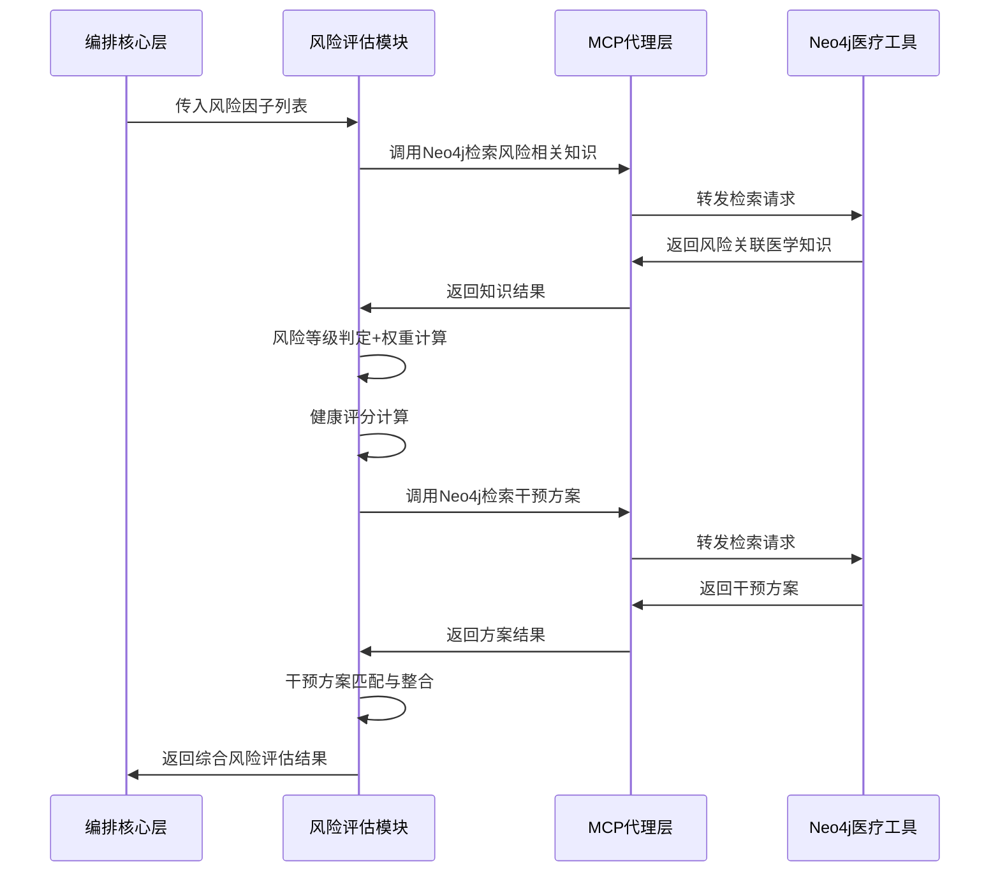

***

### 3.4 健康档案数据结构定义

```python
# 监测数据项结构
class MonitoringDataItem(BaseModel):
    value: float                # 数值
    unit: str                   # 单位
    measure_time: datetime      # 测量时间
    status: str = "normal"      # 状态：normal/abnormal/warning

# 单项监测数据统计结构
class MonitoringDataStats(BaseModel):
    item_name: str              # 监测项名称：心率/血糖/灌注指数/血氧/睡眠/血压
    latest_data: List[MonitoringDataItem]  # 当日最新3-5次数据
    daily_stats: List[Dict]     # 最近30天日统计：date/avg_value/max_value/min_value
    weekly_stats: List[Dict]    # 最近12周周统计：week/avg_value/trend
    monthly_stats: List[Dict]   # 最近6个月月统计：month/avg_value/trend

# 用户健康档案结构
class UserHealthProfile(BaseModel):
    name: Optional[str]         # 姓名
    gender: Optional[str]       # 性别：男/女
    age: Optional[int]          # 年龄
    height: Optional[float]     # 身高（cm）
    weight: Optional[float]     # 体重（kg）
    family_history: List[str]   # 家族遗传病史
    allergy_history: List[str]  # 过敏史
    past_medical_history: List[str] # 既往病史
    surgery_history: List[str]  # 手术史
    medication_adherence: str   # 用药依从性：好/一般/差

# 完整结构化健康数据结构
class StructuredHealthData(BaseModel):
    monitoring_data: List[MonitoringDataStats]  # 6项监测数据
    user_profile: UserHealthProfile             # 用户健康档案
```

### 3.2 核心类设计

#### 3.2.1 HealthReportChain

```python
class HealthReportChain(Chain[ReportContext, ReportResult]):
    def __init__(self, resource: ReportResource):
        self.resource = resource
        self.steps = [
            DataStandardizationStep(),
            HealthAnalysisStep(),
            RiskExtractStep(),
            KnowledgeRetrieveStep(),
            RiskAssessmentStep(),
            ReportGenerateStep(),
            ContentValidateStep(),
            ResultAssembleStep()
        ]
```

## 四、核心工具详细设计

### 4.1 Neo4jMedicalTool

```python
class Neo4jMedicalTool(Tool):
    def __init__(self, neo4j_adapter: Neo4jMedicalAdapter):
        self.adapter = neo4j_adapter
        self.query_parser = MedicalQueryParser()
        self.retriever = MedicalKnowledgeRetriever(adapter)
    
    def call(self, method: str, params: Dict[str, Any]) -> Any:
        if method == "retrieve_by_symptom":
            return self.retrieve_by_symptom(params["symptoms"])
        elif method == "retrieve_disease_info":
            return self.retrieve_disease_info(params["disease_name"])
        elif method == "retrieve_drug_info":
            return self.retrieve_drug_info(params["drug_name"])
        elif method == "retrieve_health_knowledge":
            return self.retrieve_health_knowledge(params["risk_factors"])
        elif method == "get_health_suggestions":
            return self.get_health_suggestions(params["health_conditions"])
    
    def retrieve_by_symptom(self, symptoms: List[str]) -> List[DiseaseInfo]:
        """根据症状查询可能的疾病和相关信息"""
        cypher = self.query_parser.build_symptom_query(symptoms)
        result = self.adapter.run_query(cypher)
        return self._parse_disease_result(result)
```

### 4.2 MedicalKnowledgeValidator

```python
class MedicalKnowledgeValidator(Tool):
    def validate_answer(self, answer: str, reference_knowledge: List[KnowledgeNode]) -> ValidationResult:
        """校验回答内容的准确性
        1. 检查回答中是否包含与参考知识矛盾的内容
        2. 检查是否有误导性的医疗建议
        3. 检查是否有超出知识范围的虚假信息
        """
        conflicts = self._check_conflicts(answer, reference_knowledge)
        misleading = self._check_misleading_content(answer)
        return ValidationResult(
            is_valid=len(conflicts) == 0 and len(misleading) == 0,
            conflicts=conflicts,
            misleading=misleading
        )
```

### 4.3 LangChainTool

```python
class LangChainTool(Tool):
    def __init__(self, langchain_adapter: LangChainAdapter):
        self.adapter = langchain_adapter
        self.consult_chain = self.adapter.create_consult_chain()
        self.report_chain = self.adapter.create_report_chain()
    
    def generate_consult_answer(self, question: str, context: str, knowledge: List[KnowledgeNode]) -> str:
        """生成健康咨询回答"""
        prompt = self._build_consult_prompt(question, context, knowledge)
        return self.consult_chain.run(prompt)
    
    def generate_health_report(self, health_data: HealthData, knowledge: List[KnowledgeNode]) -> Dict:
        """生成健康报告内容"""
        prompt = self._build_report_prompt(health_data, knowledge)
        return self.report_chain.run(prompt)
```

## 五、错误码设计

| 错误码   | 错误信息    | 说明                 |
| ----- | ------- | ------------------ |
| 200   | 成功      | 请求处理成功             |
| 40001 | 参数错误    | 请求参数缺失或格式错误        |
| 40002 | 无效的问题   | 问题包含敏感内容或不属于健康咨询范围 |
| 40003 | 无效的健康数据 | 健康数据格式错误或包含异常值     |
| 50001 | 知识检索失败  | Neo4j数据库查询失败       |
| 50002 | LLM调用失败 | 大语言模型服务调用失败        |
| 50003 | 内容校验失败  | 生成的内容未通过医学知识校验     |
| 50004 | 报告生成失败  | 报告生成过程出现异常         |
| 50005 | 系统内部错误  | 其他未知系统错误           |

## 六、向量库初始化与维护设计

### 6.1 向量库初始化流程

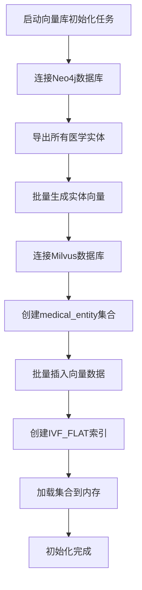

### 6.2 日常维护流程

1. **增量更新**：Neo4j新增/修改实体时，实时生成向量并插入Milvus
2. **全量更新**：每月执行一次全量向量重建，保证数据一致性
3. **健康检查**：每5分钟检查Milvus连接状态和集合加载状态
4. **监控告警**：检索延迟超过200ms、内存使用率超过80%时触发告警

### 6.3 向量库依赖

- Python SDK版本：pymilvus≥2.3.0
- 部署要求：Docker环境≥20.10.0，Docker Compose≥2.0.0
- 资源要求：内存≥16G，CPU≥4核

## 七、开发规范

1. 所有医学相关的字符串常量统一放在`constants/medical_constants.py`中管理
2. 医学知识校验规则必须可配置，支持动态更新
3. 所有Neo4j查询必须做参数化处理，防止Cypher注入
4. 接口响应时间超过阈值时必须记录慢查询日志
5. 所有用户健康数据必须脱敏处理后再进入日志系统
6. 新增医学知识查询场景必须补充对应的单元测试用例
7. 所有模型调用必须支持降级方案，模型服务不可用时返回友好提示
8. Milvus向量检索必须设置合理的超时时间，默认300ms
9. 向量检索结果必须经过阈值过滤，相似度<0.75的结果不得使用
10. 向量库的初始化和维护操作必须通过专用工具类实现，禁止直接操作Milvus集合

